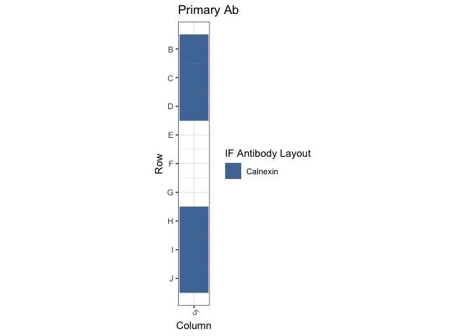
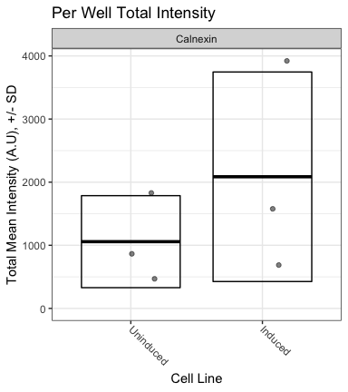

Figure 1D: TetON Cells / Calnexin
================
Sandra Vidak/Gianluca Pegoraro
November 7th 2022

### Introduction

Columbus screen names:

`20191008-40x-TetON-GRP78-Calnexin-PDI-SUN2-LAP2a-LB1-H3K27-H4K16-gH2AX_20191008_114604`

`20191009-40x-TetON-Hsp110-Calnexin-Hsc70-SUN1_20191009_125328`

`20191010-40x-TetON-Hsp110-GRP94-Calnexin-Hsp70-SUN1-Hsp40-Hsp90_20191010_144805`

### Analysis Setup

Load required packages.

``` r
library(tidyverse)
```

    ## ── Attaching packages ─────────────────────────────────────── tidyverse 1.3.2 ──
    ## ✔ ggplot2 3.3.6      ✔ purrr   0.3.5 
    ## ✔ tibble  3.1.8      ✔ dplyr   1.0.10
    ## ✔ tidyr   1.2.1      ✔ stringr 1.4.1 
    ## ✔ readr   2.1.3      ✔ forcats 0.5.2 
    ## ── Conflicts ────────────────────────────────────────── tidyverse_conflicts() ──
    ## ✖ dplyr::filter() masks stats::filter()
    ## ✖ dplyr::lag()    masks stats::lag()

``` r
library(fs)
library(Hmisc)
```

    ## Loading required package: lattice
    ## Loading required package: survival
    ## Loading required package: Formula
    ## 
    ## Attaching package: 'Hmisc'
    ## 
    ## The following objects are masked from 'package:dplyr':
    ## 
    ##     src, summarize
    ## 
    ## The following objects are masked from 'package:base':
    ## 
    ##     format.pval, units

``` r
library(ggthemes)
library(DescTools) # for Dunnett's Test
```

    ## 
    ## Attaching package: 'DescTools'
    ## 
    ## The following objects are masked from 'package:Hmisc':
    ## 
    ##     %nin%, Label, Mean, Quantile

``` r
library(curl)
```

    ## Using libcurl 7.79.1 with LibreSSL/3.3.6
    ## 
    ## Attaching package: 'curl'
    ## 
    ## The following object is masked from 'package:readr':
    ## 
    ##     parse_date

``` r
source("R/Plotters.R") #Functions needed for plotting
```

Set the palette and the running theme for ggplot2.

### Experimental Metadata

Read plate layouts.

``` r
cell_levs <- c("Uninduced", "Induced")

plate_layouts <- read_tsv("metadata/plate_layout.txt") %>%
  filter(!is.na(cell_line)) %>%
  separate(col = cell_line, 
           into = c("cell_line"), 
           remove = T) %>%
  mutate(cell_line = factor(cell_line, levels = cell_levs))

glimpse(plate_layouts)
```

    ## Rows: 6
    ## Columns: 4
    ## $ row       <dbl> 2, 3, 4, 8, 9, 10
    ## $ column    <dbl> 5, 5, 5, 5, 5, 5
    ## $ marker    <chr> "Calnexin", "Calnexin", "Calnexin", "Calnexin", "Calnexin", …
    ## $ cell_line <fct> Uninduced, Uninduced, Uninduced, Induced, Induced, Induced

Plot plate layouts.

<!-- -->

<!-- -->

### Download the data if needed

Download and unzip the Columbus results of the experiments from Figshare
if they have not been already downloaded.

``` r
if(!dir.exists("input")) {
  URL <- "https://figshare.com/ndownloader/files/38127834"
  curl_download(URL, "input.zip")
  unzip("input.zip")
}
```

### Read and Process Columbus data

Recursively search the `input` directory and its subdirectories for
files whose name includes the Glob patterns defined in the chunk above,
and read the cell-level Columbus data from the results text files.

``` r
read_columbus_results <- function(path, glob) {
  dir_ls(path = path,
         recurse = T,
         glob = glob)  %>%
    read_tsv(
      id = "file_name"
    ) %>%
    select(
      screen = ScreenName,
      plate = PlateName,
      well = WellName,
      row = Row,
      column = Column,
      nuc_area = `Nuclei Selected - Nucleus Area [px²]`,
      cyto_area = `Nuclei Selected - Cytoplasm Area [px²]`,
      cell_area = `Nuclei Selected - Cell Area [px²]`,
      nuc_marker_int = `Nuclei Selected - Intensity Nucleus BP600/37 Mean`,
      cyto_marker_int = `Nuclei Selected - Intensity Cytoplasm BP600/37 Mean`,
      ratio_marker_int = `Nuclei Selected - Nuc_Cyto_BP600_Ratio`
    )
}

glob_path <- "*- Nuclei Selected[0].txt"
col_tbl <- read_columbus_results("input", glob_path)

glimpse(col_tbl)
```

    ## Rows: 398,519
    ## Columns: 11
    ## $ screen           <chr> "20191008-40x-TetON-GRP78-Calnexin-PDI-SUN2-LAP2a-LB1…
    ## $ plate            <chr> "AssayPlate_PerkinElmer_CellCarrier-384 Ultra", "Assa…
    ## $ well             <chr> "B10", "B10", "B10", "B10", "B10", "B10", "B10", "B10…
    ## $ row              <dbl> 2, 2, 2, 2, 2, 2, 2, 2, 2, 2, 2, 2, 2, 2, 2, 2, 2, 2,…
    ## $ column           <dbl> 10, 10, 10, 10, 10, 10, 10, 10, 10, 10, 10, 10, 10, 1…
    ## $ nuc_area         <dbl> 1413, 2736, 1687, 1831, 1605, 2219, 1884, 1133, 1678,…
    ## $ cyto_area        <dbl> 635, 1802, 987, 785, 400, 3999, 2148, 1789, 1204, 218…
    ## $ cell_area        <dbl> 2048, 4538, 2674, 2616, 2005, 6218, 4032, 2922, 2882,…
    ## $ nuc_marker_int   <dbl> 2605.95, 3068.62, 2836.78, 3005.06, 2383.19, 2485.38,…
    ## $ cyto_marker_int  <dbl> 857.346, 567.685, 748.230, 796.290, 1288.730, 472.500…
    ## $ ratio_marker_int <dbl> 3.03955, 5.40551, 3.79132, 3.77383, 1.84926, 5.26007,…

Join Columbus data with the plate layout information.

``` r
cell_tbl <- col_tbl %>%
  mutate(sum_marker_int = nuc_marker_int + cyto_marker_int) %>%
  inner_join(plate_layouts,
             by = c("row", "column")) %>%
  select(screen,
         plate,
         well,
         row,
         column,
         cell_line,
         marker,
         nuc_area:sum_marker_int)

glimpse(cell_tbl)
```

    ## Rows: 27,625
    ## Columns: 14
    ## $ screen           <chr> "20191008-40x-TetON-GRP78-Calnexin-PDI-SUN2-LAP2a-LB1…
    ## $ plate            <chr> "AssayPlate_PerkinElmer_CellCarrier-384 Ultra", "Assa…
    ## $ well             <chr> "B5", "B5", "B5", "B5", "B5", "B5", "B5", "B5", "B5",…
    ## $ row              <dbl> 2, 2, 2, 2, 2, 2, 2, 2, 2, 2, 2, 2, 2, 2, 2, 2, 2, 2,…
    ## $ column           <dbl> 5, 5, 5, 5, 5, 5, 5, 5, 5, 5, 5, 5, 5, 5, 5, 5, 5, 5,…
    ## $ cell_line        <fct> Uninduced, Uninduced, Uninduced, Uninduced, Uninduced…
    ## $ marker           <chr> "Calnexin", "Calnexin", "Calnexin", "Calnexin", "Caln…
    ## $ nuc_area         <dbl> 1535, 1497, 1857, 1178, 1457, 1784, 1784, 3784, 3694,…
    ## $ cyto_area        <dbl> 1733, 1470, 1130, 1475, 361, 4289, 2824, 3453, 2282, …
    ## $ cell_area        <dbl> 3268, 2967, 2987, 2653, 1818, 6073, 4608, 7237, 5976,…
    ## $ nuc_marker_int   <dbl> 777.584, 858.843, 722.836, 747.350, 575.962, 690.992,…
    ## $ cyto_marker_int  <dbl> 747.992, 867.456, 647.116, 870.219, 679.463, 750.281,…
    ## $ ratio_marker_int <dbl> 1.039560, 0.990071, 1.117010, 0.858807, 0.847673, 0.9…
    ## $ sum_marker_int   <dbl> 1525.576, 1726.299, 1369.952, 1617.569, 1255.425, 144…

Calculate number of cells and mean per well for all properties.

``` r
well_tbl <- cell_tbl %>%
  group_by(screen,
           well,
           row,
           column,
           cell_line,
           marker) %>%
  summarise(cell_n = n(),
            across(nuc_area:sum_marker_int,
                   list(mean = ~ mean(.x, na.rm = T))))

glimpse(well_tbl)
```

    ## Rows: 18
    ## Columns: 14
    ## Groups: screen, well, row, column, cell_line [18]
    ## $ screen                <chr> "20191008-40x-TetON-GRP78-Calnexin-PDI-SUN2-LAP2…
    ## $ well                  <chr> "B5", "C5", "D5", "H5", "I5", "J5", "B5", "C5", …
    ## $ row                   <dbl> 2, 3, 4, 8, 9, 10, 2, 3, 4, 8, 9, 10, 2, 3, 4, 8…
    ## $ column                <dbl> 5, 5, 5, 5, 5, 5, 5, 5, 5, 5, 5, 5, 5, 5, 5, 5, …
    ## $ cell_line             <fct> Uninduced, Uninduced, Uninduced, Induced, Induce…
    ## $ marker                <chr> "Calnexin", "Calnexin", "Calnexin", "Calnexin", …
    ## $ cell_n                <int> 1517, 1500, 1439, 1547, 1484, 1617, 1542, 1596, …
    ## $ nuc_area_mean         <dbl> 2447.960, 2594.614, 2421.129, 2043.721, 2184.638…
    ## $ cyto_area_mean        <dbl> 3207.858, 3102.757, 3404.315, 3534.946, 3626.447…
    ## $ cell_area_mean        <dbl> 5655.819, 5697.371, 5825.443, 5578.668, 5811.086…
    ## $ nuc_marker_int_mean   <dbl> 692.1245, 944.9945, 1219.5997, 2563.1620, 2572.5…
    ## $ cyto_marker_int_mean  <dbl> 680.6082, 914.9898, 1107.5799, 1310.3710, 1368.6…
    ## $ ratio_marker_int_mean <dbl> 1.0312435, 1.0385160, 1.1143746, 2.0507560, 1.98…
    ## $ sum_marker_int_mean   <dbl> 1372.8040, 1859.9843, 2327.1795, 3873.5330, 3941…

Calculate the mean of the technical replicates for each biological
replicate. Now every marker/cell line combination has an n = 3
biological replicates.

``` r
bioreps_tbl <- well_tbl %>%
  group_by(screen,
           cell_line,
           marker) %>%
  summarise(across(cell_n:sum_marker_int_mean,
                    ~ mean(.x, na.rm = T)))

glimpse(bioreps_tbl)
```

    ## Rows: 6
    ## Columns: 11
    ## Groups: screen, cell_line [6]
    ## $ screen                <chr> "20191008-40x-TetON-GRP78-Calnexin-PDI-SUN2-LAP2…
    ## $ cell_line             <fct> Uninduced, Induced, Uninduced, Induced, Uninduce…
    ## $ marker                <chr> "Calnexin", "Calnexin", "Calnexin", "Calnexin", …
    ## $ cell_n                <dbl> 1485.333, 1549.333, 1566.667, 1578.333, 1462.667…
    ## $ nuc_area_mean         <dbl> 2487.901, 2088.838, 2614.918, 2093.268, 2627.478…
    ## $ cyto_area_mean        <dbl> 3238.310, 3490.909, 2979.976, 3466.624, 3302.813…
    ## $ cell_area_mean        <dbl> 5726.211, 5579.747, 5594.894, 5559.892, 5930.291…
    ## $ nuc_marker_int_mean   <dbl> 952.2395, 2591.6216, 438.2796, 1046.3115, 207.56…
    ## $ cyto_marker_int_mean  <dbl> 901.0593, 1347.0043, 457.7338, 536.5230, 215.329…
    ## $ ratio_marker_int_mean <dbl> 1.0613781, 2.0293355, 0.9625746, 2.0684901, 0.97…
    ## $ sum_marker_int_mean   <dbl> 1853.3226, 3938.6259, 896.0120, 1583.0201, 422.9…

### Biological Replicates Level plot for Fig.1D

<!-- -->

### Calculate Dunnett’s test for the continuous variables.

Define a custom function to run a Dunnett post-hoc test only on the Mean
marker intensity sum (Cyto + Nucleus), using the cell line as the
predictor variable, and fixing Uninduced as the negative control. The
output of the Dunnett’s test is then rearranged to a tidy table to make
it work with `dplyr`.

``` r
calc_dunnett <- function(df){
  as.data.frame(as.table(DunnettTest(ratio_marker_int_mean ~ cell_line,
                          control = "Uninduced",
                          data = df)$Uninduced)) %>%
    pivot_wider(names_from = Var2, values_from = Freq) %>%
    rename(comparison = Var1)
}
```

Run the custom function on all the data grouped based on the IF marker
and save the data to a .csv file.

``` r
dunnett_test <- bioreps_tbl %>%
  group_by(marker) %>%
  group_modify(~ calc_dunnett(.x))

write_csv(dunnett_test, "output/dunnett_results.csv")

knitr::kable(dunnett_test, digits = 3)
```

| marker   | comparison        |  diff | lwr.ci | upr.ci |  pval |
|:---------|:------------------|------:|-------:|-------:|------:|
| Calnexin | Induced-Uninduced | 0.908 |  0.507 |  1.309 | 0.003 |

Document the information about the analysis session

``` r
sessionInfo()
```

    ## R version 4.2.1 (2022-06-23)
    ## Platform: x86_64-apple-darwin17.0 (64-bit)
    ## Running under: macOS Big Sur ... 10.16
    ## 
    ## Matrix products: default
    ## BLAS:   /Library/Frameworks/R.framework/Versions/4.2/Resources/lib/libRblas.0.dylib
    ## LAPACK: /Library/Frameworks/R.framework/Versions/4.2/Resources/lib/libRlapack.dylib
    ## 
    ## locale:
    ## [1] en_US.UTF-8/en_US.UTF-8/en_US.UTF-8/C/en_US.UTF-8/en_US.UTF-8
    ## 
    ## attached base packages:
    ## [1] stats     graphics  grDevices utils     datasets  methods   base     
    ## 
    ## other attached packages:
    ##  [1] curl_4.3.3        DescTools_0.99.47 ggthemes_4.2.4    Hmisc_4.7-1      
    ##  [5] Formula_1.2-4     survival_3.4-0    lattice_0.20-45   fs_1.5.2         
    ##  [9] forcats_0.5.2     stringr_1.4.1     dplyr_1.0.10      purrr_0.3.5      
    ## [13] readr_2.1.3       tidyr_1.2.1       tibble_3.1.8      ggplot2_3.3.6    
    ## [17] tidyverse_1.3.2  
    ## 
    ## loaded via a namespace (and not attached):
    ##  [1] bit64_4.0.5         lubridate_1.8.0     RColorBrewer_1.1-3 
    ##  [4] httr_1.4.4          tools_4.2.1         backports_1.4.1    
    ##  [7] utf8_1.2.2          R6_2.5.1            rpart_4.1.19       
    ## [10] DBI_1.1.3           colorspace_2.0-3    nnet_7.3-18        
    ## [13] withr_2.5.0         Exact_3.2           tidyselect_1.2.0   
    ## [16] gridExtra_2.3       bit_4.0.4           compiler_4.2.1     
    ## [19] cli_3.4.1           rvest_1.0.3         htmlTable_2.4.1    
    ## [22] expm_0.999-6        xml2_1.3.3          labeling_0.4.2     
    ## [25] scales_1.2.1        checkmate_2.1.0     mvtnorm_1.1-3      
    ## [28] proxy_0.4-27        digest_0.6.30       foreign_0.8-83     
    ## [31] rmarkdown_2.17      base64enc_0.1-3     jpeg_0.1-9         
    ## [34] pkgconfig_2.0.3     htmltools_0.5.3     highr_0.9          
    ## [37] dbplyr_2.2.1        fastmap_1.1.0       htmlwidgets_1.5.4  
    ## [40] rlang_1.0.6         readxl_1.4.1        rstudioapi_0.14    
    ## [43] farver_2.1.1        generics_0.1.3      jsonlite_1.8.3     
    ## [46] vroom_1.6.0         googlesheets4_1.0.1 magrittr_2.0.3     
    ## [49] interp_1.1-3        Matrix_1.5-1        Rcpp_1.0.9         
    ## [52] munsell_0.5.0       fansi_1.0.3         lifecycle_1.0.3    
    ## [55] stringi_1.7.8       yaml_2.3.6          rootSolve_1.8.2.3  
    ## [58] MASS_7.3-58.1       grid_4.2.1          parallel_4.2.1     
    ## [61] crayon_1.5.2        lmom_2.9            deldir_1.0-6       
    ## [64] haven_2.5.1         splines_4.2.1       hms_1.1.2          
    ## [67] knitr_1.40          pillar_1.8.1        boot_1.3-28        
    ## [70] gld_2.6.6           reprex_2.0.2        glue_1.6.2         
    ## [73] evaluate_0.17       latticeExtra_0.6-30 data.table_1.14.4  
    ## [76] modelr_0.1.9        png_0.1-7           vctrs_0.5.0        
    ## [79] tzdb_0.3.0          cellranger_1.1.0    gtable_0.3.1       
    ## [82] assertthat_0.2.1    xfun_0.34           broom_1.0.1        
    ## [85] e1071_1.7-12        class_7.3-20        googledrive_2.0.0  
    ## [88] gargle_1.2.1        cluster_2.1.4       ellipsis_0.3.2
