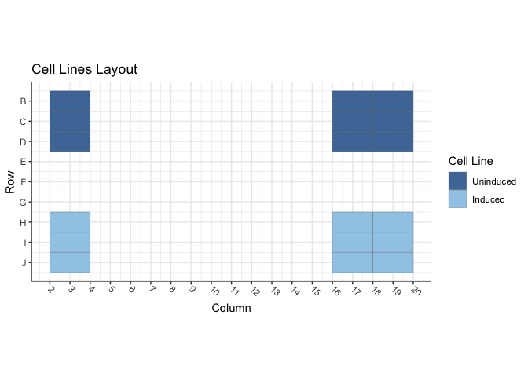
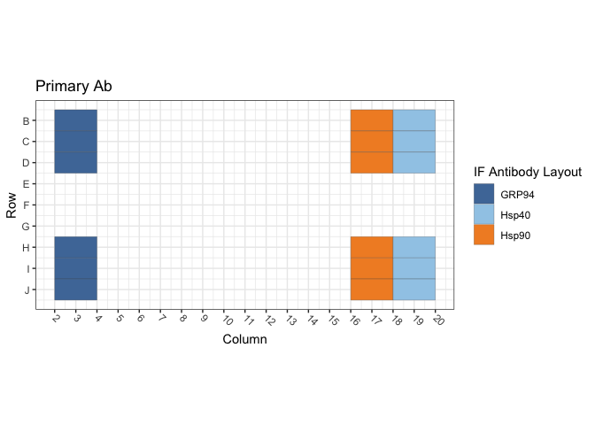
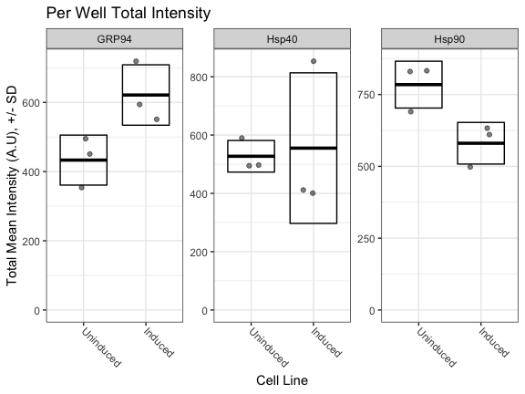

Figure 1C and 1D: TetON Cells / GRP94, Hsp90, and Hsp40
================
Sandra Vidak/Gianluca Pegoraro
October 27th 2022

### Introduction

Columbus screen names:

`20191008-40x-TetON-GRP94-Hsp70-Hsp40-Hsp90_20191008_131309`

`20191009-40x-TetON-GRP94-Hsp70-Hsp90-Hsp40_20191009_131506`

`20191010-40x-TetON-Hsp110-GRP94-Calnexin-Hsp70-SUN1-Hsp40-Hsp90_20191010_144805`

### Analysis Setup

Load required packages.

``` r
library(tidyverse)
```

    ## ── Attaching packages ─────────────────────────────────────── tidyverse 1.3.2 ──
    ## ✔ ggplot2 3.3.6      ✔ purrr   0.3.5 
    ## ✔ tibble  3.1.8      ✔ dplyr   1.0.10
    ## ✔ tidyr   1.2.1      ✔ stringr 1.4.1 
    ## ✔ readr   2.1.3      ✔ forcats 0.5.2 
    ## ── Conflicts ────────────────────────────────────────── tidyverse_conflicts() ──
    ## ✖ dplyr::filter() masks stats::filter()
    ## ✖ dplyr::lag()    masks stats::lag()

``` r
library(fs)
library(Hmisc)
```

    ## Loading required package: lattice
    ## Loading required package: survival
    ## Loading required package: Formula
    ## 
    ## Attaching package: 'Hmisc'
    ## 
    ## The following objects are masked from 'package:dplyr':
    ## 
    ##     src, summarize
    ## 
    ## The following objects are masked from 'package:base':
    ## 
    ##     format.pval, units

``` r
library(ggthemes)
library(DescTools) # for Dunnett's Test
```

    ## 
    ## Attaching package: 'DescTools'
    ## 
    ## The following objects are masked from 'package:Hmisc':
    ## 
    ##     %nin%, Label, Mean, Quantile

``` r
source("R/Plotters.R") #Functions needed for plotting
```

Set the palette and the running theme for ggplot2.

### Experimental Metadata

Read plate layouts.

``` r
cell_levs <- c("Uninduced", "Induced")

plate_layouts <- read_tsv("metadata/plate_layout.txt") %>%
  filter(!is.na(cell_line)) %>%
  separate(col = cell_line, 
           into = c("cell_line"), 
           remove = T) %>%
  mutate(cell_line = factor(cell_line, levels = cell_levs))

glimpse(plate_layouts)
```

    ## Rows: 18
    ## Columns: 4
    ## $ row       <dbl> 2, 3, 4, 8, 9, 10, 2, 3, 4, 8, 9, 10, 2, 3, 4, 8, 9, 10
    ## $ column    <dbl> 3, 3, 3, 3, 3, 3, 17, 17, 17, 17, 17, 17, 19, 19, 19, 19, 19…
    ## $ marker    <chr> "GRP94", "GRP94", "GRP94", "GRP94", "GRP94", "GRP94", "Hsp90…
    ## $ cell_line <fct> Uninduced, Uninduced, Uninduced, Induced, Induced, Induced, …

Plot plate layouts.

<!-- -->

<!-- -->

### Read and Process Columbus data

Recursively search the `input` directory and its subdirectories for
files whose name includes the Glob patterns defined in the chunk above,
and read the cell-level Columbus data from the results text files.

``` r
read_columbus_results <- function(path, glob) {
  dir_ls(path = path,
         recurse = T,
         glob = glob)  %>%
    read_tsv(
      id = "file_name"
    ) %>%
    select(
      screen = ScreenName,
      plate = PlateName,
      well = WellName,
      row = Row,
      column = Column,
      nuc_area = `Nuclei Selected - Nucleus Area [px²]`,
      cyto_area = `Nuclei Selected - Cytoplasm Area [px²]`,
      cell_area = `Nuclei Selected - Cell Area [px²]`,
      nuc_marker_int = `Nuclei Selected - Intensity Nucleus BP600/37 Mean`,
      cyto_marker_int = `Nuclei Selected - Intensity Cytoplasm BP600/37 Mean`,
      ratio_marker_int = `Nuclei Selected - Nuc_Cyto_BP600_Ratio`
    )
}

glob_path <- "*- Nuclei Selected[0].txt"
col_tbl <- read_columbus_results("input", glob_path)

glimpse(col_tbl)
```

    ## Rows: 309,346
    ## Columns: 11
    ## $ screen           <chr> "20191008-40x-TetON-GRP94-Hsp70-Hsp40-Hsp90_20191008_…
    ## $ plate            <chr> "AssayPlate_PerkinElmer_CellCarrier-384 Ultra", "Assa…
    ## $ well             <chr> "B17", "B17", "B17", "B17", "B17", "B17", "B17", "B17…
    ## $ row              <dbl> 2, 2, 2, 2, 2, 2, 2, 2, 2, 2, 2, 2, 2, 2, 2, 2, 2, 2,…
    ## $ column           <dbl> 17, 17, 17, 17, 17, 17, 17, 17, 17, 17, 17, 17, 17, 1…
    ## $ nuc_area         <dbl> 1658, 1635, 1626, 1158, 1644, 1133, 1401, 1715, 2145,…
    ## $ cyto_area        <dbl> 1121, 1086, 2939, 2697, 3181, 2205, 1100, 2856, 3065,…
    ## $ cell_area        <dbl> 2779, 2721, 4565, 3855, 4825, 3338, 2501, 4571, 5210,…
    ## $ nuc_marker_int   <dbl> 430.258, 409.428, 412.504, 433.524, 597.744, 394.823,…
    ## $ cyto_marker_int  <dbl> 359.518, 361.772, 368.287, 399.813, 443.879, 415.877,…
    ## $ ratio_marker_int <dbl> 1.196760, 1.131730, 1.120060, 1.084320, 1.346640, 0.9…

Join Columbus data with the plate layout information.

``` r
cell_tbl <- col_tbl %>%
  mutate(sum_marker_int = nuc_marker_int + cyto_marker_int) %>%
  inner_join(plate_layouts,
             by = c("row", "column")) %>%
  select(screen,
         plate,
         well,
         row,
         column,
         cell_line,
         marker,
         nuc_area:sum_marker_int)

glimpse(cell_tbl)
```

    ## Rows: 83,594
    ## Columns: 14
    ## $ screen           <chr> "20191008-40x-TetON-GRP94-Hsp70-Hsp40-Hsp90_20191008_…
    ## $ plate            <chr> "AssayPlate_PerkinElmer_CellCarrier-384 Ultra", "Assa…
    ## $ well             <chr> "B17", "B17", "B17", "B17", "B17", "B17", "B17", "B17…
    ## $ row              <dbl> 2, 2, 2, 2, 2, 2, 2, 2, 2, 2, 2, 2, 2, 2, 2, 2, 2, 2,…
    ## $ column           <dbl> 17, 17, 17, 17, 17, 17, 17, 17, 17, 17, 17, 17, 17, 1…
    ## $ cell_line        <fct> Uninduced, Uninduced, Uninduced, Uninduced, Uninduced…
    ## $ marker           <chr> "Hsp90", "Hsp90", "Hsp90", "Hsp90", "Hsp90", "Hsp90",…
    ## $ nuc_area         <dbl> 1658, 1635, 1626, 1158, 1644, 1133, 1401, 1715, 2145,…
    ## $ cyto_area        <dbl> 1121, 1086, 2939, 2697, 3181, 2205, 1100, 2856, 3065,…
    ## $ cell_area        <dbl> 2779, 2721, 4565, 3855, 4825, 3338, 2501, 4571, 5210,…
    ## $ nuc_marker_int   <dbl> 430.258, 409.428, 412.504, 433.524, 597.744, 394.823,…
    ## $ cyto_marker_int  <dbl> 359.518, 361.772, 368.287, 399.813, 443.879, 415.877,…
    ## $ ratio_marker_int <dbl> 1.196760, 1.131730, 1.120060, 1.084320, 1.346640, 0.9…
    ## $ sum_marker_int   <dbl> 789.776, 771.200, 780.791, 833.337, 1041.623, 810.700…

Calculate number of cells and mean per well for all properties.

``` r
well_tbl <- cell_tbl %>%
  group_by(screen,
           well,
           row,
           column,
           cell_line,
           marker) %>%
  summarise(cell_n = n(),
            across(nuc_area:sum_marker_int,
                   list(mean = ~ mean(.x, na.rm = T))))

glimpse(well_tbl)
```

    ## Rows: 54
    ## Columns: 14
    ## Groups: screen, well, row, column, cell_line [54]
    ## $ screen                <chr> "20191008-40x-TetON-GRP94-Hsp70-Hsp40-Hsp90_2019…
    ## $ well                  <chr> "B17", "B19", "B3", "C17", "C19", "C3", "D17", "…
    ## $ row                   <dbl> 2, 2, 2, 3, 3, 3, 4, 4, 4, 8, 8, 8, 9, 9, 9, 10,…
    ## $ column                <dbl> 17, 19, 3, 17, 19, 3, 17, 19, 3, 17, 19, 3, 17, …
    ## $ cell_line             <fct> Uninduced, Uninduced, Uninduced, Uninduced, Unin…
    ## $ marker                <chr> "Hsp90", "Hsp40", "GRP94", "Hsp90", "Hsp40", "GR…
    ## $ cell_n                <int> 1409, 1550, 1582, 1536, 1507, 1525, 1466, 1434, …
    ## $ nuc_area_mean         <dbl> 2500.133, 2411.603, 2451.439, 2559.881, 2484.646…
    ## $ cyto_area_mean        <dbl> 3313.039, 3222.100, 3081.379, 3134.173, 3081.583…
    ## $ cell_area_mean        <dbl> 5813.172, 5633.703, 5532.819, 5694.054, 5566.229…
    ## $ nuc_marker_int_mean   <dbl> 430.3431, 362.9081, 226.7791, 455.8385, 340.4717…
    ## $ cyto_marker_int_mean  <dbl> 369.6315, 223.5235, 233.3086, 394.1026, 227.0922…
    ## $ ratio_marker_int_mean <dbl> 1.1820039, 1.6703727, 0.9822478, 1.1694774, 1.52…
    ## $ sum_marker_int_mean   <dbl> 799.9746, 586.4316, 460.0878, 849.9411, 567.5640…

Calculate the mean of the technical replicates for each biological
replicate. Now every marker/cell line combination has an n = 3
biological replicates.

``` r
bioreps_tbl <- well_tbl %>%
  group_by(screen,
           cell_line,
           marker) %>%
  summarise(across(cell_n:sum_marker_int_mean,
                    ~ mean(.x, na.rm = T)))

glimpse(bioreps_tbl)
```

    ## Rows: 18
    ## Columns: 11
    ## Groups: screen, cell_line [6]
    ## $ screen                <chr> "20191008-40x-TetON-GRP94-Hsp70-Hsp40-Hsp90_2019…
    ## $ cell_line             <fct> Uninduced, Uninduced, Uninduced, Induced, Induce…
    ## $ marker                <chr> "GRP94", "Hsp40", "Hsp90", "GRP94", "Hsp40", "Hs…
    ## $ cell_n                <dbl> 1547.667, 1497.000, 1470.333, 1553.333, 1597.333…
    ## $ nuc_area_mean         <dbl> 2530.753, 2509.210, 2540.574, 2047.399, 2133.960…
    ## $ cyto_area_mean        <dbl> 3142.701, 3185.959, 3265.898, 3554.789, 3412.219…
    ## $ cell_area_mean        <dbl> 5673.455, 5695.169, 5806.472, 5602.188, 5546.179…
    ## $ nuc_marker_int_mean   <dbl> 247.0136, 356.4818, 447.6508, 402.8297, 519.3350…
    ## $ cyto_marker_int_mean  <dbl> 247.9609, 233.3800, 385.1786, 316.1956, 333.8193…
    ## $ ratio_marker_int_mean <dbl> 1.0050926, 1.5671913, 1.1757415, 1.3014019, 1.61…
    ## $ sum_marker_int_mean   <dbl> 494.9745, 589.8618, 832.9045, 719.0252, 853.3109…

### Biological Replicates Level plots for Fig.1C,D

<!-- -->

### Calculate Dunnett’s test for the continuous variables.

Define a custom function to run a Dunnett post-hoc test only on the Mean
marker intensity sum (Cyto + Nucleus), using the cell line as the
predictor variable, and fixing Uninduced as the negative control. The
output of the Dunnett’s test is then rearranged to a tidy table to make
it work with `dplyr`.

``` r
calc_dunnett <- function(df){
  as.data.frame(as.table(DunnettTest(ratio_marker_int_mean ~ cell_line,
                          control = "Uninduced",
                          data = df)$Uninduced)) %>%
    pivot_wider(names_from = Var2, values_from = Freq) %>%
    rename(comparison = Var1)
}
```

Run the custom function on all the data grouped based on the IF marker
and save the data to a .csv file.

``` r
dunnett_test <- bioreps_tbl %>%
  group_by(marker) %>%
  group_modify(~ calc_dunnett(.x))

write_csv(dunnett_test, "output/dunnett_results.csv")

knitr::kable(dunnett_test, digits = 3)
```

| marker | comparison        |  diff | lwr.ci | upr.ci |  pval |
|:-------|:------------------|------:|-------:|-------:|------:|
| GRP94  | Induced-Uninduced | 0.193 | -0.048 |  0.434 | 0.090 |
| Hsp40  | Induced-Uninduced | 0.174 |  0.022 |  0.326 | 0.033 |
| Hsp90  | Induced-Uninduced | 0.144 |  0.067 |  0.221 | 0.006 |

Document the information about the analysis session

``` r
sessionInfo()
```

    ## R version 4.2.1 (2022-06-23)
    ## Platform: x86_64-apple-darwin17.0 (64-bit)
    ## Running under: macOS Big Sur ... 10.16
    ## 
    ## Matrix products: default
    ## BLAS:   /Library/Frameworks/R.framework/Versions/4.2/Resources/lib/libRblas.0.dylib
    ## LAPACK: /Library/Frameworks/R.framework/Versions/4.2/Resources/lib/libRlapack.dylib
    ## 
    ## locale:
    ## [1] en_US.UTF-8/en_US.UTF-8/en_US.UTF-8/C/en_US.UTF-8/en_US.UTF-8
    ## 
    ## attached base packages:
    ## [1] stats     graphics  grDevices utils     datasets  methods   base     
    ## 
    ## other attached packages:
    ##  [1] DescTools_0.99.47 ggthemes_4.2.4    Hmisc_4.7-1       Formula_1.2-4    
    ##  [5] survival_3.4-0    lattice_0.20-45   fs_1.5.2          forcats_0.5.2    
    ##  [9] stringr_1.4.1     dplyr_1.0.10      purrr_0.3.5       readr_2.1.3      
    ## [13] tidyr_1.2.1       tibble_3.1.8      ggplot2_3.3.6     tidyverse_1.3.2  
    ## 
    ## loaded via a namespace (and not attached):
    ##  [1] bit64_4.0.5         lubridate_1.8.0     RColorBrewer_1.1-3 
    ##  [4] httr_1.4.4          tools_4.2.1         backports_1.4.1    
    ##  [7] utf8_1.2.2          R6_2.5.1            rpart_4.1.19       
    ## [10] DBI_1.1.3           colorspace_2.0-3    nnet_7.3-18        
    ## [13] withr_2.5.0         Exact_3.2           tidyselect_1.2.0   
    ## [16] gridExtra_2.3       bit_4.0.4           compiler_4.2.1     
    ## [19] cli_3.4.1           rvest_1.0.3         htmlTable_2.4.1    
    ## [22] expm_0.999-6        xml2_1.3.3          labeling_0.4.2     
    ## [25] scales_1.2.1        checkmate_2.1.0     mvtnorm_1.1-3      
    ## [28] proxy_0.4-27        digest_0.6.30       foreign_0.8-83     
    ## [31] rmarkdown_2.17      base64enc_0.1-3     jpeg_0.1-9         
    ## [34] pkgconfig_2.0.3     htmltools_0.5.3     highr_0.9          
    ## [37] dbplyr_2.2.1        fastmap_1.1.0       htmlwidgets_1.5.4  
    ## [40] rlang_1.0.6         readxl_1.4.1        rstudioapi_0.14    
    ## [43] farver_2.1.1        generics_0.1.3      jsonlite_1.8.3     
    ## [46] vroom_1.6.0         googlesheets4_1.0.1 magrittr_2.0.3     
    ## [49] interp_1.1-3        Matrix_1.5-1        Rcpp_1.0.9         
    ## [52] munsell_0.5.0       fansi_1.0.3         lifecycle_1.0.3    
    ## [55] stringi_1.7.8       yaml_2.3.6          rootSolve_1.8.2.3  
    ## [58] MASS_7.3-58.1       grid_4.2.1          parallel_4.2.1     
    ## [61] crayon_1.5.2        lmom_2.9            deldir_1.0-6       
    ## [64] haven_2.5.1         splines_4.2.1       hms_1.1.2          
    ## [67] knitr_1.40          pillar_1.8.1        boot_1.3-28        
    ## [70] gld_2.6.6           reprex_2.0.2        glue_1.6.2         
    ## [73] evaluate_0.17       latticeExtra_0.6-30 data.table_1.14.4  
    ## [76] modelr_0.1.9        png_0.1-7           vctrs_0.5.0        
    ## [79] tzdb_0.3.0          cellranger_1.1.0    gtable_0.3.1       
    ## [82] assertthat_0.2.1    xfun_0.34           broom_1.0.1        
    ## [85] e1071_1.7-12        class_7.3-20        googledrive_2.0.0  
    ## [88] gargle_1.2.1        cluster_2.1.4       ellipsis_0.3.2
