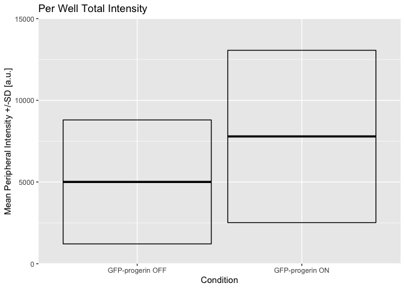
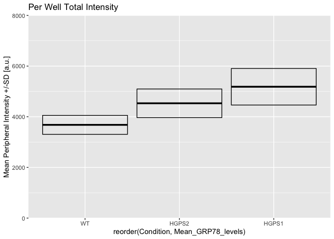

Figure 3C and 3D: TETON Cells / GRP78
================
Sandra Vidak
October 27th 2022

``` r
library(ggplot2)
library(ggthemes)
```

### Read Data for Fig 3C

Import and filter data and calculate sum and mean of the GRP78
peripheral recruitment for each biological replicate in TetON
fibroblasts.

``` r
GRP78_ring_1 <- read.csv(file="input/GRP78ring1.csv")

GRP78_ring_1_filtered <- GRP78_ring_1 [ c(seq(1, nrow(GRP78_ring_1),3)), c("Intensity.Nucleus.3", "Intensity.Nucleus.4")]

GRP78_ring_1_filtered_rowsum <- rowSums(GRP78_ring_1_filtered[,1:2])


Mean_Uninduced_GRP78_1 <- mean(GRP78_ring_1_filtered_rowsum[1:3])

Mean_Induced_4days_GRP78_1 <- mean(GRP78_ring_1_filtered_rowsum[7:9])
```

``` r
GRP78_ring_2 <- read.csv(file="input/GRP78ring2.csv") 

GRP78_ring_2_filtered <- GRP78_ring_2 [ c(seq(1, nrow(GRP78_ring_2),10)), c("Intensity.Nucleus.3", "Intensity.Nucleus.4")]

GRP78_ring_2_filtered_rowsum <- rowSums(GRP78_ring_2_filtered[,1:2])


Mean_Uninduced_GRP78_2 <- mean(GRP78_ring_2_filtered_rowsum[1:3])

Mean_Induced_4days_GRP78_2 <- mean(GRP78_ring_2_filtered_rowsum[7:9])
```

``` r
GRP78_ring_3 <- read.csv(file="input/GRP78ring3.csv") 

GRP78_ring_3_filtered <- GRP78_ring_3 [ c(seq(1, nrow(GRP78_ring_3),8)), c("Intensity.Nucleus.3", "Intensity.Nucleus.4")]

GRP78_ring_3_filtered_rowsum <- rowSums(GRP78_ring_3_filtered[,1:2])


Mean_Uninduced_GRP78_3 <- mean(GRP78_ring_3_filtered_rowsum[1:3])

Mean_Induced_4days_GRP78_3 <- mean(GRP78_ring_3_filtered_rowsum[7:9])
```

``` r
GRP78_Uninduced <- c(Mean_Uninduced_GRP78_1, Mean_Uninduced_GRP78_2, Mean_Uninduced_GRP78_3)

GRP78_Induced4days <- c(Mean_Induced_4days_GRP78_1, Mean_Induced_4days_GRP78_2, Mean_Induced_4days_GRP78_3)


GRP78_df <- data.frame (GRP78_Uninduced,GRP78_Induced4days)

rownames(GRP78_df) <- c("Biological replicate1", "Biological replicate2", "Biological replicate3")

GRP78_df
```

    ##                       GRP78_Uninduced GRP78_Induced4days
    ## Biological replicate1        1200.590           1790.192
    ## Biological replicate2        8785.121          11683.471
    ## Biological replicate3        5030.977           9895.736

Calculate mean and SD for 3 different biological replicates in every
condition

``` r
Mean_GRP78_levels <- apply(GRP78_df,2,mean)

SD_GRP78_levels <- apply(GRP78_df,2,sd)

Mean_GRP78_levels2 <- as.data.frame(Mean_GRP78_levels)

SD_GRP78_levels2 <- as.data.frame(SD_GRP78_levels)
Condition <- rep(c("GFP-progerin OFF","GFP-progerin ON"), each=1)
GRP78_plot <- data.frame(Mean_GRP78_levels2,SD_GRP78_levels2, Condition)
```

### Biological Replicates Level plot for Fig.3C

<!-- -->

### Read and Process Data for Fig 3D

Import and filter data and calculate sum and mean of the GRP78
peripheral recruitment for each biological replicate in h-Tert
immortalized patient fibroblasts

``` r
GRP78_ring_1 <- read.csv(file="input/GRP78ring1_1.csv") 
GRP78_ring_WT_1_filtered <- GRP78_ring_1 [ c(seq(13, nrow(GRP78_ring_1),4)), c("Intensity.Nucleus.3", "Intensity.Nucleus.4")]

GRP78_ring_WT_1_filtered_rowsum <- rowSums(GRP78_ring_WT_1_filtered[,1:2])


GRP78_ring_HGPS1_1_filtered <- GRP78_ring_1 [ c(seq(15, nrow(GRP78_ring_1),4)), c("Intensity.Nucleus.3", "Intensity.Nucleus.4")]

GRP78_ring_HGPS1_1_filtered_rowsum <- rowSums(GRP78_ring_HGPS1_1_filtered[,1:2])

GRP78_ring_HGPS2_1_filtered <- GRP78_ring_1 [ c(seq(16, nrow(GRP78_ring_1),4)), c("Intensity.Nucleus.3", "Intensity.Nucleus.4")]

GRP78_ring_HGPS2_1_filtered_rowsum <- rowSums(GRP78_ring_HGPS2_1_filtered[,1:2])


Mean_WT_1 <- mean(GRP78_ring_WT_1_filtered_rowsum[1:3])

Mean_HGPS1_1 <- mean(GRP78_ring_HGPS1_1_filtered_rowsum[1:3])

Mean_HGPS2_1 <- mean(GRP78_ring_HGPS2_1_filtered_rowsum[1:3])
```

``` r
GRP78_ring_2 <- read.csv(file="input/GRP78ring2_1.csv") 

GRP78_ring_WT_2_filtered <- GRP78_ring_2 [ c(seq(1, nrow(GRP78_ring_2),16)), c("Intensity.Nucleus.3", "Intensity.Nucleus.4")]

GRP78_ring_WT_2_filtered_rowsum <- rowSums(GRP78_ring_WT_2_filtered[,1:2])


GRP78_ring_HGPS1_2_filtered <- GRP78_ring_2 [ c(seq(9, nrow(GRP78_ring_2),16)), c("Intensity.Nucleus.3", "Intensity.Nucleus.4")]

GRP78_ring_HGPS1_2_filtered_rowsum <- rowSums(GRP78_ring_HGPS1_2_filtered[,1:2])


GRP78_ring_HGPS2_2_filtered <- GRP78_ring_2 [ c(seq(13, nrow(GRP78_ring_2),16)), c("Intensity.Nucleus.3", "Intensity.Nucleus.4")]

GRP78_ring_HGPS2_2_filtered_rowsum <- rowSums(GRP78_ring_HGPS2_2_filtered[,1:2])


Mean_WT_2 <- mean(GRP78_ring_WT_2_filtered_rowsum[1:3])

Mean_HGPS1_2 <- mean(GRP78_ring_HGPS1_2_filtered_rowsum[1:3])

Mean_HGPS2_2 <- mean(GRP78_ring_HGPS2_2_filtered_rowsum[1:3])
```

``` r
GRP78_ring_3 <- read.csv(file="input/GRP78ring3_1.csv") 

GRP78_ring_WT_3_filtered <- GRP78_ring_3 [ c(seq(1, nrow(GRP78_ring_3),16)), c("Intensity.Nucleus.3", "Intensity.Nucleus.4")]


GRP78_ring_WT_3_filtered_rowsum <- rowSums(GRP78_ring_WT_3_filtered[,1:2])

GRP78_ring_HGPS1_3_filtered <- GRP78_ring_3 [ c(seq(9, nrow(GRP78_ring_3),16)), c("Intensity.Nucleus.3", "Intensity.Nucleus.4")]

GRP78_ring_HGPS1_3_filtered_rowsum <- rowSums(GRP78_ring_HGPS1_3_filtered[,1:2])

GRP78_ring_HGPS2_3_filtered <- GRP78_ring_3 [ c(seq(13, nrow(GRP78_ring_3),16)), c("Intensity.Nucleus.3", "Intensity.Nucleus.4")]

GRP78_ring_HGPS2_3_filtered_rowsum <- rowSums(GRP78_ring_HGPS2_3_filtered[,1:2])


Mean_WT_3 <- mean(GRP78_ring_WT_3_filtered_rowsum[1:3])

Mean_HGPS1_3 <- mean(GRP78_ring_HGPS1_3_filtered_rowsum[1:3])

Mean_HGPS2_3 <- mean(GRP78_ring_HGPS2_3_filtered_rowsum[1:3])
```

``` r
GRP78_WT <- c(Mean_WT_1, Mean_WT_2, Mean_WT_3)

GRP78_HGPS1 <- c(Mean_HGPS1_1, Mean_HGPS1_2, Mean_HGPS1_3)

GRP78_HGPS2 <- c(Mean_HGPS2_1, Mean_HGPS2_2, Mean_HGPS2_3)


GRP78_df <- data.frame (GRP78_WT,GRP78_HGPS1,GRP78_HGPS2)
rownames(GRP78_df) <- c("Biological replicate1", "Biological replicate2", "Biological replicate3")

GRP78_df
```

    ##                       GRP78_WT GRP78_HGPS1 GRP78_HGPS2
    ## Biological replicate1 3700.798    5533.903    4634.488
    ## Biological replicate2 3295.834    4354.312    3921.338
    ## Biological replicate3 4043.385    5663.743    5037.591

Calculate mean and SD for 3 different biological replicates in every
condition

``` r
Mean_GRP78_levels <- apply(GRP78_df,2,mean)

SD_GRP78_levels <- apply(GRP78_df,2,sd)

Mean_GRP78_levels2 <- as.data.frame(Mean_GRP78_levels)

SD_GRP78_levels2 <- as.data.frame(SD_GRP78_levels)
Condition <- rep(c("WT","HGPS1", "HGPS2"), each=1)

GRP78_plot <- data.frame(Mean_GRP78_levels2,SD_GRP78_levels2, Condition)
```

### Biological Replicates Level plot for Fig.3D

<!-- -->

Document the information about the analysis session

``` r
sessionInfo()
```

    ## R version 4.2.1 (2022-06-23)
    ## Platform: x86_64-apple-darwin17.0 (64-bit)
    ## Running under: macOS Big Sur ... 10.16
    ## 
    ## Matrix products: default
    ## BLAS:   /Library/Frameworks/R.framework/Versions/4.2/Resources/lib/libRblas.0.dylib
    ## LAPACK: /Library/Frameworks/R.framework/Versions/4.2/Resources/lib/libRlapack.dylib
    ## 
    ## locale:
    ## [1] en_US.UTF-8/en_US.UTF-8/en_US.UTF-8/C/en_US.UTF-8/en_US.UTF-8
    ## 
    ## attached base packages:
    ## [1] stats     graphics  grDevices utils     datasets  methods   base     
    ## 
    ## other attached packages:
    ## [1] ggthemes_4.2.4 ggplot2_3.3.6 
    ## 
    ## loaded via a namespace (and not attached):
    ##  [1] highr_0.9        pillar_1.8.1     compiler_4.2.1   tools_4.2.1     
    ##  [5] digest_0.6.30    evaluate_0.17    lifecycle_1.0.3  tibble_3.1.8    
    ##  [9] gtable_0.3.1     pkgconfig_2.0.3  rlang_1.0.6      cli_3.4.1       
    ## [13] DBI_1.1.3        rstudioapi_0.14  yaml_2.3.6       xfun_0.34       
    ## [17] fastmap_1.1.0    withr_2.5.0      stringr_1.4.1    dplyr_1.0.10    
    ## [21] knitr_1.40       generics_0.1.3   vctrs_0.5.0      grid_4.2.1      
    ## [25] tidyselect_1.2.0 glue_1.6.2       R6_2.5.1         fansi_1.0.3     
    ## [29] rmarkdown_2.17   farver_2.1.1     purrr_0.3.5      magrittr_2.0.3  
    ## [33] scales_1.2.1     htmltools_0.5.3  assertthat_0.2.1 colorspace_2.0-3
    ## [37] labeling_0.4.2   utf8_1.2.2       stringi_1.7.8    munsell_0.5.0
