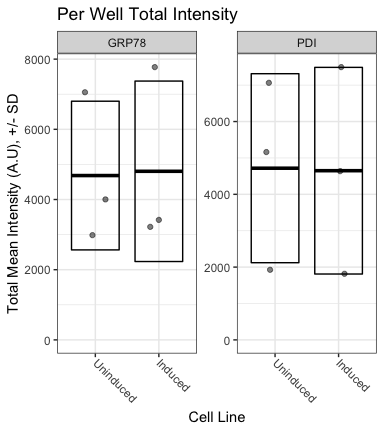

Figure 3H: TetONC661S Cells / GRP78 and PDI
================
Sandra Vidak/Gianluca Pegoraro
November 16th 2022

### Introduction

Columbus screen names:

`180124-40x-TetON-d50C661S-1868-GRP78-PDI-VCP-SUN1_20180124_114654`

`20191017-40x-TetON-C661S10-GRP78-PDI-LB1-H4K16ac_20191017_134327`

`20191018-40x-TetON-C661S11-GRP78-PDI-SUN2-LAP2a-LB1-H4K16ac-Hsp40_20191024_123323`

### Analysis Setup

Load required packages.

``` r
library(tidyverse)
```

    ## ── Attaching packages ─────────────────────────────────────── tidyverse 1.3.2 ──
    ## ✔ ggplot2 3.3.6      ✔ purrr   0.3.5 
    ## ✔ tibble  3.1.8      ✔ dplyr   1.0.10
    ## ✔ tidyr   1.2.1      ✔ stringr 1.4.1 
    ## ✔ readr   2.1.3      ✔ forcats 0.5.2 
    ## ── Conflicts ────────────────────────────────────────── tidyverse_conflicts() ──
    ## ✖ dplyr::filter() masks stats::filter()
    ## ✖ dplyr::lag()    masks stats::lag()

``` r
library(fs)
library(Hmisc)
```

    ## Loading required package: lattice
    ## Loading required package: survival
    ## Loading required package: Formula
    ## 
    ## Attaching package: 'Hmisc'
    ## 
    ## The following objects are masked from 'package:dplyr':
    ## 
    ##     src, summarize
    ## 
    ## The following objects are masked from 'package:base':
    ## 
    ##     format.pval, units

``` r
library(ggthemes)
library(DescTools) # for Dunnett's Test
```

    ## 
    ## Attaching package: 'DescTools'
    ## 
    ## The following objects are masked from 'package:Hmisc':
    ## 
    ##     %nin%, Label, Mean, Quantile

``` r
library(curl)
```

    ## Using libcurl 7.79.1 with LibreSSL/3.3.6
    ## 
    ## Attaching package: 'curl'
    ## 
    ## The following object is masked from 'package:readr':
    ## 
    ##     parse_date

``` r
source("R/Plotters.R") #Functions needed for plotting
```

Set the palette and the running theme for ggplot2.

### Experimental Metadata

Read plate layouts.

``` r
cell_levs <- c("Uninduced", "Induced")

plate_layouts <- read_tsv("metadata/plate_layout.txt") %>%
  filter(!is.na(cell_line)) %>%
  separate(col = cell_line, 
           into = c("cell_line"), 
           remove = T) %>%
  mutate(cell_line = factor(cell_line, levels = cell_levs))

glimpse(plate_layouts)
```

    ## Rows: 36
    ## Columns: 5
    ## $ screen    <chr> "180124-40x-TetON-d50C661S-1868-GRP78-PDI-VCP-SUN1_20180124_…
    ## $ row       <dbl> 2, 3, 4, 8, 9, 10, 2, 3, 4, 8, 9, 10, 2, 3, 4, 8, 9, 10, 2, …
    ## $ column    <dbl> 3, 3, 3, 3, 3, 3, 5, 5, 5, 5, 5, 5, 4, 4, 4, 4, 4, 4, 6, 6, …
    ## $ marker    <chr> "GRP78", "GRP78", "GRP78", "GRP78", "GRP78", "GRP78", "PDI",…
    ## $ cell_line <fct> Uninduced, Uninduced, Uninduced, Induced, Induced, Induced, …

Plot plate layouts.

<!-- -->

<!-- -->

### Download the data if needed

Download and unzip the Columbus results of the experiments from Figshare
if they have not been already downloaded.

``` r
if(!dir.exists("input")) {
  URL <- "https://figshare.com/ndownloader/files/38158233"
  curl_download(URL, "input.zip")
  unzip("input.zip")
}
```

### Read and Process Columbus data

Recursively search the `input` directory and its subdirectories for
files whose name includes the Glob patterns defined in the chunk above,
and read the cell-level Columbus data from the results text files.

``` r
read_columbus_results <- function(path, glob) {
  dir_ls(path = path,
         recurse = T,
         glob = glob)  %>%
    read_tsv(
      id = "file_name"
    ) %>%
    select(
      screen = ScreenName,
      plate = PlateName,
      well = WellName,
      row = Row,
      column = Column,
      nuc_area = `Nuclei Selected - Nucleus Area [px²]`,
      cyto_area = `Nuclei Selected - Cytoplasm Area [px²]`,
      cell_area = `Nuclei Selected - Cell Area [px²]`,
      nuc_marker_int = `Nuclei Selected - Intensity Nucleus BP600/37 Mean`,
      cyto_marker_int = `Nuclei Selected - Intensity Cytoplasm BP600/37 Mean`,
      ratio_marker_int = `Nuclei Selected - Nuc_Cyto_BP600_Ratio`
    )
}

glob_path <- "*- Nuclei Selected[0].txt"
col_tbl <- read_columbus_results("input", glob_path)

glimpse(col_tbl)
```

    ## Rows: 110,704
    ## Columns: 11
    ## $ screen           <chr> "180124-40x-TetON-d50C661S-1868-GRP78-PDI-VCP-SUN1_20…
    ## $ plate            <chr> "Plate2", "Plate2", "Plate2", "Plate2", "Plate2", "Pl…
    ## $ well             <chr> "B11", "B11", "B11", "B11", "B11", "B11", "B11", "B11…
    ## $ row              <dbl> 2, 2, 2, 2, 2, 2, 2, 2, 2, 2, 2, 2, 2, 2, 2, 2, 2, 2,…
    ## $ column           <dbl> 11, 11, 11, 11, 11, 11, 11, 11, 11, 11, 11, 11, 11, 1…
    ## $ nuc_area         <dbl> 2077, 1539, 1700, 1961, 1503, 1384, 1700, 1795, 1526,…
    ## $ cyto_area        <dbl> 3143, 5320, 8734, 13228, 8773, 5765, 2630, 4301, 1941…
    ## $ cell_area        <dbl> 5220, 6859, 10434, 15189, 10276, 7149, 4330, 6096, 34…
    ## $ nuc_marker_int   <dbl> 2303.08, 2925.33, 2348.67, 2257.37, 2105.84, 2432.26,…
    ## $ cyto_marker_int  <dbl> 2345.46, 2778.31, 1901.50, 2478.71, 2426.74, 2424.84,…
    ## $ ratio_marker_int <dbl> 0.981928, 1.052920, 1.235170, 0.910704, 0.867767, 1.0…

Join Columbus data with the plate layout information.

``` r
cell_tbl <- col_tbl %>%
  mutate(sum_marker_int = nuc_marker_int + cyto_marker_int) %>%
  inner_join(plate_layouts,
             by = c("row", "column","screen")) %>%
  select(screen,
         plate,
         well,
         row,
         column,
         cell_line,
         marker,
         nuc_area:sum_marker_int)

glimpse(cell_tbl)
```

    ## Rows: 26,772
    ## Columns: 14
    ## $ screen           <chr> "180124-40x-TetON-d50C661S-1868-GRP78-PDI-VCP-SUN1_20…
    ## $ plate            <chr> "Plate2", "Plate2", "Plate2", "Plate2", "Plate2", "Pl…
    ## $ well             <chr> "B3", "B3", "B3", "B3", "B3", "B3", "B3", "B3", "B3",…
    ## $ row              <dbl> 2, 2, 2, 2, 2, 2, 2, 2, 2, 2, 2, 2, 2, 2, 2, 2, 2, 2,…
    ## $ column           <dbl> 3, 3, 3, 3, 3, 3, 3, 3, 3, 3, 3, 3, 3, 3, 3, 3, 3, 3,…
    ## $ cell_line        <fct> Uninduced, Uninduced, Uninduced, Uninduced, Uninduced…
    ## $ marker           <chr> "GRP78", "GRP78", "GRP78", "GRP78", "GRP78", "GRP78",…
    ## $ nuc_area         <dbl> 1583, 2567, 1605, 1526, 2090, 2112, 1843, 1754, 1560,…
    ## $ cyto_area        <dbl> 1693, 8699, 1457, 1975, 5232, 5062, 2502, 3583, 4367,…
    ## $ cell_area        <dbl> 3276, 11266, 3062, 3501, 7322, 7174, 4345, 5337, 5927…
    ## $ nuc_marker_int   <dbl> 1512.110, 1495.480, 671.195, 1522.930, 1863.390, 1248…
    ## $ cyto_marker_int  <dbl> 1451.83, 1763.70, 1262.39, 1053.65, 1914.68, 1757.07,…
    ## $ ratio_marker_int <dbl> 1.041520, 0.847919, 0.531687, 1.445390, 0.973217, 0.7…
    ## $ sum_marker_int   <dbl> 2963.940, 3259.180, 1933.585, 2576.580, 3778.070, 300…

Calculate number of cells and mean per well for all properties. 4
technical replicates for each of the 3 biological replicates -\> 12
wells for marker/cell line combination.

``` r
well_tbl <- cell_tbl %>%
  group_by(screen,
           well,
           row,
           column,
           cell_line,
           marker) %>%
  summarise(cell_n = n(),
            across(nuc_area:sum_marker_int,
                   list(mean = ~ mean(.x, na.rm = T))))

glimpse(well_tbl)
```

    ## Rows: 36
    ## Columns: 14
    ## Groups: screen, well, row, column, cell_line [36]
    ## $ screen                <chr> "180124-40x-TetON-d50C661S-1868-GRP78-PDI-VCP-SU…
    ## $ well                  <chr> "B3", "B5", "C3", "C5", "D3", "D5", "H3", "H5", …
    ## $ row                   <dbl> 2, 2, 3, 3, 4, 4, 8, 8, 9, 9, 10, 10, 2, 2, 3, 3…
    ## $ column                <dbl> 3, 5, 3, 5, 3, 5, 3, 5, 3, 5, 3, 5, 4, 6, 4, 6, …
    ## $ cell_line             <fct> Uninduced, Uninduced, Uninduced, Uninduced, Unin…
    ## $ marker                <chr> "GRP78", "PDI", "GRP78", "PDI", "GRP78", "PDI", …
    ## $ cell_n                <int> 1060, 991, 1007, 952, 939, 1176, 1143, 860, 1058…
    ## $ nuc_area_mean         <dbl> 1924.995, 1988.279, 1935.537, 1875.775, 2000.899…
    ## $ cyto_area_mean        <dbl> 5562.489, 5895.759, 5865.670, 6122.278, 6360.177…
    ## $ cell_area_mean        <dbl> 7487.484, 7884.037, 7801.208, 7998.054, 8361.076…
    ## $ nuc_marker_int_mean   <dbl> 1057.4712, 764.1939, 1244.0321, 756.6305, 1480.9…
    ## $ cyto_marker_int_mean  <dbl> 1422.806, 1219.277, 1720.012, 1221.028, 2033.170…
    ## $ ratio_marker_int_mean <dbl> 0.7571722, 0.6429167, 0.7360154, 0.6408093, 0.74…
    ## $ sum_marker_int_mean   <dbl> 2480.277, 1983.471, 2964.044, 1977.658, 3514.074…

Calculate the mean of the technical replicates for each biological
replicate. Now every marker/cell line combination has an n = 3
biological replicates.

``` r
bioreps_tbl <- well_tbl %>%
  group_by(screen,
           cell_line,
           marker) %>%
  summarise(across(cell_n:sum_marker_int_mean,
                    ~ mean(.x, na.rm = T)))

glimpse(bioreps_tbl)
```

    ## Rows: 12
    ## Columns: 11
    ## Groups: screen, cell_line [6]
    ## $ screen                <chr> "180124-40x-TetON-d50C661S-1868-GRP78-PDI-VCP-SU…
    ## $ cell_line             <fct> Uninduced, Uninduced, Induced, Induced, Uninduce…
    ## $ marker                <chr> "GRP78", "PDI", "GRP78", "PDI", "GRP78", "PDI", …
    ## $ cell_n                <dbl> 1002.0000, 1039.6667, 1153.0000, 885.0000, 689.3…
    ## $ nuc_area_mean         <dbl> 1953.810, 1917.792, 1921.136, 2070.873, 1569.722…
    ## $ cyto_area_mean        <dbl> 5929.445, 5684.096, 5126.800, 6925.231, 4684.696…
    ## $ cell_area_mean        <dbl> 7883.256, 7601.888, 7047.936, 8996.105, 6254.418…
    ## $ nuc_marker_int_mean   <dbl> 1260.8025, 748.0222, 1287.5439, 637.6226, 3155.0…
    ## $ cyto_marker_int_mean  <dbl> 1725.329, 1178.751, 1935.544, 1178.652, 3896.726…
    ## $ ratio_marker_int_mean <dbl> 0.7447715, 0.6525799, 0.6768590, 0.5540821, 0.84…
    ## $ sum_marker_int_mean   <dbl> 2986.132, 1926.941, 3223.088, 1816.353, 7057.045…

### Biological Replicates Level plot for Fig.3H

<!-- -->

### Calculate Dunnett’s test for the continuous variables.

Define a custom function to run a Dunnett post-hoc test only on the Mean
marker intensity sum (Cyto + Nucleus), using the cell line as the
predictor variable, and fixing Uninduced as the negative control. The
output of the Dunnett’s test is then rearranged to a tidy table to make
it work with `dplyr`.

``` r
calc_dunnett <- function(df){
  as.data.frame(as.table(DunnettTest(ratio_marker_int_mean ~ cell_line,
                          control = "Uninduced",
                          data = df)$Uninduced)) %>%
    pivot_wider(names_from = Var2, values_from = Freq) %>%
    rename(comparison = Var1)
}
```

Run the custom function on all the data grouped based on the IF marker
and save the data to a .csv file.

``` r
dunnett_test <- bioreps_tbl %>%
  group_by(marker) %>%
  group_modify(~ calc_dunnett(.x))

write_csv(dunnett_test, "output/dunnett_results.csv")

knitr::kable(dunnett_test, digits = 3)
```

| marker | comparison        |   diff | lwr.ci | upr.ci |  pval |
|:-------|:------------------|-------:|-------:|-------:|------:|
| GRP78  | Induced-Uninduced | -0.072 | -0.221 |  0.076 | 0.248 |
| PDI    | Induced-Uninduced | -0.138 | -0.321 |  0.045 | 0.104 |

Document the information about the analysis session

``` r
sessionInfo()
```

    ## R version 4.2.1 (2022-06-23)
    ## Platform: x86_64-apple-darwin17.0 (64-bit)
    ## Running under: macOS Big Sur ... 10.16
    ## 
    ## Matrix products: default
    ## BLAS:   /Library/Frameworks/R.framework/Versions/4.2/Resources/lib/libRblas.0.dylib
    ## LAPACK: /Library/Frameworks/R.framework/Versions/4.2/Resources/lib/libRlapack.dylib
    ## 
    ## locale:
    ## [1] en_US.UTF-8/en_US.UTF-8/en_US.UTF-8/C/en_US.UTF-8/en_US.UTF-8
    ## 
    ## attached base packages:
    ## [1] stats     graphics  grDevices utils     datasets  methods   base     
    ## 
    ## other attached packages:
    ##  [1] curl_4.3.3        DescTools_0.99.47 ggthemes_4.2.4    Hmisc_4.7-1      
    ##  [5] Formula_1.2-4     survival_3.4-0    lattice_0.20-45   fs_1.5.2         
    ##  [9] forcats_0.5.2     stringr_1.4.1     dplyr_1.0.10      purrr_0.3.5      
    ## [13] readr_2.1.3       tidyr_1.2.1       tibble_3.1.8      ggplot2_3.3.6    
    ## [17] tidyverse_1.3.2  
    ## 
    ## loaded via a namespace (and not attached):
    ##  [1] bit64_4.0.5         lubridate_1.8.0     RColorBrewer_1.1-3 
    ##  [4] httr_1.4.4          tools_4.2.1         backports_1.4.1    
    ##  [7] utf8_1.2.2          R6_2.5.1            rpart_4.1.19       
    ## [10] DBI_1.1.3           colorspace_2.0-3    nnet_7.3-18        
    ## [13] withr_2.5.0         Exact_3.2           tidyselect_1.2.0   
    ## [16] gridExtra_2.3       bit_4.0.4           compiler_4.2.1     
    ## [19] cli_3.4.1           rvest_1.0.3         htmlTable_2.4.1    
    ## [22] expm_0.999-6        xml2_1.3.3          labeling_0.4.2     
    ## [25] scales_1.2.1        checkmate_2.1.0     mvtnorm_1.1-3      
    ## [28] proxy_0.4-27        digest_0.6.30       foreign_0.8-83     
    ## [31] rmarkdown_2.17      base64enc_0.1-3     jpeg_0.1-9         
    ## [34] pkgconfig_2.0.3     htmltools_0.5.3     highr_0.9          
    ## [37] dbplyr_2.2.1        fastmap_1.1.0       htmlwidgets_1.5.4  
    ## [40] rlang_1.0.6         readxl_1.4.1        rstudioapi_0.14    
    ## [43] farver_2.1.1        generics_0.1.3      jsonlite_1.8.3     
    ## [46] vroom_1.6.0         googlesheets4_1.0.1 magrittr_2.0.3     
    ## [49] interp_1.1-3        Matrix_1.5-3        Rcpp_1.0.9         
    ## [52] munsell_0.5.0       fansi_1.0.3         lifecycle_1.0.3    
    ## [55] stringi_1.7.8       yaml_2.3.6          rootSolve_1.8.2.3  
    ## [58] MASS_7.3-58.1       grid_4.2.1          parallel_4.2.1     
    ## [61] crayon_1.5.2        lmom_2.9            deldir_1.0-6       
    ## [64] haven_2.5.1         splines_4.2.1       hms_1.1.2          
    ## [67] knitr_1.40          pillar_1.8.1        boot_1.3-28        
    ## [70] gld_2.6.6           reprex_2.0.2        glue_1.6.2         
    ## [73] evaluate_0.17       latticeExtra_0.6-30 data.table_1.14.4  
    ## [76] modelr_0.1.9        png_0.1-7           vctrs_0.5.0        
    ## [79] tzdb_0.3.0          cellranger_1.1.0    gtable_0.3.1       
    ## [82] assertthat_0.2.1    xfun_0.34           broom_1.0.1        
    ## [85] e1071_1.7-12        class_7.3-20        googledrive_2.0.0  
    ## [88] gargle_1.2.1        cluster_2.1.4       ellipsis_0.3.2
