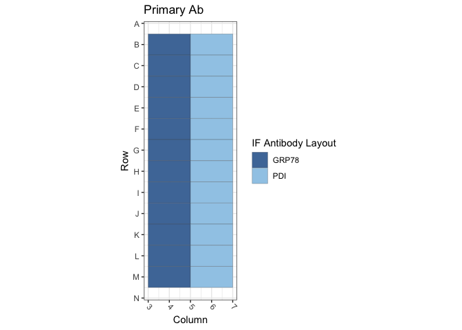
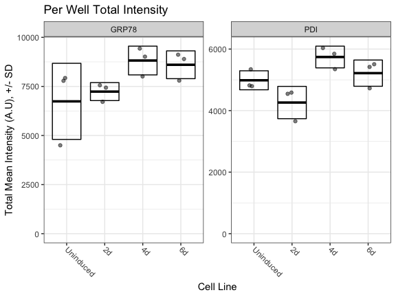

Figure S1B: TetON Cells / GRP78 and PDI
================
Sandra Vidak/Gianluca Pegoraro
March 13th 2023

### Introduction

Columbus screen names:

`20191008-40x-TetON-GRP78-Calnexin-PDI-SUN2-LAP2a-LB1-H3K27-H4K16-gH2AX_20191008_114604`

`20191009-40x-TetON-GRP78-PDI-SUN2-LAP2a-LB1-H3K27-H4K16-gH2AX_20191009_121129`

`20191009-40x-TetON-GRP78-PDI-SUN2-LAP2a-LB1-H3K27-H4K16-gH2AX_20191009_134935`

### Analysis Setup

Load required packages.

``` r
library(tidyverse)
```

    ## ── Attaching packages ─────────────────────────────────────── tidyverse 1.3.2 ──
    ## ✔ ggplot2 3.3.6      ✔ purrr   0.3.5 
    ## ✔ tibble  3.1.8      ✔ dplyr   1.0.10
    ## ✔ tidyr   1.2.1      ✔ stringr 1.4.1 
    ## ✔ readr   2.1.3      ✔ forcats 0.5.2 
    ## ── Conflicts ────────────────────────────────────────── tidyverse_conflicts() ──
    ## ✖ dplyr::filter() masks stats::filter()
    ## ✖ dplyr::lag()    masks stats::lag()

``` r
library(fs)
library(Hmisc)
```

    ## Loading required package: lattice
    ## Loading required package: survival
    ## Loading required package: Formula
    ## 
    ## Attaching package: 'Hmisc'
    ## 
    ## The following objects are masked from 'package:dplyr':
    ## 
    ##     src, summarize
    ## 
    ## The following objects are masked from 'package:base':
    ## 
    ##     format.pval, units

``` r
library(ggthemes)
library(DescTools) # for Dunnett's Test
```

    ## 
    ## Attaching package: 'DescTools'
    ## 
    ## The following objects are masked from 'package:Hmisc':
    ## 
    ##     %nin%, Label, Mean, Quantile

``` r
library(curl)
```

    ## Using libcurl 7.86.0 with LibreSSL/3.3.6
    ## 
    ## Attaching package: 'curl'
    ## 
    ## The following object is masked from 'package:readr':
    ## 
    ##     parse_date

``` r
source("R/Plotters.R") #Functions needed for plotting
```

Set the palette and the running theme for ggplot2.

### Experimental Metadata

Read plate layouts.

``` r
cell_levs <- c("Uninduced", "2d", "4d", "6d")

plate_layouts <- read_tsv("metadata/plate_layout.txt") %>%
  filter(!is.na(cell_line)) %>%
  separate(col = cell_line, 
           into = c("cell_line"), 
           remove = T) %>%
  mutate(cell_line = factor(cell_line, levels = cell_levs))

glimpse(plate_layouts)
```

    ## Rows: 24
    ## Columns: 4
    ## $ row       <dbl> 2, 3, 4, 5, 6, 7, 8, 9, 10, 11, 12, 13, 2, 3, 4, 5, 6, 7, 8,…
    ## $ column    <dbl> 4, 4, 4, 4, 4, 4, 4, 4, 4, 4, 4, 4, 6, 6, 6, 6, 6, 6, 6, 6, …
    ## $ marker    <chr> "GRP78", "GRP78", "GRP78", "GRP78", "GRP78", "GRP78", "GRP78…
    ## $ cell_line <fct> Uninduced, Uninduced, Uninduced, 2d, 2d, 2d, 4d, 4d, 4d, 6d,…

Plot plate layouts.

<!-- -->

<!-- -->

### Download the data if needed

Download and unzip the Columbus results of the experiments from Figshare
if they have not been already downloaded.

``` r
if(!dir.exists("input")) {
  URL <- "https://figshare.com/ndownloader/files/39550549"
  curl_download(URL, "input.zip")
  unzip("input.zip")
  dir_copy("data", "input")
  dir_delete("data")
}
```

### Read and Process Columbus data

Recursively search the `input` directory and its subdirectories for
files whose name includes the Glob patterns defined in the chunk above,
and read the cell-level Columbus data from the results text files.

``` r
read_columbus_results <- function(path, glob) {
  dir_ls(path = path,
         recurse = T,
         glob = glob)  %>%
    read_tsv(
      id = "file_name"
    ) %>%
    select(
      screen = ScreenName,
      plate = PlateName,
      well = WellName,
      row = Row,
      column = Column,
      nuc_area = `Nuclei Selected - Nucleus Area [px²]`,
      cyto_area = `Nuclei Selected - Cytoplasm Area [px²]`,
      cell_area = `Nuclei Selected - Cell Area [px²]`,
      nuc_marker_int = `Nuclei Selected - Intensity Nucleus BP600/37 Mean`,
      cyto_marker_int = `Nuclei Selected - Intensity Cytoplasm BP600/37 Mean`,
      ratio_marker_int = `Nuclei Selected - Nuc_Cyto_BP600_Ratio`
    )
}

glob_path <- "*- Nuclei Selected[0].txt"
col_tbl <- read_columbus_results("input", glob_path)

glimpse(col_tbl)
```

    ## Rows: 471,478
    ## Columns: 11
    ## $ screen           <chr> "20191008-40x-TetON-GRP78-Calnexin-PDI-SUN2-LAP2a-LB1…
    ## $ plate            <chr> "AssayPlate_PerkinElmer_CellCarrier-384 Ultra", "Assa…
    ## $ well             <chr> "B10", "B10", "B10", "B10", "B10", "B10", "B10", "B10…
    ## $ row              <dbl> 2, 2, 2, 2, 2, 2, 2, 2, 2, 2, 2, 2, 2, 2, 2, 2, 2, 2,…
    ## $ column           <dbl> 10, 10, 10, 10, 10, 10, 10, 10, 10, 10, 10, 10, 10, 1…
    ## $ nuc_area         <dbl> 1413, 2736, 1687, 1831, 1605, 2219, 1884, 1133, 1678,…
    ## $ cyto_area        <dbl> 635, 1802, 987, 785, 400, 3999, 2148, 1789, 1204, 218…
    ## $ cell_area        <dbl> 2048, 4538, 2674, 2616, 2005, 6218, 4032, 2922, 2882,…
    ## $ nuc_marker_int   <dbl> 2605.95, 3068.62, 2836.78, 3005.06, 2383.19, 2485.38,…
    ## $ cyto_marker_int  <dbl> 857.346, 567.685, 748.230, 796.290, 1288.730, 472.500…
    ## $ ratio_marker_int <dbl> 3.03955, 5.40551, 3.79132, 3.77383, 1.84926, 5.26007,…

Join Columbus data with the plate layout information.

``` r
cell_tbl <- col_tbl %>%
  mutate(sum_marker_int = nuc_marker_int + cyto_marker_int) %>%
  inner_join(plate_layouts,
             by = c("row", "column")) %>%
  select(screen,
         plate,
         well,
         row,
         column,
         cell_line,
         marker,
         nuc_area:sum_marker_int)

glimpse(cell_tbl)
```

    ## Rows: 108,764
    ## Columns: 14
    ## $ screen           <chr> "20191008-40x-TetON-GRP78-Calnexin-PDI-SUN2-LAP2a-LB1…
    ## $ plate            <chr> "AssayPlate_PerkinElmer_CellCarrier-384 Ultra", "Assa…
    ## $ well             <chr> "B4", "B4", "B4", "B4", "B4", "B4", "B4", "B4", "B4",…
    ## $ row              <dbl> 2, 2, 2, 2, 2, 2, 2, 2, 2, 2, 2, 2, 2, 2, 2, 2, 2, 2,…
    ## $ column           <dbl> 4, 4, 4, 4, 4, 4, 4, 4, 4, 4, 4, 4, 4, 4, 4, 4, 4, 4,…
    ## $ cell_line        <fct> Uninduced, Uninduced, Uninduced, Uninduced, Uninduced…
    ## $ marker           <chr> "GRP78", "GRP78", "GRP78", "GRP78", "GRP78", "GRP78",…
    ## $ nuc_area         <dbl> 1220, 1877, 1414, 1708, 1923, 1491, 1266, 1638, 2293,…
    ## $ cyto_area        <dbl> 2403, 603, 2227, 975, 2825, 1927, 3918, 2717, 1785, 6…
    ## $ cell_area        <dbl> 3623, 2480, 3641, 2683, 4748, 3418, 5184, 4355, 4078,…
    ## $ nuc_marker_int   <dbl> 2500.27, 3216.22, 3211.46, 3078.86, 2547.19, 3062.48,…
    ## $ cyto_marker_int  <dbl> 2827.89, 3129.67, 3950.26, 3580.95, 3234.80, 3174.62,…
    ## $ ratio_marker_int <dbl> 0.884147, 1.027660, 0.812974, 0.859788, 0.787434, 0.9…
    ## $ sum_marker_int   <dbl> 5328.16, 6345.89, 7161.72, 6659.81, 5781.99, 6237.10,…

Calculate number of cells and mean per well for all properties. 4
technical replicates for each of the 3 biological replicates -\> 12
wells for marker/cell line combination.

``` r
well_tbl <- cell_tbl %>%
  group_by(screen,
           well,
           row,
           column,
           cell_line,
           marker) %>%
  summarise(cell_n = n(),
            across(nuc_area:sum_marker_int,
                   list(mean = ~ mean(.x, na.rm = T))))

glimpse(well_tbl)
```

    ## Rows: 72
    ## Columns: 14
    ## Groups: screen, well, row, column, cell_line [72]
    ## $ screen                <chr> "20191008-40x-TetON-GRP78-Calnexin-PDI-SUN2-LAP2…
    ## $ well                  <chr> "B4", "B6", "C4", "C6", "D4", "D6", "E4", "E6", …
    ## $ row                   <dbl> 2, 2, 3, 3, 4, 4, 5, 5, 6, 6, 7, 7, 8, 8, 9, 9, …
    ## $ column                <dbl> 4, 6, 4, 6, 4, 6, 4, 6, 4, 6, 4, 6, 4, 6, 4, 6, …
    ## $ cell_line             <fct> Uninduced, Uninduced, Uninduced, Uninduced, Unin…
    ## $ marker                <chr> "GRP78", "PDI", "GRP78", "PDI", "GRP78", "PDI", …
    ## $ cell_n                <int> 1553, 1392, 1530, 1446, 1620, 1481, 1422, 1552, …
    ## $ nuc_area_mean         <dbl> 2503.679, 2638.567, 2557.862, 2424.512, 2425.993…
    ## $ cyto_area_mean        <dbl> 3109.417, 3338.554, 3226.733, 3393.648, 3019.771…
    ## $ cell_area_mean        <dbl> 5613.097, 5977.121, 5784.595, 5818.160, 5445.764…
    ## $ nuc_marker_int_mean   <dbl> 2964.451, 2035.994, 3617.464, 2248.209, 3925.694…
    ## $ cyto_marker_int_mean  <dbl> 3704.183, 2496.594, 4597.545, 2791.487, 4963.799…
    ## $ ratio_marker_int_mean <dbl> 0.8094652, 0.8324471, 0.7983045, 0.8242916, 0.80…
    ## $ sum_marker_int_mean   <dbl> 6668.634, 4532.588, 8216.780, 5039.706, 8889.493…

Calculate the mean of the technical replicates for each biological
replicate. Now every marker/cell line combination has an n = 3
biological replicates.

``` r
bioreps_tbl <- well_tbl %>%
  group_by(screen,
           cell_line,
           marker) %>%
  summarise(across(cell_n:sum_marker_int_mean,
                    ~ mean(.x, na.rm = T)))

glimpse(bioreps_tbl)
```

    ## Rows: 24
    ## Columns: 11
    ## Groups: screen, cell_line [12]
    ## $ screen                <chr> "20191008-40x-TetON-GRP78-Calnexin-PDI-SUN2-LAP2…
    ## $ cell_line             <fct> Uninduced, Uninduced, 2d, 2d, 4d, 4d, 6d, 6d, Un…
    ## $ marker                <chr> "GRP78", "PDI", "GRP78", "PDI", "GRP78", "PDI", …
    ## $ cell_n                <dbl> 1567.667, 1439.667, 1475.667, 1524.333, 1616.000…
    ## $ nuc_area_mean         <dbl> 2495.845, 2523.349, 2544.995, 2501.964, 2040.158…
    ## $ cyto_area_mean        <dbl> 3118.641, 3326.687, 3328.447, 3227.489, 3406.572…
    ## $ cell_area_mean        <dbl> 5614.485, 5850.036, 5873.443, 5729.453, 5446.730…
    ## $ nuc_marker_int_mean   <dbl> 3502.536, 2158.857, 3586.987, 2097.166, 4590.209…
    ## $ cyto_marker_int_mean  <dbl> 4421.843, 2659.296, 3972.773, 2485.963, 4841.646…
    ## $ ratio_marker_int_mean <dbl> 0.8028738, 0.8304091, 0.9144549, 0.8596373, 0.97…
    ## $ sum_marker_int_mean   <dbl> 7924.969, 4818.156, 7560.655, 4583.129, 9431.855…

### Biological Replicates Level plots for Fig.S1B

<!-- -->

### Calculate Dunnett’s test for the continuous variables.

Define a custom function to run a Dunnett post-hoc test only on the Mean
marker intensity sum (Cyto + Nucleus), using the cell line as the
predictor variable, and fixing Uninduced as the negative control. The
output of the Dunnett’s test is then rearranged to a tidy table to make
it work with `dplyr`.

``` r
calc_dunnett <- function(df){
  as.data.frame(as.table(DunnettTest(ratio_marker_int_mean ~ cell_line,
                          control = "Uninduced",
                          data = df)$Uninduced)) %>%
    pivot_wider(names_from = Var2, values_from = Freq) %>%
    rename(comparison = Var1)
}
```

Run the custom function on all the data grouped based on the IF marker
and save the data to a .csv file.

``` r
dunnett_test <- bioreps_tbl %>%
  group_by(marker) %>%
  group_modify(~ calc_dunnett(.x))

write_csv(dunnett_test, "output/dunnett_results.csv")

knitr::kable(dunnett_test, digits = 3)
```

| marker | comparison   |   diff | lwr.ci | upr.ci |  pval |
|:-------|:-------------|-------:|-------:|-------:|------:|
| GRP78  | 2d-Uninduced |  0.096 |  0.045 |  0.148 | 0.002 |
| GRP78  | 4d-Uninduced |  0.162 |  0.111 |  0.214 | 0.000 |
| GRP78  | 6d-Uninduced |  0.218 |  0.166 |  0.270 | 0.000 |
| PDI    | 2d-Uninduced |  0.028 | -0.046 |  0.102 | 0.597 |
| PDI    | 4d-Uninduced | -0.034 | -0.108 |  0.040 | 0.453 |
| PDI    | 6d-Uninduced |  0.116 |  0.042 |  0.190 | 0.005 |

Document the information about the analysis session

``` r
sessionInfo()
```

    ## R version 4.2.2 (2022-10-31)
    ## Platform: x86_64-apple-darwin17.0 (64-bit)
    ## Running under: macOS Big Sur ... 10.16
    ## 
    ## Matrix products: default
    ## BLAS:   /Library/Frameworks/R.framework/Versions/4.2/Resources/lib/libRblas.0.dylib
    ## LAPACK: /Library/Frameworks/R.framework/Versions/4.2/Resources/lib/libRlapack.dylib
    ## 
    ## locale:
    ## [1] en_US.UTF-8/en_US.UTF-8/en_US.UTF-8/C/en_US.UTF-8/en_US.UTF-8
    ## 
    ## attached base packages:
    ## [1] stats     graphics  grDevices utils     datasets  methods   base     
    ## 
    ## other attached packages:
    ##  [1] curl_4.3.3        DescTools_0.99.47 ggthemes_4.2.4    Hmisc_4.7-1      
    ##  [5] Formula_1.2-4     survival_3.5-3    lattice_0.20-45   fs_1.5.2         
    ##  [9] forcats_0.5.2     stringr_1.4.1     dplyr_1.0.10      purrr_0.3.5      
    ## [13] readr_2.1.3       tidyr_1.2.1       tibble_3.1.8      ggplot2_3.3.6    
    ## [17] tidyverse_1.3.2  
    ## 
    ## loaded via a namespace (and not attached):
    ##  [1] bit64_4.0.5         lubridate_1.8.0     RColorBrewer_1.1-3 
    ##  [4] httr_1.4.4          tools_4.2.2         backports_1.4.1    
    ##  [7] utf8_1.2.2          R6_2.5.1            rpart_4.1.19       
    ## [10] DBI_1.1.3           colorspace_2.0-3    nnet_7.3-18        
    ## [13] withr_2.5.0         Exact_3.2           tidyselect_1.2.0   
    ## [16] gridExtra_2.3       bit_4.0.4           compiler_4.2.2     
    ## [19] cli_3.4.1           rvest_1.0.3         htmlTable_2.4.1    
    ## [22] expm_0.999-6        xml2_1.3.3          labeling_0.4.2     
    ## [25] scales_1.2.1        checkmate_2.1.0     mvtnorm_1.1-3      
    ## [28] proxy_0.4-27        digest_0.6.30       foreign_0.8-84     
    ## [31] rmarkdown_2.17      base64enc_0.1-3     jpeg_0.1-9         
    ## [34] pkgconfig_2.0.3     htmltools_0.5.3     highr_0.9          
    ## [37] dbplyr_2.2.1        fastmap_1.1.0       htmlwidgets_1.5.4  
    ## [40] rlang_1.0.6         readxl_1.4.1        rstudioapi_0.14    
    ## [43] farver_2.1.1        generics_0.1.3      jsonlite_1.8.3     
    ## [46] vroom_1.6.0         googlesheets4_1.0.1 magrittr_2.0.3     
    ## [49] interp_1.1-3        Matrix_1.5-3        Rcpp_1.0.9         
    ## [52] munsell_0.5.0       fansi_1.0.3         lifecycle_1.0.3    
    ## [55] stringi_1.7.8       yaml_2.3.6          rootSolve_1.8.2.3  
    ## [58] MASS_7.3-58.3       grid_4.2.2          parallel_4.2.2     
    ## [61] crayon_1.5.2        lmom_2.9            deldir_1.0-6       
    ## [64] haven_2.5.1         splines_4.2.2       hms_1.1.2          
    ## [67] knitr_1.40          pillar_1.8.1        boot_1.3-28.1      
    ## [70] gld_2.6.6           reprex_2.0.2        glue_1.6.2         
    ## [73] evaluate_0.17       latticeExtra_0.6-30 data.table_1.14.4  
    ## [76] modelr_0.1.9        png_0.1-7           vctrs_0.5.0        
    ## [79] tzdb_0.3.0          cellranger_1.1.0    gtable_0.3.1       
    ## [82] assertthat_0.2.1    xfun_0.34           broom_1.0.1        
    ## [85] e1071_1.7-12        class_7.3-21        googledrive_2.0.0  
    ## [88] gargle_1.2.1        cluster_2.1.4       ellipsis_0.3.2
