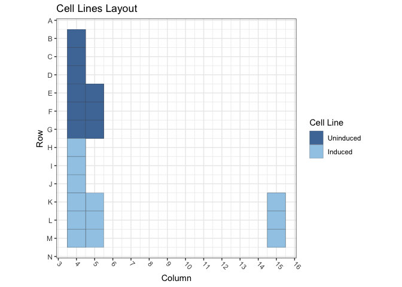
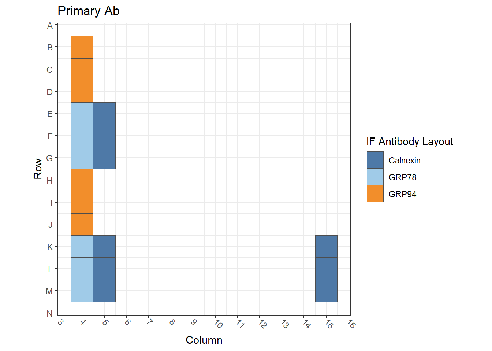
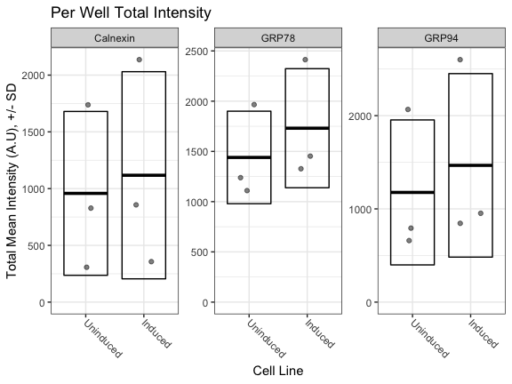

Figure S1D: TetON Cells / GRP94, GRP78 and Calnexin
================
Sandra Vidak/Gianluca Pegoraro
March 13th 2023

### Introduction

Columbus screen names:

`221013-40x-TetON-GFPd50-Hsp110-Hsp90-GRP94-GRP78-Calnexin-SUN1-SUN2_20221013_123454`

`221020-40x-TetON-GFPd50-Hsp110-Hsp90-GRP94-GRP78-Calnexin-SUN1-SUN2_20221020_130040`

`221020-40x-TetON-GFPd50-Hsp110-Hsp90-GRP94-GRP78-Calnexin-SUN1-SUN22_20221020_134857`

### Analysis Setup

Load required packages.

``` r
library(tidyverse)
```

    ## ── Attaching packages ─────────────────────────────────────── tidyverse 1.3.2 ──
    ## ✔ ggplot2 3.3.6      ✔ purrr   0.3.5 
    ## ✔ tibble  3.1.8      ✔ dplyr   1.0.10
    ## ✔ tidyr   1.2.1      ✔ stringr 1.4.1 
    ## ✔ readr   2.1.3      ✔ forcats 0.5.2 
    ## ── Conflicts ────────────────────────────────────────── tidyverse_conflicts() ──
    ## ✖ dplyr::filter() masks stats::filter()
    ## ✖ dplyr::lag()    masks stats::lag()

``` r
library(fs)
library(Hmisc)
```

    ## Loading required package: lattice
    ## Loading required package: survival
    ## Loading required package: Formula
    ## 
    ## Attaching package: 'Hmisc'
    ## 
    ## The following objects are masked from 'package:dplyr':
    ## 
    ##     src, summarize
    ## 
    ## The following objects are masked from 'package:base':
    ## 
    ##     format.pval, units

``` r
library(ggthemes)
library(DescTools) # for Dunnett's Test
```

    ## 
    ## Attaching package: 'DescTools'
    ## 
    ## The following objects are masked from 'package:Hmisc':
    ## 
    ##     %nin%, Label, Mean, Quantile

``` r
library(curl)
```

    ## Using libcurl 7.86.0 with LibreSSL/3.3.6
    ## 
    ## Attaching package: 'curl'
    ## 
    ## The following object is masked from 'package:readr':
    ## 
    ##     parse_date

``` r
source("R/Plotters.R") #Functions needed for plotting
```

Set the palette and the running theme for ggplot2.

### Experimental Metadata

Read plate layouts.

``` r
cell_levs <- c("Uninduced", "Induced")

plate_layouts <- read_tsv("metadata/plate_layout.txt") %>%
  filter(!is.na(cell_line)) %>%
  separate(col = cell_line, 
           into = c("cell_line"), 
           remove = T) %>%
  mutate(cell_line = factor(cell_line, levels = cell_levs))

glimpse(plate_layouts)
```

    ## Rows: 54
    ## Columns: 5
    ## $ screen    <chr> "221013-40x-TetON-GFPd50-Hsp110-Hsp90-GRP94-GRP78-Calnexin-S…
    ## $ row       <dbl> 2, 3, 4, 5, 6, 7, 8, 9, 10, 11, 12, 13, 5, 6, 7, 11, 12, 13,…
    ## $ column    <dbl> 4, 4, 4, 4, 4, 4, 4, 4, 4, 4, 4, 4, 5, 5, 5, 5, 5, 5, 4, 4, …
    ## $ marker    <chr> "GRP94", "GRP94", "GRP94", "GRP78", "GRP78", "GRP78", "GRP94…
    ## $ cell_line <fct> Uninduced, Uninduced, Uninduced, Uninduced, Uninduced, Unind…

Plot plate layouts.

<!-- -->

<!-- -->

### Download the data if needed

Download and unzip the Columbus results of the experiments from Figshare
if they have not been already downloaded.

``` r
if(!dir.exists("input")) {
  URL <- "https://figshare.com/ndownloader/files/39550630"
  curl_download(URL, "input.zip")
  unzip("input.zip")
  dir_copy("data", "input")
  dir_delete("data")
}
```

### Read and Process Columbus data

Recursively search the `input` directory and its subdirectories for
files whose name includes the Glob patterns defined in the chunk above,
and read the cell-level Columbus data from the results text files.

``` r
read_columbus_results <- function(path, glob) {
  dir_ls(path = path,
         recurse = T,
         glob = glob)  %>%
    read_tsv(
      id = "file_name"
    ) %>%
    select(
      screen = ScreenName,
      plate = PlateName,
      well = WellName,
      row = Row,
      column = Column,
      nuc_area = `Nuclei Selected - Nucleus Area [px²]`,
      cyto_area = `Nuclei Selected - Cytoplasm Area [px²]`,
      cell_area = `Nuclei Selected - Cell Area [px²]`,
      nuc_marker_int = `Nuclei Selected - Intensity Nucleus BP600/37 Mean`,
      cyto_marker_int = `Nuclei Selected - Intensity Cytoplasm BP600/37 Mean`,
      ratio_marker_int = `Nuclei Selected - Nuc_Cyto_BP600_Ratio`
    )
}

glob_path <- "*- Nuclei Selected[0].txt"
col_tbl <- read_columbus_results("input", glob_path)

glimpse(col_tbl)
```

    ## Rows: 171,615
    ## Columns: 11
    ## $ screen           <chr> "221013-40x-TetON-GFPd50-Hsp110-Hsp90-GRP94-GRP78-Cal…
    ## $ plate            <chr> "AssayPlate_PerkinElmer_CellCarrier-384 Ultra", "Assa…
    ## $ well             <chr> "B12", "B12", "B12", "B12", "B12", "B12", "B12", "B12…
    ## $ row              <dbl> 2, 2, 2, 2, 2, 2, 2, 2, 2, 2, 2, 2, 2, 2, 2, 2, 2, 2,…
    ## $ column           <dbl> 12, 12, 12, 12, 12, 12, 12, 12, 12, 12, 12, 12, 12, 1…
    ## $ nuc_area         <dbl> 2901, 1367, 1535, 1006, 2551, 2055, 1837, 1514, 1501,…
    ## $ cyto_area        <dbl> 2953, 2758, 2751, 6636, 10438, 8264, 4010, 6688, 2185…
    ## $ cell_area        <dbl> 5854, 4125, 4286, 7642, 12989, 10319, 5847, 8202, 368…
    ## $ nuc_marker_int   <dbl> 1150.500, 1460.890, 1230.610, 1707.470, 1244.650, 169…
    ## $ cyto_marker_int  <dbl> 1476.95, 1571.49, 1619.99, 1546.16, 1366.78, 2125.90,…
    ## $ ratio_marker_int <dbl> 0.778974, 0.929621, 0.759637, 1.104330, 0.910646, 0.7…

Join Columbus data with the plate layout information.

``` r
cell_tbl <- col_tbl %>%
  mutate(sum_marker_int = nuc_marker_int + cyto_marker_int) %>%
  inner_join(plate_layouts,
             by = c("row", "column","screen")) %>%
  select(screen,
         plate,
         well,
         row,
         column,
         cell_line,
         marker,
         nuc_area:sum_marker_int)

glimpse(cell_tbl)
```

    ## Rows: 29,849
    ## Columns: 14
    ## $ screen           <chr> "221013-40x-TetON-GFPd50-Hsp110-Hsp90-GRP94-GRP78-Cal…
    ## $ plate            <chr> "AssayPlate_PerkinElmer_CellCarrier-384 Ultra", "Assa…
    ## $ well             <chr> "B4", "B4", "B4", "B4", "B4", "B4", "B4", "B4", "B4",…
    ## $ row              <dbl> 2, 2, 2, 2, 2, 2, 2, 2, 2, 2, 2, 2, 2, 2, 2, 2, 2, 2,…
    ## $ column           <dbl> 4, 4, 4, 4, 4, 4, 4, 4, 4, 4, 4, 4, 4, 4, 4, 4, 4, 4,…
    ## $ cell_line        <fct> Uninduced, Uninduced, Uninduced, Uninduced, Uninduced…
    ## $ marker           <chr> "GRP94", "GRP94", "GRP94", "GRP94", "GRP94", "GRP94",…
    ## $ nuc_area         <dbl> 1609, 1946, 1606, 1528, 1110, 3139, 1751, 1416, 1517,…
    ## $ cyto_area        <dbl> 4410, 2922, 1865, 2934, 2617, 4755, 3630, 2419, 4007,…
    ## $ cell_area        <dbl> 6019, 4868, 3471, 4462, 3727, 7894, 5381, 3835, 5524,…
    ## $ nuc_marker_int   <dbl> 850.811, 1036.880, 1011.680, 1084.840, 1489.540, 989.…
    ## $ cyto_marker_int  <dbl> 948.172, 1368.760, 1140.510, 1159.370, 1086.140, 1117…
    ## $ ratio_marker_int <dbl> 0.897317, 0.757536, 0.887046, 0.935714, 1.371410, 0.8…
    ## $ sum_marker_int   <dbl> 1798.983, 2405.640, 2152.190, 2244.210, 2575.680, 210…

Calculate number of cells and mean per well for all properties. 4
technical replicates for each of the 3 biological replicates -\> 12
wells for marker/cell line combination.

``` r
well_tbl <- cell_tbl %>%
  group_by(screen,
           well,
           row,
           column,
           cell_line,
           marker) %>%
  summarise(cell_n = n(),
            across(nuc_area:sum_marker_int,
                   list(mean = ~ mean(.x, na.rm = T))))

glimpse(well_tbl)
```

    ## Rows: 54
    ## Columns: 14
    ## Groups: screen, well, row, column, cell_line [54]
    ## $ screen                <chr> "221013-40x-TetON-GFPd50-Hsp110-Hsp90-GRP94-GRP7…
    ## $ well                  <chr> "B4", "C4", "D4", "E4", "E5", "F4", "F5", "G4", …
    ## $ row                   <dbl> 2, 3, 4, 5, 5, 6, 6, 7, 7, 8, 9, 10, 11, 11, 12,…
    ## $ column                <dbl> 4, 4, 4, 4, 5, 4, 5, 4, 5, 4, 4, 4, 4, 5, 4, 5, …
    ## $ cell_line             <fct> Uninduced, Uninduced, Uninduced, Uninduced, Unin…
    ## $ marker                <chr> "GRP94", "GRP94", "GRP94", "GRP78", "Calnexin", …
    ## $ cell_n                <int> 754, 997, 795, 787, 898, 908, 938, 847, 990, 243…
    ## $ nuc_area_mean         <dbl> 2220.277, 2326.404, 2339.421, 2325.130, 2327.627…
    ## $ cyto_area_mean        <dbl> 6565.968, 5733.223, 6737.401, 6441.850, 6241.384…
    ## $ cell_area_mean        <dbl> 8786.245, 8059.627, 9076.823, 8766.980, 8569.011…
    ## $ nuc_marker_int_mean   <dbl> 1190.0755, 1045.9502, 1084.2335, 997.2968, 1069.…
    ## $ cyto_marker_int_mean  <dbl> 991.5654, 971.8091, 929.7804, 936.5743, 776.6462…
    ## $ ratio_marker_int_mean <dbl> 1.249093, 1.113564, 1.202599, 1.147769, 1.463934…
    ## $ sum_marker_int_mean   <dbl> 2181.6409, 2017.7593, 2014.0139, 1933.8710, 1846…

Calculate the mean of the technical replicates for each biological
replicate. Now every marker/cell line combination has an n = 3
biological replicates.

``` r
bioreps_tbl <- well_tbl %>%
  group_by(screen,
           cell_line,
           marker) %>%
  summarise(across(cell_n:sum_marker_int_mean,
                    ~ mean(.x, na.rm = T)))

glimpse(bioreps_tbl)
```

    ## Rows: 18
    ## Columns: 11
    ## Groups: screen, cell_line [6]
    ## $ screen                <chr> "221013-40x-TetON-GFPd50-Hsp110-Hsp90-GRP94-GRP7…
    ## $ cell_line             <fct> Uninduced, Uninduced, Uninduced, Induced, Induce…
    ## $ marker                <chr> "Calnexin", "GRP78", "GRP94", "Calnexin", "GRP78…
    ## $ cell_n                <dbl> 942.0000, 847.3333, 848.6667, 305.0000, 330.0000…
    ## $ nuc_area_mean         <dbl> 2352.216, 2344.315, 2295.368, 2522.810, 2473.013…
    ## $ cyto_area_mean        <dbl> 5906.575, 6468.701, 6345.531, 9965.732, 9616.608…
    ## $ cell_area_mean        <dbl> 8258.791, 8813.017, 8640.898, 12488.542, 12089.6…
    ## $ nuc_marker_int_mean   <dbl> 997.2652, 984.9804, 1106.7531, 1514.8004, 1468.0…
    ## $ cyto_marker_int_mean  <dbl> 738.7105, 981.7702, 964.3850, 616.0212, 943.0617…
    ## $ ratio_marker_int_mean <dbl> 1.438849, 1.059150, 1.188419, 2.696250, 1.630001…
    ## $ sum_marker_int_mean   <dbl> 1735.9757, 1966.7506, 2071.1381, 2130.8216, 2411…

### Biological Replicates Level plots for Fig.S1D

<!-- -->

### Calculate Dunnett’s test for the continuous variables.

Define a custom function to run a Dunnett post-hoc test only on the Mean
marker intensity sum (Cyto + Nucleus), using the cell line as the
predictor variable, and fixing Uninduced as the negative control. The
output of the Dunnett’s test is then rearranged to a tidy table to make
it work with `dplyr`.

``` r
calc_dunnett <- function(df){
  as.data.frame(as.table(DunnettTest(ratio_marker_int_mean ~ cell_line,
                          control = "Uninduced",
                          data = df)$Uninduced)) %>%
    pivot_wider(names_from = Var2, values_from = Freq) %>%
    rename(comparison = Var1)
}
```

Run the custom function on all the data grouped based on the IF marker
and save the data to a .csv file.

``` r
dunnett_test <- bioreps_tbl %>%
  group_by(marker) %>%
  group_modify(~ calc_dunnett(.x))

write_csv(dunnett_test, "output/dunnett_results.csv")

knitr::kable(dunnett_test, digits = 3)
```

| marker   | comparison        |  diff | lwr.ci | upr.ci |  pval |
|:---------|:------------------|------:|-------:|-------:|------:|
| Calnexin | Induced-Uninduced | 0.748 |  0.195 |  1.301 | 0.020 |
| GRP78    | Induced-Uninduced | 0.599 |  0.268 |  0.930 | 0.007 |
| GRP94    | Induced-Uninduced | 0.410 | -0.062 |  0.882 | 0.073 |

Document the information about the analysis session

``` r
sessionInfo()
```

    ## R version 4.2.2 (2022-10-31)
    ## Platform: x86_64-apple-darwin17.0 (64-bit)
    ## Running under: macOS Big Sur ... 10.16
    ## 
    ## Matrix products: default
    ## BLAS:   /Library/Frameworks/R.framework/Versions/4.2/Resources/lib/libRblas.0.dylib
    ## LAPACK: /Library/Frameworks/R.framework/Versions/4.2/Resources/lib/libRlapack.dylib
    ## 
    ## locale:
    ## [1] en_US.UTF-8/en_US.UTF-8/en_US.UTF-8/C/en_US.UTF-8/en_US.UTF-8
    ## 
    ## attached base packages:
    ## [1] stats     graphics  grDevices utils     datasets  methods   base     
    ## 
    ## other attached packages:
    ##  [1] curl_4.3.3        DescTools_0.99.47 ggthemes_4.2.4    Hmisc_4.7-1      
    ##  [5] Formula_1.2-4     survival_3.5-3    lattice_0.20-45   fs_1.5.2         
    ##  [9] forcats_0.5.2     stringr_1.4.1     dplyr_1.0.10      purrr_0.3.5      
    ## [13] readr_2.1.3       tidyr_1.2.1       tibble_3.1.8      ggplot2_3.3.6    
    ## [17] tidyverse_1.3.2  
    ## 
    ## loaded via a namespace (and not attached):
    ##  [1] bit64_4.0.5         lubridate_1.8.0     RColorBrewer_1.1-3 
    ##  [4] httr_1.4.4          tools_4.2.2         backports_1.4.1    
    ##  [7] utf8_1.2.2          R6_2.5.1            rpart_4.1.19       
    ## [10] DBI_1.1.3           colorspace_2.0-3    nnet_7.3-18        
    ## [13] withr_2.5.0         Exact_3.2           tidyselect_1.2.0   
    ## [16] gridExtra_2.3       bit_4.0.4           compiler_4.2.2     
    ## [19] cli_3.4.1           rvest_1.0.3         htmlTable_2.4.1    
    ## [22] expm_0.999-6        xml2_1.3.3          labeling_0.4.2     
    ## [25] scales_1.2.1        checkmate_2.1.0     mvtnorm_1.1-3      
    ## [28] proxy_0.4-27        digest_0.6.30       foreign_0.8-84     
    ## [31] rmarkdown_2.17      base64enc_0.1-3     jpeg_0.1-9         
    ## [34] pkgconfig_2.0.3     htmltools_0.5.3     highr_0.9          
    ## [37] dbplyr_2.2.1        fastmap_1.1.0       htmlwidgets_1.5.4  
    ## [40] rlang_1.0.6         readxl_1.4.1        rstudioapi_0.14    
    ## [43] farver_2.1.1        generics_0.1.3      jsonlite_1.8.3     
    ## [46] vroom_1.6.0         googlesheets4_1.0.1 magrittr_2.0.3     
    ## [49] interp_1.1-3        Matrix_1.5-3        Rcpp_1.0.9         
    ## [52] munsell_0.5.0       fansi_1.0.3         lifecycle_1.0.3    
    ## [55] stringi_1.7.8       yaml_2.3.6          rootSolve_1.8.2.3  
    ## [58] MASS_7.3-58.3       grid_4.2.2          parallel_4.2.2     
    ## [61] crayon_1.5.2        lmom_2.9            deldir_1.0-6       
    ## [64] haven_2.5.1         splines_4.2.2       hms_1.1.2          
    ## [67] knitr_1.40          pillar_1.8.1        boot_1.3-28.1      
    ## [70] gld_2.6.6           reprex_2.0.2        glue_1.6.2         
    ## [73] evaluate_0.17       latticeExtra_0.6-30 data.table_1.14.4  
    ## [76] modelr_0.1.9        png_0.1-7           vctrs_0.5.0        
    ## [79] tzdb_0.3.0          cellranger_1.1.0    gtable_0.3.1       
    ## [82] assertthat_0.2.1    xfun_0.34           broom_1.0.1        
    ## [85] e1071_1.7-12        class_7.3-21        googledrive_2.0.0  
    ## [88] gargle_1.2.1        cluster_2.1.4       ellipsis_0.3.2
