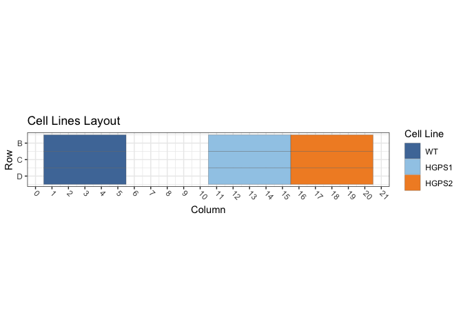
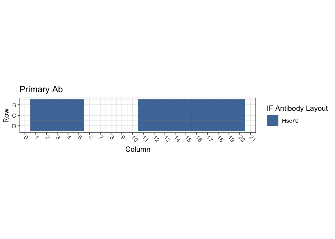
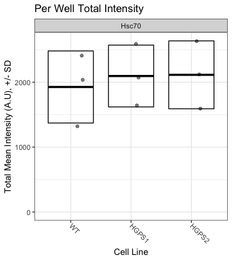

Figure S1D: TetON Cells / Hsc70
================
Sandra Vidak/Gianluca Pegoraro
November 16th 2022

### Introduction

Columbus screen names:

`180129-40x-hFibro-GRP94-Hsc70-SUN1-LAP2_20180129_121044`

`180322-40X-hFibro-NewSigmaFBS-GRP78-PDI-Hsc70_20180322_162251`

`180424-hFibro-PDI-Hsc70-VCP_20180424_115904`

### Analysis Setup

Load required packages.

``` r
library(tidyverse)
```

    ## ── Attaching packages ─────────────────────────────────────── tidyverse 1.3.2 ──
    ## ✔ ggplot2 3.3.6      ✔ purrr   0.3.5 
    ## ✔ tibble  3.1.8      ✔ dplyr   1.0.10
    ## ✔ tidyr   1.2.1      ✔ stringr 1.4.1 
    ## ✔ readr   2.1.3      ✔ forcats 0.5.2 
    ## ── Conflicts ────────────────────────────────────────── tidyverse_conflicts() ──
    ## ✖ dplyr::filter() masks stats::filter()
    ## ✖ dplyr::lag()    masks stats::lag()

``` r
library(fs)
library(Hmisc)
```

    ## Loading required package: lattice
    ## Loading required package: survival
    ## Loading required package: Formula
    ## 
    ## Attaching package: 'Hmisc'
    ## 
    ## The following objects are masked from 'package:dplyr':
    ## 
    ##     src, summarize
    ## 
    ## The following objects are masked from 'package:base':
    ## 
    ##     format.pval, units

``` r
library(ggthemes)
library(DescTools) # for Dunnett's Test
```

    ## 
    ## Attaching package: 'DescTools'
    ## 
    ## The following objects are masked from 'package:Hmisc':
    ## 
    ##     %nin%, Label, Mean, Quantile

``` r
library(curl)
```

    ## Using libcurl 7.79.1 with LibreSSL/3.3.6
    ## 
    ## Attaching package: 'curl'
    ## 
    ## The following object is masked from 'package:readr':
    ## 
    ##     parse_date

``` r
source("R/Plotters.R") #Functions needed for plotting
```

Set the palette and the running theme for ggplot2.

### Experimental Metadata

Read plate layouts.

``` r
cell_levs <- c("WT", "HGPS1", "HGPS2")

plate_layouts <- read_tsv("metadata/plate_layout.txt") %>%
  filter(!is.na(cell_line)) %>%
  separate(col = cell_line, 
           into = c("cell_line"), 
           remove = T) %>%
  mutate(cell_line = factor(cell_line, levels = cell_levs))

glimpse(plate_layouts)
```

    ## Rows: 9
    ## Columns: 4
    ## $ row       <dbl> 2, 3, 4, 2, 3, 4, 2, 3, 4
    ## $ column    <dbl> 3, 3, 3, 13, 13, 13, 18, 18, 18
    ## $ marker    <chr> "Hsc70", "Hsc70", "Hsc70", "Hsc70", "Hsc70", "Hsc70", "Hsc70…
    ## $ cell_line <fct> WT, WT, WT, HGPS1, HGPS1, HGPS1, HGPS2, HGPS2, HGPS2

Plot plate layouts.

<!-- -->

<!-- -->

### Download the data if needed

Download and unzip the Columbus results of the experiments from Figshare
if they have not been already downloaded.

``` r
if(!dir.exists("input")) {
  URL <- "https://figshare.com/ndownloader/files/38158791"
  curl_download(URL, "input.zip")
  unzip("input.zip")
}
```

### Read and Process Columbus data

Recursively search the `input` directory and its subdirectories for
files whose name includes the Glob patterns defined in the chunk above,
and read the cell-level Columbus data from the results text files.

``` r
read_columbus_results <- function(path, glob) {
  dir_ls(path = path,
         recurse = T,
         glob = glob)  %>%
    read_tsv(
      id = "file_name"
    ) %>%
    select(
      screen = ScreenName,
      plate = PlateName,
      well = WellName,
      row = Row,
      column = Column,
      nuc_area = `Nuclei Selected - Nucleus Area [px²]`,
      cyto_area = `Nuclei Selected - Cytoplasm Area [px²]`,
      cell_area = `Nuclei Selected - Cell Area [px²]`,
      nuc_marker_int = `Nuclei Selected - Intensity Nucleus BP600/37 Mean`,
      cyto_marker_int = `Nuclei Selected - Intensity Cytoplasm BP600/37 Mean`,
      ratio_marker_int = `Nuclei Selected - Nuc_Cyto_BP600_Ratio`
    )
}

glob_path <- "*- Nuclei Selected[0].txt"
col_tbl <- read_columbus_results("input", glob_path)

glimpse(col_tbl)
```

    ## Rows: 39,422
    ## Columns: 11
    ## $ screen           <chr> "180129-40x-hFibro-GRP94-Hsc70-SUN1-LAP2_20180129_121…
    ## $ plate            <chr> "Plate 2", "Plate 2", "Plate 2", "Plate 2", "Plate 2"…
    ## $ well             <chr> "B10", "B10", "B10", "B10", "B10", "B10", "B10", "B10…
    ## $ row              <dbl> 2, 2, 2, 2, 2, 2, 2, 2, 2, 2, 2, 2, 2, 2, 2, 2, 2, 2,…
    ## $ column           <dbl> 10, 10, 10, 10, 10, 10, 10, 10, 10, 10, 10, 10, 10, 1…
    ## $ nuc_area         <dbl> 1952, 1824, 1532, 1650, 1773, 2072, 1894, 1397, 1832,…
    ## $ cyto_area        <dbl> 11348, 7458, 8499, 18267, 11771, 9550, 18070, 7688, 2…
    ## $ cell_area        <dbl> 13300, 9282, 10031, 19917, 13544, 11622, 19964, 9085,…
    ## $ nuc_marker_int   <dbl> 768.494, 737.308, 722.846, 923.323, 561.646, 747.003,…
    ## $ cyto_marker_int  <dbl> 60.5062, 79.4469, 81.2076, 56.3048, 54.3863, 64.9091,…
    ## $ ratio_marker_int <dbl> 12.70110, 9.28051, 8.90122, 16.39870, 10.32700, 11.50…

Join Columbus data with the plate layout information.

``` r
cell_tbl <- col_tbl %>%
  mutate(sum_marker_int = nuc_marker_int + cyto_marker_int) %>%
  inner_join(plate_layouts,
             by = c("row", "column")) %>%
  select(screen,
         plate,
         well,
         row,
         column,
         cell_line,
         marker,
         nuc_area:sum_marker_int)

glimpse(cell_tbl)
```

    ## Rows: 8,098
    ## Columns: 14
    ## $ screen           <chr> "180129-40x-hFibro-GRP94-Hsc70-SUN1-LAP2_20180129_121…
    ## $ plate            <chr> "Plate 2", "Plate 2", "Plate 2", "Plate 2", "Plate 2"…
    ## $ well             <chr> "B13", "B13", "B13", "B13", "B13", "B13", "B13", "B13…
    ## $ row              <dbl> 2, 2, 2, 2, 2, 2, 2, 2, 2, 2, 2, 2, 2, 2, 2, 2, 2, 2,…
    ## $ column           <dbl> 13, 13, 13, 13, 13, 13, 13, 13, 13, 13, 13, 13, 13, 1…
    ## $ cell_line        <fct> HGPS1, HGPS1, HGPS1, HGPS1, HGPS1, HGPS1, HGPS1, HGPS…
    ## $ marker           <chr> "Hsc70", "Hsc70", "Hsc70", "Hsc70", "Hsc70", "Hsc70",…
    ## $ nuc_area         <dbl> 2335, 1715, 1729, 1829, 1798, 2602, 2475, 1791, 2333,…
    ## $ cyto_area        <dbl> 18578, 23972, 15247, 14298, 10306, 19003, 30226, 2061…
    ## $ cell_area        <dbl> 20913, 25687, 16976, 16127, 12104, 21605, 32701, 2240…
    ## $ nuc_marker_int   <dbl> 1820.120, 1091.290, 977.669, 1662.230, 2580.340, 1694…
    ## $ cyto_marker_int  <dbl> 423.715, 257.893, 355.737, 700.671, 1136.170, 559.051…
    ## $ ratio_marker_int <dbl> 4.29562, 4.23154, 2.74829, 2.37235, 2.27108, 3.03024,…
    ## $ sum_marker_int   <dbl> 2243.835, 1349.183, 1333.406, 2362.901, 3716.510, 225…

Calculate number of cells and mean per well for all properties.

``` r
well_tbl <- cell_tbl %>%
  group_by(screen,
           well,
           row,
           column,
           cell_line,
           marker) %>%
  summarise(cell_n = n(),
            across(nuc_area:sum_marker_int,
                   list(mean = ~ mean(.x, na.rm = T))))

glimpse(well_tbl)
```

    ## Rows: 27
    ## Columns: 14
    ## Groups: screen, well, row, column, cell_line [27]
    ## $ screen                <chr> "180129-40x-hFibro-GRP94-Hsc70-SUN1-LAP2_2018012…
    ## $ well                  <chr> "B13", "B18", "B3", "C13", "C18", "C3", "D13", "…
    ## $ row                   <dbl> 2, 2, 2, 3, 3, 3, 4, 4, 4, 2, 2, 2, 3, 3, 3, 4, …
    ## $ column                <dbl> 13, 18, 3, 13, 18, 3, 13, 18, 3, 13, 18, 3, 13, …
    ## $ cell_line             <fct> HGPS1, HGPS2, WT, HGPS1, HGPS2, WT, HGPS1, HGPS2…
    ## $ marker                <chr> "Hsc70", "Hsc70", "Hsc70", "Hsc70", "Hsc70", "Hs…
    ## $ cell_n                <int> 149, 203, 288, 150, 239, 316, 190, 266, 380, 152…
    ## $ nuc_area_mean         <dbl> 1899.107, 1832.217, 1929.559, 1945.613, 1898.385…
    ## $ cyto_area_mean        <dbl> 17031.517, 14486.507, 14694.830, 17918.980, 1362…
    ## $ cell_area_mean        <dbl> 18930.62, 16318.72, 16624.39, 19864.59, 15526.58…
    ## $ nuc_marker_int_mean   <dbl> 1295.8765, 1141.8972, 1085.6274, 1180.0757, 1129…
    ## $ cyto_marker_int_mean  <dbl> 440.2362, 406.1712, 395.0168, 370.8910, 420.6011…
    ## $ ratio_marker_int_mean <dbl> 3.1358137, 3.0272324, 2.9425081, 3.4366171, 2.88…
    ## $ sum_marker_int_mean   <dbl> 1736.113, 1548.068, 1480.644, 1550.967, 1550.167…

Calculate the mean of the technical replicates for each biological
replicate. Now every marker/cell line combination has an n = 3
biological replicates.

``` r
bioreps_tbl <- well_tbl %>%
  group_by(screen,
           cell_line,
           marker) %>%
  summarise(across(cell_n:sum_marker_int_mean,
                    ~ mean(.x, na.rm = T)))

glimpse(bioreps_tbl)
```

    ## Rows: 9
    ## Columns: 11
    ## Groups: screen, cell_line [9]
    ## $ screen                <chr> "180129-40x-hFibro-GRP94-Hsc70-SUN1-LAP2_2018012…
    ## $ cell_line             <fct> WT, HGPS1, HGPS2, WT, HGPS1, HGPS2, WT, HGPS1, H…
    ## $ marker                <chr> "Hsc70", "Hsc70", "Hsc70", "Hsc70", "Hsc70", "Hs…
    ## $ cell_n                <dbl> 328.0000, 163.0000, 236.0000, 616.0000, 168.0000…
    ## $ nuc_area_mean         <dbl> 2001.383, 1901.128, 1867.469, 1917.934, 1995.476…
    ## $ cyto_area_mean        <dbl> 14486.117, 16589.022, 13833.615, 8852.496, 17359…
    ## $ cell_area_mean        <dbl> 16487.50, 18490.15, 15701.08, 10770.43, 19355.14…
    ## $ nuc_marker_int_mean   <dbl> 968.0853, 1225.7918, 1162.4933, 1093.7518, 1445.…
    ## $ cyto_marker_int_mean  <dbl> 356.4505, 410.1027, 425.9686, 1324.0243, 1138.85…
    ## $ ratio_marker_int_mean <dbl> 2.8968877, 3.2053702, 2.9299890, 0.8316130, 1.32…
    ## $ sum_marker_int_mean   <dbl> 1324.536, 1635.894, 1588.462, 2417.776, 2587.163…

### Biological Replicates Level plots For Figure S1D

<!-- -->

### Calculate Dunnett’s test for the continuous variables.

Define a custom function to run a Dunnett post-hoc test only on the Mean
marker intensity sum (Cyto + Nucleus), using the cell line as the
predictor variable, and fixing WT1 as the negative control. The output
of the Dunnett’s test is then rearranged to a tidy table to make it work
with `dplyr`.

``` r
calc_dunnett <- function(df){
  as.data.frame(as.table(DunnettTest(ratio_marker_int_mean ~ cell_line,
                          control = "WT",
                          data = df)$WT)) %>%
    pivot_wider(names_from = Var2, values_from = Freq) %>%
    rename(comparison = Var1)
}
```

Run the custom function on all the data grouped based on the IF marker
and save the data to a .csv file.

``` r
dunnett_test <- bioreps_tbl %>%
  group_by(marker) %>%
  group_modify(~ calc_dunnett(.x))

write_csv(dunnett_test, "output/dunnett_results.csv")

knitr::kable(dunnett_test, digits = 3)
```

| marker | comparison |  diff | lwr.ci | upr.ci |  pval |
|:-------|:-----------|------:|-------:|-------:|------:|
| Hsc70  | HGPS1-WT   | 0.388 | -2.105 |  2.880 | 0.869 |
| Hsc70  | HGPS2-WT   | 0.301 | -2.192 |  2.793 | 0.918 |

Document the information about the analysis session

``` r
sessionInfo()
```

    ## R version 4.2.1 (2022-06-23)
    ## Platform: x86_64-apple-darwin17.0 (64-bit)
    ## Running under: macOS Big Sur ... 10.16
    ## 
    ## Matrix products: default
    ## BLAS:   /Library/Frameworks/R.framework/Versions/4.2/Resources/lib/libRblas.0.dylib
    ## LAPACK: /Library/Frameworks/R.framework/Versions/4.2/Resources/lib/libRlapack.dylib
    ## 
    ## locale:
    ## [1] en_US.UTF-8/en_US.UTF-8/en_US.UTF-8/C/en_US.UTF-8/en_US.UTF-8
    ## 
    ## attached base packages:
    ## [1] stats     graphics  grDevices utils     datasets  methods   base     
    ## 
    ## other attached packages:
    ##  [1] curl_4.3.3        DescTools_0.99.47 ggthemes_4.2.4    Hmisc_4.7-1      
    ##  [5] Formula_1.2-4     survival_3.4-0    lattice_0.20-45   fs_1.5.2         
    ##  [9] forcats_0.5.2     stringr_1.4.1     dplyr_1.0.10      purrr_0.3.5      
    ## [13] readr_2.1.3       tidyr_1.2.1       tibble_3.1.8      ggplot2_3.3.6    
    ## [17] tidyverse_1.3.2  
    ## 
    ## loaded via a namespace (and not attached):
    ##  [1] bit64_4.0.5         lubridate_1.8.0     RColorBrewer_1.1-3 
    ##  [4] httr_1.4.4          tools_4.2.1         backports_1.4.1    
    ##  [7] utf8_1.2.2          R6_2.5.1            rpart_4.1.19       
    ## [10] DBI_1.1.3           colorspace_2.0-3    nnet_7.3-18        
    ## [13] withr_2.5.0         Exact_3.2           tidyselect_1.2.0   
    ## [16] gridExtra_2.3       bit_4.0.4           compiler_4.2.1     
    ## [19] cli_3.4.1           rvest_1.0.3         htmlTable_2.4.1    
    ## [22] expm_0.999-6        xml2_1.3.3          labeling_0.4.2     
    ## [25] scales_1.2.1        checkmate_2.1.0     mvtnorm_1.1-3      
    ## [28] proxy_0.4-27        digest_0.6.30       foreign_0.8-83     
    ## [31] rmarkdown_2.17      base64enc_0.1-3     jpeg_0.1-9         
    ## [34] pkgconfig_2.0.3     htmltools_0.5.3     highr_0.9          
    ## [37] dbplyr_2.2.1        fastmap_1.1.0       htmlwidgets_1.5.4  
    ## [40] rlang_1.0.6         readxl_1.4.1        rstudioapi_0.14    
    ## [43] farver_2.1.1        generics_0.1.3      jsonlite_1.8.3     
    ## [46] vroom_1.6.0         googlesheets4_1.0.1 magrittr_2.0.3     
    ## [49] interp_1.1-3        Matrix_1.5-3        Rcpp_1.0.9         
    ## [52] munsell_0.5.0       fansi_1.0.3         lifecycle_1.0.3    
    ## [55] stringi_1.7.8       yaml_2.3.6          rootSolve_1.8.2.3  
    ## [58] MASS_7.3-58.1       grid_4.2.1          parallel_4.2.1     
    ## [61] crayon_1.5.2        lmom_2.9            deldir_1.0-6       
    ## [64] haven_2.5.1         splines_4.2.1       hms_1.1.2          
    ## [67] knitr_1.40          pillar_1.8.1        boot_1.3-28        
    ## [70] gld_2.6.6           reprex_2.0.2        glue_1.6.2         
    ## [73] evaluate_0.17       latticeExtra_0.6-30 data.table_1.14.4  
    ## [76] modelr_0.1.9        png_0.1-7           vctrs_0.5.0        
    ## [79] tzdb_0.3.0          cellranger_1.1.0    gtable_0.3.1       
    ## [82] assertthat_0.2.1    xfun_0.34           broom_1.0.1        
    ## [85] e1071_1.7-12        class_7.3-20        googledrive_2.0.0  
    ## [88] gargle_1.2.1        cluster_2.1.4       ellipsis_0.3.2
