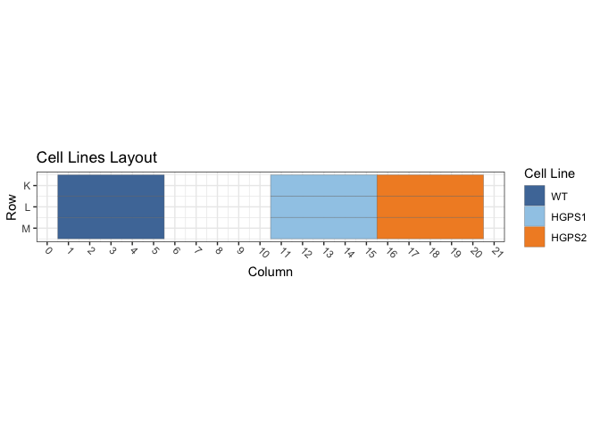
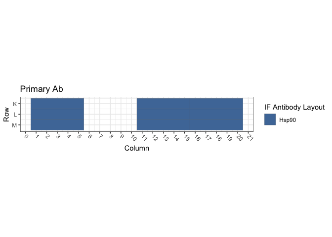
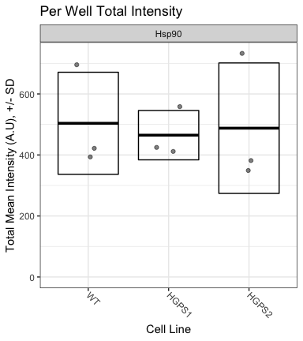

Figure S1D: TetON Cells / Hsp90
================
Sandra Vidak/Gianluca Pegoraro
October 27th 2022

### Introduction

Columbus screen names:

`180129-40x-hFibro-Hsp40-Hsp90_20180129_131533`

`180322-40X-hFibro-AtlantaFBS-GRP94-Calnexin-Hsp40-Hsp90-SUN1-LAP2_20180322_152441`

`180322-40X-hFibro-NewSigmaFBS-GRP94-Calnexin-Hsp40-Hsp90-SUN1-LAP2_20180322_163721`

### Analysis Setup

Load required packages.

``` r
library(tidyverse)
```

    ## ── Attaching packages ─────────────────────────────────────── tidyverse 1.3.2 ──
    ## ✔ ggplot2 3.3.6      ✔ purrr   0.3.5 
    ## ✔ tibble  3.1.8      ✔ dplyr   1.0.10
    ## ✔ tidyr   1.2.1      ✔ stringr 1.4.1 
    ## ✔ readr   2.1.3      ✔ forcats 0.5.2 
    ## ── Conflicts ────────────────────────────────────────── tidyverse_conflicts() ──
    ## ✖ dplyr::filter() masks stats::filter()
    ## ✖ dplyr::lag()    masks stats::lag()

``` r
library(fs)
library(Hmisc)
```

    ## Loading required package: lattice
    ## Loading required package: survival
    ## Loading required package: Formula
    ## 
    ## Attaching package: 'Hmisc'
    ## 
    ## The following objects are masked from 'package:dplyr':
    ## 
    ##     src, summarize
    ## 
    ## The following objects are masked from 'package:base':
    ## 
    ##     format.pval, units

``` r
library(ggthemes)
library(DescTools) # for Dunnett's Test
```

    ## 
    ## Attaching package: 'DescTools'
    ## 
    ## The following objects are masked from 'package:Hmisc':
    ## 
    ##     %nin%, Label, Mean, Quantile

``` r
source("R/Plotters.R") #Functions needed for plotting
```

Set the palette and the running theme for ggplot2.

### Experimental Metadata

Read plate layouts.

``` r
cell_levs <- c("WT", "HGPS1", "HGPS2")

plate_layouts <- read_tsv("metadata/plate_layout.txt") %>%
  filter(!is.na(cell_line)) %>%
  separate(col = cell_line, 
           into = c("cell_line"), 
           remove = T) %>%
  mutate(cell_line = factor(cell_line, levels = cell_levs))

glimpse(plate_layouts)
```

    ## Rows: 9
    ## Columns: 4
    ## $ row       <dbl> 11, 12, 13, 11, 12, 13, 11, 12, 13
    ## $ column    <dbl> 3, 3, 3, 13, 13, 13, 18, 18, 18
    ## $ marker    <chr> "Hsp90", "Hsp90", "Hsp90", "Hsp90", "Hsp90", "Hsp90", "Hsp90…
    ## $ cell_line <fct> WT, WT, WT, HGPS1, HGPS1, HGPS1, HGPS2, HGPS2, HGPS2

Plot plate layouts.

<!-- -->

<!-- -->

### Read and Process Columbus data

Recursively search the `input` directory and its subdirectories for
files whose name includes the Glob patterns defined in the chunk above,
and read the cell-level Columbus data from the results text files.

``` r
read_columbus_results <- function(path, glob) {
  dir_ls(path = path,
         recurse = T,
         glob = glob)  %>%
    read_tsv(
      id = "file_name"
    ) %>%
    select(
      screen = ScreenName,
      plate = PlateName,
      well = WellName,
      row = Row,
      column = Column,
      nuc_area = `Nuclei Selected - Nucleus Area [px²]`,
      cyto_area = `Nuclei Selected - Cytoplasm Area [px²]`,
      cell_area = `Nuclei Selected - Cell Area [px²]`,
      nuc_marker_int = `Nuclei Selected - Intensity Nucleus BP600/37 Mean`,
      cyto_marker_int = `Nuclei Selected - Intensity Cytoplasm BP600/37 Mean`,
      ratio_marker_int = `Nuclei Selected - Nuc_Cyto_BP600_Ratio`
    )
}

glob_path <- "*- Nuclei Selected[0].txt"
col_tbl <- read_columbus_results("input", glob_path)

glimpse(col_tbl)
```

    ## Rows: 55,291
    ## Columns: 11
    ## $ screen           <chr> "180129-40x-hFibro-Hsp40-Hsp90_20180129_131533", "180…
    ## $ plate            <chr> "Plate1", "Plate1", "Plate1", "Plate1", "Plate1", "Pl…
    ## $ well             <chr> "H13", "H13", "H13", "H13", "H13", "H13", "H13", "H13…
    ## $ row              <dbl> 8, 8, 8, 8, 8, 8, 8, 8, 8, 8, 8, 8, 8, 8, 8, 8, 8, 8,…
    ## $ column           <dbl> 13, 13, 13, 13, 13, 13, 13, 13, 13, 13, 13, 13, 13, 1…
    ## $ nuc_area         <dbl> 1453, 1616, 1502, 2257, 2357, 1798, 2504, 1870, 1914,…
    ## $ cyto_area        <dbl> 16942, 15420, 24392, 25676, 10697, 14375, 16608, 1321…
    ## $ cell_area        <dbl> 18395, 17036, 25894, 27933, 13054, 16173, 19112, 1508…
    ## $ nuc_marker_int   <dbl> 458.769, 405.721, 645.234, 514.009, 559.892, 411.077,…
    ## $ cyto_marker_int  <dbl> 115.2820, 135.2960, 148.5430, 101.8110, 122.6820, 86.…
    ## $ ratio_marker_int <dbl> 3.97955, 2.99876, 4.34375, 5.04866, 4.56378, 4.76071,…

Join Columbus data with the plate layout information.

``` r
cell_tbl <- col_tbl %>%
  mutate(sum_marker_int = nuc_marker_int + cyto_marker_int) %>%
  inner_join(plate_layouts,
             by = c("row", "column")) %>%
  select(screen,
         plate,
         well,
         row,
         column,
         cell_line,
         marker,
         nuc_area:sum_marker_int)

glimpse(cell_tbl)
```

    ## Rows: 8,361
    ## Columns: 14
    ## $ screen           <chr> "180129-40x-hFibro-Hsp40-Hsp90_20180129_131533", "180…
    ## $ plate            <chr> "Plate1", "Plate1", "Plate1", "Plate1", "Plate1", "Pl…
    ## $ well             <chr> "K13", "K13", "K13", "K13", "K13", "K13", "K13", "K13…
    ## $ row              <dbl> 11, 11, 11, 11, 11, 11, 11, 11, 11, 11, 11, 11, 11, 1…
    ## $ column           <dbl> 13, 13, 13, 13, 13, 13, 13, 13, 13, 13, 13, 13, 13, 1…
    ## $ cell_line        <fct> HGPS1, HGPS1, HGPS1, HGPS1, HGPS1, HGPS1, HGPS1, HGPS…
    ## $ marker           <chr> "Hsp90", "Hsp90", "Hsp90", "Hsp90", "Hsp90", "Hsp90",…
    ## $ nuc_area         <dbl> 1547, 1488, 1537, 1870, 1802, 2680, 2166, 1602, 1647,…
    ## $ cyto_area        <dbl> 15680, 13506, 9407, 21292, 13194, 31791, 34780, 19182…
    ## $ cell_area        <dbl> 17227, 14994, 10944, 23162, 14996, 34471, 36946, 2078…
    ## $ nuc_marker_int   <dbl> 417.5779, 417.6210, 495.0150, 439.3810, 477.4060, 206…
    ## $ cyto_marker_int  <dbl> 84.12946, 87.55300, 112.69700, 75.65060, 109.95900, 4…
    ## $ ratio_marker_int <dbl> 4.963515, 4.769920, 4.392420, 5.808030, 4.341680, 4.2…
    ## $ sum_marker_int   <dbl> 501.7074, 505.1740, 607.7120, 515.0316, 587.3650, 254…

Calculate number of cells and mean per well for all properties.

``` r
well_tbl <- cell_tbl %>%
  group_by(screen,
           well,
           row,
           column,
           cell_line,
           marker) %>%
  summarise(cell_n = n(),
            across(nuc_area:sum_marker_int,
                   list(mean = ~ mean(.x, na.rm = T))))

glimpse(well_tbl)
```

    ## Rows: 27
    ## Columns: 14
    ## Groups: screen, well, row, column, cell_line [27]
    ## $ screen                <chr> "180129-40x-hFibro-Hsp40-Hsp90_20180129_131533",…
    ## $ well                  <chr> "K13", "K18", "K3", "L13", "L18", "L3", "M13", "…
    ## $ row                   <dbl> 11, 11, 11, 12, 12, 12, 13, 13, 13, 11, 11, 11, …
    ## $ column                <dbl> 13, 18, 3, 13, 18, 3, 13, 18, 3, 13, 18, 3, 13, …
    ## $ cell_line             <fct> HGPS1, HGPS2, WT, HGPS1, HGPS2, WT, HGPS1, HGPS2…
    ## $ marker                <chr> "Hsp90", "Hsp90", "Hsp90", "Hsp90", "Hsp90", "Hs…
    ## $ cell_n                <int> 194, 297, 286, 252, 310, 289, 205, 243, 365, 241…
    ## $ nuc_area_mean         <dbl> 1948.593, 1865.320, 2092.276, 1911.766, 1868.284…
    ## $ cyto_area_mean        <dbl> 15174.979, 11587.788, 15622.066, 13257.448, 1194…
    ## $ cell_area_mean        <dbl> 17123.572, 13453.108, 17714.343, 15169.214, 1381…
    ## $ nuc_marker_int_mean   <dbl> 336.1813, 273.9648, 344.1013, 329.8790, 300.8886…
    ## $ cyto_marker_int_mean  <dbl> 99.75267, 89.20888, 93.39089, 93.58080, 89.47033…
    ## $ ratio_marker_int_mean <dbl> 3.545260, 3.243943, 3.781889, 3.658391, 3.559008…
    ## $ sum_marker_int_mean   <dbl> 435.9339, 363.1737, 437.4922, 423.4598, 390.3589…

Calculate the mean of the technical replicates for each biological
replicate. Now every marker/cell line combination has an n = 3
biological replicates.

``` r
bioreps_tbl <- well_tbl %>%
  group_by(screen,
           cell_line,
           marker) %>%
  summarise(across(cell_n:sum_marker_int_mean,
                    ~ mean(.x, na.rm = T)))

glimpse(bioreps_tbl)
```

    ## Rows: 9
    ## Columns: 11
    ## Groups: screen, cell_line [9]
    ## $ screen                <chr> "180129-40x-hFibro-Hsp40-Hsp90_20180129_131533",…
    ## $ cell_line             <fct> WT, HGPS1, HGPS2, WT, HGPS1, HGPS2, WT, HGPS1, H…
    ## $ marker                <chr> "Hsp90", "Hsp90", "Hsp90", "Hsp90", "Hsp90", "Hs…
    ## $ cell_n                <dbl> 313.3333, 217.0000, 283.3333, 354.0000, 240.6667…
    ## $ nuc_area_mean         <dbl> 2058.601, 1909.274, 1862.605, 1781.170, 1947.252…
    ## $ cyto_area_mean        <dbl> 14698.623, 14025.482, 11995.441, 11890.293, 1437…
    ## $ cell_area_mean        <dbl> 16757.22, 15934.76, 13858.05, 13671.46, 16318.83…
    ## $ nuc_marker_int_mean   <dbl> 329.0573, 331.2327, 289.9892, 296.7985, 315.8023…
    ## $ cyto_marker_int_mean  <dbl> 91.49812, 92.82960, 90.61037, 97.74829, 96.63611…
    ## $ ratio_marker_int_mean <dbl> 3.754447, 3.739151, 3.357293, 3.225073, 3.496582…
    ## $ sum_marker_int_mean   <dbl> 420.5554, 424.0623, 380.5995, 394.5468, 412.5125…

### Biological Replicates Level plots For Figure S1D

<!-- -->

### Calculate Dunnett’s test for the continuous variables.

Define a custom function to run a Dunnett post-hoc test only on the Mean
marker intensity sum (Cyto + Nucleus), using the cell line as the
predictor variable, and fixing WT1 as the negative control. The output
of the Dunnett’s test is then rearranged to a tidy table to make it work
with `dplyr`.

``` r
calc_dunnett <- function(df){
  as.data.frame(as.table(DunnettTest(ratio_marker_int_mean ~ cell_line,
                          control = "WT",
                          data = df)$WT)) %>%
    pivot_wider(names_from = Var2, values_from = Freq) %>%
    rename(comparison = Var1)
}
```

Run the custom function on all the data grouped based on the IF marker
and save the data to a .csv file.

``` r
dunnett_test <- bioreps_tbl %>%
  group_by(marker) %>%
  group_modify(~ calc_dunnett(.x))

write_csv(dunnett_test, "output/dunnett_results.csv")

knitr::kable(dunnett_test, digits = 3)
```

| marker | comparison |  diff | lwr.ci | upr.ci |  pval |
|:-------|:-----------|------:|-------:|-------:|------:|
| Hsp90  | HGPS1-WT   | 0.763 | -1.221 |  2.747 | 0.481 |
| Hsp90  | HGPS2-WT   | 0.514 | -1.470 |  2.497 | 0.695 |

Document the information about the analysis session

``` r
sessionInfo()
```

    ## R version 4.2.1 (2022-06-23)
    ## Platform: x86_64-apple-darwin17.0 (64-bit)
    ## Running under: macOS Big Sur ... 10.16
    ## 
    ## Matrix products: default
    ## BLAS:   /Library/Frameworks/R.framework/Versions/4.2/Resources/lib/libRblas.0.dylib
    ## LAPACK: /Library/Frameworks/R.framework/Versions/4.2/Resources/lib/libRlapack.dylib
    ## 
    ## locale:
    ## [1] en_US.UTF-8/en_US.UTF-8/en_US.UTF-8/C/en_US.UTF-8/en_US.UTF-8
    ## 
    ## attached base packages:
    ## [1] stats     graphics  grDevices utils     datasets  methods   base     
    ## 
    ## other attached packages:
    ##  [1] DescTools_0.99.47 ggthemes_4.2.4    Hmisc_4.7-1       Formula_1.2-4    
    ##  [5] survival_3.4-0    lattice_0.20-45   fs_1.5.2          forcats_0.5.2    
    ##  [9] stringr_1.4.1     dplyr_1.0.10      purrr_0.3.5       readr_2.1.3      
    ## [13] tidyr_1.2.1       tibble_3.1.8      ggplot2_3.3.6     tidyverse_1.3.2  
    ## 
    ## loaded via a namespace (and not attached):
    ##  [1] bit64_4.0.5         lubridate_1.8.0     RColorBrewer_1.1-3 
    ##  [4] httr_1.4.4          tools_4.2.1         backports_1.4.1    
    ##  [7] utf8_1.2.2          R6_2.5.1            rpart_4.1.19       
    ## [10] DBI_1.1.3           colorspace_2.0-3    nnet_7.3-18        
    ## [13] withr_2.5.0         Exact_3.2           tidyselect_1.2.0   
    ## [16] gridExtra_2.3       bit_4.0.4           compiler_4.2.1     
    ## [19] cli_3.4.1           rvest_1.0.3         htmlTable_2.4.1    
    ## [22] expm_0.999-6        xml2_1.3.3          labeling_0.4.2     
    ## [25] scales_1.2.1        checkmate_2.1.0     mvtnorm_1.1-3      
    ## [28] proxy_0.4-27        digest_0.6.30       foreign_0.8-83     
    ## [31] rmarkdown_2.17      base64enc_0.1-3     jpeg_0.1-9         
    ## [34] pkgconfig_2.0.3     htmltools_0.5.3     highr_0.9          
    ## [37] dbplyr_2.2.1        fastmap_1.1.0       htmlwidgets_1.5.4  
    ## [40] rlang_1.0.6         readxl_1.4.1        rstudioapi_0.14    
    ## [43] farver_2.1.1        generics_0.1.3      jsonlite_1.8.3     
    ## [46] vroom_1.6.0         googlesheets4_1.0.1 magrittr_2.0.3     
    ## [49] interp_1.1-3        Matrix_1.5-1        Rcpp_1.0.9         
    ## [52] munsell_0.5.0       fansi_1.0.3         lifecycle_1.0.3    
    ## [55] stringi_1.7.8       yaml_2.3.6          rootSolve_1.8.2.3  
    ## [58] MASS_7.3-58.1       grid_4.2.1          parallel_4.2.1     
    ## [61] crayon_1.5.2        lmom_2.9            deldir_1.0-6       
    ## [64] haven_2.5.1         splines_4.2.1       hms_1.1.2          
    ## [67] knitr_1.40          pillar_1.8.1        boot_1.3-28        
    ## [70] gld_2.6.6           reprex_2.0.2        glue_1.6.2         
    ## [73] evaluate_0.17       latticeExtra_0.6-30 data.table_1.14.4  
    ## [76] modelr_0.1.9        png_0.1-7           vctrs_0.5.0        
    ## [79] tzdb_0.3.0          cellranger_1.1.0    gtable_0.3.1       
    ## [82] assertthat_0.2.1    xfun_0.34           broom_1.0.1        
    ## [85] e1071_1.7-12        class_7.3-20        googledrive_2.0.0  
    ## [88] gargle_1.2.1        cluster_2.1.4       ellipsis_0.3.2
