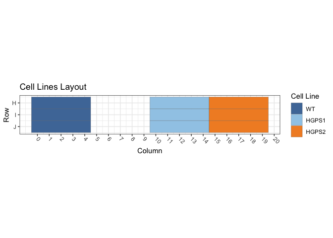
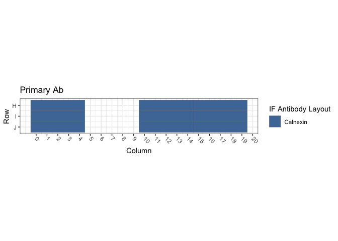
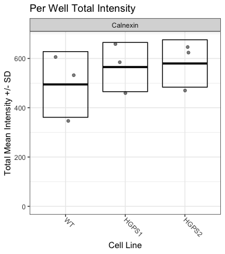

Figure S1E and S1F: hTERT-Progeria / GRP94
================
Sandra Vidak/Gianluca Pegoraro
October 28th 2022

### Introduction

Columbus screen names:

`180124-40x-hFibro-Calnexin-Hsp40_20180124_111314`

`180129-40x-hFibro-Calnexin-HSF1_20180129_130358`

`180205-40x-hFibro-Calnexin-Hsp70-Hsp90-SUN1_20180205_112614`

### Analysis Setup

Load required packages.

``` r
library(tidyverse)
```

    ## ── Attaching packages ─────────────────────────────────────── tidyverse 1.3.2 ──
    ## ✔ ggplot2 3.3.6      ✔ purrr   0.3.5 
    ## ✔ tibble  3.1.8      ✔ dplyr   1.0.10
    ## ✔ tidyr   1.2.1      ✔ stringr 1.4.1 
    ## ✔ readr   2.1.3      ✔ forcats 0.5.2 
    ## ── Conflicts ────────────────────────────────────────── tidyverse_conflicts() ──
    ## ✖ dplyr::filter() masks stats::filter()
    ## ✖ dplyr::lag()    masks stats::lag()

``` r
library(fs)
library(Hmisc)
```

    ## Loading required package: lattice
    ## Loading required package: survival
    ## Loading required package: Formula
    ## 
    ## Attaching package: 'Hmisc'
    ## 
    ## The following objects are masked from 'package:dplyr':
    ## 
    ##     src, summarize
    ## 
    ## The following objects are masked from 'package:base':
    ## 
    ##     format.pval, units

``` r
library(ggthemes)
library(DescTools) # for Dunnett's Test
```

    ## 
    ## Attaching package: 'DescTools'
    ## 
    ## The following objects are masked from 'package:Hmisc':
    ## 
    ##     %nin%, Label, Mean, Quantile

``` r
source("R/Plotters.R") #Functions needed for plotting
```

Set the palette and the running theme for ggplot2.

### Experimental Metadata

Read plate layouts.

``` r
cell_levs <- c("WT", 
               "HGPS1","HGPS2")

plate_layouts <- read_tsv("metadata/plate_layout.txt") %>%
  filter(!is.na(cell_line)) %>%
  separate(col = cell_line, 
           into = c("cell_line", "cell_id"), 
           remove = T) %>%
  mutate(cell_line = factor(cell_line, levels = cell_levs))

glimpse(plate_layouts)
```

    ## Rows: 9
    ## Columns: 5
    ## $ row       <dbl> 8, 9, 10, 8, 9, 10, 8, 9, 10
    ## $ column    <dbl> 2, 2, 2, 12, 12, 12, 17, 17, 17
    ## $ marker    <chr> "Calnexin", "Calnexin", "Calnexin", "Calnexin", "Calnexin", …
    ## $ cell_line <fct> WT, WT, WT, HGPS1, HGPS1, HGPS1, HGPS2, HGPS2, HGPS2
    ## $ cell_id   <chr> "CRL1474", "CRL1474", "CRL1474", "72T", "72T", "72T", "97T",…

Plot plate layouts.

<!-- -->

<!-- -->

### Read and Process Columbus data

Recursively search the `input` directory and its subdirectories for
files whose name includes the Glob patterns defined in the chunk above,
and read the cell-level Columbus data from the results text files.

``` r
read_columbus_results <- function(path, glob) {
  dir_ls(path = path,
         recurse = T,
         glob = glob)  %>%
    read_tsv(
      id = "file_name"
    ) %>%
    select(
      screen = ScreenName,
      plate = PlateName,
      well = WellName,
      row = Row,
      column = Column,
      nuc_area = `Nuclei Selected - Nucleus Area [px²]`,
      cyto_area = `Nuclei Selected - Cytoplasm Area [px²]`,
      cell_area = `Nuclei Selected - Cell Area [px²]`,
      nuc_marker_int = `Nuclei Selected - Intensity Nucleus BP600/37 Mean`,
      cyto_marker_int = `Nuclei Selected - Intensity Cytoplasm BP600/37 Mean`,
      ratio_marker_int = `Nuclei Selected - Nuc_Cyto_BP600_Ratio`
    )
}

glob_path <- "*- Nuclei Selected[0].txt"
col_tbl <- read_columbus_results("input", glob_path)

glimpse(col_tbl)
```

    ## Rows: 15,593
    ## Columns: 11
    ## $ screen           <chr> "180205-40x-hFibro-Calnexin-Hsp70-Hsp90-SUN1_20180205…
    ## $ plate            <chr> "Plate 1", "Plate 1", "Plate 1", "Plate 1", "Plate 1"…
    ## $ well             <chr> "E13", "E13", "E13", "E13", "E13", "E13", "E13", "E13…
    ## $ row              <dbl> 5, 5, 5, 5, 5, 5, 5, 5, 5, 5, 5, 5, 5, 5, 5, 5, 5, 5,…
    ## $ column           <dbl> 13, 13, 13, 13, 13, 13, 13, 13, 13, 13, 13, 13, 13, 1…
    ## $ nuc_area         <dbl> 2889, 2199, 1954, 2351, 2217, 2598, 2644, 2341, 1687,…
    ## $ cyto_area        <dbl> 48615, 40644, 28090, 30134, 26700, 29023, 42772, 2962…
    ## $ cell_area        <dbl> 51504, 42843, 30044, 32485, 28917, 31621, 45416, 3197…
    ## $ nuc_marker_int   <dbl> 388.454, 580.341, 544.455, 408.388, 623.464, 532.906,…
    ## $ cyto_marker_int  <dbl> 616.719, 688.414, 746.066, 311.729, 612.159, 706.241,…
    ## $ ratio_marker_int <dbl> 0.629872, 0.843011, 0.729768, 1.310070, 1.018470, 0.7…

Join Columbus data with the plate layout information.

``` r
cell_tbl <- col_tbl %>%
  mutate(sum_marker_int = nuc_marker_int + cyto_marker_int) %>%
  inner_join(plate_layouts,
             by = c("row", "column")) %>%
  select(screen,
         plate,
         well,
         row,
         column,
         cell_line,
         marker,
         nuc_area:sum_marker_int)

glimpse(cell_tbl)
```

    ## Rows: 5,341
    ## Columns: 14
    ## $ screen           <chr> "180205-40x-hFibro-Calnexin-Hsp70-Hsp90-SUN1_20180205…
    ## $ plate            <chr> "Plate 1", "Plate 1", "Plate 1", "Plate 1", "Plate 1"…
    ## $ well             <chr> "H12", "H12", "H12", "H12", "H12", "H12", "H12", "H12…
    ## $ row              <dbl> 8, 8, 8, 8, 8, 8, 8, 8, 8, 8, 8, 8, 8, 8, 8, 8, 8, 8,…
    ## $ column           <dbl> 12, 12, 12, 12, 12, 12, 12, 12, 12, 12, 12, 12, 12, 1…
    ## $ cell_line        <fct> HGPS1, HGPS1, HGPS1, HGPS1, HGPS1, HGPS1, HGPS1, HGPS…
    ## $ marker           <chr> "Calnexin", "Calnexin", "Calnexin", "Calnexin", "Caln…
    ## $ nuc_area         <dbl> 3145, 2665, 1092, 2415, 2044, 2877, 1991, 1035, 2903,…
    ## $ cyto_area        <dbl> 54150, 28767, 33827, 21981, 4098, 13474, 7575, 29360,…
    ## $ cell_area        <dbl> 57295, 31432, 34919, 24396, 6142, 16351, 9566, 30395,…
    ## $ nuc_marker_int   <dbl> 192.3680, 209.9560, 210.8800, 151.7620, 233.6110, 315…
    ## $ cyto_marker_int  <dbl> 136.1830, 228.9380, 366.1980, 163.5890, 130.9900, 495…
    ## $ ratio_marker_int <dbl> 1.412580, 0.917090, 0.575863, 0.927703, 1.783420, 0.6…
    ## $ sum_marker_int   <dbl> 328.5510, 438.8940, 577.0780, 315.3510, 364.6010, 810…

Calculate number of cells and mean per well for all properties.

``` r
well_tbl <- cell_tbl %>%
  group_by(screen,
           well,
           row,
           column,
           cell_line,
           marker) %>%
  summarise(cell_n = n(),
            across(nuc_area:sum_marker_int,
                   list(mean = ~ mean(.x, na.rm = T))))

glimpse(well_tbl)
```

    ## Rows: 27
    ## Columns: 14
    ## Groups: screen, well, row, column, cell_line [27]
    ## $ screen                <chr> "180124-40x-hFibro-Calnexin-Hsp40_20180124_11131…
    ## $ well                  <chr> "H12", "H17", "H2", "I12", "I17", "I2", "J12", "…
    ## $ row                   <dbl> 8, 8, 8, 9, 9, 9, 10, 10, 10, 8, 8, 8, 9, 9, 9, …
    ## $ column                <dbl> 12, 17, 2, 12, 17, 2, 12, 17, 2, 12, 17, 2, 12, …
    ## $ cell_line             <fct> HGPS1, HGPS2, WT, HGPS1, HGPS2, WT, HGPS1, HGPS2…
    ## $ marker                <chr> "Calnexin", "Calnexin", "Calnexin", "Calnexin", …
    ## $ cell_n                <int> 216, 222, 310, 171, 217, 303, 147, 231, 395, 204…
    ## $ nuc_area_mean         <dbl> 1903.519, 1823.631, 1980.210, 1947.164, 1888.171…
    ## $ cyto_area_mean        <dbl> 13837.00, 13910.64, 15279.89, 16802.94, 13854.95…
    ## $ cell_area_mean        <dbl> 15740.51, 15734.27, 17260.10, 18750.10, 15743.12…
    ## $ nuc_marker_int_mean   <dbl> 402.0101, 380.1086, 339.5472, 403.4506, 413.9494…
    ## $ cyto_marker_int_mean  <dbl> 226.9770, 166.8855, 157.2200, 184.9421, 184.2132…
    ## $ ratio_marker_int_mean <dbl> 2.010924, 2.581688, 2.282401, 2.414435, 2.467966…
    ## $ sum_marker_int_mean   <dbl> 628.9871, 546.9941, 496.7671, 588.3927, 598.1627…

Calculate the mean of the technical replicates for each biological
replicate. Now every marker/cell line combination has an n = 3
biological replicates.

``` r
bioreps_tbl <- well_tbl %>%
  group_by(screen,
           cell_line,
           marker) %>%
  summarise(across(cell_n:sum_marker_int_mean,
                    ~ mean(.x, na.rm = T)))

glimpse(bioreps_tbl)
```

    ## Rows: 9
    ## Columns: 11
    ## Groups: screen, cell_line [9]
    ## $ screen                <chr> "180124-40x-hFibro-Calnexin-Hsp40_20180124_11131…
    ## $ cell_line             <fct> WT, HGPS1, HGPS2, WT, HGPS1, HGPS2, WT, HGPS1, H…
    ## $ marker                <chr> "Calnexin", "Calnexin", "Calnexin", "Calnexin", …
    ## $ cell_n                <dbl> 336.00000, 178.00000, 223.33333, 352.33333, 204.…
    ## $ nuc_area_mean         <dbl> 2021.662, 1928.531, 1876.087, 1993.198, 2008.298…
    ## $ cyto_area_mean        <dbl> 14684.45, 16594.88, 13887.79, 13428.77, 15534.52…
    ## $ cell_area_mean        <dbl> 16706.11, 18523.41, 15763.88, 15421.97, 17542.82…
    ## $ nuc_marker_int_mean   <dbl> 348.3661, 433.1977, 428.3359, 211.9051, 283.8866…
    ## $ cyto_marker_int_mean  <dbl> 181.8872, 221.5442, 196.8904, 135.1280, 173.6226…
    ## $ ratio_marker_int_mean <dbl> 2.062601, 2.181372, 2.433796, 1.644426, 1.759289…
    ## $ sum_marker_int_mean   <dbl> 530.2533, 654.7419, 625.2263, 347.0331, 457.5092…

### Biological Replicates Level plots for Figure S1E

<!-- -->

### Threshold quantifications

Calculate the mean and standard deviation for the pooled population of
controls cells (`WT1`) and on a per biological replicate and on a per
marker basis. Set the threshold for quantification of increases or
decreases at Mean +/- 1 SD.

``` r
thresholds_tbl <- cell_tbl %>% 
  filter(cell_line == "WT") %>%
  group_by(screen, marker) %>%
  summarise(across(nuc_marker_int:sum_marker_int,
                   list(mean_neg = ~ mean(.x, na.rm = T),
                        sd_neg = ~ sd(.x, na.rm = T)))) %>%
  mutate(nuc_marker_plus_thres = nuc_marker_int_mean_neg + 1.5*(nuc_marker_int_sd_neg),
         nuc_marker_minus_thres = nuc_marker_int_mean_neg - 1.5*(nuc_marker_int_sd_neg),
         cyto_marker_plus_thres = cyto_marker_int_mean_neg + 1.5*(cyto_marker_int_sd_neg),
         cyto_marker_minus_thres = cyto_marker_int_mean_neg - 1.5*(cyto_marker_int_sd_neg),
         sum_marker_plus_thres = sum_marker_int_mean_neg + 1.5*(sum_marker_int_sd_neg),
         sum_marker_minus_thres = sum_marker_int_mean_neg - 1.5*(sum_marker_int_sd_neg))

glimpse(thresholds_tbl)
```

    ## Rows: 3
    ## Columns: 16
    ## Groups: screen [3]
    ## $ screen                    <chr> "180124-40x-hFibro-Calnexin-Hsp40_20180124_1…
    ## $ marker                    <chr> "Calnexin", "Calnexin", "Calnexin"
    ## $ nuc_marker_int_mean_neg   <dbl> 347.2498, 210.8204, 354.7658
    ## $ nuc_marker_int_sd_neg     <dbl> 77.91515, 61.62976, 249.87782
    ## $ cyto_marker_int_mean_neg  <dbl> 182.7850, 134.6951, 247.6865
    ## $ cyto_marker_int_sd_neg    <dbl> 63.27051, 44.19532, 163.29934
    ## $ ratio_marker_int_mean_neg <dbl> 2.045164, 1.640854, 1.525790
    ## $ ratio_marker_int_sd_neg   <dbl> 0.6090720, 0.4502217, 0.5552056
    ## $ sum_marker_int_mean_neg   <dbl> 530.0347, 345.5155, 604.4656
    ## $ sum_marker_int_sd_neg     <dbl> 123.44863, 94.83855, 391.76786
    ## $ nuc_marker_plus_thres     <dbl> 464.1225, 303.2651, 729.5826
    ## $ nuc_marker_minus_thres    <dbl> 230.37703, 118.37581, -20.05088
    ## $ cyto_marker_plus_thres    <dbl> 277.6907, 200.9881, 492.6355
    ## $ cyto_marker_minus_thres   <dbl> 87.879201, 68.402103, 2.737517
    ## $ sum_marker_plus_thres     <dbl> 715.2077, 487.7733, 1192.1174
    ## $ sum_marker_minus_thres    <dbl> 344.86178, 203.25770, 16.81382

``` r
defects_tbl <- cell_tbl %>%
  left_join(thresholds_tbl, by = c("screen", "marker")) %>%
  group_by(screen, row, column, cell_line, marker) %>%
  summarise(prop_defects_cyto_plus = 100 * mean(cyto_marker_int >= cyto_marker_plus_thres, na.rm = T),
            prop_defects_cyto_minus = 100 * mean(cyto_marker_int <= cyto_marker_minus_thres, na.rm = T),
            prop_defects_nuc_plus = 100 * mean(nuc_marker_int >= nuc_marker_plus_thres, na.rm = T),
            prop_defects_nuc_minus = 100 * mean(nuc_marker_int <= nuc_marker_minus_thres, na.rm = T),
            prop_defects_sum_plus = 100 * mean(sum_marker_int >= sum_marker_plus_thres, na.rm = T),
            prop_defects_sum_minus = 100 * mean(sum_marker_int <= sum_marker_minus_thres, na.rm = T)) %>%
  arrange(screen, marker, cell_line)

glimpse(defects_tbl)
```

    ## Rows: 27
    ## Columns: 11
    ## Groups: screen, row, column, cell_line [27]
    ## $ screen                  <chr> "180124-40x-hFibro-Calnexin-Hsp40_20180124_111…
    ## $ row                     <dbl> 8, 9, 10, 8, 9, 10, 8, 9, 10, 8, 9, 10, 8, 9, …
    ## $ column                  <dbl> 2, 2, 2, 12, 12, 12, 17, 17, 17, 2, 2, 2, 12, …
    ## $ cell_line               <fct> WT, WT, WT, HGPS1, HGPS1, HGPS1, HGPS2, HGPS2,…
    ## $ marker                  <chr> "Calnexin", "Calnexin", "Calnexin", "Calnexin"…
    ## $ prop_defects_cyto_plus  <dbl> 1.935484, 10.561056, 9.873418, 26.388889, 9.94…
    ## $ prop_defects_cyto_minus <dbl> 2.2580645, 1.3201320, 1.0126582, 3.7037037, 2.…
    ## $ prop_defects_nuc_plus   <dbl> 3.870968, 11.881188, 6.582278, 24.074074, 25.1…
    ## $ prop_defects_nuc_minus  <dbl> 4.1935484, 2.3102310, 5.3164557, 1.3888889, 4.…
    ## $ prop_defects_sum_plus   <dbl> 3.225806, 12.541254, 9.873418, 27.777778, 17.5…
    ## $ prop_defects_sum_minus  <dbl> 4.5161290, 1.3201320, 6.0759494, 2.7777778, 3.…

``` r
bioreps_defects_tbl <- defects_tbl %>%
  group_by(screen, cell_line, marker) %>%
  summarise(across(prop_defects_cyto_plus:prop_defects_sum_minus,
                   list(mean = ~ mean(.x, na.rm = T),
                        sd = ~ sd(.x, na.rm = T))))

glimpse(bioreps_defects_tbl)
```

    ## Rows: 9
    ## Columns: 15
    ## Groups: screen, cell_line [9]
    ## $ screen                       <chr> "180124-40x-hFibro-Calnexin-Hsp40_2018012…
    ## $ cell_line                    <fct> WT, HGPS1, HGPS2, WT, HGPS1, HGPS2, WT, H…
    ## $ marker                       <chr> "Calnexin", "Calnexin", "Calnexin", "Caln…
    ## $ prop_defects_cyto_plus_mean  <dbl> 7.456653, 24.128277, 16.653268, 7.263942,…
    ## $ prop_defects_cyto_plus_sd    <dbl> 4.793818, 13.202412, 11.608833, 2.477239,…
    ## $ prop_defects_cyto_minus_mean <dbl> 1.530285, 2.014295, 5.735522, 3.713314, 1…
    ## $ prop_defects_cyto_minus_sd   <dbl> 0.6487545, 1.8731040, 4.9756908, 1.296726…
    ## $ prop_defects_nuc_plus_mean   <dbl> 7.444811, 35.454377, 34.108365, 6.083638,…
    ## $ prop_defects_nuc_plus_sd     <dbl> 4.074172, 18.790423, 21.414368, 4.743111,…
    ## $ prop_defects_nuc_minus_mean  <dbl> 3.9400784, 1.8274854, 2.2799297, 3.347356…
    ## $ prop_defects_nuc_minus_sd    <dbl> 1.5190563, 2.0817297, 1.9924132, 2.695588…
    ## $ prop_defects_sum_plus_mean   <dbl> 8.546826, 32.794287, 28.895884, 5.557301,…
    ## $ prop_defects_sum_plus_sd     <dbl> 4.797320, 18.282364, 20.007764, 4.785020,…
    ## $ prop_defects_sum_minus_mean  <dbl> 3.9707368, 2.0955166, 3.0272208, 4.301981…
    ## $ prop_defects_sum_minus_sd    <dbl> 2.4243637, 1.8512105, 2.9329745, 2.544090…

### Biological Replicates Level plots for Figure S1F

<!-- -->

### Calculate Dunnett’s test for the continuous variables.

Define a custom function to run a Dunnett post-hoc test only on the Mean
marker intensity sum (Cyto + Nucleus), using the cell line as the
predictor variable, and fixing WT1 as the negative control. The output
of the Dunnett’s test is then rearranged to a tidy table to make it work
with `dplyr`.

``` r
calc_dunnett <- function(df){
  as.data.frame(as.table(DunnettTest(sum_marker_int_mean ~ cell_line,
                          control = "WT",
                          data = df)$WT)) %>%
    pivot_wider(names_from = Var2, values_from = Freq) %>%
    rename(comparison = Var1)
}
```

Run the custom function on all the data grouped based on the IF marker
and save the data to a .csv file.

``` r
dunnett_test <- bioreps_tbl %>%
  group_by(marker) %>%
  group_modify(~ calc_dunnett(.x))

write_csv(dunnett_test, "output/dunnett_results.csv")

knitr::kable(dunnett_test, digits = 3)
```

| marker   | comparison |   diff |   lwr.ci |  upr.ci |  pval |
|:---------|:-----------|-------:|---------:|--------:|------:|
| Calnexin | HGPS1-WT   | 70.589 | -189.350 | 330.529 | 0.672 |
| Calnexin | HGPS2-WT   | 85.088 | -174.851 | 345.028 | 0.575 |

### Chi-square test for counts/proportion of Cells with defects

Calculate the number of cells with defects and normal on a per well
basis. Each treatment has 12 wells (4 technical replicates X 3
biological replicates).

``` r
defects_counts <- cell_tbl %>%
  left_join(thresholds_tbl, by = c("screen", "marker")) %>%
  group_by(screen, row, column, cell_line, marker) %>%
  summarise(n_cells = n(),
            cyto_plus_def = sum(cyto_marker_int >= cyto_marker_plus_thres, na.rm = T),
            cyto_minus_def = sum(cyto_marker_int <= cyto_marker_minus_thres, na.rm = T),
            nuc_plus_def = sum(nuc_marker_int >= nuc_marker_plus_thres, na.rm = T),
            nuc_minus_def = sum(nuc_marker_int <= nuc_marker_minus_thres, na.rm = T),
            sum_plus_def = sum(sum_marker_int >= sum_marker_plus_thres, na.rm = T),
            sum_minus_def = sum(sum_marker_int <= sum_marker_minus_thres, na.rm = T)) %>%
  mutate(across(cyto_plus_def:sum_minus_def,
                list(norm = ~ n_cells - .x))) %>%
  rename_with( ~ gsub("def_norm", "norm", .x, fixed = TRUE)) %>%
  arrange(screen, marker, cell_line)

defects_counts
```

    ## # A tibble: 27 × 18
    ## # Groups:   screen, row, column, cell_line [27]
    ##    screen      row column cell_…¹ marker n_cells cyto_…² cyto_…³ nuc_p…⁴ nuc_m…⁵
    ##    <chr>     <dbl>  <dbl> <fct>   <chr>    <int>   <int>   <int>   <int>   <int>
    ##  1 180124-4…     8      2 WT      Calne…     310       6       7      12      13
    ##  2 180124-4…     9      2 WT      Calne…     303      32       4      36       7
    ##  3 180124-4…    10      2 WT      Calne…     395      39       4      26      21
    ##  4 180124-4…     8     12 HGPS1   Calne…     216      57       8      52       3
    ##  5 180124-4…     9     12 HGPS1   Calne…     171      17       4      43       7
    ##  6 180124-4…    10     12 HGPS1   Calne…     147      53       0      84       0
    ##  7 180124-4…     8     17 HGPS2   Calne…     222      18      24      37       7
    ##  8 180124-4…     9     17 HGPS2   Calne…     217      26      12      60       8
    ##  9 180124-4…    10     17 HGPS2   Calne…     231      69       2     134       0
    ## 10 180129-4…     8      2 WT      Calne…     387      22      20       6      25
    ## # … with 17 more rows, 8 more variables: sum_plus_def <int>,
    ## #   sum_minus_def <int>, cyto_plus_norm <int>, cyto_minus_norm <int>,
    ## #   nuc_plus_norm <int>, nuc_minus_norm <int>, sum_plus_norm <int>,
    ## #   sum_minus_norm <int>, and abbreviated variable names ¹​cell_line,
    ## #   ²​cyto_plus_def, ³​cyto_minus_def, ⁴​nuc_plus_def, ⁵​nuc_minus_def

Summarize the counts by taking the mean of all 12 wells per condition,
then pivot the table longer to put in a format that can be handled by
xtabs downstream.

``` r
defects_counts_long <- defects_counts %>%
  select(-n_cells) %>%
  group_by(marker, cell_line) %>%
  summarise(across(cyto_plus_def:sum_minus_norm, # Take the mean of all the wells in all the technical and biological replicates
              ~ mean(.x, na.rm = TRUE))) %>% 
  pivot_longer(cols = cyto_plus_def:sum_minus_norm,
               names_pattern = "(.*_.*)_(.*)",
               names_to = c("type", "quality"),
               values_to = "count")

defects_counts_long
```

    ## # A tibble: 36 × 5
    ## # Groups:   marker [1]
    ##    marker   cell_line type       quality  count
    ##    <chr>    <fct>     <chr>      <chr>    <dbl>
    ##  1 Calnexin WT        cyto_plus  def      18.6 
    ##  2 Calnexin WT        cyto_minus def       6.11
    ##  3 Calnexin WT        nuc_plus   def      16.4 
    ##  4 Calnexin WT        nuc_minus  def       8.67
    ##  5 Calnexin WT        sum_plus   def      17.6 
    ##  6 Calnexin WT        sum_minus  def       9.89
    ##  7 Calnexin WT        cyto_plus  norm    230.  
    ##  8 Calnexin WT        cyto_minus norm    243.  
    ##  9 Calnexin WT        nuc_plus   norm    232.  
    ## 10 Calnexin WT        nuc_minus  norm    240.  
    ## # … with 26 more rows

Define a function that calculate a contingency table of counts based on
the cell line and the cell class (normal/defects). The table is then
used to calculate the chi-square test to determine whether any of the 6
cell lines is different from the others in terms of proportion of
defects.

``` r
calc_chi <- function(df){
    xtabs_tbl <- xtabs(count ~ cell_line + quality, data = df)
    broom::tidy(chisq.test(xtabs_tbl))
}
```

Apply the function on a per IF marker and on a per defect category to
calculate the p-values on a per IF marker and defect type basis.

``` r
chi_square_test <- defects_counts_long %>%
  group_by(marker, type) %>%
  group_modify(~ calc_chi(.x))

write_csv(chi_square_test, "output/chi_square_results.csv")

knitr::kable(chi_square_test, digits = 3)
```

| marker   | type       | statistic | p.value | parameter | method                     |
|:---------|:-----------|----------:|--------:|----------:|:---------------------------|
| Calnexin | cyto_minus |     1.224 |   0.542 |         2 | Pearson’s Chi-squared test |
| Calnexin | cyto_plus  |    20.994 |   0.000 |         2 | Pearson’s Chi-squared test |
| Calnexin | nuc_minus  |     3.669 |   0.160 |         2 | Pearson’s Chi-squared test |
| Calnexin | nuc_plus   |    58.345 |   0.000 |         2 | Pearson’s Chi-squared test |
| Calnexin | sum_minus  |     3.687 |   0.158 |         2 | Pearson’s Chi-squared test |
| Calnexin | sum_plus   |    48.850 |   0.000 |         2 | Pearson’s Chi-squared test |

Document the information about the analysis session

``` r
sessionInfo()
```

    ## R version 4.2.1 (2022-06-23)
    ## Platform: x86_64-apple-darwin17.0 (64-bit)
    ## Running under: macOS Big Sur ... 10.16
    ## 
    ## Matrix products: default
    ## BLAS:   /Library/Frameworks/R.framework/Versions/4.2/Resources/lib/libRblas.0.dylib
    ## LAPACK: /Library/Frameworks/R.framework/Versions/4.2/Resources/lib/libRlapack.dylib
    ## 
    ## locale:
    ## [1] en_US.UTF-8/en_US.UTF-8/en_US.UTF-8/C/en_US.UTF-8/en_US.UTF-8
    ## 
    ## attached base packages:
    ## [1] stats     graphics  grDevices utils     datasets  methods   base     
    ## 
    ## other attached packages:
    ##  [1] DescTools_0.99.47 ggthemes_4.2.4    Hmisc_4.7-1       Formula_1.2-4    
    ##  [5] survival_3.4-0    lattice_0.20-45   fs_1.5.2          forcats_0.5.2    
    ##  [9] stringr_1.4.1     dplyr_1.0.10      purrr_0.3.5       readr_2.1.3      
    ## [13] tidyr_1.2.1       tibble_3.1.8      ggplot2_3.3.6     tidyverse_1.3.2  
    ## 
    ## loaded via a namespace (and not attached):
    ##  [1] bit64_4.0.5         lubridate_1.8.0     RColorBrewer_1.1-3 
    ##  [4] httr_1.4.4          tools_4.2.1         backports_1.4.1    
    ##  [7] utf8_1.2.2          R6_2.5.1            rpart_4.1.19       
    ## [10] DBI_1.1.3           colorspace_2.0-3    nnet_7.3-18        
    ## [13] withr_2.5.0         Exact_3.2           tidyselect_1.2.0   
    ## [16] gridExtra_2.3       bit_4.0.4           compiler_4.2.1     
    ## [19] cli_3.4.1           rvest_1.0.3         htmlTable_2.4.1    
    ## [22] expm_0.999-6        xml2_1.3.3          labeling_0.4.2     
    ## [25] scales_1.2.1        checkmate_2.1.0     mvtnorm_1.1-3      
    ## [28] proxy_0.4-27        digest_0.6.30       foreign_0.8-83     
    ## [31] rmarkdown_2.17      base64enc_0.1-3     jpeg_0.1-9         
    ## [34] pkgconfig_2.0.3     htmltools_0.5.3     highr_0.9          
    ## [37] dbplyr_2.2.1        fastmap_1.1.0       htmlwidgets_1.5.4  
    ## [40] rlang_1.0.6         readxl_1.4.1        rstudioapi_0.14    
    ## [43] farver_2.1.1        generics_0.1.3      jsonlite_1.8.3     
    ## [46] vroom_1.6.0         googlesheets4_1.0.1 magrittr_2.0.3     
    ## [49] interp_1.1-3        Matrix_1.5-1        Rcpp_1.0.9         
    ## [52] munsell_0.5.0       fansi_1.0.3         lifecycle_1.0.3    
    ## [55] stringi_1.7.8       yaml_2.3.6          rootSolve_1.8.2.3  
    ## [58] MASS_7.3-58.1       grid_4.2.1          parallel_4.2.1     
    ## [61] crayon_1.5.2        lmom_2.9            deldir_1.0-6       
    ## [64] haven_2.5.1         splines_4.2.1       hms_1.1.2          
    ## [67] knitr_1.40          pillar_1.8.1        boot_1.3-28        
    ## [70] gld_2.6.6           reprex_2.0.2        glue_1.6.2         
    ## [73] evaluate_0.17       latticeExtra_0.6-30 data.table_1.14.4  
    ## [76] modelr_0.1.9        png_0.1-7           vctrs_0.5.0        
    ## [79] tzdb_0.3.0          cellranger_1.1.0    gtable_0.3.1       
    ## [82] assertthat_0.2.1    xfun_0.34           broom_1.0.1        
    ## [85] e1071_1.7-12        class_7.3-20        googledrive_2.0.0  
    ## [88] gargle_1.2.1        cluster_2.1.4       ellipsis_0.3.2
