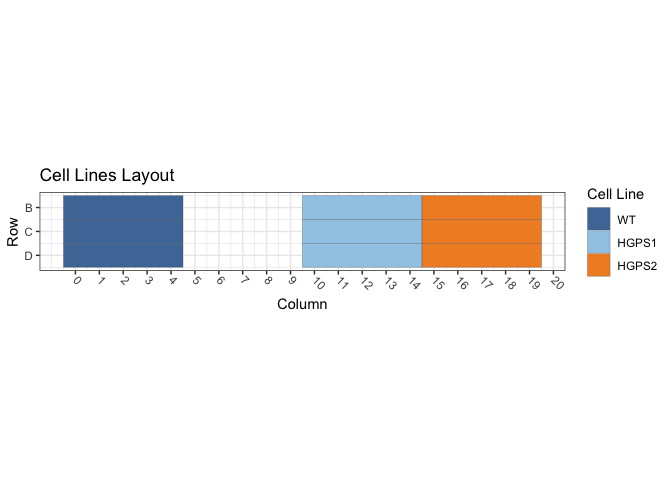
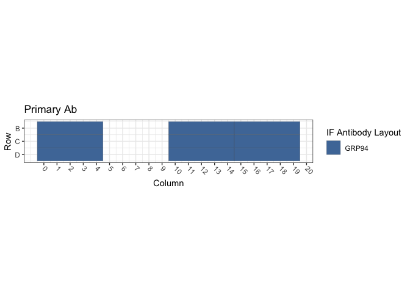
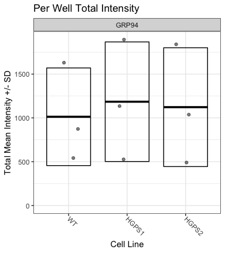
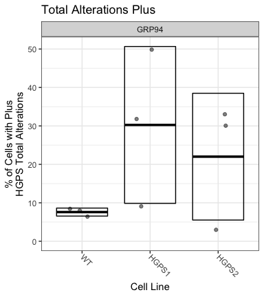

Figure S1E and S1F: hTERT-Progeria / GRP94
================
Sandra Vidak/Gianluca Pegoraro
October 28th 2022

### Introduction

Columbus screen names:

`180124-40x-hFibro-GRP94-Hsc70-HSP90ab-HSF1-LAP2_20180124_101939`

`180129-40x-hFibro-GRP94-Hsc70-SUN1-LAP2_20180129_121044`

`180322-40X-hFibro-NewSigmaFBS-GRP94-Calnexin-Hsp40-Hsp90-SUN1-LAP2_20180322_163721`

### Analysis Setup

Load required packages.

``` r
library(tidyverse)
```

    ## ── Attaching packages ─────────────────────────────────────── tidyverse 1.3.2 ──
    ## ✔ ggplot2 3.3.6      ✔ purrr   0.3.5 
    ## ✔ tibble  3.1.8      ✔ dplyr   1.0.10
    ## ✔ tidyr   1.2.1      ✔ stringr 1.4.1 
    ## ✔ readr   2.1.3      ✔ forcats 0.5.2 
    ## ── Conflicts ────────────────────────────────────────── tidyverse_conflicts() ──
    ## ✖ dplyr::filter() masks stats::filter()
    ## ✖ dplyr::lag()    masks stats::lag()

``` r
library(fs)
library(Hmisc)
```

    ## Loading required package: lattice
    ## Loading required package: survival
    ## Loading required package: Formula
    ## 
    ## Attaching package: 'Hmisc'
    ## 
    ## The following objects are masked from 'package:dplyr':
    ## 
    ##     src, summarize
    ## 
    ## The following objects are masked from 'package:base':
    ## 
    ##     format.pval, units

``` r
library(ggthemes)
library(DescTools) # for Dunnett's Test
```

    ## 
    ## Attaching package: 'DescTools'
    ## 
    ## The following objects are masked from 'package:Hmisc':
    ## 
    ##     %nin%, Label, Mean, Quantile

``` r
source("R/Plotters.R") #Functions needed for plotting
```

Set the palette and the running theme for ggplot2.

### Experimental Metadata

Read plate layouts.

``` r
cell_levs <- c("WT", 
               "HGPS1","HGPS2")

plate_layouts <- read_tsv("metadata/plate_layout.txt") %>%
  filter(!is.na(cell_line)) %>%
  separate(col = cell_line, 
           into = c("cell_line", "cell_id"), 
           remove = T) %>%
  mutate(cell_line = factor(cell_line, levels = cell_levs))

glimpse(plate_layouts)
```

    ## Rows: 9
    ## Columns: 5
    ## $ row       <dbl> 2, 3, 4, 2, 3, 4, 2, 3, 4
    ## $ column    <dbl> 2, 2, 2, 12, 12, 12, 17, 17, 17
    ## $ marker    <chr> "GRP94", "GRP94", "GRP94", "GRP94", "GRP94", "GRP94", "GRP94…
    ## $ cell_line <fct> WT, WT, WT, HGPS1, HGPS1, HGPS1, HGPS2, HGPS2, HGPS2
    ## $ cell_id   <chr> "CRL1474", "CRL1474", "CRL1474", "72T", "72T", "72T", "97T",…

Plot plate layouts.

<!-- -->

<!-- -->

### Read and Process Columbus data

Recursively search the `input` directory and its subdirectories for
files whose name includes the Glob patterns defined in the chunk above,
and read the cell-level Columbus data from the results text files.

``` r
read_columbus_results <- function(path, glob) {
  dir_ls(path = path,
         recurse = T,
         glob = glob)  %>%
    read_tsv(
      id = "file_name"
    ) %>%
    select(
      screen = ScreenName,
      plate = PlateName,
      well = WellName,
      row = Row,
      column = Column,
      nuc_area = `Nuclei Selected - Nucleus Area [px²]`,
      cyto_area = `Nuclei Selected - Cytoplasm Area [px²]`,
      cell_area = `Nuclei Selected - Cell Area [px²]`,
      nuc_marker_int = `Nuclei Selected - Intensity Nucleus BP600/37 Mean`,
      cyto_marker_int = `Nuclei Selected - Intensity Cytoplasm BP600/37 Mean`,
      ratio_marker_int = `Nuclei Selected - Nuc_Cyto_BP600_Ratio`
    )
}

glob_path <- "*- Nuclei Selected[0].txt"
col_tbl <- read_columbus_results("input", glob_path)

glimpse(col_tbl)
```

    ## Rows: 54,470
    ## Columns: 11
    ## $ screen           <chr> "180129-40x-hFibro-GRP94-Hsc70-SUN1-LAP2_20180129_121…
    ## $ plate            <chr> "Plate 2", "Plate 2", "Plate 2", "Plate 2", "Plate 2"…
    ## $ well             <chr> "B10", "B10", "B10", "B10", "B10", "B10", "B10", "B10…
    ## $ row              <dbl> 2, 2, 2, 2, 2, 2, 2, 2, 2, 2, 2, 2, 2, 2, 2, 2, 2, 2,…
    ## $ column           <dbl> 10, 10, 10, 10, 10, 10, 10, 10, 10, 10, 10, 10, 10, 1…
    ## $ nuc_area         <dbl> 1952, 1824, 1532, 1650, 1773, 2072, 1894, 1397, 1832,…
    ## $ cyto_area        <dbl> 11348, 7458, 8499, 18267, 11771, 9550, 18070, 7688, 2…
    ## $ cell_area        <dbl> 13300, 9282, 10031, 19917, 13544, 11622, 19964, 9085,…
    ## $ nuc_marker_int   <dbl> 768.494, 737.308, 722.846, 923.323, 561.646, 747.003,…
    ## $ cyto_marker_int  <dbl> 60.5062, 79.4469, 81.2076, 56.3048, 54.3863, 64.9091,…
    ## $ ratio_marker_int <dbl> 12.70110, 9.28051, 8.90122, 16.39870, 10.32700, 11.50…

Join Columbus data with the plate layout information.

``` r
cell_tbl <- col_tbl %>%
  mutate(sum_marker_int = nuc_marker_int + cyto_marker_int) %>%
  inner_join(plate_layouts,
             by = c("row", "column")) %>%
  select(screen,
         plate,
         well,
         row,
         column,
         cell_line,
         marker,
         nuc_area:sum_marker_int)

glimpse(cell_tbl)
```

    ## Rows: 7,663
    ## Columns: 14
    ## $ screen           <chr> "180129-40x-hFibro-GRP94-Hsc70-SUN1-LAP2_20180129_121…
    ## $ plate            <chr> "Plate 2", "Plate 2", "Plate 2", "Plate 2", "Plate 2"…
    ## $ well             <chr> "B12", "B12", "B12", "B12", "B12", "B12", "B12", "B12…
    ## $ row              <dbl> 2, 2, 2, 2, 2, 2, 2, 2, 2, 2, 2, 2, 2, 2, 2, 2, 2, 2,…
    ## $ column           <dbl> 12, 12, 12, 12, 12, 12, 12, 12, 12, 12, 12, 12, 12, 1…
    ## $ cell_line        <fct> HGPS1, HGPS1, HGPS1, HGPS1, HGPS1, HGPS1, HGPS1, HGPS…
    ## $ marker           <chr> "GRP94", "GRP94", "GRP94", "GRP94", "GRP94", "GRP94",…
    ## $ nuc_area         <dbl> 1714, 1929, 1300, 1459, 2037, 1867, 3220, 1302, 1560,…
    ## $ cyto_area        <dbl> 23600, 10621, 13454, 12777, 23398, 20821, 28402, 1533…
    ## $ cell_area        <dbl> 25314, 12550, 14754, 14236, 25435, 22688, 31622, 1663…
    ## $ nuc_marker_int   <dbl> 595.177, 403.333, 716.228, 442.912, 474.828, 342.063,…
    ## $ cyto_marker_int  <dbl> 372.670, 535.088, 397.806, 327.402, 366.829, 427.190,…
    ## $ ratio_marker_int <dbl> 1.597060, 0.753770, 1.800440, 1.352810, 1.294410, 0.8…
    ## $ sum_marker_int   <dbl> 967.847, 938.421, 1114.034, 770.314, 841.657, 769.253…

Calculate number of cells and mean per well for all properties.

``` r
well_tbl <- cell_tbl %>%
  group_by(screen,
           well,
           row,
           column,
           cell_line,
           marker) %>%
  summarise(cell_n = n(),
            across(nuc_area:sum_marker_int,
                   list(mean = ~ mean(.x, na.rm = T))))

glimpse(well_tbl)
```

    ## Rows: 27
    ## Columns: 14
    ## Groups: screen, well, row, column, cell_line [27]
    ## $ screen                <chr> "180124-40x-hFibro-GRP94-Hsc70-HSP90ab-HSF1-LAP2…
    ## $ well                  <chr> "B12", "B17", "B2", "C12", "C17", "C2", "D12", "…
    ## $ row                   <dbl> 2, 2, 2, 3, 3, 3, 4, 4, 4, 2, 2, 2, 3, 3, 3, 4, …
    ## $ column                <dbl> 12, 17, 2, 12, 17, 2, 12, 17, 2, 12, 17, 2, 12, …
    ## $ cell_line             <fct> HGPS1, HGPS2, WT, HGPS1, HGPS2, WT, HGPS1, HGPS2…
    ## $ marker                <chr> "GRP94", "GRP94", "GRP94", "GRP94", "GRP94", "GR…
    ## $ cell_n                <int> 183, 185, 320, 164, 250, 241, 172, 206, 371, 150…
    ## $ nuc_area_mean         <dbl> 1930.508, 1798.422, 1954.041, 1970.335, 1861.988…
    ## $ cyto_area_mean        <dbl> 15926.984, 14756.449, 15108.903, 18971.707, 1341…
    ## $ cell_area_mean        <dbl> 17857.49, 16554.87, 17062.94, 20942.04, 15278.14…
    ## $ nuc_marker_int_mean   <dbl> 1041.1642, 996.2464, 889.6563, 1027.0343, 889.34…
    ## $ cyto_marker_int_mean  <dbl> 882.2171, 866.8651, 726.4524, 899.4735, 889.3129…
    ## $ ratio_marker_int_mean <dbl> 1.2372979, 1.2174042, 1.2832938, 1.2296728, 1.06…
    ## $ sum_marker_int_mean   <dbl> 1923.3813, 1863.1115, 1616.1087, 1926.5078, 1778…

Calculate the mean of the technical replicates for each biological
replicate. Now every marker/cell line combination has an n = 3
biological replicates.

``` r
bioreps_tbl <- well_tbl %>%
  group_by(screen,
           cell_line,
           marker) %>%
  summarise(across(cell_n:sum_marker_int_mean,
                    ~ mean(.x, na.rm = T)))

glimpse(bioreps_tbl)
```

    ## Rows: 9
    ## Columns: 11
    ## Groups: screen, cell_line [9]
    ## $ screen                <chr> "180124-40x-hFibro-GRP94-Hsc70-HSP90ab-HSF1-LAP2…
    ## $ cell_line             <fct> WT, HGPS1, HGPS2, WT, HGPS1, HGPS2, WT, HGPS1, H…
    ## $ marker                <chr> "GRP94", "GRP94", "GRP94", "GRP94", "GRP94", "GR…
    ## $ cell_n                <dbl> 310.6667, 173.0000, 213.6667, 448.6667, 153.6667…
    ## $ nuc_area_mean         <dbl> 2002.897, 1920.562, 1819.837, 1912.392, 1910.067…
    ## $ cyto_area_mean        <dbl> 15359.627, 16930.748, 13959.360, 11921.205, 1722…
    ## $ cell_area_mean        <dbl> 17362.52, 18851.31, 15779.20, 13833.60, 19138.96…
    ## $ nuc_marker_int_mean   <dbl> 897.8673, 1030.7187, 962.1625, 439.4994, 568.817…
    ## $ cyto_marker_int_mean  <dbl> 728.9863, 857.8643, 877.6365, 433.4200, 571.3346…
    ## $ ratio_marker_int_mean <dbl> 1.2886051, 1.2892153, 1.1636769, 1.0432124, 1.05…
    ## $ sum_marker_int_mean   <dbl> 1626.8536, 1888.5830, 1839.7990, 872.9193, 1140.…

### Biological Replicates Level plots for Figure S1E

<!-- -->

### Threshold quantifications

Calculate the mean and standard deviation for the pooled population of
controls cells (`WT1`) and on a per biological replicate and on a per
marker basis. Set the threshold for quantification of increases or
decreases at Mean +/- 1 SD.

``` r
thresholds_tbl <- cell_tbl %>% 
  filter(cell_line == "WT") %>%
  group_by(screen, marker) %>%
  summarise(across(nuc_marker_int:sum_marker_int,
                   list(mean_neg = ~ mean(.x, na.rm = T),
                        sd_neg = ~ sd(.x, na.rm = T)))) %>%
  mutate(nuc_marker_plus_thres = nuc_marker_int_mean_neg + 1.5*(nuc_marker_int_sd_neg),
         nuc_marker_minus_thres = nuc_marker_int_mean_neg - 1.5*(nuc_marker_int_sd_neg),
         cyto_marker_plus_thres = cyto_marker_int_mean_neg + 1.5*(cyto_marker_int_sd_neg),
         cyto_marker_minus_thres = cyto_marker_int_mean_neg - 1.5*(cyto_marker_int_sd_neg),
         sum_marker_plus_thres = sum_marker_int_mean_neg + 1.5*(sum_marker_int_sd_neg),
         sum_marker_minus_thres = sum_marker_int_mean_neg - 1.5*(sum_marker_int_sd_neg))

glimpse(thresholds_tbl)
```

    ## Rows: 3
    ## Columns: 16
    ## Groups: screen [3]
    ## $ screen                    <chr> "180124-40x-hFibro-GRP94-Hsc70-HSP90ab-HSF1-…
    ## $ marker                    <chr> "GRP94", "GRP94", "GRP94"
    ## $ nuc_marker_int_mean_neg   <dbl> 895.6712, 439.6655, 267.8036
    ## $ nuc_marker_int_sd_neg     <dbl> 156.76818, 90.69864, 57.83565
    ## $ cyto_marker_int_mean_neg  <dbl> 729.8194, 434.6097, 272.2726
    ## $ cyto_marker_int_sd_neg    <dbl> 180.74723, 102.97025, 64.10362
    ## $ ratio_marker_int_mean_neg <dbl> 1.284126, 1.040716, 1.004425
    ## $ ratio_marker_int_sd_neg   <dbl> 0.3280138, 0.2167192, 0.1837727
    ## $ sum_marker_int_mean_neg   <dbl> 1625.4906, 874.2753, 540.0763
    ## $ sum_marker_int_sd_neg     <dbl> 275.4576, 172.3729, 112.6504
    ## $ nuc_marker_plus_thres     <dbl> 1130.8235, 575.7135, 354.5571
    ## $ nuc_marker_minus_thres    <dbl> 660.5189, 303.6176, 181.0502
    ## $ cyto_marker_plus_thres    <dbl> 1000.9402, 589.0651, 368.4281
    ## $ cyto_marker_minus_thres   <dbl> 458.6985, 280.1543, 176.1172
    ## $ sum_marker_plus_thres     <dbl> 2038.6770, 1132.8347, 709.0518
    ## $ sum_marker_minus_thres    <dbl> 1212.3041, 615.7159, 371.1007

``` r
defects_tbl <- cell_tbl %>%
  left_join(thresholds_tbl, by = c("screen", "marker")) %>%
  group_by(screen, row, column, cell_line, marker) %>%
  summarise(prop_defects_cyto_plus = 100 * mean(cyto_marker_int >= cyto_marker_plus_thres, na.rm = T),
            prop_defects_cyto_minus = 100 * mean(cyto_marker_int <= cyto_marker_minus_thres, na.rm = T),
            prop_defects_nuc_plus = 100 * mean(nuc_marker_int >= nuc_marker_plus_thres, na.rm = T),
            prop_defects_nuc_minus = 100 * mean(nuc_marker_int <= nuc_marker_minus_thres, na.rm = T),
            prop_defects_sum_plus = 100 * mean(sum_marker_int >= sum_marker_plus_thres, na.rm = T),
            prop_defects_sum_minus = 100 * mean(sum_marker_int <= sum_marker_minus_thres, na.rm = T)) %>%
  arrange(screen, marker, cell_line)

glimpse(defects_tbl)
```

    ## Rows: 27
    ## Columns: 11
    ## Groups: screen, row, column, cell_line [27]
    ## $ screen                  <chr> "180124-40x-hFibro-GRP94-Hsc70-HSP90ab-HSF1-LA…
    ## $ row                     <dbl> 2, 3, 4, 2, 3, 4, 2, 3, 4, 2, 3, 4, 2, 3, 4, 2…
    ## $ column                  <dbl> 2, 2, 2, 12, 12, 12, 17, 17, 17, 2, 2, 2, 12, …
    ## $ cell_line               <fct> WT, WT, WT, HGPS1, HGPS1, HGPS1, HGPS2, HGPS2,…
    ## $ marker                  <chr> "GRP94", "GRP94", "GRP94", "GRP94", "GRP94", "…
    ## $ prop_defects_cyto_plus  <dbl> 9.687500, 8.298755, 8.894879, 24.590164, 32.31…
    ## $ prop_defects_cyto_minus <dbl> 3.4375000, 3.7344398, 3.2345013, 0.5464481, 0.…
    ## $ prop_defects_nuc_plus   <dbl> 6.562500, 8.298755, 6.469003, 27.868852, 30.48…
    ## $ prop_defects_nuc_minus  <dbl> 1.8750000, 4.1493776, 2.9649596, 3.2786885, 4.…
    ## $ prop_defects_sum_plus   <dbl> 8.437500, 9.543568, 7.008086, 31.147541, 37.19…
    ## $ prop_defects_sum_minus  <dbl> 5.0000000, 2.0746888, 3.5040431, 0.5464481, 1.…

``` r
bioreps_defects_tbl <- defects_tbl %>%
  group_by(screen, cell_line, marker) %>%
  summarise(across(prop_defects_cyto_plus:prop_defects_sum_minus,
                   list(mean = ~ mean(.x, na.rm = T),
                        sd = ~ sd(.x, na.rm = T))))

glimpse(bioreps_defects_tbl)
```

    ## Rows: 9
    ## Columns: 15
    ## Groups: screen, cell_line [9]
    ## $ screen                       <chr> "180124-40x-hFibro-GRP94-Hsc70-HSP90ab-HS…
    ## $ cell_line                    <fct> WT, HGPS1, HGPS2, WT, HGPS1, HGPS2, WT, H…
    ## $ marker                       <chr> "GRP94", "GRP94", "GRP94", "GRP94", "GRP9…
    ## $ prop_defects_cyto_plus_mean  <dbl> 8.960378, 25.752025, 27.950179, 7.502686,…
    ## $ prop_defects_cyto_plus_sd    <dbl> 0.6966855, 6.0681223, 3.2040211, 1.248854…
    ## $ prop_defects_cyto_minus_mean <dbl> 3.4688137, 3.0985797, 3.4055104, 4.450565…
    ## $ prop_defects_cyto_minus_sd   <dbl> 0.2514359, 4.3657100, 1.3578182, 1.089517…
    ## $ prop_defects_nuc_plus_mean   <dbl> 7.110086, 28.948343, 22.802379, 7.232570,…
    ## $ prop_defects_nuc_plus_sd     <dbl> 1.030479, 1.368725, 8.000576, 3.820786, 1…
    ## $ prop_defects_nuc_minus_mean  <dbl> 2.996446, 4.453645, 10.898907, 2.924843, …
    ## $ prop_defects_nuc_minus_sd    <dbl> 1.1375157, 1.2777553, 3.8519657, 1.038750…
    ## $ prop_defects_sum_plus_mean   <dbl> 8.329718, 31.889415, 30.005388, 6.397736,…
    ## $ prop_defects_sum_plus_sd     <dbl> 1.271173, 4.976418, 3.828258, 1.860026, 1…
    ## $ prop_defects_sum_minus_mean  <dbl> 3.5262440, 3.5050838, 7.5154728, 4.753118…
    ## $ prop_defects_sum_minus_sd    <dbl> 1.4627820, 4.0644815, 2.7749719, 1.559175…

### Biological Replicates Level plots for Figure S1F

<!-- -->

### Calculate Dunnett’s test for the continuous variables.

Define a custom function to run a Dunnett post-hoc test only on the Mean
marker intensity sum (Cyto + Nucleus), using the cell line as the
predictor variable, and fixing WT1 as the negative control. The output
of the Dunnett’s test is then rearranged to a tidy table to make it work
with `dplyr`.

``` r
calc_dunnett <- function(df){
  as.data.frame(as.table(DunnettTest(sum_marker_int_mean ~ cell_line,
                          control = "WT",
                          data = df)$WT)) %>%
    pivot_wider(names_from = Var2, values_from = Freq) %>%
    rename(comparison = Var1)
}
```

Run the custom function on all the data grouped based on the IF marker
and save the data to a .csv file.

``` r
dunnett_test <- bioreps_tbl %>%
  group_by(marker) %>%
  group_modify(~ calc_dunnett(.x))

write_csv(dunnett_test, "output/dunnett_results.csv")

knitr::kable(dunnett_test, digits = 3)
```

| marker | comparison |    diff |    lwr.ci |   upr.ci |  pval |
|:-------|:-----------|--------:|----------:|---------:|------:|
| GRP94  | HGPS1-WT   | 171.822 | -1330.344 | 1673.987 | 0.926 |
| GRP94  | HGPS2-WT   | 109.697 | -1392.468 | 1611.863 | 0.969 |

### Chi-square test for counts/proportion of Cells with defects

Calculate the number of cells with defects and normal on a per well
basis. Each treatment has 12 wells (4 technical replicates X 3
biological replicates)

``` r
defects_counts <- cell_tbl %>%
  left_join(thresholds_tbl, by = c("screen", "marker")) %>%
  group_by(screen, row, column, cell_line, marker) %>%
  summarise(n_cells = n(),
            cyto_plus_def = sum(cyto_marker_int >= cyto_marker_plus_thres, na.rm = T),
            cyto_minus_def = sum(cyto_marker_int <= cyto_marker_minus_thres, na.rm = T),
            nuc_plus_def = sum(nuc_marker_int >= nuc_marker_plus_thres, na.rm = T),
            nuc_minus_def = sum(nuc_marker_int <= nuc_marker_minus_thres, na.rm = T),
            sum_plus_def = sum(sum_marker_int >= sum_marker_plus_thres, na.rm = T),
            sum_minus_def = sum(sum_marker_int <= sum_marker_minus_thres, na.rm = T)) %>%
  mutate(across(cyto_plus_def:sum_minus_def,
                list(norm = ~ n_cells - .x))) %>%
  rename_with( ~ gsub("def_norm", "norm", .x, fixed = TRUE)) %>%
  arrange(screen, marker, cell_line)

defects_counts
```

    ## # A tibble: 27 × 18
    ## # Groups:   screen, row, column, cell_line [27]
    ##    screen      row column cell_…¹ marker n_cells cyto_…² cyto_…³ nuc_p…⁴ nuc_m…⁵
    ##    <chr>     <dbl>  <dbl> <fct>   <chr>    <int>   <int>   <int>   <int>   <int>
    ##  1 180124-4…     2      2 WT      GRP94      320      31      11      21       6
    ##  2 180124-4…     3      2 WT      GRP94      241      20       9      20      10
    ##  3 180124-4…     4      2 WT      GRP94      371      33      12      24      11
    ##  4 180124-4…     2     12 HGPS1   GRP94      183      45       1      51       6
    ##  5 180124-4…     3     12 HGPS1   GRP94      164      53       1      50       7
    ##  6 180124-4…     4     12 HGPS1   GRP94      172      35      14      49      10
    ##  7 180124-4…     2     17 HGPS2   GRP94      185      45       4      52      18
    ##  8 180124-4…     3     17 HGPS2   GRP94      250      76       8      34      38
    ##  9 180124-4…     4     17 HGPS2   GRP94      206      60      10      55      16
    ## 10 180129-4…     2      2 WT      GRP94      443      31      21      13      18
    ## # … with 17 more rows, 8 more variables: sum_plus_def <int>,
    ## #   sum_minus_def <int>, cyto_plus_norm <int>, cyto_minus_norm <int>,
    ## #   nuc_plus_norm <int>, nuc_minus_norm <int>, sum_plus_norm <int>,
    ## #   sum_minus_norm <int>, and abbreviated variable names ¹​cell_line,
    ## #   ²​cyto_plus_def, ³​cyto_minus_def, ⁴​nuc_plus_def, ⁵​nuc_minus_def

Summarize the counts by taking the mean of all 12 wells per condition,
then pivot the table longer to put in a format that can be handled by
xtabs downstream.

``` r
defects_counts_long <- defects_counts %>%
  select(-n_cells) %>%
  group_by(marker, cell_line) %>%
  summarise(across(cyto_plus_def:sum_minus_norm, # Take the mean of all the wells in all the technical and biological replicates
              ~ mean(.x, na.rm = TRUE))) %>% 
  pivot_longer(cols = cyto_plus_def:sum_minus_norm,
               names_pattern = "(.*_.*)_(.*)",
               names_to = c("type", "quality"),
               values_to = "count")

defects_counts_long
```

    ## # A tibble: 36 × 5
    ## # Groups:   marker [1]
    ##    marker cell_line type       quality count
    ##    <chr>  <fct>     <chr>      <chr>   <dbl>
    ##  1 GRP94  WT        cyto_plus  def      36.7
    ##  2 GRP94  WT        cyto_minus def      22.3
    ##  3 GRP94  WT        nuc_plus   def      35.3
    ##  4 GRP94  WT        nuc_minus  def      17.2
    ##  5 GRP94  WT        sum_plus   def      35.7
    ##  6 GRP94  WT        sum_minus  def      23.6
    ##  7 GRP94  WT        cyto_plus  norm    433. 
    ##  8 GRP94  WT        cyto_minus norm    448. 
    ##  9 GRP94  WT        nuc_plus   norm    435. 
    ## 10 GRP94  WT        nuc_minus  norm    453. 
    ## # … with 26 more rows

Define a function that calculate a contingency table of counts based on
the cell line and the cell class (normal/defects). The table is then
used to calculate the chi-square test to determine whether any of the 6
cell lines is different from the others in terms of proportion of
defects.

``` r
calc_chi <- function(df){
    xtabs_tbl <- xtabs(count ~ cell_line + quality, data = df)
    broom::tidy(chisq.test(xtabs_tbl))
}
```

Apply the function on a per IF marker and on a per defect category to
calculate the p-values on a per IF marker and defect type basis.

``` r
chi_square_test <- defects_counts_long %>%
  group_by(marker, type) %>%
  group_modify(~ calc_chi(.x))

write_csv(chi_square_test, "output/chi_square_results.csv")

knitr::kable(chi_square_test, digits = 3)
```

| marker | type       | statistic | p.value | parameter | method                     |
|:-------|:-----------|----------:|--------:|----------:|:---------------------------|
| GRP94  | cyto_minus |     7.106 |   0.029 |         2 | Pearson’s Chi-squared test |
| GRP94  | cyto_plus  |    42.349 |   0.000 |         2 | Pearson’s Chi-squared test |
| GRP94  | nuc_minus  |     3.852 |   0.146 |         2 | Pearson’s Chi-squared test |
| GRP94  | nuc_plus   |    44.209 |   0.000 |         2 | Pearson’s Chi-squared test |
| GRP94  | sum_minus  |     0.180 |   0.914 |         2 | Pearson’s Chi-squared test |
| GRP94  | sum_plus   |    54.603 |   0.000 |         2 | Pearson’s Chi-squared test |

Document the information about the analysis session

``` r
sessionInfo()
```

    ## R version 4.2.1 (2022-06-23)
    ## Platform: x86_64-apple-darwin17.0 (64-bit)
    ## Running under: macOS Big Sur ... 10.16
    ## 
    ## Matrix products: default
    ## BLAS:   /Library/Frameworks/R.framework/Versions/4.2/Resources/lib/libRblas.0.dylib
    ## LAPACK: /Library/Frameworks/R.framework/Versions/4.2/Resources/lib/libRlapack.dylib
    ## 
    ## locale:
    ## [1] en_US.UTF-8/en_US.UTF-8/en_US.UTF-8/C/en_US.UTF-8/en_US.UTF-8
    ## 
    ## attached base packages:
    ## [1] stats     graphics  grDevices utils     datasets  methods   base     
    ## 
    ## other attached packages:
    ##  [1] DescTools_0.99.47 ggthemes_4.2.4    Hmisc_4.7-1       Formula_1.2-4    
    ##  [5] survival_3.4-0    lattice_0.20-45   fs_1.5.2          forcats_0.5.2    
    ##  [9] stringr_1.4.1     dplyr_1.0.10      purrr_0.3.5       readr_2.1.3      
    ## [13] tidyr_1.2.1       tibble_3.1.8      ggplot2_3.3.6     tidyverse_1.3.2  
    ## 
    ## loaded via a namespace (and not attached):
    ##  [1] bit64_4.0.5         lubridate_1.8.0     RColorBrewer_1.1-3 
    ##  [4] httr_1.4.4          tools_4.2.1         backports_1.4.1    
    ##  [7] utf8_1.2.2          R6_2.5.1            rpart_4.1.19       
    ## [10] DBI_1.1.3           colorspace_2.0-3    nnet_7.3-18        
    ## [13] withr_2.5.0         Exact_3.2           tidyselect_1.2.0   
    ## [16] gridExtra_2.3       bit_4.0.4           compiler_4.2.1     
    ## [19] cli_3.4.1           rvest_1.0.3         htmlTable_2.4.1    
    ## [22] expm_0.999-6        xml2_1.3.3          labeling_0.4.2     
    ## [25] scales_1.2.1        checkmate_2.1.0     mvtnorm_1.1-3      
    ## [28] proxy_0.4-27        digest_0.6.30       foreign_0.8-83     
    ## [31] rmarkdown_2.17      base64enc_0.1-3     jpeg_0.1-9         
    ## [34] pkgconfig_2.0.3     htmltools_0.5.3     highr_0.9          
    ## [37] dbplyr_2.2.1        fastmap_1.1.0       htmlwidgets_1.5.4  
    ## [40] rlang_1.0.6         readxl_1.4.1        rstudioapi_0.14    
    ## [43] farver_2.1.1        generics_0.1.3      jsonlite_1.8.3     
    ## [46] vroom_1.6.0         googlesheets4_1.0.1 magrittr_2.0.3     
    ## [49] interp_1.1-3        Matrix_1.5-1        Rcpp_1.0.9         
    ## [52] munsell_0.5.0       fansi_1.0.3         lifecycle_1.0.3    
    ## [55] stringi_1.7.8       yaml_2.3.6          rootSolve_1.8.2.3  
    ## [58] MASS_7.3-58.1       grid_4.2.1          parallel_4.2.1     
    ## [61] crayon_1.5.2        lmom_2.9            deldir_1.0-6       
    ## [64] haven_2.5.1         splines_4.2.1       hms_1.1.2          
    ## [67] knitr_1.40          pillar_1.8.1        boot_1.3-28        
    ## [70] gld_2.6.6           reprex_2.0.2        glue_1.6.2         
    ## [73] evaluate_0.17       latticeExtra_0.6-30 data.table_1.14.4  
    ## [76] modelr_0.1.9        png_0.1-7           vctrs_0.5.0        
    ## [79] tzdb_0.3.0          cellranger_1.1.0    gtable_0.3.1       
    ## [82] assertthat_0.2.1    xfun_0.34           broom_1.0.1        
    ## [85] e1071_1.7-12        class_7.3-20        googledrive_2.0.0  
    ## [88] gargle_1.2.1        cluster_2.1.4       ellipsis_0.3.2
