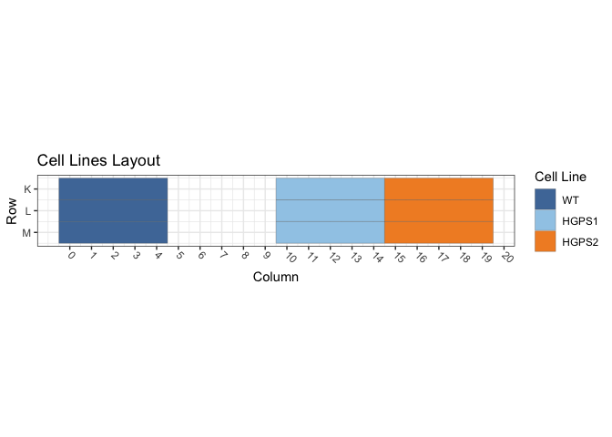
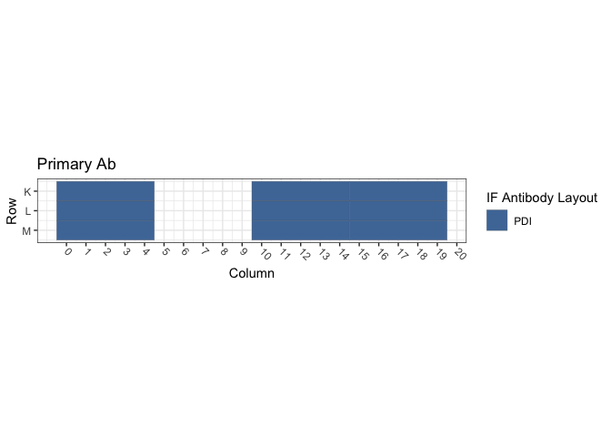
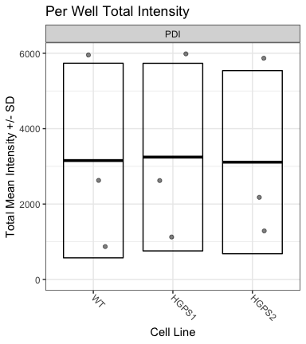
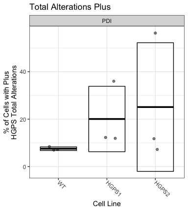

Figure S1E and S1F: hTERT-Progeria / PDI
================
Sandra Vidak/Gianluca Pegoraro
October 28th 2022

### Introduction

Columbus screen names:

`180124-40x-hFibro-PDI_20180124_105415`

`180129-40x-hFibro-GRP78-PDI-Hsp70-VCP-SUN2-LB1_20180129_123247`

`180322-40X-hFibro-NewSigmaFBS-GRP78-PDI-Hsc70_20180322_162251`

### Analysis Setup

Load required packages.

``` r
library(tidyverse)
```

    ## ── Attaching packages ─────────────────────────────────────── tidyverse 1.3.2 ──
    ## ✔ ggplot2 3.3.6      ✔ purrr   0.3.5 
    ## ✔ tibble  3.1.8      ✔ dplyr   1.0.10
    ## ✔ tidyr   1.2.1      ✔ stringr 1.4.1 
    ## ✔ readr   2.1.3      ✔ forcats 0.5.2 
    ## ── Conflicts ────────────────────────────────────────── tidyverse_conflicts() ──
    ## ✖ dplyr::filter() masks stats::filter()
    ## ✖ dplyr::lag()    masks stats::lag()

``` r
library(fs)
library(Hmisc)
```

    ## Loading required package: lattice
    ## Loading required package: survival
    ## Loading required package: Formula
    ## 
    ## Attaching package: 'Hmisc'
    ## 
    ## The following objects are masked from 'package:dplyr':
    ## 
    ##     src, summarize
    ## 
    ## The following objects are masked from 'package:base':
    ## 
    ##     format.pval, units

``` r
library(ggthemes)
library(DescTools) # for Dunnett's Test
```

    ## 
    ## Attaching package: 'DescTools'
    ## 
    ## The following objects are masked from 'package:Hmisc':
    ## 
    ##     %nin%, Label, Mean, Quantile

``` r
source("R/Plotters.R") #Functions needed for plotting
```

Set the palette and the running theme for ggplot2.

### Experimental Metadata

Read plate layouts.

``` r
cell_levs <- c("WT", 
               "HGPS1","HGPS2")

plate_layouts <- read_tsv("metadata/plate_layout.txt") %>%
  filter(!is.na(cell_line)) %>%
  separate(col = cell_line, 
           into = c("cell_line", "cell_id"), 
           remove = T) %>%
  mutate(cell_line = factor(cell_line, levels = cell_levs))

glimpse(plate_layouts)
```

    ## Rows: 9
    ## Columns: 5
    ## $ row       <dbl> 11, 12, 13, 11, 12, 13, 11, 12, 13
    ## $ column    <dbl> 2, 2, 2, 12, 12, 12, 17, 17, 17
    ## $ marker    <chr> "PDI", "PDI", "PDI", "PDI", "PDI", "PDI", "PDI", "PDI", "PDI"
    ## $ cell_line <fct> WT, WT, WT, HGPS1, HGPS1, HGPS1, HGPS2, HGPS2, HGPS2
    ## $ cell_id   <chr> "CRL1474", "CRL1474", "CRL1474", "72T", "72T", "72T", "97T",…

Plot plate layouts.

<!-- -->

<!-- -->

### Read and Process Columbus data

Recursively search the `input` directory and its subdirectories for
files whose name includes the Glob patterns defined in the chunk above,
and read the cell-level Columbus data from the results text files.

``` r
read_columbus_results <- function(path, glob) {
  dir_ls(path = path,
         recurse = T,
         glob = glob)  %>%
    read_tsv(
      id = "file_name"
    ) %>%
    select(
      screen = ScreenName,
      plate = PlateName,
      well = WellName,
      row = Row,
      column = Column,
      nuc_area = `Nuclei Selected - Nucleus Area [px²]`,
      cyto_area = `Nuclei Selected - Cytoplasm Area [px²]`,
      cell_area = `Nuclei Selected - Cell Area [px²]`,
      nuc_marker_int = `Nuclei Selected - Intensity Nucleus BP600/37 Mean`,
      cyto_marker_int = `Nuclei Selected - Intensity Cytoplasm BP600/37 Mean`,
      ratio_marker_int = `Nuclei Selected - Nuc_Cyto_BP600_Ratio`
    )
}

glob_path <- "*- Nuclei Selected[0].txt"
col_tbl <- read_columbus_results("input", glob_path)

glimpse(col_tbl)
```

    ## Rows: 37,139
    ## Columns: 11
    ## $ screen           <chr> "180322-40X-hFibro-NewSigmaFBS-GRP78-PDI-Hsc70_201803…
    ## $ plate            <chr> "Plate 2", "Plate 2", "Plate 2", "Plate 2", "Plate 2"…
    ## $ well             <chr> "B13", "B13", "B13", "B13", "B13", "B13", "B13", "B13…
    ## $ row              <dbl> 2, 2, 2, 2, 2, 2, 2, 2, 2, 2, 2, 2, 2, 2, 2, 2, 2, 2,…
    ## $ column           <dbl> 13, 13, 13, 13, 13, 13, 13, 13, 13, 13, 13, 13, 13, 1…
    ## $ nuc_area         <dbl> 1821, 3047, 2210, 1608, 2348, 2402, 1835, 1735, 3010,…
    ## $ cyto_area        <dbl> 9519, 34256, 29025, 14733, 33114, 10118, 20413, 17116…
    ## $ cell_area        <dbl> 11340, 37303, 31235, 16341, 35462, 12520, 22248, 1885…
    ## $ nuc_marker_int   <dbl> 1373.710, 960.363, 1287.340, 1962.000, 678.826, 577.6…
    ## $ cyto_marker_int  <dbl> 1152.630, 818.773, 695.591, 1121.210, 776.322, 571.88…
    ## $ ratio_marker_int <dbl> 1.191800, 1.172930, 1.850720, 1.749890, 0.874413, 1.0…

Join Columbus data with the plate layout information.

``` r
cell_tbl <- col_tbl %>%
  mutate(sum_marker_int = nuc_marker_int + cyto_marker_int) %>%
  inner_join(plate_layouts,
             by = c("row", "column")) %>%
  select(screen,
         plate,
         well,
         row,
         column,
         cell_line,
         marker,
         nuc_area:sum_marker_int)

glimpse(cell_tbl)
```

    ## Rows: 8,456
    ## Columns: 14
    ## $ screen           <chr> "180322-40X-hFibro-NewSigmaFBS-GRP78-PDI-Hsc70_201803…
    ## $ plate            <chr> "Plate 2", "Plate 2", "Plate 2", "Plate 2", "Plate 2"…
    ## $ well             <chr> "K12", "K12", "K12", "K12", "K12", "K12", "K12", "K12…
    ## $ row              <dbl> 11, 11, 11, 11, 11, 11, 11, 11, 11, 11, 11, 11, 11, 1…
    ## $ column           <dbl> 12, 12, 12, 12, 12, 12, 12, 12, 12, 12, 12, 12, 12, 1…
    ## $ cell_line        <fct> HGPS1, HGPS1, HGPS1, HGPS1, HGPS1, HGPS1, HGPS1, HGPS…
    ## $ marker           <chr> "PDI", "PDI", "PDI", "PDI", "PDI", "PDI", "PDI", "PDI…
    ## $ nuc_area         <dbl> 1036, 1675, 1566, 4734, 1945, 2394, 1858, 1538, 1864,…
    ## $ cyto_area        <dbl> 9278, 12390, 10540, 30472, 10450, 8809, 14769, 39464,…
    ## $ cell_area        <dbl> 10314, 14065, 12106, 35206, 12395, 11203, 16627, 4100…
    ## $ nuc_marker_int   <dbl> 1406.460, 696.132, 432.981, 1207.780, 595.224, 1276.7…
    ## $ cyto_marker_int  <dbl> 1634.680, 704.404, 792.604, 2133.710, 1678.950, 2073.…
    ## $ ratio_marker_int <dbl> 0.860389, 0.988256, 0.546276, 0.566047, 0.354522, 0.6…
    ## $ sum_marker_int   <dbl> 3041.140, 1400.536, 1225.585, 3341.490, 2274.174, 335…

Calculate number of cells and mean per well for all properties.

``` r
well_tbl <- cell_tbl %>%
  group_by(screen,
           well,
           row,
           column,
           cell_line,
           marker) %>%
  summarise(cell_n = n(),
            across(nuc_area:sum_marker_int,
                   list(mean = ~ mean(.x, na.rm = T))))

glimpse(well_tbl)
```

    ## Rows: 27
    ## Columns: 14
    ## Groups: screen, well, row, column, cell_line [27]
    ## $ screen                <chr> "180124-40x-hFibro-PDI_20180124_105415", "180124…
    ## $ well                  <chr> "K12", "K17", "K2", "L12", "L17", "L2", "M12", "…
    ## $ row                   <dbl> 11, 11, 11, 12, 12, 12, 13, 13, 13, 11, 11, 11, …
    ## $ column                <dbl> 12, 17, 2, 12, 17, 2, 12, 17, 2, 12, 17, 2, 12, …
    ## $ cell_line             <fct> HGPS1, HGPS2, WT, HGPS1, HGPS2, WT, HGPS1, HGPS2…
    ## $ marker                <chr> "PDI", "PDI", "PDI", "PDI", "PDI", "PDI", "PDI",…
    ## $ cell_n                <int> 235, 256, 388, 174, 221, 403, 170, 236, 367, 194…
    ## $ nuc_area_mean         <dbl> 1998.570, 1897.008, 2015.459, 1947.063, 1863.109…
    ## $ cyto_area_mean        <dbl> 15346.855, 13339.051, 13314.420, 17189.649, 1581…
    ## $ cell_area_mean        <dbl> 17345.426, 15236.059, 15329.879, 19136.713, 1768…
    ## $ nuc_marker_int_mean   <dbl> 2120.4052, 2025.2136, 2136.6441, 2228.8801, 1902…
    ## $ cyto_marker_int_mean  <dbl> 4445.6703, 4560.7479, 3475.2648, 4037.4461, 3787…
    ## $ ratio_marker_int_mean <dbl> 0.5323690, 0.4772587, 0.6609008, 0.6350600, 0.56…
    ## $ sum_marker_int_mean   <dbl> 6566.0755, 6585.9615, 5611.9089, 6266.3263, 5690…

Calculate the mean of the technical replicates for each biological
replicate. Now every marker/cell line combination has an n = 3
biological replicates.

``` r
bioreps_tbl <- well_tbl %>%
  group_by(screen,
           cell_line,
           marker) %>%
  summarise(across(cell_n:sum_marker_int_mean,
                    ~ mean(.x, na.rm = T)))

glimpse(bioreps_tbl)
```

    ## Rows: 9
    ## Columns: 11
    ## Groups: screen, cell_line [9]
    ## $ screen                <chr> "180124-40x-hFibro-PDI_20180124_105415", "180124…
    ## $ cell_line             <fct> WT, HGPS1, HGPS2, WT, HGPS1, HGPS2, WT, HGPS1, H…
    ## $ marker                <chr> "PDI", "PDI", "PDI", "PDI", "PDI", "PDI", "PDI",…
    ## $ cell_n                <dbl> 386.0000, 193.0000, 237.6667, 438.6667, 209.6667…
    ## $ nuc_area_mean         <dbl> 1994.249, 1924.150, 1870.834, 1955.582, 1935.994…
    ## $ cyto_area_mean        <dbl> 13164.674, 16120.892, 14209.014, 11967.014, 1501…
    ## $ cell_area_mean        <dbl> 15158.923, 18045.042, 16079.848, 13922.596, 1694…
    ## $ nuc_marker_int_mean   <dbl> 2325.9550, 2103.4723, 1917.5722, 293.9073, 357.2…
    ## $ cyto_marker_int_mean  <dbl> 3631.4774, 3883.1025, 3950.5177, 579.8659, 770.4…
    ## $ ratio_marker_int_mean <dbl> 0.6916311, 0.6298107, 0.5420147, 0.5229837, 0.48…
    ## $ sum_marker_int_mean   <dbl> 5957.4324, 5986.5748, 5868.0899, 873.7733, 1127.…

### Biological Replicates Level plots for Figure S1E

<!-- -->

### Threshold quantifications

Calculate the mean and standard deviation for the pooled population of
controls cells (`WT1`) and on a per biological replicate and on a per
marker basis. Set the threshold for quantification of increases or
decreases at Mean +/- 1 SD.

``` r
thresholds_tbl <- cell_tbl %>% 
  filter(cell_line == "WT") %>%
  group_by(screen, marker) %>%
  summarise(across(nuc_marker_int:sum_marker_int,
                   list(mean_neg = ~ mean(.x, na.rm = T),
                        sd_neg = ~ sd(.x, na.rm = T)))) %>%
  mutate(nuc_marker_plus_thres = nuc_marker_int_mean_neg + 1.5*(nuc_marker_int_sd_neg),
         nuc_marker_minus_thres = nuc_marker_int_mean_neg - 1.5*(nuc_marker_int_sd_neg),
         cyto_marker_plus_thres = cyto_marker_int_mean_neg + 1.5*(cyto_marker_int_sd_neg),
         cyto_marker_minus_thres = cyto_marker_int_mean_neg - 1.5*(cyto_marker_int_sd_neg),
         sum_marker_plus_thres = sum_marker_int_mean_neg + 1.5*(sum_marker_int_sd_neg),
         sum_marker_minus_thres = sum_marker_int_mean_neg - 1.5*(sum_marker_int_sd_neg))

glimpse(thresholds_tbl)
```

    ## Rows: 3
    ## Columns: 16
    ## Groups: screen [3]
    ## $ screen                    <chr> "180124-40x-hFibro-PDI_20180124_105415", "18…
    ## $ marker                    <chr> "PDI", "PDI", "PDI"
    ## $ nuc_marker_int_mean_neg   <dbl> 2319.1299, 293.6526, 950.5660
    ## $ nuc_marker_int_sd_neg     <dbl> 821.2703, 102.4263, 345.2651
    ## $ cyto_marker_int_mean_neg  <dbl> 3633.2845, 579.7235, 1683.5215
    ## $ cyto_marker_int_sd_neg    <dbl> 1300.6404, 139.3753, 451.7148
    ## $ ratio_marker_int_mean_neg <dbl> 0.6894067, 0.5225281, 0.5786975
    ## $ ratio_marker_int_sd_neg   <dbl> 0.2797826, 0.2051804, 0.1874434
    ## $ sum_marker_int_mean_neg   <dbl> 5952.4144, 873.3761, 2634.0875
    ## $ sum_marker_int_sd_neg     <dbl> 1801.1744, 200.3614, 692.4270
    ## $ nuc_marker_plus_thres     <dbl> 3551.0353, 447.2921, 1468.4637
    ## $ nuc_marker_minus_thres    <dbl> 1087.2244, 140.0131, 432.6683
    ## $ cyto_marker_plus_thres    <dbl> 5584.2451, 788.7864, 2361.0938
    ## $ cyto_marker_minus_thres   <dbl> 1682.3238, 370.6606, 1005.9492
    ## $ sum_marker_plus_thres     <dbl> 8654.176, 1173.918, 3672.728
    ## $ sum_marker_minus_thres    <dbl> 3250.653, 572.834, 1595.447

``` r
defects_tbl <- cell_tbl %>%
  left_join(thresholds_tbl, by = c("screen", "marker")) %>%
  group_by(screen, row, column, cell_line, marker) %>%
  summarise(prop_defects_cyto_plus = 100 * mean(cyto_marker_int >= cyto_marker_plus_thres, na.rm = T),
            prop_defects_cyto_minus = 100 * mean(cyto_marker_int <= cyto_marker_minus_thres, na.rm = T),
            prop_defects_nuc_plus = 100 * mean(nuc_marker_int >= nuc_marker_plus_thres, na.rm = T),
            prop_defects_nuc_minus = 100 * mean(nuc_marker_int <= nuc_marker_minus_thres, na.rm = T),
            prop_defects_sum_plus = 100 * mean(sum_marker_int >= sum_marker_plus_thres, na.rm = T),
            prop_defects_sum_minus = 100 * mean(sum_marker_int <= sum_marker_minus_thres, na.rm = T)) %>%
  arrange(screen, marker, cell_line)

glimpse(defects_tbl)
```

    ## Rows: 27
    ## Columns: 11
    ## Groups: screen, row, column, cell_line [27]
    ## $ screen                  <chr> "180124-40x-hFibro-PDI_20180124_105415", "1801…
    ## $ row                     <dbl> 11, 12, 13, 11, 12, 13, 11, 12, 13, 11, 12, 13…
    ## $ column                  <dbl> 2, 2, 2, 12, 12, 12, 17, 17, 17, 2, 2, 2, 12, …
    ## $ cell_line               <fct> WT, WT, WT, HGPS1, HGPS1, HGPS1, HGPS2, HGPS2,…
    ## $ marker                  <chr> "PDI", "PDI", "PDI", "PDI", "PDI", "PDI", "PDI…
    ## $ prop_defects_cyto_plus  <dbl> 8.505155, 8.436725, 8.174387, 23.404255, 17.81…
    ## $ prop_defects_cyto_minus <dbl> 3.0927835, 2.2332506, 0.5449591, 0.4255319, 4.…
    ## $ prop_defects_nuc_plus   <dbl> 5.670103, 5.955335, 13.351499, 7.234043, 6.896…
    ## $ prop_defects_nuc_minus  <dbl> 1.2886598, 0.4962779, 0.2724796, 2.9787234, 0.…
    ## $ prop_defects_sum_plus   <dbl> 6.958763, 8.436725, 9.809264, 14.893617, 13.79…
    ## $ prop_defects_sum_minus  <dbl> 4.3814433, 1.2406948, 0.2724796, 1.2765957, 2.…

``` r
bioreps_defects_tbl <- defects_tbl %>%
  group_by(screen, cell_line, marker) %>%
  summarise(across(prop_defects_cyto_plus:prop_defects_sum_minus,
                   list(mean = ~ mean(.x, na.rm = T),
                        sd = ~ sd(.x, na.rm = T))))

glimpse(bioreps_defects_tbl)
```

    ## Rows: 9
    ## Columns: 15
    ## Groups: screen, cell_line [9]
    ## $ screen                       <chr> "180124-40x-hFibro-PDI_20180124_105415", …
    ## $ cell_line                    <fct> WT, HGPS1, HGPS2, WT, HGPS1, HGPS2, WT, H…
    ## $ marker                       <chr> "PDI", "PDI", "PDI", "PDI", "PDI", "PDI",…
    ## $ prop_defects_cyto_plus_mean  <dbl> 8.372089, 16.093057, 16.497433, 8.162948,…
    ## $ prop_defects_cyto_plus_sd    <dbl> 0.174600, 8.307823, 8.594256, 1.593661, 1…
    ## $ prop_defects_cyto_minus_mean <dbl> 1.9569978, 6.7769578, 4.5206728, 4.861595…
    ## $ prop_defects_cyto_minus_sd   <dbl> 1.2961825, 8.0880522, 3.0848352, 2.033467…
    ## $ prop_defects_nuc_plus_mean   <dbl> 8.325646, 7.063139, 5.264475, 7.465698, 1…
    ## $ prop_defects_nuc_plus_sd     <dbl> 4.3548523, 0.1687868, 1.5368145, 0.778666…
    ## $ prop_defects_nuc_minus_mean  <dbl> 0.6858058, 4.9144764, 9.9182521, 0.827558…
    ## $ prop_defects_nuc_minus_sd    <dbl> 0.5339440, 6.1165702, 3.6876406, 0.441131…
    ## $ prop_defects_sum_plus_mean   <dbl> 8.401584, 11.915181, 11.755239, 6.961666,…
    ## $ prop_defects_sum_plus_sd     <dbl> 1.425576, 4.241573, 7.495062, 2.547488, 9…
    ## $ prop_defects_sum_minus_mean  <dbl> 1.9648726, 6.6820115, 10.3494305, 4.02450…
    ## $ prop_defects_sum_minus_sd    <dbl> 2.1480737, 8.4925513, 6.3318851, 2.297921…

### Biological Replicates Level plots for Figure S1F

<!-- -->

### Calculate Dunnett’s test for the continuous variables.

Define a custom function to run a Dunnett post-hoc test only on the Mean
marker intensity sum (Cyto + Nucleus), using the cell line as the
predictor variable, and fixing WT1 as the negative control. The output
of the Dunnett’s test is then rearranged to a tidy table to make it work
with `dplyr`.

``` r
calc_dunnett <- function(df){
  as.data.frame(as.table(DunnettTest(sum_marker_int_mean ~ cell_line,
                          control = "WT",
                          data = df)$WT)) %>%
    pivot_wider(names_from = Var2, values_from = Freq) %>%
    rename(comparison = Var1)
}
```

Run the custom function on all the data grouped based on the IF marker
and save the data to a .csv file.

``` r
dunnett_test <- bioreps_tbl %>%
  group_by(marker) %>%
  group_modify(~ calc_dunnett(.x))

write_csv(dunnett_test, "output/dunnett_results.csv")

knitr::kable(dunnett_test, digits = 3)
```

| marker | comparison |    diff |    lwr.ci |   upr.ci |  pval |
|:-------|:-----------|--------:|----------:|---------:|------:|
| PDI    | HGPS1-WT   |  91.493 | -5760.442 | 5943.427 | 0.999 |
| PDI    | HGPS2-WT   | -43.372 | -5895.307 | 5808.562 | 1.000 |

### Chi-square test for counts/proportion of Cells with defects

Calculate the number of cells with defects and normal on a per well
basis. Each treatment has 12 wells (4 technical replicates X 3
biological replicates)

``` r
defects_counts <- cell_tbl %>%
  left_join(thresholds_tbl, by = c("screen", "marker")) %>%
  group_by(screen, row, column, cell_line, marker) %>%
  summarise(n_cells = n(),
            cyto_plus_def = sum(cyto_marker_int >= cyto_marker_plus_thres, na.rm = T),
            cyto_minus_def = sum(cyto_marker_int <= cyto_marker_minus_thres, na.rm = T),
            nuc_plus_def = sum(nuc_marker_int >= nuc_marker_plus_thres, na.rm = T),
            nuc_minus_def = sum(nuc_marker_int <= nuc_marker_minus_thres, na.rm = T),
            sum_plus_def = sum(sum_marker_int >= sum_marker_plus_thres, na.rm = T),
            sum_minus_def = sum(sum_marker_int <= sum_marker_minus_thres, na.rm = T)) %>%
  mutate(across(cyto_plus_def:sum_minus_def,
                list(norm = ~ n_cells - .x))) %>%
  rename_with( ~ gsub("def_norm", "norm", .x, fixed = TRUE)) %>%
  arrange(screen, marker, cell_line)

defects_counts
```

    ## # A tibble: 27 × 18
    ## # Groups:   screen, row, column, cell_line [27]
    ##    screen      row column cell_…¹ marker n_cells cyto_…² cyto_…³ nuc_p…⁴ nuc_m…⁵
    ##    <chr>     <dbl>  <dbl> <fct>   <chr>    <int>   <int>   <int>   <int>   <int>
    ##  1 180124-4…    11      2 WT      PDI        388      33      12      22       5
    ##  2 180124-4…    12      2 WT      PDI        403      34       9      24       2
    ##  3 180124-4…    13      2 WT      PDI        367      30       2      49       1
    ##  4 180124-4…    11     12 HGPS1   PDI        235      55       1      17       7
    ##  5 180124-4…    12     12 HGPS1   PDI        174      31       7      12       0
    ##  6 180124-4…    13     12 HGPS1   PDI        170      12      27      12      20
    ##  7 180124-4…    11     17 HGPS2   PDI        256      67       6      18      23
    ##  8 180124-4…    12     17 HGPS2   PDI        221      30       7      10      15
    ##  9 180124-4…    13     17 HGPS2   PDI        236      23      19      10      33
    ## 10 180129-4…    11      2 WT      PDI        423      37      26      34       3
    ## # … with 17 more rows, 8 more variables: sum_plus_def <int>,
    ## #   sum_minus_def <int>, cyto_plus_norm <int>, cyto_minus_norm <int>,
    ## #   nuc_plus_norm <int>, nuc_minus_norm <int>, sum_plus_norm <int>,
    ## #   sum_minus_norm <int>, and abbreviated variable names ¹​cell_line,
    ## #   ²​cyto_plus_def, ³​cyto_minus_def, ⁴​nuc_plus_def, ⁵​nuc_minus_def

Summarize the counts by taking the mean of all 12 wells per condition,
then pivot the table longer to put in a format that can be handled by
xtabs downstream.

``` r
defects_counts_long <- defects_counts %>%
  select(-n_cells) %>%
  group_by(marker, cell_line) %>%
  summarise(across(cyto_plus_def:sum_minus_norm, # Take the mean of all the wells in all the technical and biological replicates
              ~ mean(.x, na.rm = TRUE))) %>% 
  pivot_longer(cols = cyto_plus_def:sum_minus_norm,
               names_pattern = "(.*_.*)_(.*)",
               names_to = c("type", "quality"),
               values_to = "count")

defects_counts_long
```

    ## # A tibble: 36 × 5
    ## # Groups:   marker [1]
    ##    marker cell_line type       quality  count
    ##    <chr>  <fct>     <chr>      <chr>    <dbl>
    ##  1 PDI    WT        cyto_plus  def      38.1 
    ##  2 PDI    WT        cyto_minus def      24.4 
    ##  3 PDI    WT        nuc_plus   def      38.4 
    ##  4 PDI    WT        nuc_minus  def       6.56
    ##  5 PDI    WT        sum_plus   def      37.6 
    ##  6 PDI    WT        sum_minus  def      21.9 
    ##  7 PDI    WT        cyto_plus  norm    465.  
    ##  8 PDI    WT        cyto_minus norm    479.  
    ##  9 PDI    WT        nuc_plus   norm    465.  
    ## 10 PDI    WT        nuc_minus  norm    497   
    ## # … with 26 more rows

Define a function that calculate a contingency table of counts based on
the cell line and the cell class (normal/defects). The table is then
used to calculate the chi-square test to determine whether any of the 6
cell lines is different from the others in terms of proportion of
defects.

``` r
calc_chi <- function(df){
    xtabs_tbl <- xtabs(count ~ cell_line + quality, data = df)
    broom::tidy(chisq.test(xtabs_tbl))
}
```

Apply the function on a per IF marker and on a per defect category to
calculate the p-values on a per IF marker and defect type basis.

``` r
chi_square_test <- defects_counts_long %>%
  group_by(marker, type) %>%
  group_modify(~ calc_chi(.x))

write_csv(chi_square_test, "output/chi_square_results.csv")

knitr::kable(chi_square_test, digits = 3)
```

| marker | type       | statistic | p.value | parameter | method                     |
|:-------|:-----------|----------:|--------:|----------:|:---------------------------|
| PDI    | cyto_minus |     5.178 |   0.075 |         2 | Pearson’s Chi-squared test |
| PDI    | cyto_plus  |    71.562 |   0.000 |         2 | Pearson’s Chi-squared test |
| PDI    | nuc_minus  |    17.859 |   0.000 |         2 | Pearson’s Chi-squared test |
| PDI    | nuc_plus   |     5.768 |   0.056 |         2 | Pearson’s Chi-squared test |
| PDI    | sum_minus  |     9.678 |   0.008 |         2 | Pearson’s Chi-squared test |
| PDI    | sum_plus   |    52.209 |   0.000 |         2 | Pearson’s Chi-squared test |

Document the information about the analysis session

``` r
sessionInfo()
```

    ## R version 4.2.1 (2022-06-23)
    ## Platform: x86_64-apple-darwin17.0 (64-bit)
    ## Running under: macOS Big Sur ... 10.16
    ## 
    ## Matrix products: default
    ## BLAS:   /Library/Frameworks/R.framework/Versions/4.2/Resources/lib/libRblas.0.dylib
    ## LAPACK: /Library/Frameworks/R.framework/Versions/4.2/Resources/lib/libRlapack.dylib
    ## 
    ## locale:
    ## [1] en_US.UTF-8/en_US.UTF-8/en_US.UTF-8/C/en_US.UTF-8/en_US.UTF-8
    ## 
    ## attached base packages:
    ## [1] stats     graphics  grDevices utils     datasets  methods   base     
    ## 
    ## other attached packages:
    ##  [1] DescTools_0.99.47 ggthemes_4.2.4    Hmisc_4.7-1       Formula_1.2-4    
    ##  [5] survival_3.4-0    lattice_0.20-45   fs_1.5.2          forcats_0.5.2    
    ##  [9] stringr_1.4.1     dplyr_1.0.10      purrr_0.3.5       readr_2.1.3      
    ## [13] tidyr_1.2.1       tibble_3.1.8      ggplot2_3.3.6     tidyverse_1.3.2  
    ## 
    ## loaded via a namespace (and not attached):
    ##  [1] bit64_4.0.5         lubridate_1.8.0     RColorBrewer_1.1-3 
    ##  [4] httr_1.4.4          tools_4.2.1         backports_1.4.1    
    ##  [7] utf8_1.2.2          R6_2.5.1            rpart_4.1.19       
    ## [10] DBI_1.1.3           colorspace_2.0-3    nnet_7.3-18        
    ## [13] withr_2.5.0         Exact_3.2           tidyselect_1.2.0   
    ## [16] gridExtra_2.3       bit_4.0.4           compiler_4.2.1     
    ## [19] cli_3.4.1           rvest_1.0.3         htmlTable_2.4.1    
    ## [22] expm_0.999-6        xml2_1.3.3          labeling_0.4.2     
    ## [25] scales_1.2.1        checkmate_2.1.0     mvtnorm_1.1-3      
    ## [28] proxy_0.4-27        digest_0.6.30       foreign_0.8-83     
    ## [31] rmarkdown_2.17      base64enc_0.1-3     jpeg_0.1-9         
    ## [34] pkgconfig_2.0.3     htmltools_0.5.3     highr_0.9          
    ## [37] dbplyr_2.2.1        fastmap_1.1.0       htmlwidgets_1.5.4  
    ## [40] rlang_1.0.6         readxl_1.4.1        rstudioapi_0.14    
    ## [43] farver_2.1.1        generics_0.1.3      jsonlite_1.8.3     
    ## [46] vroom_1.6.0         googlesheets4_1.0.1 magrittr_2.0.3     
    ## [49] interp_1.1-3        Matrix_1.5-1        Rcpp_1.0.9         
    ## [52] munsell_0.5.0       fansi_1.0.3         lifecycle_1.0.3    
    ## [55] stringi_1.7.8       yaml_2.3.6          rootSolve_1.8.2.3  
    ## [58] MASS_7.3-58.1       grid_4.2.1          parallel_4.2.1     
    ## [61] crayon_1.5.2        lmom_2.9            deldir_1.0-6       
    ## [64] haven_2.5.1         splines_4.2.1       hms_1.1.2          
    ## [67] knitr_1.40          pillar_1.8.1        boot_1.3-28        
    ## [70] gld_2.6.6           reprex_2.0.2        glue_1.6.2         
    ## [73] evaluate_0.17       latticeExtra_0.6-30 data.table_1.14.4  
    ## [76] modelr_0.1.9        png_0.1-7           vctrs_0.5.0        
    ## [79] tzdb_0.3.0          cellranger_1.1.0    gtable_0.3.1       
    ## [82] assertthat_0.2.1    xfun_0.34           broom_1.0.1        
    ## [85] e1071_1.7-12        class_7.3-20        googledrive_2.0.0  
    ## [88] gargle_1.2.1        cluster_2.1.4       ellipsis_0.3.2
