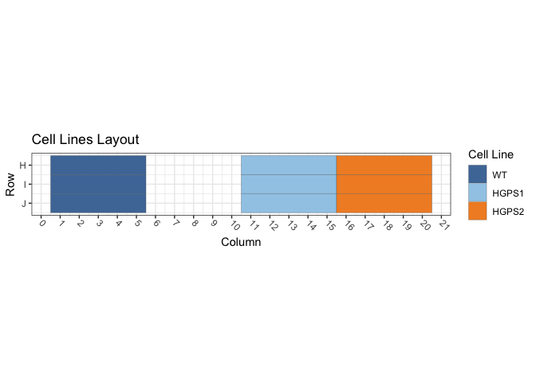
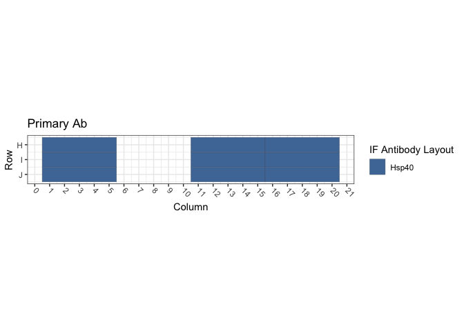
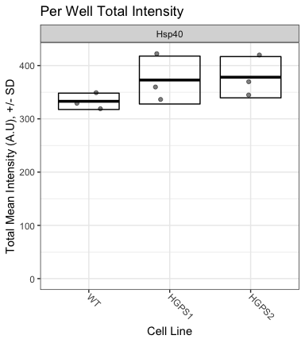

Figure S1F: TetON Cells / Hsp40
================
Sandra Vidak/Gianluca Pegoraro
March 13th 2023

### Introduction

Columbus screen names:

`180124-40x-hFibro-Calnexin-Hsp40_20180124_111314`

`180322-40X-hFibro-NewSigmaFBS-GRP94-Calnexin-Hsp40-Hsp90-SUN1-LAP2_20180322_163721`

`180424-hFibro-Calnexin-Hsp70-Hsp40-Hsp90-LAP2_20180424_122230`

### Analysis Setup

Load required packages.

``` r
library(tidyverse)
```

    ## ── Attaching packages ─────────────────────────────────────── tidyverse 1.3.2 ──
    ## ✔ ggplot2 3.3.6      ✔ purrr   0.3.5 
    ## ✔ tibble  3.1.8      ✔ dplyr   1.0.10
    ## ✔ tidyr   1.2.1      ✔ stringr 1.4.1 
    ## ✔ readr   2.1.3      ✔ forcats 0.5.2 
    ## ── Conflicts ────────────────────────────────────────── tidyverse_conflicts() ──
    ## ✖ dplyr::filter() masks stats::filter()
    ## ✖ dplyr::lag()    masks stats::lag()

``` r
library(fs)
library(Hmisc)
```

    ## Loading required package: lattice
    ## Loading required package: survival
    ## Loading required package: Formula
    ## 
    ## Attaching package: 'Hmisc'
    ## 
    ## The following objects are masked from 'package:dplyr':
    ## 
    ##     src, summarize
    ## 
    ## The following objects are masked from 'package:base':
    ## 
    ##     format.pval, units

``` r
library(ggthemes)
library(DescTools) # for Dunnett's Test
```

    ## 
    ## Attaching package: 'DescTools'
    ## 
    ## The following objects are masked from 'package:Hmisc':
    ## 
    ##     %nin%, Label, Mean, Quantile

``` r
library(curl)
```

    ## Using libcurl 7.86.0 with LibreSSL/3.3.6
    ## 
    ## Attaching package: 'curl'
    ## 
    ## The following object is masked from 'package:readr':
    ## 
    ##     parse_date

``` r
source("R/Plotters.R") #Functions needed for plotting
```

Set the palette and the running theme for ggplot2.

### Experimental Metadata

Read plate layouts.

``` r
cell_levs <- c("WT", "HGPS1", "HGPS2")

plate_layouts <- read_tsv("metadata/plate_layout.txt") %>%
  filter(!is.na(cell_line)) %>%
  separate(col = cell_line, 
           into = c("cell_line"), 
           remove = T) %>%
  mutate(cell_line = factor(cell_line, levels = cell_levs))

glimpse(plate_layouts)
```

    ## Rows: 9
    ## Columns: 4
    ## $ row       <dbl> 8, 9, 10, 8, 9, 10, 8, 9, 10
    ## $ column    <dbl> 3, 3, 3, 13, 13, 13, 18, 18, 18
    ## $ marker    <chr> "Hsp40", "Hsp40", "Hsp40", "Hsp40", "Hsp40", "Hsp40", "Hsp40…
    ## $ cell_line <fct> WT, WT, WT, HGPS1, HGPS1, HGPS1, HGPS2, HGPS2, HGPS2

Plot plate layouts.

<!-- -->

<!-- -->

### Download the data if needed

Download and unzip the Columbus results of the experiments from Figshare
if they have not been already downloaded.

``` r
if(!dir.exists("input")) {
  URL <- "https://figshare.com/ndownloader/files/38159235"
  curl_download(URL, "input.zip")
  unzip("input.zip")
}
```

### Read and Process Columbus data

Recursively search the `input` directory and its subdirectories for
files whose name includes the Glob patterns defined in the chunk above,
and read the cell-level Columbus data from the results text files.

``` r
read_columbus_results <- function(path, glob) {
  dir_ls(path = path,
         recurse = T,
         glob = glob)  %>%
    read_tsv(
      id = "file_name"
    ) %>%
    select(
      screen = ScreenName,
      plate = PlateName,
      well = WellName,
      row = Row,
      column = Column,
      nuc_area = `Nuclei Selected - Nucleus Area [px²]`,
      cyto_area = `Nuclei Selected - Cytoplasm Area [px²]`,
      cell_area = `Nuclei Selected - Cell Area [px²]`,
      nuc_marker_int = `Nuclei Selected - Intensity Nucleus BP600/37 Mean`,
      cyto_marker_int = `Nuclei Selected - Intensity Cytoplasm BP600/37 Mean`,
      ratio_marker_int = `Nuclei Selected - Nuc_Cyto_BP600_Ratio`
    )
}

glob_path <- "*- Nuclei Selected[0].txt"
col_tbl <- read_columbus_results("input", glob_path)

glimpse(col_tbl)
```

    ## Rows: 56,468
    ## Columns: 11
    ## $ screen           <chr> "180124-40x-hFibro-Calnexin-Hsp40_20180124_111314", "…
    ## $ plate            <chr> "Plate 1", "Plate 1", "Plate 1", "Plate 1", "Plate 1"…
    ## $ well             <chr> "H12", "H12", "H12", "H12", "H12", "H12", "H12", "H12…
    ## $ row              <dbl> 8, 8, 8, 8, 8, 8, 8, 8, 8, 8, 8, 8, 8, 8, 8, 8, 8, 8,…
    ## $ column           <dbl> 12, 12, 12, 12, 12, 12, 12, 12, 12, 12, 12, 12, 12, 1…
    ## $ nuc_area         <dbl> 2428, 1963, 3589, 1997, 1923, 1795, 1917, 2051, 1615,…
    ## $ cyto_area        <dbl> 20616, 24881, 51470, 34591, 23428, 11275, 18951, 1811…
    ## $ cell_area        <dbl> 23044, 26844, 55059, 36588, 25351, 13070, 20868, 2016…
    ## $ nuc_marker_int   <dbl> 474.080, 388.022, 246.502, 430.434, 248.587, 373.912,…
    ## $ cyto_marker_int  <dbl> 142.9370, 86.7191, 114.7830, 110.3320, 82.5212, 134.3…
    ## $ ratio_marker_int <dbl> 3.31671, 4.47447, 2.14755, 3.90126, 3.01240, 2.78301,…

Join Columbus data with the plate layout information.

``` r
cell_tbl <- col_tbl %>%
  mutate(sum_marker_int = nuc_marker_int + cyto_marker_int) %>%
  inner_join(plate_layouts,
             by = c("row", "column")) %>%
  select(screen,
         plate,
         well,
         row,
         column,
         cell_line,
         marker,
         nuc_area:sum_marker_int)

glimpse(cell_tbl)
```

    ## Rows: 9,182
    ## Columns: 14
    ## $ screen           <chr> "180124-40x-hFibro-Calnexin-Hsp40_20180124_111314", "…
    ## $ plate            <chr> "Plate 1", "Plate 1", "Plate 1", "Plate 1", "Plate 1"…
    ## $ well             <chr> "H13", "H13", "H13", "H13", "H13", "H13", "H13", "H13…
    ## $ row              <dbl> 8, 8, 8, 8, 8, 8, 8, 8, 8, 8, 8, 8, 8, 8, 8, 8, 8, 8,…
    ## $ column           <dbl> 13, 13, 13, 13, 13, 13, 13, 13, 13, 13, 13, 13, 13, 1…
    ## $ cell_line        <fct> HGPS1, HGPS1, HGPS1, HGPS1, HGPS1, HGPS1, HGPS1, HGPS…
    ## $ marker           <chr> "Hsp40", "Hsp40", "Hsp40", "Hsp40", "Hsp40", "Hsp40",…
    ## $ nuc_area         <dbl> 1684, 2174, 2427, 1579, 1570, 1612, 2180, 1042, 1359,…
    ## $ cyto_area        <dbl> 15961, 17642, 13185, 10210, 10571, 10235, 19341, 7619…
    ## $ cell_area        <dbl> 17645, 19816, 15612, 11789, 12141, 11847, 21521, 8661…
    ## $ nuc_marker_int   <dbl> 370.088, 346.010, 330.337, 302.978, 295.322, 305.071,…
    ## $ cyto_marker_int  <dbl> 132.1640, 135.3670, 146.5960, 143.9400, 127.6060, 113…
    ## $ ratio_marker_int <dbl> 2.80022, 2.55608, 2.25338, 2.10489, 2.31433, 2.67694,…
    ## $ sum_marker_int   <dbl> 502.2520, 481.3770, 476.9330, 446.9180, 422.9280, 419…

Calculate number of cells and mean per well for all properties.

``` r
well_tbl <- cell_tbl %>%
  group_by(screen,
           well,
           row,
           column,
           cell_line,
           marker) %>%
  summarise(cell_n = n(),
            across(nuc_area:sum_marker_int,
                   list(mean = ~ mean(.x, na.rm = T))))

glimpse(well_tbl)
```

    ## Rows: 27
    ## Columns: 14
    ## Groups: screen, well, row, column, cell_line [27]
    ## $ screen                <chr> "180124-40x-hFibro-Calnexin-Hsp40_20180124_11131…
    ## $ well                  <chr> "H13", "H18", "H3", "I13", "I18", "I3", "J13", "…
    ## $ row                   <dbl> 8, 8, 8, 9, 9, 9, 10, 10, 10, 8, 8, 8, 9, 9, 9, …
    ## $ column                <dbl> 13, 18, 3, 13, 18, 3, 13, 18, 3, 13, 18, 3, 13, …
    ## $ cell_line             <fct> HGPS1, HGPS2, WT, HGPS1, HGPS2, WT, HGPS1, HGPS2…
    ## $ marker                <chr> "Hsp40", "Hsp40", "Hsp40", "Hsp40", "Hsp40", "Hs…
    ## $ cell_n                <int> 188, 247, 380, 259, 313, 251, 147, 298, 390, 257…
    ## $ nuc_area_mean         <dbl> 1971.782, 1871.105, 1980.484, 1980.093, 1878.160…
    ## $ cyto_area_mean        <dbl> 18138.239, 13551.968, 13609.079, 14576.452, 1282…
    ## $ cell_area_mean        <dbl> 20110.02, 15423.07, 15589.56, 16556.54, 14705.77…
    ## $ nuc_marker_int_mean   <dbl> 293.2182, 303.6931, 268.5941, 255.9172, 245.5028…
    ## $ cyto_marker_int_mean  <dbl> 97.94958, 99.02000, 87.76891, 86.95729, 76.98948…
    ## $ ratio_marker_int_mean <dbl> 3.196601, 3.322013, 3.236310, 3.126333, 3.513365…
    ## $ sum_marker_int_mean   <dbl> 391.1678, 402.7131, 356.3631, 342.8745, 322.4923…

Calculate the mean of the technical replicates for each biological
replicate. Now every marker/cell line combination has an n = 3
biological replicates.

``` r
bioreps_tbl <- well_tbl %>%
  group_by(screen,
           cell_line,
           marker) %>%
  summarise(across(cell_n:sum_marker_int_mean,
                    ~ mean(.x, na.rm = T)))

glimpse(bioreps_tbl)
```

    ## Rows: 9
    ## Columns: 11
    ## Groups: screen, cell_line [9]
    ## $ screen                <chr> "180124-40x-hFibro-Calnexin-Hsp40_20180124_11131…
    ## $ cell_line             <fct> WT, HGPS1, HGPS2, WT, HGPS1, HGPS2, WT, HGPS1, H…
    ## $ marker                <chr> "Hsp40", "Hsp40", "Hsp40", "Hsp40", "Hsp40", "Hs…
    ## $ cell_n                <dbl> 340.3333, 198.0000, 286.0000, 636.0000, 251.0000…
    ## $ nuc_area_mean         <dbl> 2033.026, 1983.083, 1874.422, 1908.422, 1980.126…
    ## $ cyto_area_mean        <dbl> 15101.623, 17240.224, 12858.523, 8837.135, 15221…
    ## $ cell_area_mean        <dbl> 17134.65, 19223.31, 14732.94, 10745.56, 17201.67…
    ## $ nuc_marker_int_mean   <dbl> 252.1373, 270.6036, 259.9066, 226.8094, 280.0127…
    ## $ cyto_marker_int_mean  <dbl> 78.01525, 89.54816, 84.37868, 122.65751, 142.822…
    ## $ ratio_marker_int_mean <dbl> 3.449006, 3.228226, 3.362845, 1.880914, 2.157693…
    ## $ sum_marker_int_mean   <dbl> 330.1525, 360.1517, 344.2853, 349.4669, 422.8348…

### Biological Replicates Level plots For Figure S1F

<!-- -->

### Calculate Dunnett’s test for the continuous variables.

Define a custom function to run a Dunnett post-hoc test only on the Mean
marker intensity sum (Cyto + Nucleus), using the cell line as the
predictor variable, and fixing WT as the negative control. The output of
the Dunnett’s test is then rearranged to a tidy table to make it work
with `dplyr`.

``` r
calc_dunnett <- function(df){
  as.data.frame(as.table(DunnettTest(ratio_marker_int_mean ~ cell_line,
                          control = "WT",
                          data = df)$WT)) %>%
    pivot_wider(names_from = Var2, values_from = Freq) %>%
    rename(comparison = Var1)
}
```

Run the custom function on all the data grouped based on the IF marker
and save the data to a .csv file.

``` r
dunnett_test <- bioreps_tbl %>%
  group_by(marker) %>%
  group_modify(~ calc_dunnett(.x))

write_csv(dunnett_test, "output/dunnett_results.csv")

knitr::kable(dunnett_test, digits = 3)
```

| marker | comparison |  diff | lwr.ci | upr.ci |  pval |
|:-------|:-----------|------:|-------:|-------:|------:|
| Hsp40  | HGPS1-WT   | 0.289 | -1.439 |  2.016 | 0.852 |
| Hsp40  | HGPS2-WT   | 0.856 | -0.872 |  2.584 | 0.330 |

Document the information about the analysis session

``` r
sessionInfo()
```

    ## R version 4.2.2 (2022-10-31)
    ## Platform: x86_64-apple-darwin17.0 (64-bit)
    ## Running under: macOS Big Sur ... 10.16
    ## 
    ## Matrix products: default
    ## BLAS:   /Library/Frameworks/R.framework/Versions/4.2/Resources/lib/libRblas.0.dylib
    ## LAPACK: /Library/Frameworks/R.framework/Versions/4.2/Resources/lib/libRlapack.dylib
    ## 
    ## locale:
    ## [1] en_US.UTF-8/en_US.UTF-8/en_US.UTF-8/C/en_US.UTF-8/en_US.UTF-8
    ## 
    ## attached base packages:
    ## [1] stats     graphics  grDevices utils     datasets  methods   base     
    ## 
    ## other attached packages:
    ##  [1] curl_4.3.3        DescTools_0.99.47 ggthemes_4.2.4    Hmisc_4.7-1      
    ##  [5] Formula_1.2-4     survival_3.5-3    lattice_0.20-45   fs_1.5.2         
    ##  [9] forcats_0.5.2     stringr_1.4.1     dplyr_1.0.10      purrr_0.3.5      
    ## [13] readr_2.1.3       tidyr_1.2.1       tibble_3.1.8      ggplot2_3.3.6    
    ## [17] tidyverse_1.3.2  
    ## 
    ## loaded via a namespace (and not attached):
    ##  [1] bit64_4.0.5         lubridate_1.8.0     RColorBrewer_1.1-3 
    ##  [4] httr_1.4.4          tools_4.2.2         backports_1.4.1    
    ##  [7] utf8_1.2.2          R6_2.5.1            rpart_4.1.19       
    ## [10] DBI_1.1.3           colorspace_2.0-3    nnet_7.3-18        
    ## [13] withr_2.5.0         Exact_3.2           tidyselect_1.2.0   
    ## [16] gridExtra_2.3       bit_4.0.4           compiler_4.2.2     
    ## [19] cli_3.4.1           rvest_1.0.3         htmlTable_2.4.1    
    ## [22] expm_0.999-6        xml2_1.3.3          labeling_0.4.2     
    ## [25] scales_1.2.1        checkmate_2.1.0     mvtnorm_1.1-3      
    ## [28] proxy_0.4-27        digest_0.6.30       foreign_0.8-84     
    ## [31] rmarkdown_2.17      base64enc_0.1-3     jpeg_0.1-9         
    ## [34] pkgconfig_2.0.3     htmltools_0.5.3     highr_0.9          
    ## [37] dbplyr_2.2.1        fastmap_1.1.0       htmlwidgets_1.5.4  
    ## [40] rlang_1.0.6         readxl_1.4.1        rstudioapi_0.14    
    ## [43] farver_2.1.1        generics_0.1.3      jsonlite_1.8.3     
    ## [46] vroom_1.6.0         googlesheets4_1.0.1 magrittr_2.0.3     
    ## [49] interp_1.1-3        Matrix_1.5-3        Rcpp_1.0.9         
    ## [52] munsell_0.5.0       fansi_1.0.3         lifecycle_1.0.3    
    ## [55] stringi_1.7.8       yaml_2.3.6          rootSolve_1.8.2.3  
    ## [58] MASS_7.3-58.3       grid_4.2.2          parallel_4.2.2     
    ## [61] crayon_1.5.2        lmom_2.9            deldir_1.0-6       
    ## [64] haven_2.5.1         splines_4.2.2       hms_1.1.2          
    ## [67] knitr_1.40          pillar_1.8.1        boot_1.3-28.1      
    ## [70] gld_2.6.6           reprex_2.0.2        glue_1.6.2         
    ## [73] evaluate_0.17       latticeExtra_0.6-30 data.table_1.14.4  
    ## [76] modelr_0.1.9        png_0.1-7           vctrs_0.5.0        
    ## [79] tzdb_0.3.0          cellranger_1.1.0    gtable_0.3.1       
    ## [82] assertthat_0.2.1    xfun_0.34           broom_1.0.1        
    ## [85] e1071_1.7-12        class_7.3-21        googledrive_2.0.0  
    ## [88] gargle_1.2.1        cluster_2.1.4       ellipsis_0.3.2
