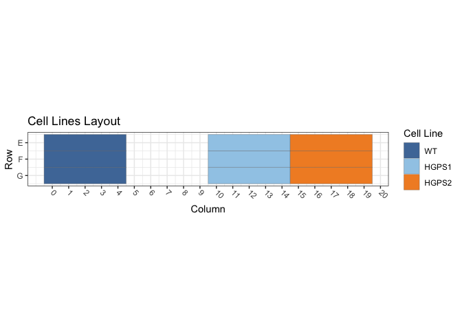
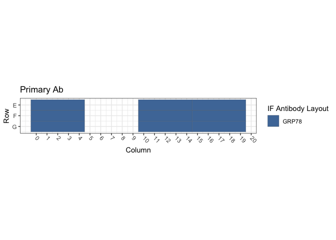
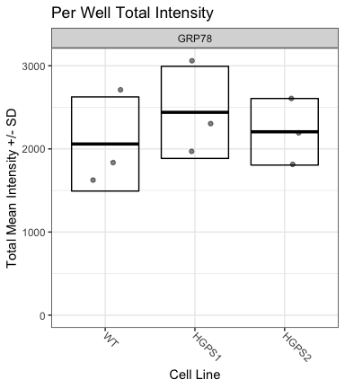
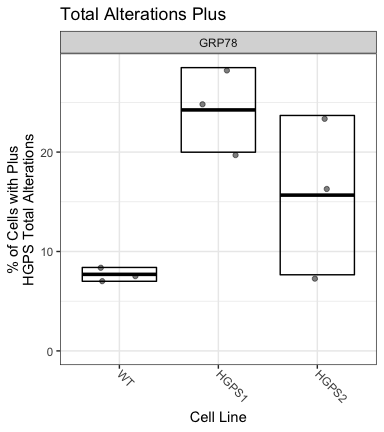

Figure S1H and S2A: hTERT-Progeria / GRP94
================
Sandra Vidak/Gianluca Pegoraro
March 13th 2023

### Introduction

Columbus screen names:

`180124-40x-hFibro-GRP78-Hsp70-VCP-LB1_20180124_103723`

`180129-40x-hFibro-GRP78-PDI-Hsp70-VCP-SUN2-LB1_20180129_123247`

`180322-40X-hFibro-NewSigmaFBS-GRP78-PDI-Hsc70_20180322_162251`

### Analysis Setup

Load required packages.

``` r
library(tidyverse)
```

    ## ── Attaching packages ─────────────────────────────────────── tidyverse 1.3.2 ──
    ## ✔ ggplot2 3.3.6      ✔ purrr   0.3.5 
    ## ✔ tibble  3.1.8      ✔ dplyr   1.0.10
    ## ✔ tidyr   1.2.1      ✔ stringr 1.4.1 
    ## ✔ readr   2.1.3      ✔ forcats 0.5.2 
    ## ── Conflicts ────────────────────────────────────────── tidyverse_conflicts() ──
    ## ✖ dplyr::filter() masks stats::filter()
    ## ✖ dplyr::lag()    masks stats::lag()

``` r
library(fs)
library(Hmisc)
```

    ## Loading required package: lattice
    ## Loading required package: survival
    ## Loading required package: Formula
    ## 
    ## Attaching package: 'Hmisc'
    ## 
    ## The following objects are masked from 'package:dplyr':
    ## 
    ##     src, summarize
    ## 
    ## The following objects are masked from 'package:base':
    ## 
    ##     format.pval, units

``` r
library(ggthemes)
library(DescTools) # for Dunnett's Test
```

    ## 
    ## Attaching package: 'DescTools'
    ## 
    ## The following objects are masked from 'package:Hmisc':
    ## 
    ##     %nin%, Label, Mean, Quantile

``` r
library(curl)
```

    ## Using libcurl 7.86.0 with LibreSSL/3.3.6
    ## 
    ## Attaching package: 'curl'
    ## 
    ## The following object is masked from 'package:readr':
    ## 
    ##     parse_date

``` r
source("R/Plotters.R") #Functions needed for plotting
```

Set the palette and the running theme for ggplot2.

### Experimental Metadata

Read plate layouts.

``` r
cell_levs <- c("WT", 
               "HGPS1","HGPS2")

plate_layouts <- read_tsv("metadata/plate_layout.txt") %>%
  filter(!is.na(cell_line)) %>%
  separate(col = cell_line, 
           into = c("cell_line", "cell_id"), 
           remove = T) %>%
  mutate(cell_line = factor(cell_line, levels = cell_levs))

glimpse(plate_layouts)
```

    ## Rows: 9
    ## Columns: 5
    ## $ row       <dbl> 5, 6, 7, 5, 6, 7, 5, 6, 7
    ## $ column    <dbl> 2, 2, 2, 12, 12, 12, 17, 17, 17
    ## $ marker    <chr> "GRP78", "GRP78", "GRP78", "GRP78", "GRP78", "GRP78", "GRP78…
    ## $ cell_line <fct> WT, WT, WT, HGPS1, HGPS1, HGPS1, HGPS2, HGPS2, HGPS2
    ## $ cell_id   <chr> "CRL1474", "CRL1474", "CRL1474", "72T", "72T", "72T", "97T",…

Plot plate layouts.

<!-- -->

<!-- -->

### Download the data if needed

Download and unzip the Columbus results of the experiments from Figshare
if they have not been already downloaded.

``` r
if(!dir.exists("input")) {
  URL <- "https://figshare.com/ndownloader/files/38669189"
  curl_download(URL, "input.zip")
  unzip("input.zip")
}
```

### Read and Process Columbus data

Recursively search the `input` directory and its subdirectories for
files whose name includes the Glob patterns defined in the chunk above,
and read the cell-level Columbus data from the results text files.

``` r
read_columbus_results <- function(path, glob) {
  dir_ls(path = path,
         recurse = T,
         glob = glob)  %>%
    read_tsv(
      id = "file_name"
    ) %>%
    select(
      screen = ScreenName,
      plate = PlateName,
      well = WellName,
      row = Row,
      column = Column,
      nuc_area = `Nuclei Selected - Nucleus Area [px²]`,
      cyto_area = `Nuclei Selected - Cytoplasm Area [px²]`,
      cell_area = `Nuclei Selected - Cell Area [px²]`,
      nuc_marker_int = `Nuclei Selected - Intensity Nucleus BP600/37 Mean`,
      cyto_marker_int = `Nuclei Selected - Intensity Cytoplasm BP600/37 Mean`,
      ratio_marker_int = `Nuclei Selected - Nuc_Cyto_BP600_Ratio`
    )
}

glob_path <- "*- Nuclei Selected[0].txt"
col_tbl <- read_columbus_results("input", glob_path)

glimpse(col_tbl)
```

    ## Rows: 57,189
    ## Columns: 11
    ## $ screen           <chr> "180124-40x-hFibro-GRP78-Hsp70-VCP-LB1_20180124_10372…
    ## $ plate            <chr> "Plate 1", "Plate 1", "Plate 1", "Plate 1", "Plate 1"…
    ## $ well             <chr> "E10", "E10", "E10", "E10", "E10", "E10", "E10", "E10…
    ## $ row              <dbl> 5, 5, 5, 5, 5, 5, 5, 5, 5, 5, 5, 5, 5, 5, 5, 5, 5, 5,…
    ## $ column           <dbl> 10, 10, 10, 10, 10, 10, 10, 10, 10, 10, 10, 10, 10, 1…
    ## $ nuc_area         <dbl> 1927, 2348, 2105, 1903, 2564, 1930, 2147, 2199, 1766,…
    ## $ cyto_area        <dbl> 21034, 17566, 16791, 11746, 19266, 14811, 12355, 1726…
    ## $ cell_area        <dbl> 22961, 19914, 18896, 13649, 21830, 16741, 14502, 1946…
    ## $ nuc_marker_int   <dbl> 2274.00, 3013.32, 1964.57, 2219.92, 1987.17, 2190.40,…
    ## $ cyto_marker_int  <dbl> 65.8860, 86.3199, 73.1411, 81.6587, 118.2300, 82.4876…
    ## $ ratio_marker_int <dbl> 34.5141, 34.9088, 26.8600, 27.1854, 16.8076, 26.5543,…

Join Columbus data with the plate layout information.

``` r
cell_tbl <- col_tbl %>%
  mutate(sum_marker_int = nuc_marker_int + cyto_marker_int) %>%
  inner_join(plate_layouts,
             by = c("row", "column")) %>%
  select(screen,
         plate,
         well,
         row,
         column,
         cell_line,
         marker,
         nuc_area:sum_marker_int)

glimpse(cell_tbl)
```

    ## Rows: 10,229
    ## Columns: 14
    ## $ screen           <chr> "180124-40x-hFibro-GRP78-Hsp70-VCP-LB1_20180124_10372…
    ## $ plate            <chr> "Plate 1", "Plate 1", "Plate 1", "Plate 1", "Plate 1"…
    ## $ well             <chr> "E12", "E12", "E12", "E12", "E12", "E12", "E12", "E12…
    ## $ row              <dbl> 5, 5, 5, 5, 5, 5, 5, 5, 5, 5, 5, 5, 5, 5, 5, 5, 5, 5,…
    ## $ column           <dbl> 12, 12, 12, 12, 12, 12, 12, 12, 12, 12, 12, 12, 12, 1…
    ## $ cell_line        <fct> HGPS1, HGPS1, HGPS1, HGPS1, HGPS1, HGPS1, HGPS1, HGPS…
    ## $ marker           <chr> "GRP78", "GRP78", "GRP78", "GRP78", "GRP78", "GRP78",…
    ## $ nuc_area         <dbl> 1603, 808, 1968, 1528, 1456, 1301, 1450, 2611, 1582, …
    ## $ cyto_area        <dbl> 6299, 13207, 31779, 7625, 8554, 4642, 6219, 18086, 14…
    ## $ cell_area        <dbl> 7902, 14015, 33747, 9153, 10010, 5943, 7669, 20697, 1…
    ## $ nuc_marker_int   <dbl> 1099.990, 1556.080, 835.932, 1050.890, 1303.870, 1373…
    ## $ cyto_marker_int  <dbl> 1748.980, 660.089, 915.562, 1078.410, 1783.500, 1729.…
    ## $ ratio_marker_int <dbl> 0.628930, 2.357380, 0.913027, 0.974477, 0.731074, 0.7…
    ## $ sum_marker_int   <dbl> 2848.970, 2216.169, 1751.494, 2129.300, 3087.370, 310…

Calculate number of cells and mean per well for all properties.

``` r
well_tbl <- cell_tbl %>%
  group_by(screen,
           well,
           row,
           column,
           cell_line,
           marker) %>%
  summarise(cell_n = n(),
            across(nuc_area:sum_marker_int,
                   list(mean = ~ mean(.x, na.rm = T))))

glimpse(well_tbl)
```

    ## Rows: 27
    ## Columns: 14
    ## Groups: screen, well, row, column, cell_line [27]
    ## $ screen                <chr> "180124-40x-hFibro-GRP78-Hsp70-VCP-LB1_20180124_…
    ## $ well                  <chr> "E12", "E17", "E2", "F12", "F17", "F2", "G12", "…
    ## $ row                   <dbl> 5, 5, 5, 6, 6, 6, 7, 7, 7, 5, 5, 5, 6, 6, 6, 7, …
    ## $ column                <dbl> 12, 17, 2, 12, 17, 2, 12, 17, 2, 12, 17, 2, 12, …
    ## $ cell_line             <fct> HGPS1, HGPS2, WT, HGPS1, HGPS2, WT, HGPS1, HGPS2…
    ## $ marker                <chr> "GRP78", "GRP78", "GRP78", "GRP78", "GRP78", "GR…
    ## $ cell_n                <int> 220, 490, 786, 368, 392, 738, 368, 422, 512, 185…
    ## $ nuc_area_mean         <dbl> 1829.200, 1829.331, 1974.344, 1872.429, 1910.704…
    ## $ cyto_area_mean        <dbl> 18568.800, 13551.673, 13359.280, 17224.647, 1584…
    ## $ cell_area_mean        <dbl> 20398.00, 15381.00, 15333.62, 19097.08, 17758.36…
    ## $ nuc_marker_int_mean   <dbl> 1301.9701, 943.2098, 899.0737, 1016.8105, 960.29…
    ## $ cyto_marker_int_mean  <dbl> 1258.3100, 1243.1930, 1030.3817, 1212.2936, 1265…
    ## $ ratio_marker_int_mean <dbl> 1.1140557, 0.8178803, 0.9257595, 0.9123203, 0.82…
    ## $ sum_marker_int_mean   <dbl> 2560.280, 2186.403, 1929.455, 2229.104, 2225.436…

Calculate the mean of the technical replicates for each biological
replicate. Now every marker/cell line combination has an n = 3
biological replicates.

``` r
bioreps_tbl <- well_tbl %>%
  group_by(screen,
           cell_line,
           marker) %>%
  summarise(across(cell_n:sum_marker_int_mean,
                    ~ mean(.x, na.rm = T)))

glimpse(bioreps_tbl)
```

    ## Rows: 9
    ## Columns: 11
    ## Groups: screen, cell_line [9]
    ## $ screen                <chr> "180124-40x-hFibro-GRP78-Hsp70-VCP-LB1_20180124_…
    ## $ cell_line             <fct> WT, HGPS1, HGPS2, WT, HGPS1, HGPS2, WT, HGPS1, H…
    ## $ marker                <chr> "GRP78", "GRP78", "GRP78", "GRP78", "GRP78", "GR…
    ## $ cell_n                <dbl> 678.6667, 318.6667, 434.6667, 384.6667, 203.0000…
    ## $ nuc_area_mean         <dbl> 2002.675, 1877.188, 1885.171, 1994.823, 1895.178…
    ## $ cyto_area_mean        <dbl> 15103.304, 17312.616, 14556.829, 13327.300, 1457…
    ## $ cell_area_mean        <dbl> 17105.98, 19189.80, 16442.00, 15322.12, 16467.92…
    ## $ nuc_marker_int_mean   <dbl> 884.4763, 1085.7579, 954.4313, 671.7754, 749.825…
    ## $ cyto_marker_int_mean  <dbl> 964.6577, 1229.5348, 1249.1906, 956.0107, 1208.6…
    ## $ ratio_marker_int_mean <dbl> 0.9764679, 0.9504735, 0.8216580, 0.7291495, 0.65…
    ## $ sum_marker_int_mean   <dbl> 1849.134, 2315.293, 2203.622, 1627.786, 1958.505…

### Biological Replicates Level plots for Figure S1H

<!-- -->

### Threshold quantifications

Calculate the mean and standard deviation for the pooled population of
controls cells (`WT1`) and on a per biological replicate and on a per
marker basis. Set the threshold for quantification of increases or
decreases at Mean +/- 1 SD.

``` r
thresholds_tbl <- cell_tbl %>% 
  filter(cell_line == "WT") %>%
  group_by(screen, marker) %>%
  summarise(across(nuc_marker_int:sum_marker_int,
                   list(mean_neg = ~ mean(.x, na.rm = T),
                        sd_neg = ~ sd(.x, na.rm = T)))) %>%
  mutate(nuc_marker_plus_thres = nuc_marker_int_mean_neg + 1.5*(nuc_marker_int_sd_neg),
         nuc_marker_minus_thres = nuc_marker_int_mean_neg - 1.5*(nuc_marker_int_sd_neg),
         cyto_marker_plus_thres = cyto_marker_int_mean_neg + 1.5*(cyto_marker_int_sd_neg),
         cyto_marker_minus_thres = cyto_marker_int_mean_neg - 1.5*(cyto_marker_int_sd_neg),
         sum_marker_plus_thres = sum_marker_int_mean_neg + 1.5*(sum_marker_int_sd_neg),
         sum_marker_minus_thres = sum_marker_int_mean_neg - 1.5*(sum_marker_int_sd_neg))

glimpse(thresholds_tbl)
```

    ## Rows: 3
    ## Columns: 16
    ## Groups: screen [3]
    ## $ screen                    <chr> "180124-40x-hFibro-GRP78-Hsp70-VCP-LB1_20180…
    ## $ marker                    <chr> "GRP78", "GRP78", "GRP78"
    ## $ nuc_marker_int_mean_neg   <dbl> 882.4239, 671.3775, 1121.2714
    ## $ nuc_marker_int_sd_neg     <dbl> 266.3886, 217.5995, 293.5410
    ## $ cyto_marker_int_mean_neg  <dbl> 972.7976, 956.0226, 1577.6204
    ## $ cyto_marker_int_sd_neg    <dbl> 317.7767, 289.7115, 347.5397
    ## $ ratio_marker_int_mean_neg <dbl> 0.9660210, 0.7287435, 0.7233442
    ## $ ratio_marker_int_sd_neg   <dbl> 0.3284024, 0.2168712, 0.1709559
    ## $ sum_marker_int_mean_neg   <dbl> 1855.222, 1627.400, 2698.892
    ## $ sum_marker_int_sd_neg     <dbl> 494.5196, 445.4961, 565.1685
    ## $ nuc_marker_plus_thres     <dbl> 1282.0067, 997.7767, 1561.5830
    ## $ nuc_marker_minus_thres    <dbl> 482.8410, 344.9783, 680.9598
    ## $ cyto_marker_plus_thres    <dbl> 1449.463, 1390.590, 2098.930
    ## $ cyto_marker_minus_thres   <dbl> 496.1326, 521.4552, 1056.3108
    ## $ sum_marker_plus_thres     <dbl> 2597.001, 2295.644, 3546.645
    ## $ sum_marker_minus_thres    <dbl> 1113.4420, 959.1559, 1851.1390

``` r
defects_tbl <- cell_tbl %>%
  left_join(thresholds_tbl, by = c("screen", "marker")) %>%
  group_by(screen, row, column, cell_line, marker) %>%
  summarise(prop_defects_cyto_plus = 100 * mean(cyto_marker_int >= cyto_marker_plus_thres, na.rm = T),
            prop_defects_cyto_minus = 100 * mean(cyto_marker_int <= cyto_marker_minus_thres, na.rm = T),
            prop_defects_nuc_plus = 100 * mean(nuc_marker_int >= nuc_marker_plus_thres, na.rm = T),
            prop_defects_nuc_minus = 100 * mean(nuc_marker_int <= nuc_marker_minus_thres, na.rm = T),
            prop_defects_sum_plus = 100 * mean(sum_marker_int >= sum_marker_plus_thres, na.rm = T),
            prop_defects_sum_minus = 100 * mean(sum_marker_int <= sum_marker_minus_thres, na.rm = T)) %>%
  arrange(screen, marker, cell_line)

glimpse(defects_tbl)
```

    ## Rows: 27
    ## Columns: 11
    ## Groups: screen, row, column, cell_line [27]
    ## $ screen                  <chr> "180124-40x-hFibro-GRP78-Hsp70-VCP-LB1_2018012…
    ## $ row                     <dbl> 5, 6, 7, 5, 6, 7, 5, 6, 7, 5, 6, 7, 5, 6, 7, 5…
    ## $ column                  <dbl> 2, 2, 2, 12, 12, 12, 17, 17, 17, 2, 2, 2, 12, …
    ## $ cell_line               <fct> WT, WT, WT, HGPS1, HGPS1, HGPS1, HGPS2, HGPS2,…
    ## $ marker                  <chr> "GRP78", "GRP78", "GRP78", "GRP78", "GRP78", "…
    ## $ prop_defects_cyto_plus  <dbl> 7.633588, 7.317073, 5.859375, 30.000000, 25.54…
    ## $ prop_defects_cyto_minus <dbl> 0.5089059, 4.6070461, 4.2968750, 0.0000000, 0.…
    ## $ prop_defects_nuc_plus   <dbl> 5.852417, 7.046070, 9.765625, 39.090909, 15.21…
    ## $ prop_defects_nuc_minus  <dbl> 0.0000000, 4.3360434, 3.1250000, 0.0000000, 0.…
    ## $ prop_defects_sum_plus   <dbl> 7.124682, 7.046070, 7.031250, 42.727273, 24.45…
    ## $ prop_defects_sum_minus  <dbl> 0.5089059, 5.6910569, 5.4687500, 0.0000000, 1.…

``` r
bioreps_defects_tbl <- defects_tbl %>%
  group_by(screen, cell_line, marker) %>%
  summarise(across(prop_defects_cyto_plus:prop_defects_sum_minus,
                   list(mean = ~ mean(.x, na.rm = T),
                        sd = ~ sd(.x, na.rm = T))))

glimpse(bioreps_defects_tbl)
```

    ## Rows: 9
    ## Columns: 15
    ## Groups: screen, cell_line [9]
    ## $ screen                       <chr> "180124-40x-hFibro-GRP78-Hsp70-VCP-LB1_20…
    ## $ cell_line                    <fct> WT, HGPS1, HGPS2, WT, HGPS1, HGPS2, WT, H…
    ## $ marker                       <chr> "GRP78", "GRP78", "GRP78", "GRP78", "GRP7…
    ## $ prop_defects_cyto_plus_mean  <dbl> 6.936679, 25.398551, 27.576168, 7.734199,…
    ## $ prop_defects_cyto_plus_sd    <dbl> 0.9462995, 4.6755979, 1.8016669, 1.153712…
    ## $ prop_defects_cyto_minus_mean <dbl> 3.1376090, 0.3623188, 0.3280459, 3.580799…
    ## $ prop_defects_cyto_minus_sd   <dbl> 2.2818001, 0.3137773, 0.2846743, 2.902150…
    ## $ prop_defects_nuc_plus_mean   <dbl> 7.554704, 21.907115, 13.498243, 7.126335,…
    ## $ prop_defects_nuc_plus_sd     <dbl> 2.005575, 15.002678, 3.579183, 1.090632, …
    ## $ prop_defects_nuc_minus_mean  <dbl> 2.4870145, 0.5434783, 1.6840765, 1.390862…
    ## $ prop_defects_nuc_minus_sd    <dbl> 2.2373170, 0.5434783, 1.4590039, 0.188262…
    ## $ prop_defects_sum_plus_mean   <dbl> 7.067334, 28.191700, 23.338814, 8.445091,…
    ## $ prop_defects_sum_plus_sd     <dbl> 0.05021443, 13.07445940, 2.55741044, 1.17…
    ## $ prop_defects_sum_minus_mean  <dbl> 3.8895709, 0.5434783, 2.0461360, 3.755463…
    ## $ prop_defects_sum_minus_sd    <dbl> 2.9298511, 0.5434783, 1.5531233, 2.275513…

### Biological Replicates Level plots for Figure S2A

<!-- -->

### Calculate Dunnett’s test for the continuous variables.

Define a custom function to run a Dunnett post-hoc test only on the Mean
marker intensity sum (Cyto + Nucleus), using the cell line as the
predictor variable, and fixing WT1 as the negative control. The output
of the Dunnett’s test is then rearranged to a tidy table to make it work
with `dplyr`.

``` r
calc_dunnett <- function(df){
  as.data.frame(as.table(DunnettTest(sum_marker_int_mean ~ cell_line,
                          control = "WT",
                          data = df)$WT)) %>%
    pivot_wider(names_from = Var2, values_from = Freq) %>%
    rename(comparison = Var1)
}
```

Run the custom function on all the data grouped based on the IF marker
and save the data to a .csv file.

``` r
dunnett_test <- bioreps_tbl %>%
  group_by(marker) %>%
  group_modify(~ calc_dunnett(.x))

write_csv(dunnett_test, "output/dunnett_results.csv")

knitr::kable(dunnett_test, digits = 3)
```

| marker | comparison |    diff |    lwr.ci |   upr.ci |  pval |
|:-------|:-----------|--------:|----------:|---------:|------:|
| GRP78  | HGPS1-WT   | 380.679 |  -818.359 | 1579.716 | 0.591 |
| GRP78  | HGPS2-WT   | 146.730 | -1052.307 | 1345.767 | 0.916 |

### Chi-square test for counts/proportion of Cells with defects

Calculate the number of cells with defects and normal on a per well
basis. Each treatment has 12 wells (4 technical replicates X 3
biological replicates)

``` r
defects_counts <- cell_tbl %>%
  left_join(thresholds_tbl, by = c("screen", "marker")) %>%
  group_by(screen, row, column, cell_line, marker) %>%
  summarise(n_cells = n(),
            cyto_plus_def = sum(cyto_marker_int >= cyto_marker_plus_thres, na.rm = T),
            cyto_minus_def = sum(cyto_marker_int <= cyto_marker_minus_thres, na.rm = T),
            nuc_plus_def = sum(nuc_marker_int >= nuc_marker_plus_thres, na.rm = T),
            nuc_minus_def = sum(nuc_marker_int <= nuc_marker_minus_thres, na.rm = T),
            sum_plus_def = sum(sum_marker_int >= sum_marker_plus_thres, na.rm = T),
            sum_minus_def = sum(sum_marker_int <= sum_marker_minus_thres, na.rm = T)) %>%
  mutate(across(cyto_plus_def:sum_minus_def,
                list(norm = ~ n_cells - .x))) %>%
  rename_with( ~ gsub("def_norm", "norm", .x, fixed = TRUE)) %>%
  arrange(screen, marker, cell_line)

defects_counts
```

    ## # A tibble: 27 × 18
    ## # Groups:   screen, row, column, cell_line [27]
    ##    screen      row column cell_…¹ marker n_cells cyto_…² cyto_…³ nuc_p…⁴ nuc_m…⁵
    ##    <chr>     <dbl>  <dbl> <fct>   <chr>    <int>   <int>   <int>   <int>   <int>
    ##  1 180124-4…     5      2 WT      GRP78      786      60       4      46       0
    ##  2 180124-4…     6      2 WT      GRP78      738      54      34      52      32
    ##  3 180124-4…     7      2 WT      GRP78      512      30      22      50      16
    ##  4 180124-4…     5     12 HGPS1   GRP78      220      66       0      86       0
    ##  5 180124-4…     6     12 HGPS1   GRP78      368      94       2      56       2
    ##  6 180124-4…     7     12 HGPS1   GRP78      368      76       2      42       4
    ##  7 180124-4…     5     17 HGPS2   GRP78      490     128       0      60       6
    ##  8 180124-4…     6     17 HGPS2   GRP78      392     116       2      42       2
    ##  9 180124-4…     7     17 HGPS2   GRP78      422     114       2      74      14
    ## 10 180129-4…     5      2 WT      GRP78      370      27       6      31       5
    ## # … with 17 more rows, 8 more variables: sum_plus_def <int>,
    ## #   sum_minus_def <int>, cyto_plus_norm <int>, cyto_minus_norm <int>,
    ## #   nuc_plus_norm <int>, nuc_minus_norm <int>, sum_plus_norm <int>,
    ## #   sum_minus_norm <int>, and abbreviated variable names ¹​cell_line,
    ## #   ²​cyto_plus_def, ³​cyto_minus_def, ⁴​nuc_plus_def, ⁵​nuc_minus_def

Summarize the counts by taking the mean of all 12 wells per condition,
then pivot the table longer to put in a format that can be handled by
xtabs downstream.

``` r
defects_counts_long <- defects_counts %>%
  select(-n_cells) %>%
  group_by(marker, cell_line) %>%
  summarise(across(cyto_plus_def:sum_minus_norm, # Take the mean of all the wells in all the technical and biological replicates
              ~ mean(.x, na.rm = TRUE))) %>% 
  pivot_longer(cols = cyto_plus_def:sum_minus_norm,
               names_pattern = "(.*_.*)_(.*)",
               names_to = c("type", "quality"),
               values_to = "count")

defects_counts_long
```

    ## # A tibble: 36 × 5
    ## # Groups:   marker [1]
    ##    marker cell_line type       quality count
    ##    <chr>  <fct>     <chr>      <chr>   <dbl>
    ##  1 GRP78  WT        cyto_plus  def      42.2
    ##  2 GRP78  WT        cyto_minus def      22.3
    ##  3 GRP78  WT        nuc_plus   def      44  
    ##  4 GRP78  WT        nuc_minus  def      15.2
    ##  5 GRP78  WT        sum_plus   def      43.9
    ##  6 GRP78  WT        sum_minus  def      24.7
    ##  7 GRP78  WT        cyto_plus  norm    539. 
    ##  8 GRP78  WT        cyto_minus norm    558. 
    ##  9 GRP78  WT        nuc_plus   norm    537. 
    ## 10 GRP78  WT        nuc_minus  norm    566. 
    ## # … with 26 more rows

Define a function that calculate a contingency table of counts based on
the cell line and the cell class (normal/defects). The table is then
used to calculate the chi-square test to determine whether any of the 6
cell lines is different from the others in terms of proportion of
defects.

``` r
calc_chi <- function(df){
    xtabs_tbl <- xtabs(count ~ cell_line + quality, data = df)
    broom::tidy(chisq.test(xtabs_tbl))
}
```

Apply the function on a per IF marker and on a per defect category to
calculate the p-values on a per IF marker and defect type basis.

``` r
chi_square_test <- defects_counts_long %>%
  group_by(marker, type) %>%
  group_modify(~ calc_chi(.x))

write_csv(chi_square_test, "output/chi_square_results.csv")

knitr::kable(chi_square_test, digits = 3)
```

| marker | type       | statistic | p.value | parameter | method                     |
|:-------|:-----------|----------:|--------:|----------:|:---------------------------|
| GRP78  | cyto_minus |     0.298 |   0.861 |         2 | Pearson’s Chi-squared test |
| GRP78  | cyto_plus  |    55.531 |   0.000 |         2 | Pearson’s Chi-squared test |
| GRP78  | nuc_minus  |     1.493 |   0.474 |         2 | Pearson’s Chi-squared test |
| GRP78  | nuc_plus   |    20.313 |   0.000 |         2 | Pearson’s Chi-squared test |
| GRP78  | sum_minus  |     2.669 |   0.263 |         2 | Pearson’s Chi-squared test |
| GRP78  | sum_plus   |    43.046 |   0.000 |         2 | Pearson’s Chi-squared test |

Document the information about the analysis session

``` r
sessionInfo()
```

    ## R version 4.2.2 (2022-10-31)
    ## Platform: x86_64-apple-darwin17.0 (64-bit)
    ## Running under: macOS Big Sur ... 10.16
    ## 
    ## Matrix products: default
    ## BLAS:   /Library/Frameworks/R.framework/Versions/4.2/Resources/lib/libRblas.0.dylib
    ## LAPACK: /Library/Frameworks/R.framework/Versions/4.2/Resources/lib/libRlapack.dylib
    ## 
    ## locale:
    ## [1] en_US.UTF-8/en_US.UTF-8/en_US.UTF-8/C/en_US.UTF-8/en_US.UTF-8
    ## 
    ## attached base packages:
    ## [1] stats     graphics  grDevices utils     datasets  methods   base     
    ## 
    ## other attached packages:
    ##  [1] curl_4.3.3        DescTools_0.99.47 ggthemes_4.2.4    Hmisc_4.7-1      
    ##  [5] Formula_1.2-4     survival_3.5-3    lattice_0.20-45   fs_1.5.2         
    ##  [9] forcats_0.5.2     stringr_1.4.1     dplyr_1.0.10      purrr_0.3.5      
    ## [13] readr_2.1.3       tidyr_1.2.1       tibble_3.1.8      ggplot2_3.3.6    
    ## [17] tidyverse_1.3.2  
    ## 
    ## loaded via a namespace (and not attached):
    ##  [1] bit64_4.0.5         lubridate_1.8.0     RColorBrewer_1.1-3 
    ##  [4] httr_1.4.4          tools_4.2.2         backports_1.4.1    
    ##  [7] utf8_1.2.2          R6_2.5.1            rpart_4.1.19       
    ## [10] DBI_1.1.3           colorspace_2.0-3    nnet_7.3-18        
    ## [13] withr_2.5.0         Exact_3.2           tidyselect_1.2.0   
    ## [16] gridExtra_2.3       bit_4.0.4           compiler_4.2.2     
    ## [19] cli_3.4.1           rvest_1.0.3         htmlTable_2.4.1    
    ## [22] expm_0.999-6        xml2_1.3.3          labeling_0.4.2     
    ## [25] scales_1.2.1        checkmate_2.1.0     mvtnorm_1.1-3      
    ## [28] proxy_0.4-27        digest_0.6.30       foreign_0.8-84     
    ## [31] rmarkdown_2.17      base64enc_0.1-3     jpeg_0.1-9         
    ## [34] pkgconfig_2.0.3     htmltools_0.5.3     highr_0.9          
    ## [37] dbplyr_2.2.1        fastmap_1.1.0       htmlwidgets_1.5.4  
    ## [40] rlang_1.0.6         readxl_1.4.1        rstudioapi_0.14    
    ## [43] farver_2.1.1        generics_0.1.3      jsonlite_1.8.3     
    ## [46] vroom_1.6.0         googlesheets4_1.0.1 magrittr_2.0.3     
    ## [49] interp_1.1-3        Matrix_1.5-3        Rcpp_1.0.9         
    ## [52] munsell_0.5.0       fansi_1.0.3         lifecycle_1.0.3    
    ## [55] stringi_1.7.8       yaml_2.3.6          rootSolve_1.8.2.3  
    ## [58] MASS_7.3-58.3       grid_4.2.2          parallel_4.2.2     
    ## [61] crayon_1.5.2        lmom_2.9            deldir_1.0-6       
    ## [64] haven_2.5.1         splines_4.2.2       hms_1.1.2          
    ## [67] knitr_1.40          pillar_1.8.1        boot_1.3-28.1      
    ## [70] gld_2.6.6           reprex_2.0.2        glue_1.6.2         
    ## [73] evaluate_0.17       latticeExtra_0.6-30 data.table_1.14.4  
    ## [76] modelr_0.1.9        png_0.1-7           vctrs_0.5.0        
    ## [79] tzdb_0.3.0          cellranger_1.1.0    gtable_0.3.1       
    ## [82] assertthat_0.2.1    xfun_0.34           broom_1.0.1        
    ## [85] e1071_1.7-12        class_7.3-21        googledrive_2.0.0  
    ## [88] gargle_1.2.1        cluster_2.1.4       ellipsis_0.3.2
