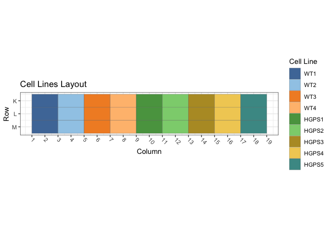
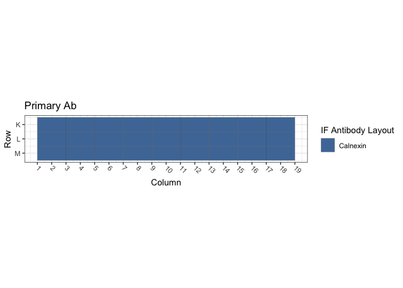
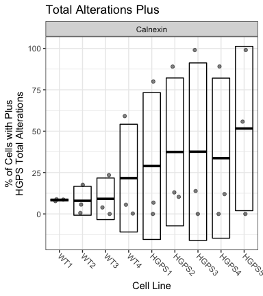

Figure S2A: Primary HGPS Fibroblasts / Calnexin
================
Sandra Vidak/Gianluca Pegoraro
October 28th 2022

### Introduction

Columbus screen names:

`220303-40x-hFibro-GRP94-GRP78-PDI_20220303_124042[8143]`

`220309-40x-hFibro-GRP94-GRP78-PDI_20220309_105421[8164]`

`220310-40x-hFibro-GRP94-GRP78-PDI_20220310_111540[8171]`

### Analysis Setup

Load required packages.

``` r
library(tidyverse)
```

    ## ── Attaching packages ─────────────────────────────────────── tidyverse 1.3.2 ──
    ## ✔ ggplot2 3.3.6      ✔ purrr   0.3.5 
    ## ✔ tibble  3.1.8      ✔ dplyr   1.0.10
    ## ✔ tidyr   1.2.1      ✔ stringr 1.4.1 
    ## ✔ readr   2.1.3      ✔ forcats 0.5.2 
    ## ── Conflicts ────────────────────────────────────────── tidyverse_conflicts() ──
    ## ✖ dplyr::filter() masks stats::filter()
    ## ✖ dplyr::lag()    masks stats::lag()

``` r
library(fs)
library(Hmisc)
```

    ## Loading required package: lattice
    ## Loading required package: survival
    ## Loading required package: Formula
    ## 
    ## Attaching package: 'Hmisc'
    ## 
    ## The following objects are masked from 'package:dplyr':
    ## 
    ##     src, summarize
    ## 
    ## The following objects are masked from 'package:base':
    ## 
    ##     format.pval, units

``` r
library(ggthemes)
library(DescTools) # for Dunnett's Test
```

    ## 
    ## Attaching package: 'DescTools'
    ## 
    ## The following objects are masked from 'package:Hmisc':
    ## 
    ##     %nin%, Label, Mean, Quantile

``` r
source("R/Plotters.R") #Functions needed for plotting
```

Set the palette and the running theme for ggplot2.

### Experimental Metadata

Read plate layouts.

``` r
cell_levs <- c("WT1", "WT2", "WT3","WT4", 
               "HGPS1","HGPS2",
               "HGPS3", "HGPS4", "HGPS5")

plate_layouts <- read_tsv("metadata/plate_layout.txt") %>%
  filter(!is.na(cell_line)) %>%
  separate(col = cell_line, 
           into = c("cell_line", "cell_id"), 
           remove = T) %>%
  mutate(cell_line = factor(cell_line, levels = cell_levs))

glimpse(plate_layouts)
```

    ## Rows: 27
    ## Columns: 5
    ## $ row       <dbl> 11, 12, 13, 11, 12, 13, 11, 12, 13, 11, 12, 13, 11, 12, 13, …
    ## $ column    <dbl> 2, 2, 2, 4, 4, 4, 6, 6, 6, 8, 8, 8, 10, 10, 10, 12, 12, 12, …
    ## $ marker    <chr> "Calnexin", "Calnexin", "Calnexin", "Calnexin", "Calnexin", …
    ## $ cell_line <fct> WT1, WT1, WT1, WT2, WT2, WT2, WT3, WT3, WT3, WT4, WT4, WT4, …
    ## $ cell_id   <chr> "GM00038", "GM00038", "GM00038", "AG08470", "AG08470", "AG08…

Plot plate layouts.

<!-- -->

<!-- -->

### Read and Process Columbus data

Recursively search the `input` directory and its subdirectories for
files whose name includes the Glob patterns defined in the chunk above,
and read the cell-level Columbus data from the results text files.

``` r
read_columbus_results <- function(path, glob) {
  dir_ls(path = path,
         recurse = T,
         glob = glob)  %>%
    read_tsv(
      id = "file_name"
    ) %>%
    select(
      screen = ScreenName,
      plate = PlateName,
      well = WellName,
      row = Row,
      column = Column,
      nuc_area = `Nuclei Selected - Nucleus Area [px²]`,
      cyto_area = `Nuclei Selected - Cytoplasm Area [px²]`,
      cell_area = `Nuclei Selected - Cell Area [px²]`,
      nuc_marker_int = `Nuclei Selected - Intensity Nucleus BP600/37 Mean`,
      cyto_marker_int = `Nuclei Selected - Intensity Cytoplasm BP600/37 Mean`,
      ratio_marker_int = `Nuclei Selected - Nuc_Cyto_BP600_Ratio`
    )
}

glob_path <- "*- Nuclei Selected[0].txt"
col_tbl <- read_columbus_results("input", glob_path)

glimpse(col_tbl)
```

    ## Rows: 11,536
    ## Columns: 11
    ## $ screen           <chr> "220303-40x-hFibro-Calnexin_20220303_134615", "220303…
    ## $ plate            <chr> "Plate1", "Plate1", "Plate1", "Plate1", "Plate1", "Pl…
    ## $ well             <chr> "K10", "K10", "K10", "K10", "K10", "K10", "K10", "K10…
    ## $ row              <dbl> 11, 11, 11, 11, 11, 11, 11, 11, 11, 11, 11, 11, 11, 1…
    ## $ column           <dbl> 10, 10, 10, 10, 10, 10, 10, 10, 10, 10, 10, 10, 10, 1…
    ## $ nuc_area         <dbl> 2136, 2044, 1847, 1763, 2794, 2144, 2048, 2209, 2102,…
    ## $ cyto_area        <dbl> 14541, 22931, 11092, 9101, 30708, 29192, 25754, 19737…
    ## $ cell_area        <dbl> 16677, 24975, 12939, 10864, 33502, 31336, 27802, 2194…
    ## $ nuc_marker_int   <dbl> 878.258, 824.398, 662.235, 708.744, 631.606, 451.501,…
    ## $ cyto_marker_int  <dbl> 375.528, 299.401, 377.220, 390.753, 395.298, 292.397,…
    ## $ ratio_marker_int <dbl> 2.33873, 2.75349, 1.75557, 1.81379, 1.59780, 1.54414,…

Join Columbus data with the plate layout information.

``` r
cell_tbl <- col_tbl %>%
  mutate(sum_marker_int = nuc_marker_int + cyto_marker_int) %>%
  inner_join(plate_layouts,
             by = c("row", "column")) %>%
  select(screen,
         plate,
         well,
         row,
         column,
         cell_line,
         marker,
         nuc_area:sum_marker_int)

glimpse(cell_tbl)
```

    ## Rows: 11,536
    ## Columns: 14
    ## $ screen           <chr> "220303-40x-hFibro-Calnexin_20220303_134615", "220303…
    ## $ plate            <chr> "Plate1", "Plate1", "Plate1", "Plate1", "Plate1", "Pl…
    ## $ well             <chr> "K10", "K10", "K10", "K10", "K10", "K10", "K10", "K10…
    ## $ row              <dbl> 11, 11, 11, 11, 11, 11, 11, 11, 11, 11, 11, 11, 11, 1…
    ## $ column           <dbl> 10, 10, 10, 10, 10, 10, 10, 10, 10, 10, 10, 10, 10, 1…
    ## $ cell_line        <fct> HGPS1, HGPS1, HGPS1, HGPS1, HGPS1, HGPS1, HGPS1, HGPS…
    ## $ marker           <chr> "Calnexin", "Calnexin", "Calnexin", "Calnexin", "Caln…
    ## $ nuc_area         <dbl> 2136, 2044, 1847, 1763, 2794, 2144, 2048, 2209, 2102,…
    ## $ cyto_area        <dbl> 14541, 22931, 11092, 9101, 30708, 29192, 25754, 19737…
    ## $ cell_area        <dbl> 16677, 24975, 12939, 10864, 33502, 31336, 27802, 2194…
    ## $ nuc_marker_int   <dbl> 878.258, 824.398, 662.235, 708.744, 631.606, 451.501,…
    ## $ cyto_marker_int  <dbl> 375.528, 299.401, 377.220, 390.753, 395.298, 292.397,…
    ## $ ratio_marker_int <dbl> 2.33873, 2.75349, 1.75557, 1.81379, 1.59780, 1.54414,…
    ## $ sum_marker_int   <dbl> 1253.786, 1123.799, 1039.455, 1099.497, 1026.904, 743…

Calculate number of cells and mean per well for all properties.

``` r
well_tbl <- cell_tbl %>%
  group_by(screen,
           well,
           row,
           column,
           cell_line,
           marker) %>%
  summarise(cell_n = n(),
            across(nuc_area:sum_marker_int,
                   list(mean = ~ mean(.x, na.rm = T))))

glimpse(well_tbl)
```

    ## Rows: 81
    ## Columns: 14
    ## Groups: screen, well, row, column, cell_line [81]
    ## $ screen                <chr> "220303-40x-hFibro-Calnexin_20220303_134615", "2…
    ## $ well                  <chr> "K10", "K12", "K14", "K16", "K18", "K2", "K4", "…
    ## $ row                   <dbl> 11, 11, 11, 11, 11, 11, 11, 11, 11, 12, 12, 12, …
    ## $ column                <dbl> 10, 12, 14, 16, 18, 2, 4, 6, 8, 10, 12, 14, 16, …
    ## $ cell_line             <fct> HGPS1, HGPS2, HGPS3, HGPS4, HGPS5, WT1, WT2, WT3…
    ## $ marker                <chr> "Calnexin", "Calnexin", "Calnexin", "Calnexin", …
    ## $ cell_n                <int> 135, 242, 76, 44, 52, 132, 173, 177, 307, 43, 21…
    ## $ nuc_area_mean         <dbl> 2332.844, 2076.616, 2176.474, 2360.114, 2896.712…
    ## $ cyto_area_mean        <dbl> 20971.64, 15602.14, 29010.59, 34153.95, 37067.15…
    ## $ cell_area_mean        <dbl> 23304.48, 17678.75, 31187.07, 36514.07, 39963.87…
    ## $ nuc_marker_int_mean   <dbl> 502.5247, 557.4312, 766.5176, 667.5910, 963.6747…
    ## $ cyto_marker_int_mean  <dbl> 317.8878, 423.5829, 522.7459, 514.3636, 804.5918…
    ## $ ratio_marker_int_mean <dbl> 1.654260, 1.366991, 1.523159, 1.425455, 1.259654…
    ## $ sum_marker_int_mean   <dbl> 820.4125, 981.0141, 1289.2635, 1181.9546, 1768.2…

Calculate the mean of the technical replicates for each biological
replicate. Now every marker/cell line combination has an n = 3
biological replicates.

``` r
bioreps_tbl <- well_tbl %>%
  group_by(screen,
           cell_line,
           marker) %>%
  summarise(across(cell_n:sum_marker_int_mean,
                    ~ mean(.x, na.rm = T)))

glimpse(bioreps_tbl)
```

    ## Rows: 27
    ## Columns: 11
    ## Groups: screen, cell_line [27]
    ## $ screen                <chr> "220303-40x-hFibro-Calnexin_20220303_134615", "2…
    ## $ cell_line             <fct> WT1, WT2, WT3, WT4, HGPS1, HGPS2, HGPS3, HGPS4, …
    ## $ marker                <chr> "Calnexin", "Calnexin", "Calnexin", "Calnexin", …
    ## $ cell_n                <dbl> 152.33333, 149.00000, 191.00000, 326.66667, 69.6…
    ## $ nuc_area_mean         <dbl> 2503.254, 2257.979, 2333.909, 2286.012, 2233.651…
    ## $ cyto_area_mean        <dbl> 21998.97, 20898.91, 18339.86, 14401.38, 23852.85…
    ## $ cell_area_mean        <dbl> 24502.22, 23156.89, 20673.77, 16687.39, 26086.50…
    ## $ nuc_marker_int_mean   <dbl> 311.5450, 338.1032, 341.3869, 414.7951, 493.3056…
    ## $ cyto_marker_int_mean  <dbl> 191.6012, 196.3119, 225.0277, 280.0040, 280.5395…
    ## $ ratio_marker_int_mean <dbl> 1.671049, 1.769497, 1.560688, 1.518912, 1.847279…
    ## $ sum_marker_int_mean   <dbl> 503.1462, 534.4150, 566.4146, 694.7991, 779.0459…

### Threshold quantifications

Calculate the mean and standard deviation for the pooled population of
controls cells (`WT1`) and on a per biological replicate and on a per
marker basis. Set the threshold for quantification of increases or
decreases at Mean +/- 1 SD.

``` r
thresholds_tbl <- cell_tbl %>% 
  filter(cell_line == "WT1") %>%
  group_by(screen, marker) %>%
  summarise(across(nuc_marker_int:sum_marker_int,
                   list(mean_neg = ~ mean(.x, na.rm = T),
                        sd_neg = ~ sd(.x, na.rm = T)))) %>%
  mutate(nuc_marker_plus_thres = nuc_marker_int_mean_neg + 1.5*(nuc_marker_int_sd_neg),
         nuc_marker_minus_thres = nuc_marker_int_mean_neg - 1.5*(nuc_marker_int_sd_neg),
         cyto_marker_plus_thres = cyto_marker_int_mean_neg + 1.5*(cyto_marker_int_sd_neg),
         cyto_marker_minus_thres = cyto_marker_int_mean_neg - 1.5*(cyto_marker_int_sd_neg),
         sum_marker_plus_thres = sum_marker_int_mean_neg + 1.5*(sum_marker_int_sd_neg),
         sum_marker_minus_thres = sum_marker_int_mean_neg - 1.5*(sum_marker_int_sd_neg))

glimpse(thresholds_tbl)
```

    ## Rows: 3
    ## Columns: 16
    ## Groups: screen [3]
    ## $ screen                    <chr> "220303-40x-hFibro-Calnexin_20220303_134615"…
    ## $ marker                    <chr> "Calnexin", "Calnexin", "Calnexin"
    ## $ nuc_marker_int_mean_neg   <dbl> 313.2648, 372.7980, 728.6148
    ## $ nuc_marker_int_sd_neg     <dbl> 68.36480, 85.31009, 202.12861
    ## $ cyto_marker_int_mean_neg  <dbl> 191.7151, 241.1552, 576.1220
    ## $ cyto_marker_int_sd_neg    <dbl> 40.43081, 84.32740, 195.48468
    ## $ ratio_marker_int_mean_neg <dbl> 1.679258, 1.634346, 1.339390
    ## $ ratio_marker_int_sd_neg   <dbl> 0.4525961, 0.3272438, 0.3816610
    ## $ sum_marker_int_mean_neg   <dbl> 504.9799, 614.3377, 1304.7368
    ## $ sum_marker_int_sd_neg     <dbl> 92.43436, 162.83928, 360.50514
    ## $ nuc_marker_plus_thres     <dbl> 415.8120, 500.7632, 1031.8078
    ## $ nuc_marker_minus_thres    <dbl> 210.7176, 244.8329, 425.4219
    ## $ cyto_marker_plus_thres    <dbl> 252.3613, 367.6463, 869.3490
    ## $ cyto_marker_minus_thres   <dbl> 131.0689, 114.6641, 282.8950
    ## $ sum_marker_plus_thres     <dbl> 643.6315, 858.5967, 1845.4945
    ## $ sum_marker_minus_thres    <dbl> 366.3284, 370.0788, 763.9791

``` r
defects_tbl <- cell_tbl %>%
  left_join(thresholds_tbl, by = c("screen", "marker")) %>%
  group_by(screen, row, column, cell_line, marker) %>%
  summarise(prop_defects_cyto_plus = 100 * mean(cyto_marker_int >= cyto_marker_plus_thres, na.rm = T),
            prop_defects_cyto_minus = 100 * mean(cyto_marker_int <= cyto_marker_minus_thres, na.rm = T),
            prop_defects_nuc_plus = 100 * mean(nuc_marker_int >= nuc_marker_plus_thres, na.rm = T),
            prop_defects_nuc_minus = 100 * mean(nuc_marker_int <= nuc_marker_minus_thres, na.rm = T),
            prop_defects_sum_plus = 100 * mean(sum_marker_int >= sum_marker_plus_thres, na.rm = T),
            prop_defects_sum_minus = 100 * mean(sum_marker_int <= sum_marker_minus_thres, na.rm = T)) %>%
  arrange(screen, marker, cell_line)

glimpse(defects_tbl)
```

    ## Rows: 81
    ## Columns: 11
    ## Groups: screen, row, column, cell_line [81]
    ## $ screen                  <chr> "220303-40x-hFibro-Calnexin_20220303_134615", …
    ## $ row                     <dbl> 11, 12, 13, 11, 12, 13, 11, 12, 13, 11, 12, 13…
    ## $ column                  <dbl> 2, 2, 2, 4, 4, 4, 6, 6, 6, 8, 8, 8, 10, 10, 10…
    ## $ cell_line               <fct> WT1, WT1, WT1, WT2, WT2, WT2, WT3, WT3, WT3, W…
    ## $ marker                  <chr> "Calnexin", "Calnexin", "Calnexin", "Calnexin"…
    ## $ prop_defects_cyto_plus  <dbl> 7.575758, 7.100592, 8.333333, 29.479769, 4.761…
    ## $ prop_defects_cyto_minus <dbl> 3.7878788, 3.5502959, 4.4871795, 6.9364162, 8.…
    ## $ prop_defects_nuc_plus   <dbl> 0.000000, 5.325444, 16.666667, 19.075145, 11.1…
    ## $ prop_defects_nuc_minus  <dbl> 2.2727273, 0.5917160, 1.2820513, 3.4682081, 2.…
    ## $ prop_defects_sum_plus   <dbl> 1.515152, 7.100592, 17.307692, 27.167630, 8.73…
    ## $ prop_defects_sum_minus  <dbl> 6.0606061, 1.1834320, 3.8461538, 6.9364162, 7.…

``` r
bioreps_defects_tbl <- defects_tbl %>%
  group_by(screen, cell_line, marker) %>%
  summarise(across(prop_defects_cyto_plus:prop_defects_sum_minus,
                   list(mean = ~ mean(.x, na.rm = T),
                        sd = ~ sd(.x, na.rm = T))))

glimpse(bioreps_defects_tbl)
```

    ## Rows: 27
    ## Columns: 15
    ## Groups: screen, cell_line [27]
    ## $ screen                       <chr> "220303-40x-hFibro-Calnexin_20220303_1346…
    ## $ cell_line                    <fct> WT1, WT2, WT3, WT4, HGPS1, HGPS2, HGPS3, …
    ## $ marker                       <chr> "Calnexin", "Calnexin", "Calnexin", "Caln…
    ## $ prop_defects_cyto_plus_mean  <dbl> 7.6698942, 14.3418191, 27.9597967, 60.173…
    ## $ prop_defects_cyto_plus_sd    <dbl> 0.6217389, 13.2631828, 3.3539510, 7.22381…
    ## $ prop_defects_cyto_minus_mean <dbl> 3.9417847, 6.3483178, 1.5686804, 1.092016…
    ## $ prop_defects_cyto_minus_sd   <dbl> 0.4870349, 2.7239279, 0.4870625, 1.153718…
    ## $ prop_defects_nuc_plus_mean   <dbl> 7.3307035, 15.6927158, 13.5494128, 43.451…
    ## $ prop_defects_nuc_plus_sd     <dbl> 8.5123583, 4.1152126, 2.8174852, 8.699211…
    ## $ prop_defects_nuc_minus_mean  <dbl> 1.3821648, 1.9497202, 1.5220655, 1.948071…
    ## $ prop_defects_nuc_minus_sd    <dbl> 0.8449656, 1.7738624, 1.2756605, 2.549305…
    ## $ prop_defects_sum_plus_mean   <dbl> 8.6411452, 17.5965602, 23.4643681, 59.113…
    ## $ prop_defects_sum_plus_sd     <dbl> 8.0081874, 9.2389126, 2.3150029, 8.474192…
    ## $ prop_defects_sum_minus_mean  <dbl> 3.696731, 5.633317, 1.875406, 2.248220, 0…
    ## $ prop_defects_sum_minus_sd    <dbl> 2.4420181, 3.1629166, 1.3778187, 2.801356…

### Biological Replicates Level plots for Figure S2A

<!-- -->

### Chi-square test for counts/proportion of Cells with defects

Calculate the number of cells with defects and normal on a per well
basis. Each treatment has 12 wells (4 technical replicates X 3
biological replicates)

``` r
defects_counts <- cell_tbl %>%
  left_join(thresholds_tbl, by = c("screen", "marker")) %>%
  group_by(screen, row, column, cell_line, marker) %>%
  summarise(n_cells = n(),
            cyto_plus_def = sum(cyto_marker_int >= cyto_marker_plus_thres, na.rm = T),
            cyto_minus_def = sum(cyto_marker_int <= cyto_marker_minus_thres, na.rm = T),
            nuc_plus_def = sum(nuc_marker_int >= nuc_marker_plus_thres, na.rm = T),
            nuc_minus_def = sum(nuc_marker_int <= nuc_marker_minus_thres, na.rm = T),
            sum_plus_def = sum(sum_marker_int >= sum_marker_plus_thres, na.rm = T),
            sum_minus_def = sum(sum_marker_int <= sum_marker_minus_thres, na.rm = T)) %>%
  mutate(across(cyto_plus_def:sum_minus_def,
                list(norm = ~ n_cells - .x))) %>%
  rename_with( ~ gsub("def_norm", "norm", .x, fixed = TRUE)) %>%
  arrange(screen, marker, cell_line)

defects_counts
```

    ## # A tibble: 81 × 18
    ## # Groups:   screen, row, column, cell_line [81]
    ##    screen      row column cell_…¹ marker n_cells cyto_…² cyto_…³ nuc_p…⁴ nuc_m…⁵
    ##    <chr>     <dbl>  <dbl> <fct>   <chr>    <int>   <int>   <int>   <int>   <int>
    ##  1 220303-4…    11      2 WT1     Calne…     132      10       5       0       3
    ##  2 220303-4…    12      2 WT1     Calne…     169      12       6       9       1
    ##  3 220303-4…    13      2 WT1     Calne…     156      13       7      26       2
    ##  4 220303-4…    11      4 WT2     Calne…     173      51      12      33       6
    ##  5 220303-4…    12      4 WT2     Calne…     126       6      11      14       3
    ##  6 220303-4…    13      4 WT2     Calne…     148      13       5      25       0
    ##  7 220303-4…    11      6 WT3     Calne…     177      49       3      28       1
    ##  8 220303-4…    12      6 WT3     Calne…     202      50       4      21       6
    ##  9 220303-4…    13      6 WT3     Calne…     194      61       2      28       2
    ## 10 220303-4…    11      8 WT4     Calne…     307     210       3     143       2
    ## # … with 71 more rows, 8 more variables: sum_plus_def <int>,
    ## #   sum_minus_def <int>, cyto_plus_norm <int>, cyto_minus_norm <int>,
    ## #   nuc_plus_norm <int>, nuc_minus_norm <int>, sum_plus_norm <int>,
    ## #   sum_minus_norm <int>, and abbreviated variable names ¹​cell_line,
    ## #   ²​cyto_plus_def, ³​cyto_minus_def, ⁴​nuc_plus_def, ⁵​nuc_minus_def

Summarize the counts by taking the mean of all 12 wells per condition,
then pivot the table longer to put in a format that can be handled by
xtabs downstream.

``` r
defects_counts_long <- defects_counts %>%
  select(-n_cells) %>%
  group_by(marker, cell_line) %>%
  summarise(across(cyto_plus_def:sum_minus_norm, # Take the mean of all the wells in all the technical and biological replicates
              ~ mean(.x, na.rm = TRUE))) %>% 
  pivot_longer(cols = cyto_plus_def:sum_minus_norm,
               names_pattern = "(.*_.*)_(.*)",
               names_to = c("type", "quality"),
               values_to = "count")

defects_counts_long
```

    ## # A tibble: 108 × 5
    ## # Groups:   marker [1]
    ##    marker   cell_line type       quality  count
    ##    <chr>    <fct>     <chr>      <chr>    <dbl>
    ##  1 Calnexin WT1       cyto_plus  def      12   
    ##  2 Calnexin WT1       cyto_minus def       6   
    ##  3 Calnexin WT1       nuc_plus   def      10.7 
    ##  4 Calnexin WT1       nuc_minus  def       4.78
    ##  5 Calnexin WT1       sum_plus   def      13   
    ##  6 Calnexin WT1       sum_minus  def       5.67
    ##  7 Calnexin WT1       cyto_plus  norm    138.  
    ##  8 Calnexin WT1       cyto_minus norm    144.  
    ##  9 Calnexin WT1       nuc_plus   norm    139.  
    ## 10 Calnexin WT1       nuc_minus  norm    145.  
    ## # … with 98 more rows

Define a function that calculate a contingency table of counts based on
the cell line and the cell class (normal/defects). The table is then
used to calculate the chi-square test to determine whether any of the 6
cell lines is different from the others in terms of proportion of
defects.

``` r
calc_chi <- function(df){
    xtabs_tbl <- xtabs(count ~ cell_line + quality, data = df)
    broom::tidy(chisq.test(xtabs_tbl))
}
```

Apply the function on a per IF marker and on a per defect category to
calculate the p-values on a per IF marker and defect type basis.

``` r
chi_square_test <- defects_counts_long %>%
  group_by(marker, type) %>%
  group_modify(~ calc_chi(.x))

write_csv(chi_square_test, "output/chi_square_results.csv")

knitr::kable(chi_square_test, digits = 3)
```

| marker   | type       | statistic | p.value | parameter | method                     |
|:---------|:-----------|----------:|--------:|----------:|:---------------------------|
| Calnexin | cyto_minus |   201.284 |       0 |         8 | Pearson’s Chi-squared test |
| Calnexin | cyto_plus  |   138.218 |       0 |         8 | Pearson’s Chi-squared test |
| Calnexin | nuc_minus  |   168.752 |       0 |         8 | Pearson’s Chi-squared test |
| Calnexin | nuc_plus   |   123.941 |       0 |         8 | Pearson’s Chi-squared test |
| Calnexin | sum_minus  |   172.951 |       0 |         8 | Pearson’s Chi-squared test |
| Calnexin | sum_plus   |   137.491 |       0 |         8 | Pearson’s Chi-squared test |

Document the information about the analysis session

``` r
sessionInfo()
```

    ## R version 4.2.1 (2022-06-23)
    ## Platform: x86_64-apple-darwin17.0 (64-bit)
    ## Running under: macOS Big Sur ... 10.16
    ## 
    ## Matrix products: default
    ## BLAS:   /Library/Frameworks/R.framework/Versions/4.2/Resources/lib/libRblas.0.dylib
    ## LAPACK: /Library/Frameworks/R.framework/Versions/4.2/Resources/lib/libRlapack.dylib
    ## 
    ## locale:
    ## [1] en_US.UTF-8/en_US.UTF-8/en_US.UTF-8/C/en_US.UTF-8/en_US.UTF-8
    ## 
    ## attached base packages:
    ## [1] stats     graphics  grDevices utils     datasets  methods   base     
    ## 
    ## other attached packages:
    ##  [1] DescTools_0.99.47 ggthemes_4.2.4    Hmisc_4.7-1       Formula_1.2-4    
    ##  [5] survival_3.4-0    lattice_0.20-45   fs_1.5.2          forcats_0.5.2    
    ##  [9] stringr_1.4.1     dplyr_1.0.10      purrr_0.3.5       readr_2.1.3      
    ## [13] tidyr_1.2.1       tibble_3.1.8      ggplot2_3.3.6     tidyverse_1.3.2  
    ## 
    ## loaded via a namespace (and not attached):
    ##  [1] bit64_4.0.5         lubridate_1.8.0     RColorBrewer_1.1-3 
    ##  [4] httr_1.4.4          tools_4.2.1         backports_1.4.1    
    ##  [7] utf8_1.2.2          R6_2.5.1            rpart_4.1.19       
    ## [10] DBI_1.1.3           colorspace_2.0-3    nnet_7.3-18        
    ## [13] withr_2.5.0         Exact_3.2           tidyselect_1.2.0   
    ## [16] gridExtra_2.3       bit_4.0.4           compiler_4.2.1     
    ## [19] cli_3.4.1           rvest_1.0.3         htmlTable_2.4.1    
    ## [22] expm_0.999-6        xml2_1.3.3          labeling_0.4.2     
    ## [25] scales_1.2.1        checkmate_2.1.0     mvtnorm_1.1-3      
    ## [28] proxy_0.4-27        digest_0.6.30       foreign_0.8-83     
    ## [31] rmarkdown_2.17      base64enc_0.1-3     jpeg_0.1-9         
    ## [34] pkgconfig_2.0.3     htmltools_0.5.3     highr_0.9          
    ## [37] dbplyr_2.2.1        fastmap_1.1.0       htmlwidgets_1.5.4  
    ## [40] rlang_1.0.6         readxl_1.4.1        rstudioapi_0.14    
    ## [43] farver_2.1.1        generics_0.1.3      jsonlite_1.8.3     
    ## [46] vroom_1.6.0         googlesheets4_1.0.1 magrittr_2.0.3     
    ## [49] interp_1.1-3        Matrix_1.5-1        Rcpp_1.0.9         
    ## [52] munsell_0.5.0       fansi_1.0.3         lifecycle_1.0.3    
    ## [55] stringi_1.7.8       yaml_2.3.6          rootSolve_1.8.2.3  
    ## [58] MASS_7.3-58.1       grid_4.2.1          parallel_4.2.1     
    ## [61] crayon_1.5.2        lmom_2.9            deldir_1.0-6       
    ## [64] haven_2.5.1         splines_4.2.1       hms_1.1.2          
    ## [67] knitr_1.40          pillar_1.8.1        boot_1.3-28        
    ## [70] gld_2.6.6           reprex_2.0.2        glue_1.6.2         
    ## [73] evaluate_0.17       latticeExtra_0.6-30 data.table_1.14.4  
    ## [76] modelr_0.1.9        png_0.1-7           vctrs_0.5.0        
    ## [79] tzdb_0.3.0          cellranger_1.1.0    gtable_0.3.1       
    ## [82] assertthat_0.2.1    xfun_0.34           broom_1.0.1        
    ## [85] e1071_1.7-12        class_7.3-20        googledrive_2.0.0  
    ## [88] gargle_1.2.1        cluster_2.1.4       ellipsis_0.3.2
