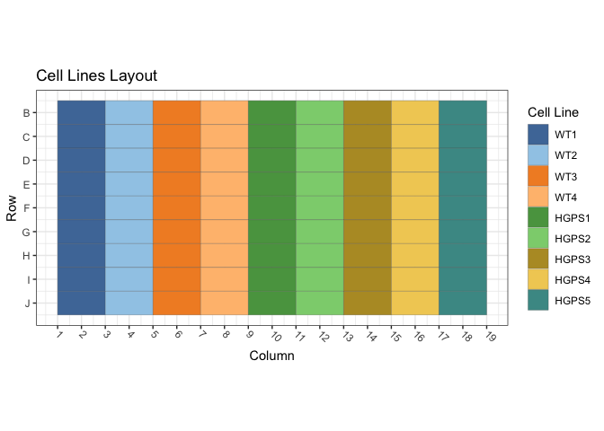
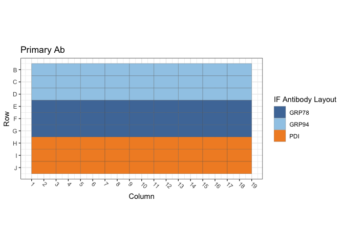
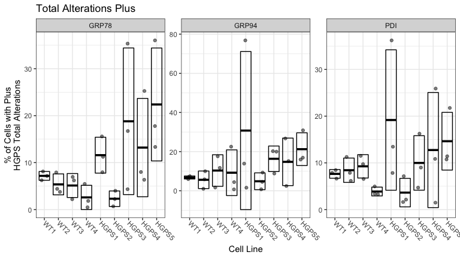

Figure S2A: Primary HGPS Fibroblasts / GRP78, GRP94 and PDI
================
Sandra Vidak/Gianluca Pegoraro
October 28th 2022

### Introduction

Columbus screen names:

`220303-40x-hFibro-GRP94-GRP78-PDI_20220303_124042`

`220309-40x-hFibro-GRP94-GRP78-PDI_20220309_105421`

`220310-40x-hFibro-GRP94-GRP78-PDI_20220310_111540`

### Analysis Setup

Load required packages.

``` r
library(tidyverse)
```

    ## ── Attaching packages ─────────────────────────────────────── tidyverse 1.3.2 ──
    ## ✔ ggplot2 3.3.6      ✔ purrr   0.3.5 
    ## ✔ tibble  3.1.8      ✔ dplyr   1.0.10
    ## ✔ tidyr   1.2.1      ✔ stringr 1.4.1 
    ## ✔ readr   2.1.3      ✔ forcats 0.5.2 
    ## ── Conflicts ────────────────────────────────────────── tidyverse_conflicts() ──
    ## ✖ dplyr::filter() masks stats::filter()
    ## ✖ dplyr::lag()    masks stats::lag()

``` r
library(fs)
library(Hmisc)
```

    ## Loading required package: lattice
    ## Loading required package: survival
    ## Loading required package: Formula
    ## 
    ## Attaching package: 'Hmisc'
    ## 
    ## The following objects are masked from 'package:dplyr':
    ## 
    ##     src, summarize
    ## 
    ## The following objects are masked from 'package:base':
    ## 
    ##     format.pval, units

``` r
library(ggthemes)
library(DescTools) # for Dunnett's Test
```

    ## 
    ## Attaching package: 'DescTools'
    ## 
    ## The following objects are masked from 'package:Hmisc':
    ## 
    ##     %nin%, Label, Mean, Quantile

``` r
source("R/Plotters.R") #Functions needed for plotting
```

Set the palette and the running theme for ggplot2.

### Experimental Metadata

Read plate layouts.

``` r
cell_levs <- c("WT1", "WT2", "WT3", "WT4", 
               "HGPS1","HGPS2",
               "HGPS3", "HGPS4", "HGPS5")

plate_layouts <- read_tsv("metadata/plate_layout.txt") %>%
  filter(!is.na(cell_line)) %>%
  separate(col = cell_line, 
           into = c("cell_line", "cell_id"), 
           remove = T) %>%
  mutate(cell_line = factor(cell_line, levels = cell_levs))

glimpse(plate_layouts)
```

    ## Rows: 81
    ## Columns: 5
    ## $ row       <dbl> 2, 3, 4, 5, 6, 7, 8, 9, 10, 2, 3, 4, 5, 6, 7, 8, 9, 10, 2, 3…
    ## $ column    <dbl> 2, 2, 2, 2, 2, 2, 2, 2, 2, 4, 4, 4, 4, 4, 4, 4, 4, 4, 6, 6, …
    ## $ marker    <chr> "GRP94", "GRP94", "GRP94", "GRP78", "GRP78", "GRP78", "PDI",…
    ## $ cell_line <fct> WT1, WT1, WT1, WT1, WT1, WT1, WT1, WT1, WT1, WT2, WT2, WT2, …
    ## $ cell_id   <chr> "GM00038", "GM00038", "GM00038", "GM00038", "GM00038", "GM00…

Plot plate layouts.

<!-- -->

<!-- -->

### Read and Process Columbus data

Recursively search the `input` directory and its subdirectories for
files whose name includes the Glob patterns defined in the chunk above,
and read the cell-level Columbus data from the results text files.

``` r
read_columbus_results <- function(path, glob) {
  dir_ls(path = path,
         recurse = T,
         glob = glob)  %>%
    read_tsv(
      id = "file_name"
    ) %>%
    select(
      screen = ScreenName,
      plate = PlateName,
      well = WellName,
      row = Row,
      column = Column,
      nuc_area = `Nuclei Selected - Nucleus Area [px²]`,
      cyto_area = `Nuclei Selected - Cytoplasm Area [px²]`,
      cell_area = `Nuclei Selected - Cell Area [px²]`,
      nuc_marker_int = `Nuclei Selected - Intensity Nucleus BP600/37 Mean`,
      cyto_marker_int = `Nuclei Selected - Intensity Cytoplasm BP600/37 Mean`,
      ratio_marker_int = `Nuclei Selected - Nuc_Cyto_BP600_Ratio`
    )
}

glob_path <- "*- Nuclei Selected[0].txt"
col_tbl <- read_columbus_results("input", glob_path)

glimpse(col_tbl)
```

    ## Rows: 44,955
    ## Columns: 11
    ## $ screen           <chr> "220303-40x-hFibro-GRP94-GRP78-PDI_20220303_124042", …
    ## $ plate            <chr> "Plate1", "Plate1", "Plate1", "Plate1", "Plate1", "Pl…
    ## $ well             <chr> "B10", "B10", "B10", "B10", "B10", "B10", "B10", "B10…
    ## $ row              <dbl> 2, 2, 2, 2, 2, 2, 2, 2, 2, 2, 2, 2, 2, 2, 2, 2, 2, 2,…
    ## $ column           <dbl> 10, 10, 10, 10, 10, 10, 10, 10, 10, 10, 10, 10, 10, 1…
    ## $ nuc_area         <dbl> 1048, 1679, 2440, 1985, 3167, 6014, 2037, 2238, 2497,…
    ## $ cyto_area        <dbl> 8995, 11975, 20469, 22803, 31131, 52436, 33335, 25261…
    ## $ cell_area        <dbl> 10043, 13654, 22909, 24788, 34298, 58450, 35372, 2749…
    ## $ nuc_marker_int   <dbl> 38.5878, 2435.0900, 1869.5500, 2007.0600, 2388.9500, …
    ## $ cyto_marker_int  <dbl> 78.2447, 2658.6500, 2324.0500, 1879.6500, 2030.1000, …
    ## $ ratio_marker_int <dbl> 0.493168, 0.915910, 0.804434, 1.067790, 1.176770, 0.5…

Join Columbus data with the plate layout information.

``` r
cell_tbl <- col_tbl %>%
  mutate(sum_marker_int = nuc_marker_int + cyto_marker_int) %>%
  inner_join(plate_layouts,
             by = c("row", "column")) %>%
  select(screen,
         plate,
         well,
         row,
         column,
         cell_line,
         marker,
         nuc_area:sum_marker_int)

glimpse(cell_tbl)
```

    ## Rows: 44,955
    ## Columns: 14
    ## $ screen           <chr> "220303-40x-hFibro-GRP94-GRP78-PDI_20220303_124042", …
    ## $ plate            <chr> "Plate1", "Plate1", "Plate1", "Plate1", "Plate1", "Pl…
    ## $ well             <chr> "B10", "B10", "B10", "B10", "B10", "B10", "B10", "B10…
    ## $ row              <dbl> 2, 2, 2, 2, 2, 2, 2, 2, 2, 2, 2, 2, 2, 2, 2, 2, 2, 2,…
    ## $ column           <dbl> 10, 10, 10, 10, 10, 10, 10, 10, 10, 10, 10, 10, 10, 1…
    ## $ cell_line        <fct> HGPS1, HGPS1, HGPS1, HGPS1, HGPS1, HGPS1, HGPS1, HGPS…
    ## $ marker           <chr> "GRP94", "GRP94", "GRP94", "GRP94", "GRP94", "GRP94",…
    ## $ nuc_area         <dbl> 1048, 1679, 2440, 1985, 3167, 6014, 2037, 2238, 2497,…
    ## $ cyto_area        <dbl> 8995, 11975, 20469, 22803, 31131, 52436, 33335, 25261…
    ## $ cell_area        <dbl> 10043, 13654, 22909, 24788, 34298, 58450, 35372, 2749…
    ## $ nuc_marker_int   <dbl> 38.5878, 2435.0900, 1869.5500, 2007.0600, 2388.9500, …
    ## $ cyto_marker_int  <dbl> 78.2447, 2658.6500, 2324.0500, 1879.6500, 2030.1000, …
    ## $ ratio_marker_int <dbl> 0.493168, 0.915910, 0.804434, 1.067790, 1.176770, 0.5…
    ## $ sum_marker_int   <dbl> 116.8325, 5093.7400, 4193.6000, 3886.7100, 4419.0500,…

Calculate number of cells and mean per well for all properties.

``` r
well_tbl <- cell_tbl %>%
  group_by(screen,
           well,
           row,
           column,
           cell_line,
           marker) %>%
  summarise(cell_n = n(),
            across(nuc_area:sum_marker_int,
                   list(mean = ~ mean(.x, na.rm = T))))

glimpse(well_tbl)
```

    ## Rows: 243
    ## Columns: 14
    ## Groups: screen, well, row, column, cell_line [243]
    ## $ screen                <chr> "220303-40x-hFibro-GRP94-GRP78-PDI_20220303_1240…
    ## $ well                  <chr> "B10", "B12", "B14", "B16", "B18", "B2", "B4", "…
    ## $ row                   <dbl> 2, 2, 2, 2, 2, 2, 2, 2, 2, 3, 3, 3, 3, 3, 3, 3, …
    ## $ column                <dbl> 10, 12, 14, 16, 18, 2, 4, 6, 8, 10, 12, 14, 16, …
    ## $ cell_line             <fct> HGPS1, HGPS2, HGPS3, HGPS4, HGPS5, WT1, WT2, WT3…
    ## $ marker                <chr> "GRP94", "GRP94", "GRP94", "GRP94", "GRP94", "GR…
    ## $ cell_n                <int> 145, 201, 99, 41, 66, 159, 200, 194, 332, 179, 2…
    ## $ nuc_area_mean         <dbl> 2565.193, 2121.721, 2239.303, 2769.000, 2872.152…
    ## $ cyto_area_mean        <dbl> 20992.70, 16386.92, 21497.34, 32209.83, 38265.79…
    ## $ cell_area_mean        <dbl> 23557.89, 18508.64, 23736.65, 34978.83, 41137.94…
    ## $ nuc_marker_int_mean   <dbl> 1896.631, 1547.508, 1947.290, 1921.514, 1475.122…
    ## $ cyto_marker_int_mean  <dbl> 2106.777, 2009.397, 2216.148, 2259.898, 1832.485…
    ## $ ratio_marker_int_mean <dbl> 0.9131968, 0.7932266, 0.9094099, 0.9062361, 0.81…
    ## $ sum_marker_int_mean   <dbl> 4003.408, 3556.905, 4163.438, 4181.412, 3307.608…

Calculate the mean of the technical replicates for each biological
replicate. Now every marker/cell line combination has an n = 3
biological replicates.

``` r
bioreps_tbl <- well_tbl %>%
  group_by(screen,
           cell_line,
           marker) %>%
  summarise(across(cell_n:sum_marker_int_mean,
                    ~ mean(.x, na.rm = T)))

glimpse(bioreps_tbl)
```

    ## Rows: 81
    ## Columns: 11
    ## Groups: screen, cell_line [27]
    ## $ screen                <chr> "220303-40x-hFibro-GRP94-GRP78-PDI_20220303_1240…
    ## $ cell_line             <fct> WT1, WT1, WT1, WT2, WT2, WT2, WT3, WT3, WT3, WT4…
    ## $ marker                <chr> "GRP78", "GRP94", "PDI", "GRP78", "GRP94", "PDI"…
    ## $ cell_n                <dbl> 168.00000, 170.00000, 167.66667, 191.66667, 212.…
    ## $ nuc_area_mean         <dbl> 2385.322, 2318.642, 2399.599, 2309.581, 2282.835…
    ## $ cyto_area_mean        <dbl> 20061.86, 19129.00, 20726.83, 18098.12, 17251.57…
    ## $ cell_area_mean        <dbl> 22447.19, 21447.64, 23126.43, 20407.71, 19534.41…
    ## $ nuc_marker_int_mean   <dbl> 1987.8525, 1777.4320, 1233.2790, 1834.3395, 1712…
    ## $ cyto_marker_int_mean  <dbl> 2860.467, 2010.129, 1835.530, 2700.265, 1884.456…
    ## $ ratio_marker_int_mean <dbl> 0.7232733, 0.9128750, 0.7379835, 0.7033292, 0.93…
    ## $ sum_marker_int_mean   <dbl> 4848.319, 3787.561, 3068.809, 4534.604, 3596.500…

### Threshold quantifications

Calculate the mean and standard deviation for the pooled population of
controls cells (`WT1`) and on a per biological replicate and on a per
marker basis. Set the threshold for quantification of increases or
decreases at Mean +/- 1 SD.

``` r
thresholds_tbl <- cell_tbl %>% 
  filter(cell_line == "WT1") %>%
  group_by(screen, marker) %>%
  summarise(across(nuc_marker_int:sum_marker_int,
                   list(mean_neg = ~ mean(.x, na.rm = T),
                        sd_neg = ~ sd(.x, na.rm = T)))) %>%
  mutate(nuc_marker_plus_thres = nuc_marker_int_mean_neg + 1.5*(nuc_marker_int_sd_neg),
         nuc_marker_minus_thres = nuc_marker_int_mean_neg - 1.5*(nuc_marker_int_sd_neg),
         cyto_marker_plus_thres = cyto_marker_int_mean_neg + 1.5*(cyto_marker_int_sd_neg),
         cyto_marker_minus_thres = cyto_marker_int_mean_neg - 1.5*(cyto_marker_int_sd_neg),
         sum_marker_plus_thres = sum_marker_int_mean_neg + 1.5*(sum_marker_int_sd_neg),
         sum_marker_minus_thres = sum_marker_int_mean_neg - 1.5*(sum_marker_int_sd_neg))

glimpse(thresholds_tbl)
```

    ## Rows: 9
    ## Columns: 16
    ## Groups: screen [3]
    ## $ screen                    <chr> "220303-40x-hFibro-GRP94-GRP78-PDI_20220303_…
    ## $ marker                    <chr> "GRP78", "GRP94", "PDI", "GRP78", "GRP94", "…
    ## $ nuc_marker_int_mean_neg   <dbl> 1987.4510, 1777.8166, 1230.7928, 1119.0382, …
    ## $ nuc_marker_int_sd_neg     <dbl> 438.3404, 270.3350, 335.3289, 297.2108, 172.…
    ## $ cyto_marker_int_mean_neg  <dbl> 2861.2125, 2013.5629, 1828.5913, 1381.3132, …
    ## $ cyto_marker_int_sd_neg    <dbl> 726.7975, 375.4212, 650.1483, 424.1644, 165.…
    ## $ ratio_marker_int_mean_neg <dbl> 0.7229997, 0.9113379, 0.7393459, 0.8449675, …
    ## $ ratio_marker_int_sd_neg   <dbl> 0.1895050, 0.2139576, 0.2866121, 0.2287944, …
    ## $ sum_marker_int_mean_neg   <dbl> 4848.663, 3791.380, 3059.384, 2500.351, 1152…
    ## $ sum_marker_int_sd_neg     <dbl> 1010.4409, 494.8911, 860.4193, 640.2193, 311…
    ## $ nuc_marker_plus_thres     <dbl> 2644.9616, 2183.3192, 1733.7861, 1564.8544, …
    ## $ nuc_marker_minus_thres    <dbl> 1329.9404, 1372.3141, 727.7994, 673.2220, 39…
    ## $ cyto_marker_plus_thres    <dbl> 3951.409, 2576.695, 2803.814, 2017.560, 746.…
    ## $ cyto_marker_minus_thres   <dbl> 1771.0162, 1450.4312, 853.3689, 745.0667, 24…
    ## $ sum_marker_plus_thres     <dbl> 6364.325, 4533.716, 4350.013, 3460.680, 1619…
    ## $ sum_marker_minus_thres    <dbl> 3333.002, 3049.043, 1768.755, 1540.022, 685.…

``` r
defects_tbl <- cell_tbl %>%
  left_join(thresholds_tbl, by = c("screen", "marker")) %>%
  group_by(screen, row, column, cell_line, marker) %>%
  summarise(prop_defects_cyto_plus = 100 * mean(cyto_marker_int >= cyto_marker_plus_thres, na.rm = T),
            prop_defects_cyto_minus = 100 * mean(cyto_marker_int <= cyto_marker_minus_thres, na.rm = T),
            prop_defects_nuc_plus = 100 * mean(nuc_marker_int >= nuc_marker_plus_thres, na.rm = T),
            prop_defects_nuc_minus = 100 * mean(nuc_marker_int <= nuc_marker_minus_thres, na.rm = T),
            prop_defects_sum_plus = 100 * mean(sum_marker_int >= sum_marker_plus_thres, na.rm = T),
            prop_defects_sum_minus = 100 * mean(sum_marker_int <= sum_marker_minus_thres, na.rm = T)) %>%
  arrange(screen, marker, cell_line)

glimpse(defects_tbl)
```

    ## Rows: 243
    ## Columns: 11
    ## Groups: screen, row, column, cell_line [243]
    ## $ screen                  <chr> "220303-40x-hFibro-GRP94-GRP78-PDI_20220303_12…
    ## $ row                     <dbl> 5, 6, 7, 5, 6, 7, 5, 6, 7, 5, 6, 7, 5, 6, 7, 5…
    ## $ column                  <dbl> 2, 2, 2, 4, 4, 4, 6, 6, 6, 8, 8, 8, 10, 10, 10…
    ## $ cell_line               <fct> WT1, WT1, WT1, WT2, WT2, WT2, WT3, WT3, WT3, W…
    ## $ marker                  <chr> "GRP78", "GRP78", "GRP78", "GRP78", "GRP78", "…
    ## $ prop_defects_cyto_plus  <dbl> 5.555556, 7.692308, 7.514451, 3.589744, 6.4327…
    ## $ prop_defects_cyto_minus <dbl> 4.9382716, 5.9171598, 4.0462428, 6.1538462, 5.…
    ## $ prop_defects_nuc_plus   <dbl> 7.4074074, 8.8757396, 7.5144509, 4.1025641, 8.…
    ## $ prop_defects_nuc_minus  <dbl> 4.320988, 1.183432, 4.046243, 8.205128, 8.7719…
    ## $ prop_defects_sum_plus   <dbl> 7.4074074, 8.8757396, 5.2023121, 3.0769231, 5.…
    ## $ prop_defects_sum_minus  <dbl> 5.555556, 2.958580, 5.202312, 6.153846, 8.7719…

``` r
bioreps_defects_tbl <- defects_tbl %>%
  group_by(screen, cell_line, marker) %>%
  summarise(across(prop_defects_cyto_plus:prop_defects_sum_minus,
                   list(mean = ~ mean(.x, na.rm = T),
                        sd = ~ sd(.x, na.rm = T))))

glimpse(bioreps_defects_tbl)
```

    ## Rows: 81
    ## Columns: 15
    ## Groups: screen, cell_line [27]
    ## $ screen                       <chr> "220303-40x-hFibro-GRP94-GRP78-PDI_202203…
    ## $ cell_line                    <fct> WT1, WT1, WT1, WT2, WT2, WT2, WT3, WT3, W…
    ## $ marker                       <chr> "GRP78", "GRP94", "PDI", "GRP78", "GRP94"…
    ## $ prop_defects_cyto_plus_mean  <dbl> 6.920771, 6.454589, 9.456944, 5.573686, 6…
    ## $ prop_defects_cyto_plus_sd    <dbl> 1.185651, 0.985973, 4.974376, 1.723277, 4…
    ## $ prop_defects_cyto_minus_mean <dbl> 4.9672247, 5.3163938, 3.4774882, 5.241074…
    ## $ prop_defects_cyto_minus_sd   <dbl> 0.9357945, 5.4882814, 2.5100061, 0.924011…
    ## $ prop_defects_nuc_plus_mean   <dbl> 7.9325326, 7.6972936, 8.2267294, 5.850952…
    ## $ prop_defects_nuc_plus_sd     <dbl> 0.8185928, 1.5652576, 1.6221827, 2.104769…
    ## $ prop_defects_nuc_minus_mean  <dbl> 3.183554, 5.277813, 3.537013, 9.327281, 1…
    ## $ prop_defects_nuc_minus_sd    <dbl> 1.73759539, 4.70070737, 2.39028610, 1.480…
    ## $ prop_defects_sum_plus_mean   <dbl> 7.1618197, 7.4559597, 7.8527726, 4.410365…
    ## $ prop_defects_sum_plus_sd     <dbl> 1.8489869, 0.1675703, 4.6561478, 1.388447…
    ## $ prop_defects_sum_minus_mean  <dbl> 4.572149, 5.937058, 4.039869, 8.324541, 2…
    ## $ prop_defects_sum_minus_sd    <dbl> 1.4085097, 6.3188320, 2.9508407, 1.985177…

### Biological Replicates Level plots for Figure S2A

<!-- -->

### Chi-square test for counts/proportion of Cells with defects

Calculate the number of cells with defects and normal on a per well
basis. Each treatment has 12 wells (4 technical replicates X 3
biological replicates)

``` r
defects_counts <- cell_tbl %>%
  left_join(thresholds_tbl, by = c("screen", "marker")) %>%
  group_by(screen, row, column, cell_line, marker) %>%
  summarise(n_cells = n(),
            cyto_plus_def = sum(cyto_marker_int >= cyto_marker_plus_thres, na.rm = T),
            cyto_minus_def = sum(cyto_marker_int <= cyto_marker_minus_thres, na.rm = T),
            nuc_plus_def = sum(nuc_marker_int >= nuc_marker_plus_thres, na.rm = T),
            nuc_minus_def = sum(nuc_marker_int <= nuc_marker_minus_thres, na.rm = T),
            sum_plus_def = sum(sum_marker_int >= sum_marker_plus_thres, na.rm = T),
            sum_minus_def = sum(sum_marker_int <= sum_marker_minus_thres, na.rm = T)) %>%
  mutate(across(cyto_plus_def:sum_minus_def,
                list(norm = ~ n_cells - .x))) %>%
  rename_with( ~ gsub("def_norm", "norm", .x, fixed = TRUE)) %>%
  arrange(screen, marker, cell_line)

defects_counts
```

    ## # A tibble: 243 × 18
    ## # Groups:   screen, row, column, cell_line [243]
    ##    screen      row column cell_…¹ marker n_cells cyto_…² cyto_…³ nuc_p…⁴ nuc_m…⁵
    ##    <chr>     <dbl>  <dbl> <fct>   <chr>    <int>   <int>   <int>   <int>   <int>
    ##  1 220303-4…     5      2 WT1     GRP78      162       9       8      12       7
    ##  2 220303-4…     6      2 WT1     GRP78      169      13      10      15       2
    ##  3 220303-4…     7      2 WT1     GRP78      173      13       7      13       7
    ##  4 220303-4…     5      4 WT2     GRP78      195       7      12       8      16
    ##  5 220303-4…     6      4 WT2     GRP78      171      11       9      14      15
    ##  6 220303-4…     7      4 WT2     GRP78      209      14       9      11      23
    ##  7 220303-4…     5      6 WT3     GRP78      198      10      22       1      38
    ##  8 220303-4…     6      6 WT3     GRP78      178       2      32       5      44
    ##  9 220303-4…     7      6 WT3     GRP78      170       5      30       5      46
    ## 10 220303-4…     5      8 WT4     GRP78      338       1     130       1     224
    ## # … with 233 more rows, 8 more variables: sum_plus_def <int>,
    ## #   sum_minus_def <int>, cyto_plus_norm <int>, cyto_minus_norm <int>,
    ## #   nuc_plus_norm <int>, nuc_minus_norm <int>, sum_plus_norm <int>,
    ## #   sum_minus_norm <int>, and abbreviated variable names ¹​cell_line,
    ## #   ²​cyto_plus_def, ³​cyto_minus_def, ⁴​nuc_plus_def, ⁵​nuc_minus_def

Summarize the counts by taking the mean of all 12 wells per condition,
then pivot the table longer to put in a format that can be handled by
xtabs downstream.

``` r
defects_counts_long <- defects_counts %>%
  select(-n_cells) %>%
  group_by(marker, cell_line) %>%
  summarise(across(cyto_plus_def:sum_minus_norm, # Take the mean of all the wells in all the technical and biological replicates
              ~ mean(.x, na.rm = TRUE))) %>% 
  pivot_longer(cols = cyto_plus_def:sum_minus_norm,
               names_pattern = "(.*_.*)_(.*)",
               names_to = c("type", "quality"),
               values_to = "count")

defects_counts_long
```

    ## # A tibble: 324 × 5
    ## # Groups:   marker [3]
    ##    marker cell_line type       quality  count
    ##    <chr>  <fct>     <chr>      <chr>    <dbl>
    ##  1 GRP78  WT1       cyto_plus  def      12.3 
    ##  2 GRP78  WT1       cyto_minus def       6.56
    ##  3 GRP78  WT1       nuc_plus   def      12.2 
    ##  4 GRP78  WT1       nuc_minus  def       4.22
    ##  5 GRP78  WT1       sum_plus   def      12.1 
    ##  6 GRP78  WT1       sum_minus  def       7   
    ##  7 GRP78  WT1       cyto_plus  norm    158.  
    ##  8 GRP78  WT1       cyto_minus norm    163.  
    ##  9 GRP78  WT1       nuc_plus   norm    158.  
    ## 10 GRP78  WT1       nuc_minus  norm    166.  
    ## # … with 314 more rows

Define a function that calculate a contingency table of counts based on
the cell line and the cell class (normal/defects). The table is then
used to calculate the chi-square test to determine whether any of the 6
cell lines is different from the others in terms of proportion of
defects.

``` r
calc_chi <- function(df){
    xtabs_tbl <- xtabs(count ~ cell_line + quality, data = df)
    broom::tidy(chisq.test(xtabs_tbl))
}
```

Apply the function on a per IF marker and on a per defect category to
calculate the p-values on a per IF marker and defect type basis.

``` r
chi_square_test <- defects_counts_long %>%
  group_by(marker, type) %>%
  group_modify(~ calc_chi(.x))

write_csv(chi_square_test, "output/chi_square_results.csv")

knitr::kable(chi_square_test, digits = 3)
```

| marker | type       | statistic | p.value | parameter | method                     |
|:-------|:-----------|----------:|--------:|----------:|:---------------------------|
| GRP78  | cyto_minus |    13.281 |   0.103 |         8 | Pearson’s Chi-squared test |
| GRP78  | cyto_plus  |    67.945 |   0.000 |         8 | Pearson’s Chi-squared test |
| GRP78  | nuc_minus  |   101.138 |   0.000 |         8 | Pearson’s Chi-squared test |
| GRP78  | nuc_plus   |    96.852 |   0.000 |         8 | Pearson’s Chi-squared test |
| GRP78  | sum_minus  |    46.344 |   0.000 |         8 | Pearson’s Chi-squared test |
| GRP78  | sum_plus   |   103.473 |   0.000 |         8 | Pearson’s Chi-squared test |
| GRP94  | cyto_minus |     6.694 |   0.570 |         8 | Pearson’s Chi-squared test |
| GRP94  | cyto_plus  |    38.272 |   0.000 |         8 | Pearson’s Chi-squared test |
| GRP94  | nuc_minus  |    27.536 |   0.001 |         8 | Pearson’s Chi-squared test |
| GRP94  | nuc_plus   |    62.934 |   0.000 |         8 | Pearson’s Chi-squared test |
| GRP94  | sum_minus  |     9.300 |   0.318 |         8 | Pearson’s Chi-squared test |
| GRP94  | sum_plus   |    60.315 |   0.000 |         8 | Pearson’s Chi-squared test |
| PDI    | cyto_minus |    18.783 |   0.016 |         8 | Pearson’s Chi-squared test |
| PDI    | cyto_plus  |    16.139 |   0.040 |         8 | Pearson’s Chi-squared test |
| PDI    | nuc_minus  |    48.139 |   0.000 |         8 | Pearson’s Chi-squared test |
| PDI    | nuc_plus   |    49.540 |   0.000 |         8 | Pearson’s Chi-squared test |
| PDI    | sum_minus  |    34.691 |   0.000 |         8 | Pearson’s Chi-squared test |
| PDI    | sum_plus   |    36.550 |   0.000 |         8 | Pearson’s Chi-squared test |

Document the information about the analysis session

``` r
sessionInfo()
```

    ## R version 4.2.1 (2022-06-23)
    ## Platform: x86_64-apple-darwin17.0 (64-bit)
    ## Running under: macOS Big Sur ... 10.16
    ## 
    ## Matrix products: default
    ## BLAS:   /Library/Frameworks/R.framework/Versions/4.2/Resources/lib/libRblas.0.dylib
    ## LAPACK: /Library/Frameworks/R.framework/Versions/4.2/Resources/lib/libRlapack.dylib
    ## 
    ## locale:
    ## [1] en_US.UTF-8/en_US.UTF-8/en_US.UTF-8/C/en_US.UTF-8/en_US.UTF-8
    ## 
    ## attached base packages:
    ## [1] stats     graphics  grDevices utils     datasets  methods   base     
    ## 
    ## other attached packages:
    ##  [1] DescTools_0.99.47 ggthemes_4.2.4    Hmisc_4.7-1       Formula_1.2-4    
    ##  [5] survival_3.4-0    lattice_0.20-45   fs_1.5.2          forcats_0.5.2    
    ##  [9] stringr_1.4.1     dplyr_1.0.10      purrr_0.3.5       readr_2.1.3      
    ## [13] tidyr_1.2.1       tibble_3.1.8      ggplot2_3.3.6     tidyverse_1.3.2  
    ## 
    ## loaded via a namespace (and not attached):
    ##  [1] bit64_4.0.5         lubridate_1.8.0     RColorBrewer_1.1-3 
    ##  [4] httr_1.4.4          tools_4.2.1         backports_1.4.1    
    ##  [7] utf8_1.2.2          R6_2.5.1            rpart_4.1.19       
    ## [10] DBI_1.1.3           colorspace_2.0-3    nnet_7.3-18        
    ## [13] withr_2.5.0         Exact_3.2           tidyselect_1.2.0   
    ## [16] gridExtra_2.3       bit_4.0.4           compiler_4.2.1     
    ## [19] cli_3.4.1           rvest_1.0.3         htmlTable_2.4.1    
    ## [22] expm_0.999-6        xml2_1.3.3          labeling_0.4.2     
    ## [25] scales_1.2.1        checkmate_2.1.0     mvtnorm_1.1-3      
    ## [28] proxy_0.4-27        digest_0.6.30       foreign_0.8-83     
    ## [31] rmarkdown_2.17      base64enc_0.1-3     jpeg_0.1-9         
    ## [34] pkgconfig_2.0.3     htmltools_0.5.3     highr_0.9          
    ## [37] dbplyr_2.2.1        fastmap_1.1.0       htmlwidgets_1.5.4  
    ## [40] rlang_1.0.6         readxl_1.4.1        rstudioapi_0.14    
    ## [43] farver_2.1.1        generics_0.1.3      jsonlite_1.8.3     
    ## [46] vroom_1.6.0         googlesheets4_1.0.1 magrittr_2.0.3     
    ## [49] interp_1.1-3        Matrix_1.5-1        Rcpp_1.0.9         
    ## [52] munsell_0.5.0       fansi_1.0.3         lifecycle_1.0.3    
    ## [55] stringi_1.7.8       yaml_2.3.6          rootSolve_1.8.2.3  
    ## [58] MASS_7.3-58.1       grid_4.2.1          parallel_4.2.1     
    ## [61] crayon_1.5.2        lmom_2.9            deldir_1.0-6       
    ## [64] haven_2.5.1         splines_4.2.1       hms_1.1.2          
    ## [67] knitr_1.40          pillar_1.8.1        boot_1.3-28        
    ## [70] gld_2.6.6           reprex_2.0.2        glue_1.6.2         
    ## [73] evaluate_0.17       latticeExtra_0.6-30 data.table_1.14.4  
    ## [76] modelr_0.1.9        png_0.1-7           vctrs_0.5.0        
    ## [79] tzdb_0.3.0          cellranger_1.1.0    gtable_0.3.1       
    ## [82] assertthat_0.2.1    xfun_0.34           broom_1.0.1        
    ## [85] e1071_1.7-12        class_7.3-20        googledrive_2.0.0  
    ## [88] gargle_1.2.1        cluster_2.1.4       ellipsis_0.3.2
