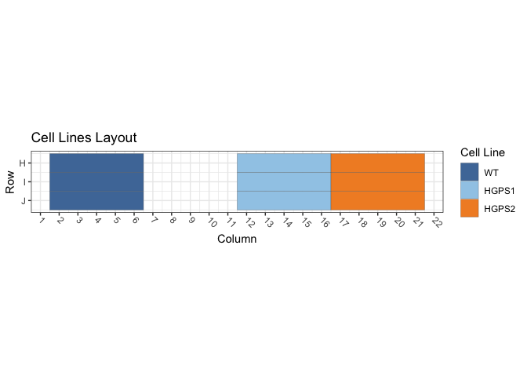
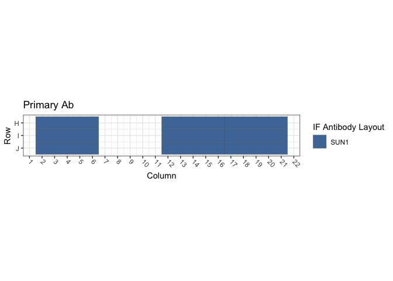
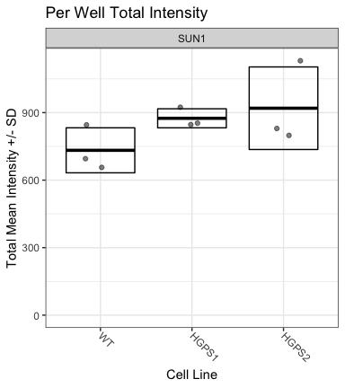

Figure S4B and S4C: hTERT-HCPS Cells / SUN1
================
Sandra Vidak/Gianluca Pegoraro
October 31st 2022

### Introduction

Columbus screen names:

`180124-40x-hFibro-SUN1_20180124_110053`

`180129-40x-hFibro-GRP94-Hsc70-SUN1-LAP2_20180129_121044`

`180205-40x-hFibro-Calnexin-Hsp70-Hsp90-SUN1_20180205_112614`

### Analysis Setup

Load required packages.

``` r
library(tidyverse)
```

    ## ── Attaching packages ─────────────────────────────────────── tidyverse 1.3.2 ──
    ## ✔ ggplot2 3.3.6      ✔ purrr   0.3.5 
    ## ✔ tibble  3.1.8      ✔ dplyr   1.0.10
    ## ✔ tidyr   1.2.1      ✔ stringr 1.4.1 
    ## ✔ readr   2.1.3      ✔ forcats 0.5.2 
    ## ── Conflicts ────────────────────────────────────────── tidyverse_conflicts() ──
    ## ✖ dplyr::filter() masks stats::filter()
    ## ✖ dplyr::lag()    masks stats::lag()

``` r
library(fs)
library(Hmisc)
```

    ## Loading required package: lattice
    ## Loading required package: survival
    ## Loading required package: Formula
    ## 
    ## Attaching package: 'Hmisc'
    ## 
    ## The following objects are masked from 'package:dplyr':
    ## 
    ##     src, summarize
    ## 
    ## The following objects are masked from 'package:base':
    ## 
    ##     format.pval, units

``` r
library(ggthemes)
library(DescTools) # for Dunnett's Test
```

    ## 
    ## Attaching package: 'DescTools'
    ## 
    ## The following objects are masked from 'package:Hmisc':
    ## 
    ##     %nin%, Label, Mean, Quantile

``` r
source("R/Plotters.R") #Functions needed for plotting
```

Set the palette and the running theme for ggplot2.

### Experimental Metadata

Read plate layouts.

``` r
cell_levs <- c("WT",
               "HGPS1","HGPS2")

plate_layouts <- read_tsv("metadata/plate_layout.txt") %>%
  filter(!is.na(cell_line)) %>%
  separate(col = cell_line, 
           into = c("cell_line", "cell_id"), 
           remove = T) %>%
  mutate(cell_line = factor(cell_line, levels = cell_levs))

glimpse(plate_layouts)
```

    ## Rows: 9
    ## Columns: 5
    ## $ row       <dbl> 8, 9, 10, 8, 9, 10, 8, 9, 10
    ## $ column    <dbl> 4, 4, 4, 14, 14, 14, 19, 19, 19
    ## $ marker    <chr> "SUN1", "SUN1", "SUN1", "SUN1", "SUN1", "SUN1", "SUN1", "SUN…
    ## $ cell_line <fct> WT, WT, WT, HGPS1, HGPS1, HGPS1, HGPS2, HGPS2, HGPS2
    ## $ cell_id   <chr> "CRL1474", "CRL1474", "CRL1474", "72T", "72T", "72T", "97T",…

Plot plate layouts.

<!-- -->

<!-- -->

### Read and Process Columbus data

Recursively search the `input` directory and its subdirectories for
files whose name includes the Glob patterns defined in the chunk above,
and read the cell-level Columbus data from the results text files.

``` r
read_columbus_results <- function(path, glob) {
  dir_ls(path = path,
         recurse = T,
         glob = glob)  %>%
    read_tsv(
      id = "file_name"
    ) %>%
    select(
      screen = ScreenName,
      plate = PlateName,
      well = WellName,
      row = Row,
      column = Column,
      nuc_area = `Nuclei Selected - Nucleus Area [px²]`,
      cyto_area = `Nuclei Selected - Cytoplasm Area [px²]`,
      cell_area = `Nuclei Selected - Cell Area [px²]`,
      nuc_marker_int = `Nuclei Selected - Intensity Nucleus BP600/37 Mean`,
      cyto_marker_int = `Nuclei Selected - Intensity Cytoplasm BP600/37 Mean`,
      ratio_marker_int = `Nuclei Selected - Nuc_Cyto_BP600_Ratio`
    )
}

glob_path <- "*- Nuclei Selected[0].txt"
col_tbl <- read_columbus_results("input", glob_path)

glimpse(col_tbl)
```

    ## Rows: 18,248
    ## Columns: 11
    ## $ screen           <chr> "180205-40x-hFibro-Calnexin-Hsp70-Hsp90-SUN1_20180205…
    ## $ plate            <chr> "Plate 1", "Plate 1", "Plate 1", "Plate 1", "Plate 1"…
    ## $ well             <chr> "E13", "E13", "E13", "E13", "E13", "E13", "E13", "E13…
    ## $ row              <dbl> 5, 5, 5, 5, 5, 5, 5, 5, 5, 5, 5, 5, 5, 5, 5, 5, 5, 5,…
    ## $ column           <dbl> 13, 13, 13, 13, 13, 13, 13, 13, 13, 13, 13, 13, 13, 1…
    ## $ nuc_area         <dbl> 2889, 2199, 1954, 2351, 2217, 2598, 2644, 2341, 1687,…
    ## $ cyto_area        <dbl> 48615, 40644, 28090, 30134, 26700, 29023, 42772, 2962…
    ## $ cell_area        <dbl> 51504, 42843, 30044, 32485, 28917, 31621, 45416, 3197…
    ## $ nuc_marker_int   <dbl> 388.454, 580.341, 544.455, 408.388, 623.464, 532.906,…
    ## $ cyto_marker_int  <dbl> 616.719, 688.414, 746.066, 311.729, 612.159, 706.241,…
    ## $ ratio_marker_int <dbl> 0.629872, 0.843011, 0.729768, 1.310070, 1.018470, 0.7…

Join Columbus data with the plate layout information.

``` r
cell_tbl <- col_tbl %>%
  mutate(sum_marker_int = nuc_marker_int + cyto_marker_int) %>%
  inner_join(plate_layouts,
             by = c("row", "column")) %>%
  select(screen,
         plate,
         well,
         row,
         column,
         cell_line,
         marker,
         nuc_area:sum_marker_int)

glimpse(cell_tbl)
```

    ## Rows: 5,053
    ## Columns: 14
    ## $ screen           <chr> "180205-40x-hFibro-Calnexin-Hsp70-Hsp90-SUN1_20180205…
    ## $ plate            <chr> "Plate 1", "Plate 1", "Plate 1", "Plate 1", "Plate 1"…
    ## $ well             <chr> "H14", "H14", "H14", "H14", "H14", "H14", "H14", "H14…
    ## $ row              <dbl> 8, 8, 8, 8, 8, 8, 8, 8, 8, 8, 8, 8, 8, 8, 8, 8, 8, 8,…
    ## $ column           <dbl> 14, 14, 14, 14, 14, 14, 14, 14, 14, 14, 14, 14, 14, 1…
    ## $ cell_line        <fct> HGPS1, HGPS1, HGPS1, HGPS1, HGPS1, HGPS1, HGPS1, HGPS…
    ## $ marker           <chr> "SUN1", "SUN1", "SUN1", "SUN1", "SUN1", "SUN1", "SUN1…
    ## $ nuc_area         <dbl> 2639, 2555, 2403, 2179, 2616, 1976, 2037, 1667, 1451,…
    ## $ cyto_area        <dbl> 33227, 36657, 24064, 8203, 27421, 21142, 35317, 23484…
    ## $ cell_area        <dbl> 35866, 39212, 26467, 10382, 30037, 23118, 37354, 2515…
    ## $ nuc_marker_int   <dbl> 530.5680, 1066.2800, 942.4330, 909.2940, 1285.9200, 1…
    ## $ cyto_marker_int  <dbl> 51.8471, 65.4573, 59.7938, 72.6116, 51.1742, 71.3431,…
    ## $ ratio_marker_int <dbl> 10.23330, 16.28970, 15.76140, 12.52270, 25.12820, 18.…
    ## $ sum_marker_int   <dbl> 582.4151, 1131.7373, 1002.2268, 981.9056, 1337.0942, …

Calculate number of cells and mean per well for all properties.

``` r
well_tbl <- cell_tbl %>%
  group_by(screen,
           well,
           row,
           column,
           cell_line,
           marker) %>%
  summarise(cell_n = n(),
            across(nuc_area:sum_marker_int,
                   list(mean = ~ mean(.x, na.rm = T))))

glimpse(well_tbl)
```

    ## Rows: 27
    ## Columns: 14
    ## Groups: screen, well, row, column, cell_line [27]
    ## $ screen                <chr> "180124-40x-hFibro-SUN1_20180124_110053", "18012…
    ## $ well                  <chr> "H14", "H19", "H4", "I14", "I19", "I4", "J14", "…
    ## $ row                   <dbl> 8, 8, 8, 9, 9, 9, 10, 10, 10, 8, 8, 8, 9, 9, 9, …
    ## $ column                <dbl> 14, 19, 4, 14, 19, 4, 14, 19, 4, 14, 19, 4, 14, …
    ## $ cell_line             <fct> HGPS1, HGPS2, WT, HGPS1, HGPS2, WT, HGPS1, HGPS2…
    ## $ marker                <chr> "SUN1", "SUN1", "SUN1", "SUN1", "SUN1", "SUN1", …
    ## $ cell_n                <int> 150, 237, 306, 136, 242, 283, 212, 279, 302, 141…
    ## $ nuc_area_mean         <dbl> 1965.460, 1864.186, 2074.036, 1942.096, 1901.335…
    ## $ cyto_area_mean        <dbl> 19344.83, 14591.82, 16213.05, 17771.17, 13584.24…
    ## $ cell_area_mean        <dbl> 21310.29, 16456.01, 18287.09, 19713.26, 15485.57…
    ## $ nuc_marker_int_mean   <dbl> 784.3136, 775.5683, 551.5477, 778.7154, 716.3552…
    ## $ cyto_marker_int_mean  <dbl> 81.22016, 75.51274, 69.34657, 90.43582, 78.22448…
    ## $ ratio_marker_int_mean <dbl> 10.384399, 10.730644, 8.663044, 9.020863, 9.8464…
    ## $ sum_marker_int_mean   <dbl> 865.5338, 851.0810, 620.8943, 869.1512, 794.5796…

Calculate the mean of the technical replicates for each biological
replicate. Now every marker/cell line combination has an n = 3
biological replicates.

``` r
bioreps_tbl <- well_tbl %>%
  group_by(screen,
           cell_line,
           marker) %>%
  summarise(across(cell_n:sum_marker_int_mean,
                    ~ mean(.x, na.rm = T)))

glimpse(bioreps_tbl)
```

    ## Rows: 9
    ## Columns: 11
    ## Groups: screen, cell_line [9]
    ## $ screen                <chr> "180124-40x-hFibro-SUN1_20180124_110053", "18012…
    ## $ cell_line             <fct> WT, HGPS1, HGPS2, WT, HGPS1, HGPS2, WT, HGPS1, H…
    ## $ marker                <chr> "SUN1", "SUN1", "SUN1", "SUN1", "SUN1", "SUN1", …
    ## $ cell_n                <dbl> 297.00000, 166.00000, 252.66667, 348.66667, 193.…
    ## $ nuc_area_mean         <dbl> 2088.239, 1941.967, 1907.557, 2031.479, 1916.092…
    ## $ cyto_area_mean        <dbl> 16265.42, 17550.12, 13818.05, 14267.75, 15794.45…
    ## $ cell_area_mean        <dbl> 18353.66, 19492.08, 15725.61, 16299.23, 17710.54…
    ## $ nuc_marker_int_mean   <dbl> 580.0343, 761.8593, 723.3052, 629.1700, 777.4163…
    ## $ cyto_marker_int_mean  <dbl> 76.70153, 91.76259, 75.76354, 65.81611, 69.12690…
    ## $ ratio_marker_int_mean <dbl> 8.185185, 8.920727, 10.190560, 10.123300, 11.984…
    ## $ sum_marker_int_mean   <dbl> 656.7358, 853.6218, 799.0688, 694.9861, 847.2134…

### Biological Replicates Level plots for Figure S4B

<!-- -->

### Threshold quantifications

Calculate the mean and standard deviation for the pooled population of
controls cells (`WT1`) and on a per biological replicate and on a per
marker basis. Set the threshold for quantification of increases or
decreases at Mean +/- 1 SD.

``` r
thresholds_tbl <- cell_tbl %>% 
  filter(cell_line == "WT") %>%
  group_by(screen, marker) %>%
  summarise(across(nuc_marker_int:sum_marker_int,
                   list(mean_neg = ~ mean(.x, na.rm = T),
                        sd_neg = ~ sd(.x, na.rm = T)))) %>%
  mutate(nuc_marker_plus_thres = nuc_marker_int_mean_neg + 1.0*(nuc_marker_int_sd_neg),
         nuc_marker_minus_thres = nuc_marker_int_mean_neg - 1.0*(nuc_marker_int_sd_neg),
         cyto_marker_plus_thres = cyto_marker_int_mean_neg + 1.0*(cyto_marker_int_sd_neg),
         cyto_marker_minus_thres = cyto_marker_int_mean_neg - 1.0*(cyto_marker_int_sd_neg),
         sum_marker_plus_thres = sum_marker_int_mean_neg + 1.0*(sum_marker_int_sd_neg),
         sum_marker_minus_thres = sum_marker_int_mean_neg - 1.0*(sum_marker_int_sd_neg))

glimpse(thresholds_tbl)
```

    ## Rows: 3
    ## Columns: 16
    ## Groups: screen [3]
    ## $ screen                    <chr> "180124-40x-hFibro-SUN1_20180124_110053", "1…
    ## $ marker                    <chr> "SUN1", "SUN1", "SUN1"
    ## $ nuc_marker_int_mean_neg   <dbl> 579.7327, 628.2061, 743.2641
    ## $ nuc_marker_int_sd_neg     <dbl> 136.5276, 170.7562, 337.7852
    ## $ cyto_marker_int_mean_neg  <dbl> 76.66587, 65.83416, 97.53880
    ## $ cyto_marker_int_sd_neg    <dbl> 25.02932, 20.80111, 31.61805
    ## $ ratio_marker_int_mean_neg <dbl> 8.185273, 10.109680, 7.783676
    ## $ ratio_marker_int_sd_neg   <dbl> 2.777551, 3.406429, 3.625601
    ## $ sum_marker_int_mean_neg   <dbl> 656.3986, 694.0402, 840.8029
    ## $ sum_marker_int_sd_neg     <dbl> 144.7764, 172.4961, 352.9811
    ## $ nuc_marker_plus_thres     <dbl> 716.2603, 798.9622, 1081.0492
    ## $ nuc_marker_minus_thres    <dbl> 443.2051, 457.4499, 405.4789
    ## $ cyto_marker_plus_thres    <dbl> 101.69519, 86.63527, 129.15685
    ## $ cyto_marker_minus_thres   <dbl> 51.63655, 45.03305, 65.92075
    ## $ sum_marker_plus_thres     <dbl> 801.1750, 866.5363, 1193.7840
    ## $ sum_marker_minus_thres    <dbl> 511.6221, 521.5441, 487.8218

``` r
defects_tbl <- cell_tbl %>%
  left_join(thresholds_tbl, by = c("screen", "marker")) %>%
  group_by(screen, row, column, cell_line, marker) %>%
  summarise(prop_defects_cyto_plus = 100 * mean(cyto_marker_int >= cyto_marker_plus_thres, na.rm = T),
            prop_defects_cyto_minus = 100 * mean(cyto_marker_int <= cyto_marker_minus_thres, na.rm = T),
            prop_defects_nuc_plus = 100 * mean(nuc_marker_int >= nuc_marker_plus_thres, na.rm = T),
            prop_defects_nuc_minus = 100 * mean(nuc_marker_int <= nuc_marker_minus_thres, na.rm = T),
            prop_defects_sum_plus = 100 * mean(sum_marker_int >= sum_marker_plus_thres, na.rm = T),
            prop_defects_sum_minus = 100 * mean(sum_marker_int <= sum_marker_minus_thres, na.rm = T)) %>%
  arrange(screen, marker, cell_line)

glimpse(defects_tbl)
```

    ## Rows: 27
    ## Columns: 11
    ## Groups: screen, row, column, cell_line [27]
    ## $ screen                  <chr> "180124-40x-hFibro-SUN1_20180124_110053", "180…
    ## $ row                     <dbl> 8, 9, 10, 8, 9, 10, 8, 9, 10, 8, 9, 10, 8, 9, …
    ## $ column                  <dbl> 4, 4, 4, 14, 14, 14, 19, 19, 19, 4, 4, 4, 14, …
    ## $ cell_line               <fct> WT, WT, WT, HGPS1, HGPS1, HGPS1, HGPS2, HGPS2,…
    ## $ marker                  <chr> "SUN1", "SUN1", "SUN1", "SUN1", "SUN1", "SUN1"…
    ## $ prop_defects_cyto_plus  <dbl> 6.209150, 14.840989, 20.198675, 20.666667, 27.…
    ## $ prop_defects_cyto_minus <dbl> 23.8562092, 13.4275618, 5.6291391, 8.0000000, …
    ## $ prop_defects_nuc_plus   <dbl> 7.843137, 14.840989, 16.887417, 58.666667, 64.…
    ## $ prop_defects_nuc_minus  <dbl> 19.2810458, 12.3674912, 9.2715232, 1.3333333, …
    ## $ prop_defects_sum_plus   <dbl> 6.862745, 15.194346, 18.543046, 56.000000, 63.…
    ## $ prop_defects_sum_minus  <dbl> 20.5882353, 12.0141343, 7.6158940, 2.0000000, …

``` r
bioreps_defects_tbl <- defects_tbl %>%
  group_by(screen, cell_line, marker) %>%
  summarise(across(prop_defects_cyto_plus:prop_defects_sum_minus,
                   list(mean = ~ mean(.x, na.rm = T),
                        sd = ~ sd(.x, na.rm = T))))

glimpse(bioreps_defects_tbl)
```

    ## Rows: 9
    ## Columns: 15
    ## Groups: screen, cell_line [9]
    ## $ screen                       <chr> "180124-40x-hFibro-SUN1_20180124_110053",…
    ## $ cell_line                    <fct> WT, HGPS1, HGPS2, WT, HGPS1, HGPS2, WT, H…
    ## $ marker                       <chr> "SUN1", "SUN1", "SUN1", "SUN1", "SUN1", "…
    ## $ prop_defects_cyto_plus_mean  <dbl> 13.749605, 31.523554, 14.392286, 9.163427…
    ## $ prop_defects_cyto_plus_sd    <dbl> 7.058331, 13.542185, 4.282411, 1.986125, …
    ## $ prop_defects_cyto_minus_mean <dbl> 14.304303, 3.559193, 14.446818, 6.563494,…
    ## $ prop_defects_cyto_minus_sd   <dbl> 9.145109, 3.942388, 5.794894, 2.118676, 1…
    ## $ prop_defects_nuc_plus_mean   <dbl> 13.19051, 56.53299, 48.73358, 13.62096, 4…
    ## $ prop_defects_nuc_plus_sd     <dbl> 4.742658, 9.422692, 10.804398, 1.742536, …
    ## $ prop_defects_nuc_minus_mean  <dbl> 13.6400200, 0.7589099, 6.7149088, 13.6746…
    ## $ prop_defects_nuc_minus_sd    <dbl> 5.1246593, 0.6855442, 4.7173856, 4.900809…
    ## $ prop_defects_sum_plus_mean   <dbl> 13.53338, 57.60026, 46.51893, 13.64813, 4…
    ## $ prop_defects_sum_plus_sd     <dbl> 6.014688, 5.740013, 8.869631, 2.086821, 1…
    ## $ prop_defects_sum_minus_mean  <dbl> 13.4060879, 0.9811321, 7.2969196, 13.0654…
    ## $ prop_defects_sum_minus_sd    <dbl> 6.597239, 1.000534, 5.872621, 3.848560, 8…

### Biological Replicates Level plots for Figure S4C

<!-- -->

### Calculate Dunnett’s test for the continuous variables.

Define a custom function to run a Dunnett post-hoc test only on the Mean
marker intensity sum (Cyto + Nucleus), using the cell line as the
predictor variable, and fixing WT1 as the negative control. The output
of the Dunnett’s test is then rearranged to a tidy table to make it work
with `dplyr`.

``` r
calc_dunnett <- function(df){
  as.data.frame(as.table(DunnettTest(sum_marker_int_mean ~ cell_line,
                          control = "WT",
                          data = df)$WT)) %>%
    pivot_wider(names_from = Var2, values_from = Freq) %>%
    rename(comparison = Var1)
}
```

Run the custom function on all the data grouped based on the IF marker
and save the data to a .csv file.

``` r
dunnett_test <- bioreps_tbl %>%
  group_by(marker) %>%
  group_modify(~ calc_dunnett(.x))

write_csv(dunnett_test, "output/dunnett_results.csv")

knitr::kable(dunnett_test, digits = 3)
```

| marker | comparison |    diff |   lwr.ci |  upr.ci |  pval |
|:-------|:-----------|--------:|---------:|--------:|------:|
| SUN1   | HGPS1-WT   | 142.231 | -145.761 | 430.224 | 0.332 |
| SUN1   | HGPS2-WT   | 187.056 | -100.937 | 475.049 | 0.187 |

### Chi-square test for counts/proportion of Cells with defects

Calculate the number of cells with defects and normal on a per well
basis. Each treatment has 12 wells (4 technical replicates X 3
biological replicates)

``` r
defects_counts <- cell_tbl %>%
  left_join(thresholds_tbl, by = c("screen", "marker")) %>%
  group_by(screen, row, column, cell_line, marker) %>%
  summarise(n_cells = n(),
            cyto_plus_def = sum(cyto_marker_int >= cyto_marker_plus_thres, na.rm = T),
            cyto_minus_def = sum(cyto_marker_int <= cyto_marker_minus_thres, na.rm = T),
            nuc_plus_def = sum(nuc_marker_int >= nuc_marker_plus_thres, na.rm = T),
            nuc_minus_def = sum(nuc_marker_int <= nuc_marker_minus_thres, na.rm = T),
            sum_plus_def = sum(sum_marker_int >= sum_marker_plus_thres, na.rm = T),
            sum_minus_def = sum(sum_marker_int <= sum_marker_minus_thres, na.rm = T)) %>%
  mutate(across(cyto_plus_def:sum_minus_def,
                list(norm = ~ n_cells - .x))) %>%
  rename_with( ~ gsub("def_norm", "norm", .x, fixed = TRUE)) %>%
  arrange(screen, marker, cell_line)

defects_counts
```

    ## # A tibble: 27 × 18
    ## # Groups:   screen, row, column, cell_line [27]
    ##    screen      row column cell_…¹ marker n_cells cyto_…² cyto_…³ nuc_p…⁴ nuc_m…⁵
    ##    <chr>     <dbl>  <dbl> <fct>   <chr>    <int>   <int>   <int>   <int>   <int>
    ##  1 180124-4…     8      4 WT      SUN1       306      19      73      24      59
    ##  2 180124-4…     9      4 WT      SUN1       283      42      38      42      35
    ##  3 180124-4…    10      4 WT      SUN1       302      61      17      51      28
    ##  4 180124-4…     8     14 HGPS1   SUN1       150      31      12      88       2
    ##  5 180124-4…     9     14 HGPS1   SUN1       136      37       3      88       0
    ##  6 180124-4…    10     14 HGPS1   SUN1       212      99       1      98       2
    ##  7 180124-4…     8     19 HGPS2   SUN1       237      25      21     142       6
    ##  8 180124-4…     9     19 HGPS2   SUN1       242      46      34     116      14
    ##  9 180124-4…    10     19 HGPS2   SUN1       279      38      57     107      33
    ## 10 180129-4…     8      4 WT      SUN1       383      31      30      47      74
    ## # … with 17 more rows, 8 more variables: sum_plus_def <int>,
    ## #   sum_minus_def <int>, cyto_plus_norm <int>, cyto_minus_norm <int>,
    ## #   nuc_plus_norm <int>, nuc_minus_norm <int>, sum_plus_norm <int>,
    ## #   sum_minus_norm <int>, and abbreviated variable names ¹​cell_line,
    ## #   ²​cyto_plus_def, ³​cyto_minus_def, ⁴​nuc_plus_def, ⁵​nuc_minus_def

Summarize the counts by taking the mean of all 12 wells per condition,
then pivot the table longer to put in a format that can be handled by
xtabs downstream.

``` r
defects_counts_long <- defects_counts %>%
  select(-n_cells) %>%
  group_by(marker, cell_line) %>%
  summarise(across(cyto_plus_def:sum_minus_norm, # Take the mean of all the wells in all the technical and biological replicates
              ~ mean(.x, na.rm = TRUE))) %>% 
  pivot_longer(cols = cyto_plus_def:sum_minus_norm,
               names_pattern = "(.*_.*)_(.*)",
               names_to = c("type", "quality"),
               values_to = "count")

defects_counts_long
```

    ## # A tibble: 36 × 5
    ## # Groups:   marker [1]
    ##    marker cell_line type       quality count
    ##    <chr>  <fct>     <chr>      <chr>   <dbl>
    ##  1 SUN1   WT        cyto_plus  def      27.6
    ##  2 SUN1   WT        cyto_minus def      24.7
    ##  3 SUN1   WT        nuc_plus   def      31.7
    ##  4 SUN1   WT        nuc_minus  def      32.3
    ##  5 SUN1   WT        sum_plus   def      32  
    ##  6 SUN1   WT        sum_minus  def      31.6
    ##  7 SUN1   WT        cyto_plus  norm    207. 
    ##  8 SUN1   WT        cyto_minus norm    210  
    ##  9 SUN1   WT        nuc_plus   norm    203  
    ## 10 SUN1   WT        nuc_minus  norm    202. 
    ## # … with 26 more rows

Define a function that calculate a contingency table of counts based on
the cell line and the cell class (normal/defects). The table is then
used to calculate the chi-square test to determine whether any of the 6
cell lines is different from the others in terms of proportion of
defects.

``` r
calc_chi <- function(df){
    xtabs_tbl <- xtabs(count ~ cell_line + quality, data = df)
    broom::tidy(chisq.test(xtabs_tbl))
}
```

Apply the function on a per IF marker and on a per defect category to
calculate the p-values on a per IF marker and defect type basis.

``` r
chi_square_test <- defects_counts_long %>%
  group_by(marker, type) %>%
  group_modify(~ calc_chi(.x))

write_csv(chi_square_test, "output/chi_square_results.csv")

knitr::kable(chi_square_test, digits = 3)
```

| marker | type       | statistic | p.value | parameter | method                     |
|:-------|:-----------|----------:|--------:|----------:|:---------------------------|
| SUN1   | cyto_minus |     9.304 |   0.010 |         2 | Pearson’s Chi-squared test |
| SUN1   | cyto_plus  |     5.899 |   0.052 |         2 | Pearson’s Chi-squared test |
| SUN1   | nuc_minus  |     4.374 |   0.112 |         2 | Pearson’s Chi-squared test |
| SUN1   | nuc_plus   |    62.661 |   0.000 |         2 | Pearson’s Chi-squared test |
| SUN1   | sum_minus  |     3.584 |   0.167 |         2 | Pearson’s Chi-squared test |
| SUN1   | sum_plus   |    59.060 |   0.000 |         2 | Pearson’s Chi-squared test |

Document the information about the analysis session

``` r
sessionInfo()
```

    ## R version 4.2.1 (2022-06-23)
    ## Platform: x86_64-apple-darwin17.0 (64-bit)
    ## Running under: macOS Big Sur ... 10.16
    ## 
    ## Matrix products: default
    ## BLAS:   /Library/Frameworks/R.framework/Versions/4.2/Resources/lib/libRblas.0.dylib
    ## LAPACK: /Library/Frameworks/R.framework/Versions/4.2/Resources/lib/libRlapack.dylib
    ## 
    ## locale:
    ## [1] en_US.UTF-8/en_US.UTF-8/en_US.UTF-8/C/en_US.UTF-8/en_US.UTF-8
    ## 
    ## attached base packages:
    ## [1] stats     graphics  grDevices utils     datasets  methods   base     
    ## 
    ## other attached packages:
    ##  [1] DescTools_0.99.47 ggthemes_4.2.4    Hmisc_4.7-1       Formula_1.2-4    
    ##  [5] survival_3.4-0    lattice_0.20-45   fs_1.5.2          forcats_0.5.2    
    ##  [9] stringr_1.4.1     dplyr_1.0.10      purrr_0.3.5       readr_2.1.3      
    ## [13] tidyr_1.2.1       tibble_3.1.8      ggplot2_3.3.6     tidyverse_1.3.2  
    ## 
    ## loaded via a namespace (and not attached):
    ##  [1] bit64_4.0.5         lubridate_1.8.0     RColorBrewer_1.1-3 
    ##  [4] httr_1.4.4          tools_4.2.1         backports_1.4.1    
    ##  [7] utf8_1.2.2          R6_2.5.1            rpart_4.1.19       
    ## [10] DBI_1.1.3           colorspace_2.0-3    nnet_7.3-18        
    ## [13] withr_2.5.0         Exact_3.2           tidyselect_1.2.0   
    ## [16] gridExtra_2.3       bit_4.0.4           compiler_4.2.1     
    ## [19] cli_3.4.1           rvest_1.0.3         htmlTable_2.4.1    
    ## [22] expm_0.999-6        xml2_1.3.3          labeling_0.4.2     
    ## [25] scales_1.2.1        checkmate_2.1.0     mvtnorm_1.1-3      
    ## [28] proxy_0.4-27        digest_0.6.30       foreign_0.8-83     
    ## [31] rmarkdown_2.17      base64enc_0.1-3     jpeg_0.1-9         
    ## [34] pkgconfig_2.0.3     htmltools_0.5.3     highr_0.9          
    ## [37] dbplyr_2.2.1        fastmap_1.1.0       htmlwidgets_1.5.4  
    ## [40] rlang_1.0.6         readxl_1.4.1        rstudioapi_0.14    
    ## [43] farver_2.1.1        generics_0.1.3      jsonlite_1.8.3     
    ## [46] vroom_1.6.0         googlesheets4_1.0.1 magrittr_2.0.3     
    ## [49] interp_1.1-3        Matrix_1.5-1        Rcpp_1.0.9         
    ## [52] munsell_0.5.0       fansi_1.0.3         lifecycle_1.0.3    
    ## [55] stringi_1.7.8       yaml_2.3.6          rootSolve_1.8.2.3  
    ## [58] MASS_7.3-58.1       grid_4.2.1          parallel_4.2.1     
    ## [61] crayon_1.5.2        lmom_2.9            deldir_1.0-6       
    ## [64] haven_2.5.1         splines_4.2.1       hms_1.1.2          
    ## [67] knitr_1.40          pillar_1.8.1        boot_1.3-28        
    ## [70] gld_2.6.6           reprex_2.0.2        glue_1.6.2         
    ## [73] evaluate_0.17       latticeExtra_0.6-30 data.table_1.14.4  
    ## [76] modelr_0.1.9        png_0.1-7           vctrs_0.5.0        
    ## [79] tzdb_0.3.0          cellranger_1.1.0    gtable_0.3.1       
    ## [82] assertthat_0.2.1    xfun_0.34           broom_1.0.1        
    ## [85] e1071_1.7-12        class_7.3-20        googledrive_2.0.0  
    ## [88] gargle_1.2.1        cluster_2.1.4       ellipsis_0.3.2
