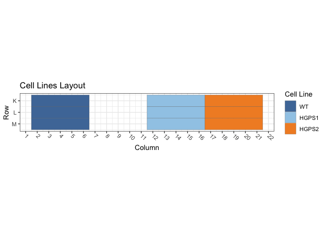
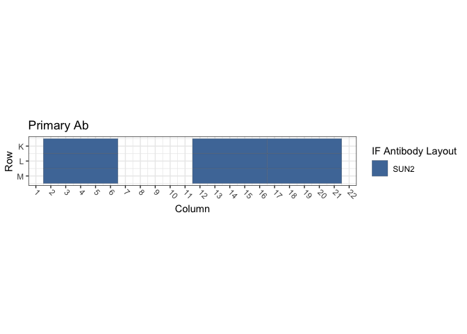
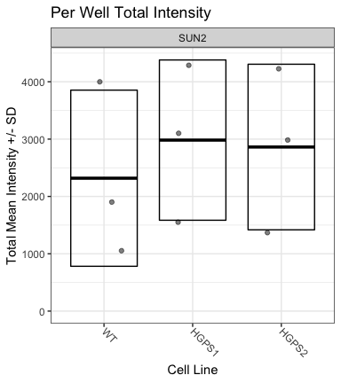
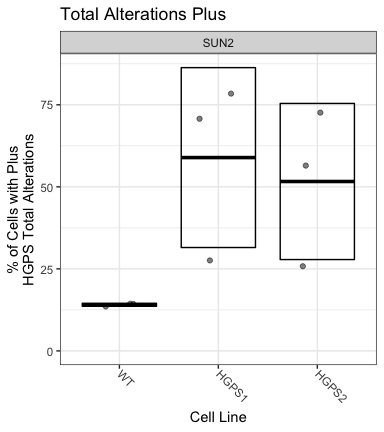

Figure S4B and S4C: hTERT-HGPS Cells / SUN2
================
Sandra Vidak/Gianluca Pegoraro
January 12th 2023

### Introduction

Columbus screen names:

`180129-40x-hFibro-GRP78-PDI-Hsp70-VCP-SUN2-LB1_20180129_123247`

`180205-40x-hFibro-Hsc70-SUN2_20180205_115714`

`180322-40X-hFibro-AtlantaFBS-HSp70-SUN2_20180322_160159`

### Analysis Setup

Load required packages.

``` r
library(tidyverse)
```

    ## ── Attaching packages ─────────────────────────────────────── tidyverse 1.3.2 ──
    ## ✔ ggplot2 3.3.6      ✔ purrr   0.3.5 
    ## ✔ tibble  3.1.8      ✔ dplyr   1.0.10
    ## ✔ tidyr   1.2.1      ✔ stringr 1.4.1 
    ## ✔ readr   2.1.3      ✔ forcats 0.5.2 
    ## ── Conflicts ────────────────────────────────────────── tidyverse_conflicts() ──
    ## ✖ dplyr::filter() masks stats::filter()
    ## ✖ dplyr::lag()    masks stats::lag()

``` r
library(fs)
library(Hmisc)
```

    ## Loading required package: lattice
    ## Loading required package: survival
    ## Loading required package: Formula
    ## 
    ## Attaching package: 'Hmisc'
    ## 
    ## The following objects are masked from 'package:dplyr':
    ## 
    ##     src, summarize
    ## 
    ## The following objects are masked from 'package:base':
    ## 
    ##     format.pval, units

``` r
library(ggthemes)
library(DescTools) # for Dunnett's Test
```

    ## 
    ## Attaching package: 'DescTools'
    ## 
    ## The following objects are masked from 'package:Hmisc':
    ## 
    ##     %nin%, Label, Mean, Quantile

``` r
library(curl)
```

    ## Using libcurl 7.79.1 with LibreSSL/3.3.6
    ## 
    ## Attaching package: 'curl'
    ## 
    ## The following object is masked from 'package:readr':
    ## 
    ##     parse_date

``` r
source("R/Plotters.R") #Functions needed for plotting
```

Set the palette and the running theme for ggplot2.

### Experimental Metadata

Read plate layouts.

``` r
cell_levs <- c("WT",
               "HGPS1","HGPS2")

plate_layouts <- read_tsv("metadata/plate_layout.txt") %>%
  filter(!is.na(cell_line)) %>%
  separate(col = cell_line, 
           into = c("cell_line", "cell_id"), 
           remove = T) %>%
  mutate(cell_line = factor(cell_line, levels = cell_levs))

glimpse(plate_layouts)
```

    ## Rows: 9
    ## Columns: 5
    ## $ row       <dbl> 11, 12, 13, 11, 12, 13, 11, 12, 13
    ## $ column    <dbl> 4, 4, 4, 14, 14, 14, 19, 19, 19
    ## $ marker    <chr> "SUN2", "SUN2", "SUN2", "SUN2", "SUN2", "SUN2", "SUN2", "SUN…
    ## $ cell_line <fct> WT, WT, WT, HGPS1, HGPS1, HGPS1, HGPS2, HGPS2, HGPS2
    ## $ cell_id   <chr> "CRL1474", "CRL1474", "CRL1474", "72T", "72T", "72T", "97T",…

Plot plate layouts.

<!-- -->

<!-- -->

### Download the data if needed

Download and unzip the Columbus results of the experiments from Figshare
if they have not been already downloaded.

``` r
if(!dir.exists("input")) {
  URL <- "https://figshare.com/ndownloader/files/38669312"
  curl_download(URL, "input.zip")
  unzip("input.zip")
}
```

### Read and Process Columbus data

Recursively search the `input` directory and its subdirectories for
files whose name includes the Glob patterns defined in the chunk above,
and read the cell-level Columbus data from the results text files.

``` r
read_columbus_results <- function(path, glob) {
  dir_ls(path = path,
         recurse = T,
         glob = glob)  %>%
    read_tsv(
      id = "file_name"
    ) %>%
    select(
      screen = ScreenName,
      plate = PlateName,
      well = WellName,
      row = Row,
      column = Column,
      nuc_area = `Nuclei Selected - Nucleus Area [px²]`,
      cyto_area = `Nuclei Selected - Cytoplasm Area [px²]`,
      cell_area = `Nuclei Selected - Cell Area [px²]`,
      nuc_marker_int = `Nuclei Selected - Intensity Nucleus BP600/37 Mean`,
      cyto_marker_int = `Nuclei Selected - Intensity Cytoplasm BP600/37 Mean`,
      ratio_marker_int = `Nuclei Selected - Nuc_Cyto_BP600_Ratio`
    )
}

glob_path <- "*- Nuclei Selected[0].txt"
col_tbl <- read_columbus_results("input", glob_path)

glimpse(col_tbl)
```

    ## Rows: 28,546
    ## Columns: 11
    ## $ screen           <chr> "180129-40x-hFibro-GRP78-PDI-Hsp70-VCP-SUN2-LB1_20180…
    ## $ plate            <chr> "Plate 2", "Plate 2", "Plate 2", "Plate 2", "Plate 2"…
    ## $ well             <chr> "E10", "E10", "E10", "E10", "E10", "E10", "E10", "E10…
    ## $ row              <dbl> 5, 5, 5, 5, 5, 5, 5, 5, 5, 5, 5, 5, 5, 5, 5, 5, 5, 5,…
    ## $ column           <dbl> 10, 10, 10, 10, 10, 10, 10, 10, 10, 10, 10, 10, 10, 1…
    ## $ nuc_area         <dbl> 1784, 1832, 1382, 2240, 1893, 1838, 1521, 2016, 1828,…
    ## $ cyto_area        <dbl> 16794, 10811, 5812, 15231, 18717, 15049, 16195, 15106…
    ## $ cell_area        <dbl> 18578, 12643, 7194, 17471, 20610, 16887, 17716, 17122…
    ## $ nuc_marker_int   <dbl> 2198.19, 2863.47, 2382.78, 1620.03, 2131.57, 1910.21,…
    ## $ cyto_marker_int  <dbl> 56.7475, 98.1154, 111.2580, 104.1530, 77.0161, 55.102…
    ## $ ratio_marker_int <dbl> 38.7363, 29.1848, 21.4167, 15.5543, 27.6770, 34.6663,…

Join Columbus data with the plate layout information.

``` r
cell_tbl <- col_tbl %>%
  mutate(sum_marker_int = nuc_marker_int + cyto_marker_int) %>%
  inner_join(plate_layouts,
             by = c("row", "column")) %>%
  select(screen,
         plate,
         well,
         row,
         column,
         cell_line,
         marker,
         nuc_area:sum_marker_int)

glimpse(cell_tbl)
```

    ## Rows: 5,799
    ## Columns: 14
    ## $ screen           <chr> "180129-40x-hFibro-GRP78-PDI-Hsp70-VCP-SUN2-LB1_20180…
    ## $ plate            <chr> "Plate 2", "Plate 2", "Plate 2", "Plate 2", "Plate 2"…
    ## $ well             <chr> "K14", "K14", "K14", "K14", "K14", "K14", "K14", "K14…
    ## $ row              <dbl> 11, 11, 11, 11, 11, 11, 11, 11, 11, 11, 11, 11, 11, 1…
    ## $ column           <dbl> 14, 14, 14, 14, 14, 14, 14, 14, 14, 14, 14, 14, 14, 1…
    ## $ cell_line        <fct> HGPS1, HGPS1, HGPS1, HGPS1, HGPS1, HGPS1, HGPS1, HGPS…
    ## $ marker           <chr> "SUN2", "SUN2", "SUN2", "SUN2", "SUN2", "SUN2", "SUN2…
    ## $ nuc_area         <dbl> 1798, 998, 1177, 1741, 1065, 1395, 1871, 1355, 1393, …
    ## $ cyto_area        <dbl> 7506, 13407, 15057, 11008, 9873, 10268, 4396, 9454, 1…
    ## $ cell_area        <dbl> 9304, 14405, 16234, 12749, 10938, 11663, 6267, 10809,…
    ## $ nuc_marker_int   <dbl> 3322.03, 3246.29, 3418.23, 3142.23, 3306.91, 3199.13,…
    ## $ cyto_marker_int  <dbl> 155.2020, 238.5410, 141.2080, 119.3790, 368.4010, 137…
    ## $ ratio_marker_int <dbl> 21.40460, 13.60900, 24.20700, 26.32160, 8.97639, 23.3…
    ## $ sum_marker_int   <dbl> 3477.232, 3484.831, 3559.438, 3261.609, 3675.311, 333…

Calculate number of cells and mean per well for all properties.

``` r
well_tbl <- cell_tbl %>%
  group_by(screen,
           well,
           row,
           column,
           cell_line,
           marker) %>%
  summarise(cell_n = n(),
            across(nuc_area:sum_marker_int,
                   list(mean = ~ mean(.x, na.rm = T))))

glimpse(well_tbl)
```

    ## Rows: 27
    ## Columns: 14
    ## Groups: screen, well, row, column, cell_line [27]
    ## $ screen                <chr> "180129-40x-hFibro-GRP78-PDI-Hsp70-VCP-SUN2-LB1_…
    ## $ well                  <chr> "K14", "K19", "K4", "L14", "L19", "L4", "M14", "…
    ## $ row                   <dbl> 11, 11, 11, 12, 12, 12, 13, 13, 13, 11, 11, 11, …
    ## $ column                <dbl> 14, 19, 4, 14, 19, 4, 14, 19, 4, 14, 19, 4, 14, …
    ## $ cell_line             <fct> HGPS1, HGPS2, WT, HGPS1, HGPS2, WT, HGPS1, HGPS2…
    ## $ marker                <chr> "SUN2", "SUN2", "SUN2", "SUN2", "SUN2", "SUN2", …
    ## $ cell_n                <int> 252, 363, 363, 200, 331, 347, 168, 314, 383, 56,…
    ## $ nuc_area_mean         <dbl> 1998.274, 1896.083, 2031.972, 2010.840, 1856.242…
    ## $ cyto_area_mean        <dbl> 13932.50, 11737.18, 13425.29, 15510.27, 12133.22…
    ## $ cell_area_mean        <dbl> 15930.77, 13633.26, 15457.26, 17521.11, 13989.46…
    ## $ nuc_marker_int_mean   <dbl> 3876.0342, 3968.7243, 3922.2297, 4069.1881, 4144…
    ## $ cyto_marker_int_mean  <dbl> 158.95285, 171.47414, 164.06064, 142.40597, 180.…
    ## $ ratio_marker_int_mean <dbl> 28.31480, 25.98381, 27.01795, 31.71242, 26.41947…
    ## $ sum_marker_int_mean   <dbl> 4034.987, 4140.198, 4087.453, 4211.594, 4325.201…

Calculate the mean of the technical replicates for each biological
replicate. Now every marker/cell line combination has an n = 3
biological replicates.

``` r
bioreps_tbl <- well_tbl %>%
  group_by(screen,
           cell_line,
           marker) %>%
  summarise(across(cell_n:sum_marker_int_mean,
                    ~ mean(.x, na.rm = T)))

glimpse(bioreps_tbl)
```

    ## Rows: 9
    ## Columns: 11
    ## Groups: screen, cell_line [9]
    ## $ screen                <chr> "180129-40x-hFibro-GRP78-PDI-Hsp70-VCP-SUN2-LB1_…
    ## $ cell_line             <fct> WT, HGPS1, HGPS2, WT, HGPS1, HGPS2, WT, HGPS1, H…
    ## $ marker                <chr> "SUN2", "SUN2", "SUN2", "SUN2", "SUN2", "SUN2", …
    ## $ cell_n                <dbl> 364.33333, 206.66667, 336.00000, 58.33333, 51.00…
    ## $ nuc_area_mean         <dbl> 2045.044, 1939.675, 1883.415, 1999.600, 2310.092…
    ## $ cyto_area_mean        <dbl> 13649.93, 14634.86, 12056.58, 17979.09, 23742.25…
    ## $ cell_area_mean        <dbl> 15694.97, 16574.53, 13940.00, 19978.69, 26052.35…
    ## $ nuc_marker_int_mean   <dbl> 3872.1786, 4158.5911, 4056.7656, 1751.4720, 3028…
    ## $ cyto_marker_int_mean  <dbl> 155.06364, 153.31415, 175.90256, 122.78147, 83.3…
    ## $ ratio_marker_int_mean <dbl> 27.81734, 30.55438, 26.37810, 15.03124, 39.32881…
    ## $ sum_marker_int_mean   <dbl> 4027.630, 4311.905, 4232.668, 1874.254, 3111.507…

### Biological Replicates Level plots for Figure S4B

<!-- -->

### Threshold quantifications

Calculate the mean and standard deviation for the pooled population of
controls cells (`WT1`) and on a per biological replicate and on a per
marker basis. Set the threshold for quantification of increases or
decreases at Mean +/- 1 SD.

``` r
thresholds_tbl <- cell_tbl %>% 
  filter(cell_line == "WT") %>%
  group_by(screen, marker) %>%
  summarise(across(nuc_marker_int:sum_marker_int,
                   list(mean_neg = ~ mean(.x, na.rm = T),
                        sd_neg = ~ sd(.x, na.rm = T)))) %>%
  mutate(nuc_marker_plus_thres = nuc_marker_int_mean_neg + 1.0*(nuc_marker_int_sd_neg),
         nuc_marker_minus_thres = nuc_marker_int_mean_neg - 1.0*(nuc_marker_int_sd_neg),
         cyto_marker_plus_thres = cyto_marker_int_mean_neg + 1.0*(cyto_marker_int_sd_neg),
         cyto_marker_minus_thres = cyto_marker_int_mean_neg - 1.0*(cyto_marker_int_sd_neg),
         sum_marker_plus_thres = sum_marker_int_mean_neg + 1.0*(sum_marker_int_sd_neg),
         sum_marker_minus_thres = sum_marker_int_mean_neg - 1.0*(sum_marker_int_sd_neg))

glimpse(thresholds_tbl)
```

    ## Rows: 3
    ## Columns: 16
    ## Groups: screen [3]
    ## $ screen                    <chr> "180129-40x-hFibro-GRP78-PDI-Hsp70-VCP-SUN2-…
    ## $ marker                    <chr> "SUN2", "SUN2", "SUN2"
    ## $ nuc_marker_int_mean_neg   <dbl> 3876.6206, 1737.1950, 987.9948
    ## $ nuc_marker_int_sd_neg     <dbl> 792.7592, 778.7165, 247.6729
    ## $ cyto_marker_int_mean_neg  <dbl> 155.32282, 123.66739, 63.95982
    ## $ cyto_marker_int_sd_neg    <dbl> 101.36280, 48.55601, 20.13510
    ## $ ratio_marker_int_mean_neg <dbl> 27.77254, 14.81713, 16.32121
    ## $ ratio_marker_int_sd_neg   <dbl> 7.769136, 6.830880, 4.823889
    ## $ sum_marker_int_mean_neg   <dbl> 4032.287, 1860.862, 1051.955
    ## $ sum_marker_int_sd_neg     <dbl> 820.3854, 795.3397, 253.7339
    ## $ nuc_marker_plus_thres     <dbl> 4669.380, 2515.911, 1235.668
    ## $ nuc_marker_minus_thres    <dbl> 3083.8614, 958.4785, 740.3219
    ## $ cyto_marker_plus_thres    <dbl> 256.68562, 172.22339, 84.09492
    ## $ cyto_marker_minus_thres   <dbl> 53.96002, 75.11138, 43.82472
    ## $ sum_marker_plus_thres     <dbl> 4852.672, 2656.202, 1305.689
    ## $ sum_marker_minus_thres    <dbl> 3211.9018, 1065.5227, 798.2207

``` r
defects_tbl <- cell_tbl %>%
  left_join(thresholds_tbl, by = c("screen", "marker")) %>%
  group_by(screen, row, column, cell_line, marker) %>%
  summarise(prop_defects_cyto_plus = 100 * mean(cyto_marker_int >= cyto_marker_plus_thres, na.rm = T),
            prop_defects_cyto_minus = 100 * mean(cyto_marker_int <= cyto_marker_minus_thres, na.rm = T),
            prop_defects_nuc_plus = 100 * mean(nuc_marker_int >= nuc_marker_plus_thres, na.rm = T),
            prop_defects_nuc_minus = 100 * mean(nuc_marker_int <= nuc_marker_minus_thres, na.rm = T),
            prop_defects_sum_plus = 100 * mean(sum_marker_int >= sum_marker_plus_thres, na.rm = T),
            prop_defects_sum_minus = 100 * mean(sum_marker_int <= sum_marker_minus_thres, na.rm = T)) %>%
  arrange(screen, marker, cell_line)

glimpse(defects_tbl)
```

    ## Rows: 27
    ## Columns: 11
    ## Groups: screen, row, column, cell_line [27]
    ## $ screen                  <chr> "180129-40x-hFibro-GRP78-PDI-Hsp70-VCP-SUN2-LB…
    ## $ row                     <dbl> 11, 12, 13, 11, 12, 13, 11, 12, 13, 11, 12, 13…
    ## $ column                  <dbl> 4, 4, 4, 14, 14, 14, 19, 19, 19, 4, 4, 4, 14, …
    ## $ cell_line               <fct> WT, WT, WT, HGPS1, HGPS1, HGPS1, HGPS2, HGPS2,…
    ## $ marker                  <chr> "SUN2", "SUN2", "SUN2", "SUN2", "SUN2", "SUN2"…
    ## $ prop_defects_cyto_plus  <dbl> 7.182320, 3.458213, 5.483029, 8.333333, 6.5000…
    ## $ prop_defects_cyto_minus <dbl> 0.0000000, 0.5763689, 0.0000000, 1.5873016, 0.…
    ## $ prop_defects_nuc_plus   <dbl> 15.426997, 8.645533, 19.321149, 13.095238, 24.…
    ## $ prop_defects_nuc_minus  <dbl> 11.019284, 18.155620, 14.099217, 14.285714, 13…
    ## $ prop_defects_sum_plus   <dbl> 15.469613, 8.645533, 18.798956, 13.492063, 24.…
    ## $ prop_defects_sum_minus  <dbl> 12.154696, 18.731988, 13.838120, 13.888889, 13…

``` r
bioreps_defects_tbl <- defects_tbl %>%
  group_by(screen, cell_line, marker) %>%
  summarise(across(prop_defects_cyto_plus:prop_defects_sum_minus,
                   list(mean = ~ mean(.x, na.rm = T),
                        sd = ~ sd(.x, na.rm = T))))

glimpse(bioreps_defects_tbl)
```

    ## Rows: 9
    ## Columns: 15
    ## Groups: screen, cell_line [9]
    ## $ screen                       <chr> "180129-40x-hFibro-GRP78-PDI-Hsp70-VCP-SU…
    ## $ cell_line                    <fct> WT, HGPS1, HGPS2, WT, HGPS1, HGPS2, WT, H…
    ## $ marker                       <chr> "SUN2", "SUN2", "SUN2", "SUN2", "SUN2", "…
    ## $ prop_defects_cyto_plus_mean  <dbl> 5.374521, 7.523810, 10.075916, 10.975848,…
    ## $ prop_defects_cyto_plus_sd    <dbl> 1.8644233, 0.9352628, 1.3715656, 4.018727…
    ## $ prop_defects_cyto_minus_mean <dbl> 0.1921230, 0.8941799, 0.4191763, 9.372266…
    ## $ prop_defects_cyto_minus_sd   <dbl> 0.3327667, 0.6021469, 0.4883457, 5.206874…
    ## $ prop_defects_nuc_plus_mean   <dbl> 14.46456, 28.40476, 25.22168, 14.94731, 7…
    ## $ prop_defects_nuc_plus_sd     <dbl> 5.402491, 17.590018, 4.916007, 6.839293, …
    ## $ prop_defects_nuc_minus_mean  <dbl> 14.424707, 12.238095, 13.355277, 13.08722…
    ## $ prop_defects_nuc_minus_sd    <dbl> 3.5792849, 2.8929306, 2.7060764, 2.154790…
    ## $ prop_defects_sum_plus_mean   <dbl> 14.30470, 27.57672, 25.79039, 13.52887, 7…
    ## $ prop_defects_sum_plus_sd     <dbl> 5.175979, 16.172425, 4.489067, 5.087110, …
    ## $ prop_defects_sum_minus_mean  <dbl> 14.908268, 12.304233, 12.869507, 12.37800…
    ## $ prop_defects_sum_minus_sd    <dbl> 3.4167391, 2.4157553, 3.1627430, 2.614508…

### Biological Replicates Level plots for Figure S4C

<!-- -->

### Calculate Dunnett’s test for the continuous variables.

Define a custom function to run a Dunnett post-hoc test only on the Mean
marker intensity sum (Cyto + Nucleus), using the cell line as the
predictor variable, and fixing WT1 as the negative control. The output
of the Dunnett’s test is then rearranged to a tidy table to make it work
with `dplyr`.

``` r
calc_dunnett <- function(df){
  as.data.frame(as.table(DunnettTest(sum_marker_int_mean ~ cell_line,
                          control = "WT",
                          data = df)$WT)) %>%
    pivot_wider(names_from = Var2, values_from = Freq) %>%
    rename(comparison = Var1)
}
```

Run the custom function on all the data grouped based on the IF marker
and save the data to a .csv file.

``` r
dunnett_test <- bioreps_tbl %>%
  group_by(marker) %>%
  group_modify(~ calc_dunnett(.x))

write_csv(dunnett_test, "output/dunnett_results.csv")

knitr::kable(dunnett_test, digits = 3)
```

| marker | comparison |    diff |    lwr.ci |   upr.ci |  pval |
|:-------|:-----------|--------:|----------:|---------:|------:|
| SUN2   | HGPS1-WT   | 664.624 | -2753.260 | 4082.508 | 0.807 |
| SUN2   | HGPS2-WT   | 543.983 | -2873.901 | 3961.867 | 0.864 |

### Chi-square test for counts/proportion of Cells with defects

Calculate the number of cells with defects and normal on a per well
basis. Each treatment has 12 wells (4 technical replicates X 3
biological replicates)

``` r
defects_counts <- cell_tbl %>%
  left_join(thresholds_tbl, by = c("screen", "marker")) %>%
  group_by(screen, row, column, cell_line, marker) %>%
  summarise(n_cells = n(),
            cyto_plus_def = sum(cyto_marker_int >= cyto_marker_plus_thres, na.rm = T),
            cyto_minus_def = sum(cyto_marker_int <= cyto_marker_minus_thres, na.rm = T),
            nuc_plus_def = sum(nuc_marker_int >= nuc_marker_plus_thres, na.rm = T),
            nuc_minus_def = sum(nuc_marker_int <= nuc_marker_minus_thres, na.rm = T),
            sum_plus_def = sum(sum_marker_int >= sum_marker_plus_thres, na.rm = T),
            sum_minus_def = sum(sum_marker_int <= sum_marker_minus_thres, na.rm = T)) %>%
  mutate(across(cyto_plus_def:sum_minus_def,
                list(norm = ~ n_cells - .x))) %>%
  rename_with( ~ gsub("def_norm", "norm", .x, fixed = TRUE)) %>%
  arrange(screen, marker, cell_line)

defects_counts
```

    ## # A tibble: 27 × 18
    ## # Groups:   screen, row, column, cell_line [27]
    ##    screen      row column cell_…¹ marker n_cells cyto_…² cyto_…³ nuc_p…⁴ nuc_m…⁵
    ##    <chr>     <dbl>  <dbl> <fct>   <chr>    <int>   <int>   <int>   <int>   <int>
    ##  1 180129-4…    11      4 WT      SUN2       363      26       0      56      40
    ##  2 180129-4…    12      4 WT      SUN2       347      12       2      30      63
    ##  3 180129-4…    13      4 WT      SUN2       383      21       0      74      54
    ##  4 180129-4…    11     14 HGPS1   SUN2       252      21       4      33      36
    ##  5 180129-4…    12     14 HGPS1   SUN2       200      13       1      49      27
    ##  6 180129-4…    13     14 HGPS1   SUN2       168      13       1      80      15
    ##  7 180129-4…    11     19 HGPS2   SUN2       363      31       0      71      47
    ##  8 180129-4…    12     19 HGPS2   SUN2       331      37       1      94      36
    ##  9 180129-4…    13     19 HGPS2   SUN2       314      33       3      87      51
    ## 10 180205-4…    11      4 WT      SUN2        65       9      10       5      10
    ## # … with 17 more rows, 8 more variables: sum_plus_def <int>,
    ## #   sum_minus_def <int>, cyto_plus_norm <int>, cyto_minus_norm <int>,
    ## #   nuc_plus_norm <int>, nuc_minus_norm <int>, sum_plus_norm <int>,
    ## #   sum_minus_norm <int>, and abbreviated variable names ¹​cell_line,
    ## #   ²​cyto_plus_def, ³​cyto_minus_def, ⁴​nuc_plus_def, ⁵​nuc_minus_def

Summarize the counts by taking the mean of all 12 wells per condition,
then pivot the table longer to put in a format that can be handled by
xtabs downstream.

``` r
defects_counts_long <- defects_counts %>%
  select(-n_cells) %>%
  group_by(marker, cell_line) %>%
  summarise(across(cyto_plus_def:sum_minus_norm, # Take the mean of all the wells in all the technical and biological replicates
              ~ mean(.x, na.rm = TRUE))) %>% 
  pivot_longer(cols = cyto_plus_def:sum_minus_norm,
               names_pattern = "(.*_.*)_(.*)",
               names_to = c("type", "quality"),
               values_to = "count")

defects_counts_long
```

    ## # A tibble: 36 × 5
    ## # Groups:   marker [1]
    ##    marker cell_line type       quality count
    ##    <chr>  <fct>     <chr>      <chr>   <dbl>
    ##  1 SUN2   WT        cyto_plus  def      21.3
    ##  2 SUN2   WT        cyto_minus def      12.8
    ##  3 SUN2   WT        nuc_plus   def      36.1
    ##  4 SUN2   WT        nuc_minus  def      35.9
    ##  5 SUN2   WT        sum_plus   def      35.8
    ##  6 SUN2   WT        sum_minus  def      36.4
    ##  7 SUN2   WT        cyto_plus  norm    229. 
    ##  8 SUN2   WT        cyto_minus norm    238. 
    ##  9 SUN2   WT        nuc_plus   norm    214. 
    ## 10 SUN2   WT        nuc_minus  norm    215. 
    ## # … with 26 more rows

Define a function that calculate a contingency table of counts based on
the cell line and the cell class (normal/defects). The table is then
used to calculate the chi-square test to determine whether any of the 6
cell lines is different from the others in terms of proportion of
defects.

``` r
calc_chi <- function(df){
    xtabs_tbl <- xtabs(count ~ cell_line + quality, data = df)
    broom::tidy(chisq.test(xtabs_tbl))
}
```

Apply the function on a per IF marker and on a per defect category to
calculate the p-values on a per IF marker and defect type basis.

``` r
chi_square_test <- defects_counts_long %>%
  group_by(marker, type) %>%
  group_modify(~ calc_chi(.x))

write_csv(chi_square_test, "output/chi_square_results.csv")

knitr::kable(chi_square_test, digits = 3)
```

| marker | type       | statistic | p.value | parameter | method                     |
|:-------|:-----------|----------:|--------:|----------:|:---------------------------|
| SUN2   | cyto_minus |     3.060 |   0.217 |         2 | Pearson’s Chi-squared test |
| SUN2   | cyto_plus  |     6.667 |   0.036 |         2 | Pearson’s Chi-squared test |
| SUN2   | nuc_minus  |     7.581 |   0.023 |         2 | Pearson’s Chi-squared test |
| SUN2   | nuc_plus   |    90.055 |   0.000 |         2 | Pearson’s Chi-squared test |
| SUN2   | sum_minus  |     8.288 |   0.016 |         2 | Pearson’s Chi-squared test |
| SUN2   | sum_plus   |    88.860 |   0.000 |         2 | Pearson’s Chi-squared test |

Document the information about the analysis session

``` r
sessionInfo()
```

    ## R version 4.2.2 (2022-10-31)
    ## Platform: x86_64-apple-darwin17.0 (64-bit)
    ## Running under: macOS Big Sur ... 10.16
    ## 
    ## Matrix products: default
    ## BLAS:   /Library/Frameworks/R.framework/Versions/4.2/Resources/lib/libRblas.0.dylib
    ## LAPACK: /Library/Frameworks/R.framework/Versions/4.2/Resources/lib/libRlapack.dylib
    ## 
    ## locale:
    ## [1] en_US.UTF-8/en_US.UTF-8/en_US.UTF-8/C/en_US.UTF-8/en_US.UTF-8
    ## 
    ## attached base packages:
    ## [1] stats     graphics  grDevices utils     datasets  methods   base     
    ## 
    ## other attached packages:
    ##  [1] curl_4.3.3        DescTools_0.99.47 ggthemes_4.2.4    Hmisc_4.7-1      
    ##  [5] Formula_1.2-4     survival_3.4-0    lattice_0.20-45   fs_1.5.2         
    ##  [9] forcats_0.5.2     stringr_1.4.1     dplyr_1.0.10      purrr_0.3.5      
    ## [13] readr_2.1.3       tidyr_1.2.1       tibble_3.1.8      ggplot2_3.3.6    
    ## [17] tidyverse_1.3.2  
    ## 
    ## loaded via a namespace (and not attached):
    ##  [1] bit64_4.0.5         lubridate_1.8.0     RColorBrewer_1.1-3 
    ##  [4] httr_1.4.4          tools_4.2.2         backports_1.4.1    
    ##  [7] utf8_1.2.2          R6_2.5.1            rpart_4.1.19       
    ## [10] DBI_1.1.3           colorspace_2.0-3    nnet_7.3-18        
    ## [13] withr_2.5.0         Exact_3.2           tidyselect_1.2.0   
    ## [16] gridExtra_2.3       bit_4.0.4           compiler_4.2.2     
    ## [19] cli_3.4.1           rvest_1.0.3         htmlTable_2.4.1    
    ## [22] expm_0.999-6        xml2_1.3.3          labeling_0.4.2     
    ## [25] scales_1.2.1        checkmate_2.1.0     mvtnorm_1.1-3      
    ## [28] proxy_0.4-27        digest_0.6.30       foreign_0.8-84     
    ## [31] rmarkdown_2.17      base64enc_0.1-3     jpeg_0.1-9         
    ## [34] pkgconfig_2.0.3     htmltools_0.5.3     highr_0.9          
    ## [37] dbplyr_2.2.1        fastmap_1.1.0       htmlwidgets_1.5.4  
    ## [40] rlang_1.0.6         readxl_1.4.1        rstudioapi_0.14    
    ## [43] farver_2.1.1        generics_0.1.3      jsonlite_1.8.3     
    ## [46] vroom_1.6.0         googlesheets4_1.0.1 magrittr_2.0.3     
    ## [49] interp_1.1-3        Matrix_1.5-3        Rcpp_1.0.9         
    ## [52] munsell_0.5.0       fansi_1.0.3         lifecycle_1.0.3    
    ## [55] stringi_1.7.8       yaml_2.3.6          rootSolve_1.8.2.3  
    ## [58] MASS_7.3-58.1       grid_4.2.2          parallel_4.2.2     
    ## [61] crayon_1.5.2        lmom_2.9            deldir_1.0-6       
    ## [64] haven_2.5.1         splines_4.2.2       hms_1.1.2          
    ## [67] knitr_1.40          pillar_1.8.1        boot_1.3-28.1      
    ## [70] gld_2.6.6           reprex_2.0.2        glue_1.6.2         
    ## [73] evaluate_0.17       latticeExtra_0.6-30 data.table_1.14.4  
    ## [76] modelr_0.1.9        png_0.1-7           vctrs_0.5.0        
    ## [79] tzdb_0.3.0          cellranger_1.1.0    gtable_0.3.1       
    ## [82] assertthat_0.2.1    xfun_0.34           broom_1.0.1        
    ## [85] e1071_1.7-12        class_7.3-20        googledrive_2.0.0  
    ## [88] gargle_1.2.1        cluster_2.1.4       ellipsis_0.3.2
