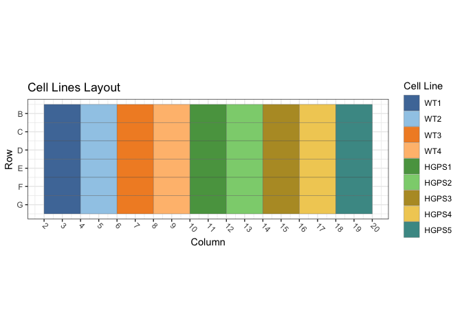
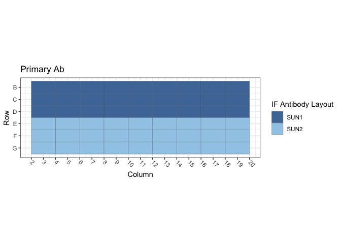
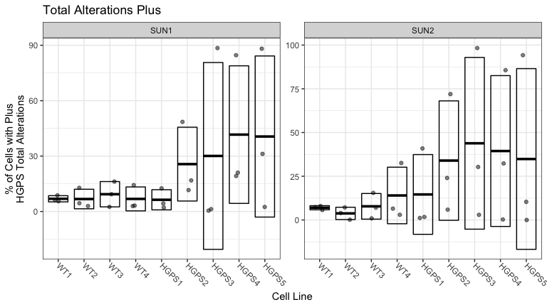

Figure S4B and S4C: Primary-HGPS Cells
================
Sandra Vidak/Gianluca Pegoraro
October 31st 2022

### Introduction

Columbus screen names:

`220303-40x-hFibro-SUN1-SUN2-LAP2a-H4K16ac_20220303_130910`

`220309-40x-hFibro-SUN1-SUN2-LAP2a-H4K16ac_20220309_113926`

`220310-40x-hFibro-SUN1-SUN2-LAP2a-H4K16ac_20220310_111540`

### Analysis Setup

Load required packages.

``` r
library(tidyverse)
```

    ## ── Attaching packages ─────────────────────────────────────── tidyverse 1.3.2 ──
    ## ✔ ggplot2 3.3.6      ✔ purrr   0.3.5 
    ## ✔ tibble  3.1.8      ✔ dplyr   1.0.10
    ## ✔ tidyr   1.2.1      ✔ stringr 1.4.1 
    ## ✔ readr   2.1.3      ✔ forcats 0.5.2 
    ## ── Conflicts ────────────────────────────────────────── tidyverse_conflicts() ──
    ## ✖ dplyr::filter() masks stats::filter()
    ## ✖ dplyr::lag()    masks stats::lag()

``` r
library(fs)
library(Hmisc)
```

    ## Loading required package: lattice
    ## Loading required package: survival
    ## Loading required package: Formula
    ## 
    ## Attaching package: 'Hmisc'
    ## 
    ## The following objects are masked from 'package:dplyr':
    ## 
    ##     src, summarize
    ## 
    ## The following objects are masked from 'package:base':
    ## 
    ##     format.pval, units

``` r
library(ggthemes)
library(DescTools) # for Dunnett's Test
```

    ## 
    ## Attaching package: 'DescTools'
    ## 
    ## The following objects are masked from 'package:Hmisc':
    ## 
    ##     %nin%, Label, Mean, Quantile

``` r
source("R/Plotters.R") #Functions needed for plotting
```

Set the palette and the running theme for ggplot2.

### Experimental Metadata

Read plate layouts.

``` r
cell_levs <- c("WT1", "WT2", "WT3","WT4", 
               "HGPS1","HGPS2",
               "HGPS3", "HGPS4","HGPS5")

plate_layouts <- read_tsv("metadata/plate_layout.txt") %>%
  filter(!is.na(cell_line)) %>%
  separate(col = cell_line, 
           into = c("cell_line", "cell_id"), 
           remove = T) %>%
  mutate(cell_line = factor(cell_line, levels = cell_levs))

glimpse(plate_layouts)
```

    ## Rows: 54
    ## Columns: 5
    ## $ row       <dbl> 2, 3, 4, 5, 6, 7, 2, 3, 4, 5, 6, 7, 2, 3, 4, 5, 6, 7, 2, 3, …
    ## $ column    <dbl> 3, 3, 3, 3, 3, 3, 5, 5, 5, 5, 5, 5, 7, 7, 7, 7, 7, 7, 9, 9, …
    ## $ marker    <chr> "SUN1", "SUN1", "SUN1", "SUN2", "SUN2", "SUN2", "SUN1", "SUN…
    ## $ cell_line <fct> WT1, WT1, WT1, WT1, WT1, WT1, WT2, WT2, WT2, WT2, WT2, WT2, …
    ## $ cell_id   <chr> "GM00038", "GM00038", "GM00038", "GM00038", "GM00038", "GM00…

Plot plate layouts.

<!-- -->

<!-- -->

### Read and Process Columbus data

Recursively search the `input` directory and its subdirectories for
files whose name includes the Glob patterns defined in the chunk above,
and read the cell-level Columbus data from the results text files.

``` r
read_columbus_results <- function(path, glob) {
  dir_ls(path = path,
         recurse = T,
         glob = glob)  %>%
    read_tsv(
      id = "file_name"
    ) %>%
    select(
      screen = ScreenName,
      plate = PlateName,
      well = WellName,
      row = Row,
      column = Column,
      nuc_area = `Nuclei Selected - Nucleus Area [px²]`,
      cyto_area = `Nuclei Selected - Cytoplasm Area [px²]`,
      cell_area = `Nuclei Selected - Cell Area [px²]`,
      nuc_marker_int = `Nuclei Selected - Intensity Nucleus BP600/37 Mean`,
      cyto_marker_int = `Nuclei Selected - Intensity Cytoplasm BP600/37 Mean`,
      ratio_marker_int = `Nuclei Selected - Nuc_Cyto_BP600_Ratio`
    )
}

glob_path <- "*- Nuclei Selected[0].txt"
col_tbl <- read_columbus_results("input", glob_path)

glimpse(col_tbl)
```

    ## Rows: 70,591
    ## Columns: 11
    ## $ screen           <chr> "220309-40x-hFibro-SUN1-SUN2-LAP2a-H4K16ac_20220309_1…
    ## $ plate            <chr> "Plate1", "Plate1", "Plate1", "Plate1", "Plate1", "Pl…
    ## $ well             <chr> "B11", "B11", "B11", "B11", "B11", "B11", "B11", "B11…
    ## $ row              <dbl> 2, 2, 2, 2, 2, 2, 2, 2, 2, 2, 2, 2, 2, 2, 2, 2, 2, 2,…
    ## $ column           <dbl> 11, 11, 11, 11, 11, 11, 11, 11, 11, 11, 11, 11, 11, 1…
    ## $ nuc_area         <dbl> 1874, 1515, 1823, 2347, 1202, 1612, 1398, 1228, 2380,…
    ## $ cyto_area        <dbl> 16677, 20919, 9297, 22382, 9923, 9392, 9036, 11801, 9…
    ## $ cell_area        <dbl> 18551, 22434, 11120, 24729, 11125, 11004, 10434, 1302…
    ## $ nuc_marker_int   <dbl> 941.571, 730.678, 790.780, 881.594, 674.132, 735.940,…
    ## $ cyto_marker_int  <dbl> 207.521, 232.294, 193.547, 162.345, 217.352, 211.475,…
    ## $ ratio_marker_int <dbl> 4.53723, 3.14548, 4.08573, 5.43038, 3.10158, 3.48003,…

Join Columbus data with the plate layout information.

``` r
cell_tbl <- col_tbl %>%
  mutate(sum_marker_int = nuc_marker_int + cyto_marker_int) %>%
  inner_join(plate_layouts,
             by = c("row", "column")) %>%
  select(screen,
         plate,
         well,
         row,
         column,
         cell_line,
         marker,
         nuc_area:sum_marker_int)

glimpse(cell_tbl)
```

    ## Rows: 31,318
    ## Columns: 14
    ## $ screen           <chr> "220309-40x-hFibro-SUN1-SUN2-LAP2a-H4K16ac_20220309_1…
    ## $ plate            <chr> "Plate1", "Plate1", "Plate1", "Plate1", "Plate1", "Pl…
    ## $ well             <chr> "B11", "B11", "B11", "B11", "B11", "B11", "B11", "B11…
    ## $ row              <dbl> 2, 2, 2, 2, 2, 2, 2, 2, 2, 2, 2, 2, 2, 2, 2, 2, 2, 2,…
    ## $ column           <dbl> 11, 11, 11, 11, 11, 11, 11, 11, 11, 11, 11, 11, 11, 1…
    ## $ cell_line        <fct> HGPS1, HGPS1, HGPS1, HGPS1, HGPS1, HGPS1, HGPS1, HGPS…
    ## $ marker           <chr> "SUN1", "SUN1", "SUN1", "SUN1", "SUN1", "SUN1", "SUN1…
    ## $ nuc_area         <dbl> 1874, 1515, 1823, 2347, 1202, 1612, 1398, 1228, 2380,…
    ## $ cyto_area        <dbl> 16677, 20919, 9297, 22382, 9923, 9392, 9036, 11801, 9…
    ## $ cell_area        <dbl> 18551, 22434, 11120, 24729, 11125, 11004, 10434, 1302…
    ## $ nuc_marker_int   <dbl> 941.571, 730.678, 790.780, 881.594, 674.132, 735.940,…
    ## $ cyto_marker_int  <dbl> 207.521, 232.294, 193.547, 162.345, 217.352, 211.475,…
    ## $ ratio_marker_int <dbl> 4.53723, 3.14548, 4.08573, 5.43038, 3.10158, 3.48003,…
    ## $ sum_marker_int   <dbl> 1149.092, 962.972, 984.327, 1043.939, 891.484, 947.41…

Calculate number of cells and mean per well for all properties.

``` r
well_tbl <- cell_tbl %>%
  group_by(screen,
           well,
           row,
           column,
           cell_line,
           marker) %>%
  summarise(cell_n = n(),
            across(nuc_area:sum_marker_int,
                   list(mean = ~ mean(.x, na.rm = T))))

glimpse(well_tbl)
```

    ## Rows: 162
    ## Columns: 14
    ## Groups: screen, well, row, column, cell_line [162]
    ## $ screen                <chr> "220303-40x-hFibro-SUN1-SUN2-LAP2a-H4K16ac_20220…
    ## $ well                  <chr> "B11", "B13", "B15", "B17", "B19", "B3", "B5", "…
    ## $ row                   <dbl> 2, 2, 2, 2, 2, 2, 2, 2, 2, 3, 3, 3, 3, 3, 3, 3, …
    ## $ column                <dbl> 11, 13, 15, 17, 19, 3, 5, 7, 9, 11, 13, 15, 17, …
    ## $ cell_line             <fct> HGPS1, HGPS2, HGPS3, HGPS4, HGPS5, WT1, WT2, WT3…
    ## $ marker                <chr> "SUN1", "SUN1", "SUN1", "SUN1", "SUN1", "SUN1", …
    ## $ cell_n                <int> 169, 241, 72, 36, 71, 149, 212, 178, 324, 138, 2…
    ## $ nuc_area_mean         <dbl> 2677.195, 2091.631, 2219.639, 2669.806, 2841.282…
    ## $ cyto_area_mean        <dbl> 20526.36, 15976.34, 24467.83, 31837.97, 34015.51…
    ## $ cell_area_mean        <dbl> 23203.56, 18067.98, 26687.47, 34507.78, 36856.79…
    ## $ nuc_marker_int_mean   <dbl> 1411.2577, 1167.9243, 922.0630, 1370.0743, 1308.…
    ## $ cyto_marker_int_mean  <dbl> 234.4080, 198.0270, 170.4824, 155.9978, 167.3340…
    ## $ ratio_marker_int_mean <dbl> 6.239420, 6.041677, 5.412958, 8.694511, 7.777448…
    ## $ sum_marker_int_mean   <dbl> 1645.666, 1369.190, 1092.545, 1526.072, 1475.974…

Calculate the mean of the technical replicates for each biological
replicate. Now every marker/cell line combination has an n = 3
biological replicates.

``` r
bioreps_tbl <- well_tbl %>%
  group_by(screen,
           cell_line,
           marker) %>%
  summarise(across(cell_n:sum_marker_int_mean,
                    ~ mean(.x, na.rm = T)))

glimpse(bioreps_tbl)
```

    ## Rows: 54
    ## Columns: 11
    ## Groups: screen, cell_line [27]
    ## $ screen                <chr> "220303-40x-hFibro-SUN1-SUN2-LAP2a-H4K16ac_20220…
    ## $ cell_line             <fct> WT1, WT1, WT2, WT2, WT3, WT3, WT4, WT4, HGPS1, H…
    ## $ marker                <chr> "SUN1", "SUN2", "SUN1", "SUN2", "SUN1", "SUN2", …
    ## $ cell_n                <dbl> 170.66667, 163.33333, 195.33333, 179.66667, 203.…
    ## $ nuc_area_mean         <dbl> 2363.474, 2384.871, 2316.011, 2260.823, 2363.528…
    ## $ cyto_area_mean        <dbl> 19515.07, 20312.50, 17971.76, 18289.58, 17328.45…
    ## $ cell_area_mean        <dbl> 21878.55, 22697.37, 20287.77, 20550.40, 19691.98…
    ## $ nuc_marker_int_mean   <dbl> 1446.2981, 1204.4960, 1468.3155, 1154.7796, 1562…
    ## $ cyto_marker_int_mean  <dbl> 255.9489, 194.3230, 307.3884, 213.1976, 317.9541…
    ## $ ratio_marker_int_mean <dbl> 6.042201, 6.606857, 4.888767, 5.818362, 5.091318…
    ## $ sum_marker_int_mean   <dbl> 1702.2471, 1398.8190, 1775.7039, 1367.9773, 1880…

### Threshold quantifications

Calculate the mean and standard deviation for the pooled population of
controls cells (`WT1`) and on a per biological replicate and on a per
marker basis. Set the threshold for quantification of increases or
decreases at Mean +/- 1.5 SD.

``` r
thresholds_tbl <- cell_tbl %>% 
  filter(cell_line == "WT1") %>%
  group_by(screen, marker) %>%
  summarise(across(nuc_marker_int:sum_marker_int,
                   list(mean_neg = ~ mean(.x, na.rm = T),
                        sd_neg = ~ sd(.x, na.rm = T)))) %>%
  mutate(nuc_marker_plus_thres = nuc_marker_int_mean_neg + 1.5*(nuc_marker_int_sd_neg),
         nuc_marker_minus_thres = nuc_marker_int_mean_neg - 1.5*(nuc_marker_int_sd_neg),
         cyto_marker_plus_thres = cyto_marker_int_mean_neg + 1.5*(cyto_marker_int_sd_neg),
         cyto_marker_minus_thres = cyto_marker_int_mean_neg - 1.5*(cyto_marker_int_sd_neg),
         sum_marker_plus_thres = sum_marker_int_mean_neg + 1.5*(sum_marker_int_sd_neg),
         sum_marker_minus_thres = sum_marker_int_mean_neg - 1.5*(sum_marker_int_sd_neg))

glimpse(thresholds_tbl)
```

    ## Rows: 6
    ## Columns: 16
    ## Groups: screen [3]
    ## $ screen                    <chr> "220303-40x-hFibro-SUN1-SUN2-LAP2a-H4K16ac_2…
    ## $ marker                    <chr> "SUN1", "SUN2", "SUN1", "SUN2", "SUN1", "SUN…
    ## $ nuc_marker_int_mean_neg   <dbl> 1467.0537, 1207.0447, 761.7166, 1287.6080, 8…
    ## $ nuc_marker_int_sd_neg     <dbl> 392.1018, 296.5988, 219.4046, 295.7684, 270.…
    ## $ cyto_marker_int_mean_neg  <dbl> 261.7170, 195.6166, 255.8531, 192.3451, 196.…
    ## $ cyto_marker_int_sd_neg    <dbl> 87.79002, 61.52295, 87.56734, 75.21565, 65.3…
    ## $ ratio_marker_int_mean_neg <dbl> 5.975924, 6.582741, 3.187949, 7.367358, 4.54…
    ## $ ratio_marker_int_sd_neg   <dbl> 1.733026, 2.135376, 1.057102, 2.546626, 1.68…
    ## $ sum_marker_int_mean_neg   <dbl> 1728.771, 1402.661, 1017.570, 1479.953, 1036…
    ## $ sum_marker_int_sd_neg     <dbl> 444.6792, 314.2962, 271.9222, 326.5382, 297.…
    ## $ nuc_marker_plus_thres     <dbl> 2055.206, 1651.943, 1090.824, 1731.261, 1245…
    ## $ nuc_marker_minus_thres    <dbl> 878.9011, 762.1465, 432.6097, 843.9553, 434.…
    ## $ cyto_marker_plus_thres    <dbl> 393.4020, 287.9010, 387.2041, 305.1685, 294.…
    ## $ cyto_marker_minus_thres   <dbl> 130.03193, 103.33213, 124.50209, 79.52160, 9…
    ## $ sum_marker_plus_thres     <dbl> 2395.790, 1874.106, 1425.453, 1969.760, 1483…
    ## $ sum_marker_minus_thres    <dbl> 1061.7518, 931.2170, 609.6864, 990.1457, 590…

``` r
defects_tbl <- cell_tbl %>%
  left_join(thresholds_tbl, by = c("screen", "marker")) %>%
  group_by(screen, row, column, cell_line, marker) %>%
  summarise(prop_defects_cyto_plus = 100 * mean(cyto_marker_int >= cyto_marker_plus_thres, na.rm = T),
            prop_defects_cyto_minus = 100 * mean(cyto_marker_int <= cyto_marker_minus_thres, na.rm = T),
            prop_defects_nuc_plus = 100 * mean(nuc_marker_int >= nuc_marker_plus_thres, na.rm = T),
            prop_defects_nuc_minus = 100 * mean(nuc_marker_int <= nuc_marker_minus_thres, na.rm = T),
            prop_defects_sum_plus = 100 * mean(sum_marker_int >= sum_marker_plus_thres, na.rm = T),
            prop_defects_sum_minus = 100 * mean(sum_marker_int <= sum_marker_minus_thres, na.rm = T)) %>%
  arrange(screen, marker, cell_line)

glimpse(defects_tbl)
```

    ## Rows: 162
    ## Columns: 11
    ## Groups: screen, row, column, cell_line [162]
    ## $ screen                  <chr> "220303-40x-hFibro-SUN1-SUN2-LAP2a-H4K16ac_202…
    ## $ row                     <dbl> 2, 3, 4, 2, 3, 4, 2, 3, 4, 2, 3, 4, 2, 3, 4, 2…
    ## $ column                  <dbl> 3, 3, 3, 5, 5, 5, 7, 7, 7, 9, 9, 9, 11, 11, 11…
    ## $ cell_line               <fct> WT1, WT1, WT1, WT2, WT2, WT2, WT3, WT3, WT3, W…
    ## $ marker                  <chr> "SUN1", "SUN1", "SUN1", "SUN1", "SUN1", "SUN1"…
    ## $ prop_defects_cyto_plus  <dbl> 0.0000000, 3.7837838, 8.9887640, 0.9433962, 12…
    ## $ prop_defects_cyto_minus <dbl> 17.4496644, 0.0000000, 0.0000000, 0.0000000, 0…
    ## $ prop_defects_nuc_plus   <dbl> 0.0000000, 5.9459459, 13.4831461, 2.8301887, 5…
    ## $ prop_defects_nuc_minus  <dbl> 21.4765101, 1.0810811, 0.0000000, 3.3018868, 0…
    ## $ prop_defects_sum_plus   <dbl> 0.000000, 3.783784, 12.921348, 2.830189, 5.056…
    ## $ prop_defects_sum_minus  <dbl> 25.5033557, 0.0000000, 0.0000000, 2.3584906, 0…

``` r
bioreps_defects_tbl <- defects_tbl %>%
  group_by(screen, cell_line, marker) %>%
  summarise(across(prop_defects_cyto_plus:prop_defects_sum_minus,
                   list(mean = ~ mean(.x, na.rm = T),
                        sd = ~ sd(.x, na.rm = T))))

glimpse(bioreps_defects_tbl)
```

    ## Rows: 54
    ## Columns: 15
    ## Groups: screen, cell_line [27]
    ## $ screen                       <chr> "220303-40x-hFibro-SUN1-SUN2-LAP2a-H4K16a…
    ## $ cell_line                    <fct> WT1, WT1, WT2, WT2, WT3, WT3, WT4, WT4, H…
    ## $ marker                       <chr> "SUN1", "SUN2", "SUN1", "SUN2", "SUN1", "…
    ## $ prop_defects_cyto_plus_mean  <dbl> 4.2575159, 8.2091734, 7.5127380, 11.52774…
    ## $ prop_defects_cyto_plus_sd    <dbl> 4.5130684, 6.7988568, 6.0727512, 9.095441…
    ## $ prop_defects_cyto_minus_mean <dbl> 5.8165548, 0.2057613, 0.0000000, 0.817995…
    ## $ prop_defects_cyto_minus_sd   <dbl> 10.07456846, 0.35638906, 0.00000000, 1.41…
    ## $ prop_defects_nuc_plus_mean   <dbl> 6.4763640, 8.5761552, 4.8396738, 5.309623…
    ## $ prop_defects_nuc_plus_sd     <dbl> 6.7572046, 5.7319289, 1.9104554, 3.385548…
    ## $ prop_defects_nuc_minus_mean  <dbl> 7.5191970, 5.7129043, 1.7980989, 4.790791…
    ## $ prop_defects_nuc_minus_sd    <dbl> 12.0994679, 4.0657507, 1.3894905, 4.84671…
    ## $ prop_defects_sum_plus_mean   <dbl> 5.5683774, 7.9814205, 4.4995378, 7.179281…
    ## $ prop_defects_sum_plus_sd     <dbl> 6.64295802, 4.21068072, 1.47219120, 4.525…
    ## $ prop_defects_sum_minus_mean  <dbl> 8.5011186, 5.9863751, 0.7861635, 4.155851…
    ## $ prop_defects_sum_minus_sd    <dbl> 14.7243693, 4.9476448, 1.3616752, 4.08830…

### Biological Replicates Level plots for Figure S4D

<!-- -->

### Chi-square test for counts/proportion of Cells with defects

Calculate the number of cells with defects and normal on a per well
basis. Each treatment has 12 wells (4 technical replicates X 3
biological replicates)

``` r
defects_counts <- cell_tbl %>%
  left_join(thresholds_tbl, by = c("screen", "marker")) %>%
  group_by(screen, row, column, cell_line, marker) %>%
  summarise(n_cells = n(),
            cyto_plus_def = sum(cyto_marker_int >= cyto_marker_plus_thres, na.rm = T),
            cyto_minus_def = sum(cyto_marker_int <= cyto_marker_minus_thres, na.rm = T),
            nuc_plus_def = sum(nuc_marker_int >= nuc_marker_plus_thres, na.rm = T),
            nuc_minus_def = sum(nuc_marker_int <= nuc_marker_minus_thres, na.rm = T),
            sum_plus_def = sum(sum_marker_int >= sum_marker_plus_thres, na.rm = T),
            sum_minus_def = sum(sum_marker_int <= sum_marker_minus_thres, na.rm = T)) %>%
  mutate(across(cyto_plus_def:sum_minus_def,
                list(norm = ~ n_cells - .x))) %>%
  rename_with( ~ gsub("def_norm", "norm", .x, fixed = TRUE)) %>%
  arrange(screen, marker, cell_line)

defects_counts
```

    ## # A tibble: 162 × 18
    ## # Groups:   screen, row, column, cell_line [162]
    ##    screen      row column cell_…¹ marker n_cells cyto_…² cyto_…³ nuc_p…⁴ nuc_m…⁵
    ##    <chr>     <dbl>  <dbl> <fct>   <chr>    <int>   <int>   <int>   <int>   <int>
    ##  1 220303-4…     2      3 WT1     SUN1       149       0      26       0      32
    ##  2 220303-4…     3      3 WT1     SUN1       185       7       0      11       2
    ##  3 220303-4…     4      3 WT1     SUN1       178      16       0      24       0
    ##  4 220303-4…     2      5 WT2     SUN1       212       2       0       6       7
    ##  5 220303-4…     3      5 WT2     SUN1       178      23       0       9       1
    ##  6 220303-4…     4      5 WT2     SUN1       196      17       0      13       3
    ##  7 220303-4…     2      7 WT3     SUN1       178      15       0      11       2
    ##  8 220303-4…     3      7 WT3     SUN1       208      71       0      37       0
    ##  9 220303-4…     4      7 WT3     SUN1       225      13       0       6      13
    ## 10 220303-4…     2      9 WT4     SUN1       324       7       3      12      23
    ## # … with 152 more rows, 8 more variables: sum_plus_def <int>,
    ## #   sum_minus_def <int>, cyto_plus_norm <int>, cyto_minus_norm <int>,
    ## #   nuc_plus_norm <int>, nuc_minus_norm <int>, sum_plus_norm <int>,
    ## #   sum_minus_norm <int>, and abbreviated variable names ¹​cell_line,
    ## #   ²​cyto_plus_def, ³​cyto_minus_def, ⁴​nuc_plus_def, ⁵​nuc_minus_def

Summarize the counts by taking the mean of all 12 wells per condition,
then pivot the table longer to put in a format that can be handled by
xtabs downstream.

``` r
defects_counts_long <- defects_counts %>%
  select(-n_cells) %>%
  group_by(marker, cell_line) %>%
  summarise(across(cyto_plus_def:sum_minus_norm, # Take the mean of all the wells in all the technical and biological replicates
              ~ mean(.x, na.rm = TRUE))) %>% 
  pivot_longer(cols = cyto_plus_def:sum_minus_norm,
               names_pattern = "(.*_.*)_(.*)",
               names_to = c("type", "quality"),
               values_to = "count")

defects_counts_long
```

    ## # A tibble: 216 × 5
    ## # Groups:   marker [2]
    ##    marker cell_line type       quality  count
    ##    <chr>  <fct>     <chr>      <chr>    <dbl>
    ##  1 SUN1   WT1       cyto_plus  def      10.9 
    ##  2 SUN1   WT1       cyto_minus def       6.78
    ##  3 SUN1   WT1       nuc_plus   def      13.9 
    ##  4 SUN1   WT1       nuc_minus  def       7   
    ##  5 SUN1   WT1       sum_plus   def      12   
    ##  6 SUN1   WT1       sum_minus  def       8.33
    ##  7 SUN1   WT1       cyto_plus  norm    162.  
    ##  8 SUN1   WT1       cyto_minus norm    166.  
    ##  9 SUN1   WT1       nuc_plus   norm    159.  
    ## 10 SUN1   WT1       nuc_minus  norm    166.  
    ## # … with 206 more rows

Define a function that calculate a contingency table of counts based on
the cell line and the cell class (normal/defects). The table is then
used to calculate the chi-square test to determine whether any of the 6
cell lines is different from the others in terms of proportion of
defects.

``` r
calc_chi <- function(df){
    xtabs_tbl <- xtabs(count ~ cell_line + quality, data = df)
    broom::tidy(chisq.test(xtabs_tbl))
}
```

Apply the function on a per IF marker and on a per defect category to
calculate the p-values on a per IF marker and defect type basis.

``` r
chi_square_test <- defects_counts_long %>%
  group_by(marker, type) %>%
  group_modify(~ calc_chi(.x))

write_csv(chi_square_test, "output/chi_square_results.csv")

knitr::kable(chi_square_test, digits = 3)
```

| marker | type       | statistic | p.value | parameter | method                     |
|:-------|:-----------|----------:|--------:|----------:|:---------------------------|
| SUN1   | cyto_minus |     9.985 |   0.266 |         8 | Pearson’s Chi-squared test |
| SUN1   | cyto_plus  |   202.805 |   0.000 |         8 | Pearson’s Chi-squared test |
| SUN1   | nuc_minus  |    57.431 |   0.000 |         8 | Pearson’s Chi-squared test |
| SUN1   | nuc_plus   |   205.846 |   0.000 |         8 | Pearson’s Chi-squared test |
| SUN1   | sum_minus  |    43.836 |   0.000 |         8 | Pearson’s Chi-squared test |
| SUN1   | sum_plus   |   252.192 |   0.000 |         8 | Pearson’s Chi-squared test |
| SUN2   | cyto_minus |     6.715 |   0.568 |         8 | Pearson’s Chi-squared test |
| SUN2   | cyto_plus  |   237.366 |   0.000 |         8 | Pearson’s Chi-squared test |
| SUN2   | nuc_minus  |    42.307 |   0.000 |         8 | Pearson’s Chi-squared test |
| SUN2   | nuc_plus   |   212.133 |   0.000 |         8 | Pearson’s Chi-squared test |
| SUN2   | sum_minus  |    40.221 |   0.000 |         8 | Pearson’s Chi-squared test |
| SUN2   | sum_plus   |   250.212 |   0.000 |         8 | Pearson’s Chi-squared test |

Document the information about the analysis session

``` r
sessionInfo()
```

    ## R version 4.2.1 (2022-06-23)
    ## Platform: x86_64-apple-darwin17.0 (64-bit)
    ## Running under: macOS Big Sur ... 10.16
    ## 
    ## Matrix products: default
    ## BLAS:   /Library/Frameworks/R.framework/Versions/4.2/Resources/lib/libRblas.0.dylib
    ## LAPACK: /Library/Frameworks/R.framework/Versions/4.2/Resources/lib/libRlapack.dylib
    ## 
    ## locale:
    ## [1] en_US.UTF-8/en_US.UTF-8/en_US.UTF-8/C/en_US.UTF-8/en_US.UTF-8
    ## 
    ## attached base packages:
    ## [1] stats     graphics  grDevices utils     datasets  methods   base     
    ## 
    ## other attached packages:
    ##  [1] DescTools_0.99.47 ggthemes_4.2.4    Hmisc_4.7-1       Formula_1.2-4    
    ##  [5] survival_3.4-0    lattice_0.20-45   fs_1.5.2          forcats_0.5.2    
    ##  [9] stringr_1.4.1     dplyr_1.0.10      purrr_0.3.5       readr_2.1.3      
    ## [13] tidyr_1.2.1       tibble_3.1.8      ggplot2_3.3.6     tidyverse_1.3.2  
    ## 
    ## loaded via a namespace (and not attached):
    ##  [1] bit64_4.0.5         lubridate_1.8.0     RColorBrewer_1.1-3 
    ##  [4] httr_1.4.4          tools_4.2.1         backports_1.4.1    
    ##  [7] utf8_1.2.2          R6_2.5.1            rpart_4.1.19       
    ## [10] DBI_1.1.3           colorspace_2.0-3    nnet_7.3-18        
    ## [13] withr_2.5.0         Exact_3.2           tidyselect_1.2.0   
    ## [16] gridExtra_2.3       bit_4.0.4           compiler_4.2.1     
    ## [19] cli_3.4.1           rvest_1.0.3         htmlTable_2.4.1    
    ## [22] expm_0.999-6        xml2_1.3.3          labeling_0.4.2     
    ## [25] scales_1.2.1        checkmate_2.1.0     mvtnorm_1.1-3      
    ## [28] proxy_0.4-27        digest_0.6.30       foreign_0.8-83     
    ## [31] rmarkdown_2.17      base64enc_0.1-3     jpeg_0.1-9         
    ## [34] pkgconfig_2.0.3     htmltools_0.5.3     highr_0.9          
    ## [37] dbplyr_2.2.1        fastmap_1.1.0       htmlwidgets_1.5.4  
    ## [40] rlang_1.0.6         readxl_1.4.1        rstudioapi_0.14    
    ## [43] farver_2.1.1        generics_0.1.3      jsonlite_1.8.3     
    ## [46] vroom_1.6.0         googlesheets4_1.0.1 magrittr_2.0.3     
    ## [49] interp_1.1-3        Matrix_1.5-1        Rcpp_1.0.9         
    ## [52] munsell_0.5.0       fansi_1.0.3         lifecycle_1.0.3    
    ## [55] stringi_1.7.8       yaml_2.3.6          rootSolve_1.8.2.3  
    ## [58] MASS_7.3-58.1       grid_4.2.1          parallel_4.2.1     
    ## [61] crayon_1.5.2        lmom_2.9            deldir_1.0-6       
    ## [64] haven_2.5.1         splines_4.2.1       hms_1.1.2          
    ## [67] knitr_1.40          pillar_1.8.1        boot_1.3-28        
    ## [70] gld_2.6.6           reprex_2.0.2        glue_1.6.2         
    ## [73] evaluate_0.17       latticeExtra_0.6-30 data.table_1.14.4  
    ## [76] modelr_0.1.9        png_0.1-7           vctrs_0.5.0        
    ## [79] tzdb_0.3.0          cellranger_1.1.0    gtable_0.3.1       
    ## [82] assertthat_0.2.1    xfun_0.34           broom_1.0.1        
    ## [85] e1071_1.7-12        class_7.3-20        googledrive_2.0.0  
    ## [88] gargle_1.2.1        cluster_2.1.4       ellipsis_0.3.2
