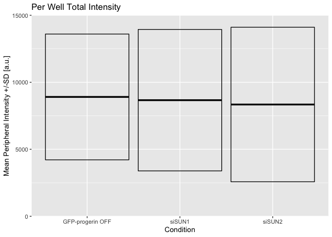

Figure S4E Right: TETON Cells / GRP78
================
Sandra Vidak
March 13th 2023

``` r
library(ggplot2)
library(ggthemes)
library(curl)
```

    ## Using libcurl 7.86.0 with LibreSSL/3.3.6

### Download the data if needed

Download and unzip the Columbus results of the experiments from Figshare
if they have not been already downloaded.

``` r
if(!dir.exists("input")) {
  URL <- "https://figshare.com/ndownloader/files/38843313"
  curl_download(URL, "input.zip")
  unzip("input.zip")
}
```

### Read Data for Fig S4E Right

Import and filter data and calculate sum and mean of the GRP78
peripheral recruitment for each biological replicate in TetON
fibroblasts.

``` r
GRP78_1 <- read.csv(file="input/GRP78Uring1.csv")

GRP78_1_filtered <- GRP78_1 [ c(seq(1, nrow(GRP78_1),1)), c("Intensity.Nucleus.3", "Intensity.Nucleus.4")]

GRP78_1_siSUN1_filtered <- GRP78_1 [ c(seq(5, nrow(GRP78_1),4)), c("Intensity.Nucleus.3", "Intensity.Nucleus.4")]

GRP78_1_siSUN2_filtered <- GRP78_1 [ c(seq(6, nrow(GRP78_1),4)), c("Intensity.Nucleus.3", "Intensity.Nucleus.4")]

GRP78_1_U_filtered_rowsum <- rowSums(GRP78_1_filtered[,1:2])

GRP78_1_siSUN1_filtered_rowsum <- rowSums(GRP78_1_siSUN1_filtered[,1:2])

GRP78_1_siSUN2_filtered_rowsum <- rowSums(GRP78_1_siSUN2_filtered[,1:2])

Mean_Uninduced_GRP78_1 <- mean(GRP78_1_U_filtered_rowsum[1:3])

Mean_Uninduced_siSUN1_GRP78_1 <- mean(GRP78_1_siSUN1_filtered_rowsum[1:3])

Mean_Uninduced_siSUN2_GRP78_1 <- mean(GRP78_1_siSUN2_filtered_rowsum[1:3])
```

``` r
GRP78_2 <- read.csv(file="input/GRP78Uring2.csv") #Import dataset Biological replicate_2

class(GRP78_2)
```

    ## [1] "data.frame"

``` r
GRP78_2_filtered <- GRP78_2[ c(seq(1, nrow(GRP78_2),1)), c("Intensity.Nucleus.3", "Intensity.Nucleus.4")]

GRP78_2_siSUN1_filtered <- GRP78_2 [ c(seq(5, nrow(GRP78_2),4)), c("Intensity.Nucleus.3", "Intensity.Nucleus.4")]

GRP78_2_siSUN2_filtered <- GRP78_2 [ c(seq(6, nrow(GRP78_2),4)), c("Intensity.Nucleus.3", "Intensity.Nucleus.4")]

GRP78_2_U_filtered_rowsum <- rowSums(GRP78_2_filtered[,1:2])

GRP78_2_siSUN1_filtered_rowsum <- rowSums(GRP78_2_siSUN1_filtered[,1:2])

GRP78_2_siSUN2_filtered_rowsum <- rowSums(GRP78_2_siSUN2_filtered[,1:2])

Mean_Uninduced_GRP78_2 <- mean(GRP78_2_U_filtered_rowsum[1:3])

Mean_Uninduced_siSUN1_GRP78_2 <- mean(GRP78_2_siSUN1_filtered_rowsum[1:3])

Mean_Uninduced_siSUN2_GRP78_2 <- mean(GRP78_2_siSUN2_filtered_rowsum[1:3])
```

``` r
GRP78_3 <- read.csv(file="input/GRP78Uring3.csv") 

GRP78_3_filtered <- GRP78_3 [ c(seq(1, nrow(GRP78_3),1)), c("Intensity.Nucleus.3", "Intensity.Nucleus.4")]

GRP78_3_siSUN1_filtered <- GRP78_3 [ c(seq(5, nrow(GRP78_3),3)), c("Intensity.Nucleus.3", "Intensity.Nucleus.4")]

GRP78_3_siSUN2_filtered <- GRP78_3 [ c(seq(6, nrow(GRP78_3),3)), c("Intensity.Nucleus.3", "Intensity.Nucleus.4")]

GRP78_3_U_filtered_rowsum <- rowSums(GRP78_3_filtered[,1:2])

GRP78_3_siSUN1_filtered_rowsum <- rowSums(GRP78_3_siSUN1_filtered[,1:2])

GRP78_3_siSUN2_filtered_rowsum <- rowSums(GRP78_3_siSUN2_filtered[,1:2])

Mean_Uninduced_GRP78_3 <- mean(GRP78_3_U_filtered_rowsum[1:3])

Mean_Uninduced_siSUN1_GRP78_3 <- mean(GRP78_3_siSUN1_filtered_rowsum[1:3])

Mean_Uninduced_siSUN2_GRP78_3 <- mean(GRP78_3_siSUN2_filtered_rowsum[1:3])
```

``` r
GRP78_Uninduced <- c(Mean_Uninduced_GRP78_1, Mean_Uninduced_GRP78_2, Mean_Uninduced_GRP78_3)

GRP78_Uninduced_siSUN1 <- c(Mean_Uninduced_siSUN1_GRP78_1, Mean_Uninduced_siSUN1_GRP78_2, Mean_Uninduced_siSUN1_GRP78_3)

GRP78_Uninduced_siSUN2 <- c(Mean_Uninduced_siSUN2_GRP78_1, Mean_Uninduced_siSUN2_GRP78_2, Mean_Uninduced_siSUN2_GRP78_3)

GRP78_df <- data.frame (GRP78_Uninduced,GRP78_Uninduced_siSUN1, GRP78_Uninduced_siSUN2 )
GRP78_df
```

    ##   GRP78_Uninduced GRP78_Uninduced_siSUN1 GRP78_Uninduced_siSUN2
    ## 1       11809.131              11321.311              10996.517
    ## 2        3491.064               2584.705               1724.814
    ## 3       11416.324              12084.692              12300.400

``` r
rownames(GRP78_df) <- c("Biological replicate1", "Biological replicate2", "Biological replicate3")
```

Calculate mean and SD for 3 different biological replicates in every
condition

``` r
Mean_GRP78_levels <- apply (GRP78_df,2,mean)

SD_GRP78_levels <- apply (GRP78_df,2,sd)

Mean_GRP78_levels2 <- as.data.frame(Mean_GRP78_levels)

SD_GRP78_levels2 <- as.data.frame(SD_GRP78_levels)
Condition <- rep(c("GFP-progerin OFF", "siSUN1", "siSUN2"), each=1)
GRP78_plot <- data.frame(Mean_GRP78_levels2,SD_GRP78_levels2, Condition )
```

### Biological Replicates Level plot for Fig.S4E right

<!-- -->

Document the information about the analysis session

``` r
sessionInfo()
```

    ## R version 4.2.2 (2022-10-31)
    ## Platform: x86_64-apple-darwin17.0 (64-bit)
    ## Running under: macOS Big Sur ... 10.16
    ## 
    ## Matrix products: default
    ## BLAS:   /Library/Frameworks/R.framework/Versions/4.2/Resources/lib/libRblas.0.dylib
    ## LAPACK: /Library/Frameworks/R.framework/Versions/4.2/Resources/lib/libRlapack.dylib
    ## 
    ## locale:
    ## [1] en_US.UTF-8/en_US.UTF-8/en_US.UTF-8/C/en_US.UTF-8/en_US.UTF-8
    ## 
    ## attached base packages:
    ## [1] stats     graphics  grDevices utils     datasets  methods   base     
    ## 
    ## other attached packages:
    ## [1] curl_4.3.3     ggthemes_4.2.4 ggplot2_3.3.6 
    ## 
    ## loaded via a namespace (and not attached):
    ##  [1] highr_0.9        pillar_1.8.1     compiler_4.2.2   tools_4.2.2     
    ##  [5] digest_0.6.30    evaluate_0.17    lifecycle_1.0.3  tibble_3.1.8    
    ##  [9] gtable_0.3.1     pkgconfig_2.0.3  rlang_1.0.6      cli_3.4.1       
    ## [13] DBI_1.1.3        rstudioapi_0.14  yaml_2.3.6       xfun_0.34       
    ## [17] fastmap_1.1.0    withr_2.5.0      stringr_1.4.1    dplyr_1.0.10    
    ## [21] knitr_1.40       generics_0.1.3   vctrs_0.5.0      grid_4.2.2      
    ## [25] tidyselect_1.2.0 glue_1.6.2       R6_2.5.1         fansi_1.0.3     
    ## [29] rmarkdown_2.17   farver_2.1.1     purrr_0.3.5      magrittr_2.0.3  
    ## [33] scales_1.2.1     htmltools_0.5.3  assertthat_0.2.1 colorspace_2.0-3
    ## [37] labeling_0.4.2   utf8_1.2.2       stringi_1.7.8    munsell_0.5.0
